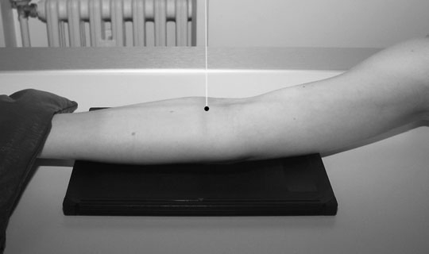
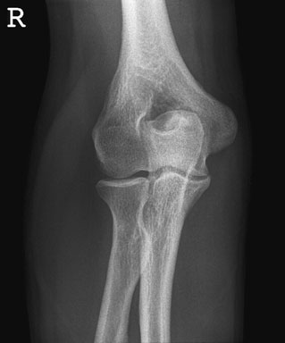
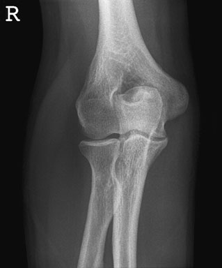

# Rx Cot antero-posterior (AP)

  📷 Radiografie Convențională (Rx)
  <strong>Actualizat:</strong> 2026-09-16
  <strong>Autor:</strong> Departamentul de Radiologie / Referință Clark (Ed. 12)

---

-   __1. Rezumat Clinic & Indicații__

    ---

    === "Indicații Clinice"

        - Evaluarea radiografică a cotului în incidență antero-posterioară.
        - Suspiciune de leziuni traumatice (fracturi, luxații sau diastazis articular).
        - Bilanț osteoarticular / visceral conform recomandării medicale de trimitere.

    === "Ghid Național IRIS"

        !!! info "Referință Primară: Ghidul Național IRIS (Ordinul MS 1342/2012)"
            - **Capitol Ghid IRIS:** *Aparat locomotor & Membru superior*
            - **Grad de Recomandare:** **Grad A**
            - **Nivel de Iradiere Estimată:** `Clasa 1 (Minimă < 0.02 mSv)`

            [:octicons-search-16: Deschide Ghidul IRIS](../../iris.md){ .md-button .md-button--primary } [:material-open-in-new: Aplicația Oficială PWA](https://radiologie-pediatrica.ro/iris/){ .md-button target="_blank" rel="noopener" }

-   __2. Poziționare & Centrare Fascicul__

    ---

    - **Poziție Pacient:**
        - Din poziția de profil, brațul pacientului este rotit extern.
        - Brațul este apoi extins complet, astfel încât fața posterioară a întregului membru să fie în contact cu suprafața mesei, iar palma să fie orientată în sus.
        - Jumătatea neexpusă a casetei este poziționată sub articulația cotului, cu axa scurtă paralelă cu antebrațul.
        - Brațul este ajustat astfel încât epicondilii medial și lateral să fie la distanță egală față de casetă.
        - Membrul este imobilizat cu săculeți cu nisip.
    - **Punct de Centrare Fascicul:** • Raza centrală verticală este centrată prin spațiile articulare, la 2.5 cm distal de mijlocul distanței dintre epicondilul medial și cel lateral al humerusului.
    - **Distanță Focar-Film (DFF / SID):** 100 cm
    - **Comandă Respiratorie:** Apnee pe durata expunerii (apnee în inspir pentru torace; expir pentru Abdomen/bazin).

-   __3. Parametri Tehnici Expunere__

    ---

    | Parametru Tehnic | Valoare Configurare Generator / Tub |
    |:-----------------|:-------------------------------------|
    | **Tensiune Tub (kV)** | DE CONFIGURAT PE APARAT |
    | **Sarcină / Produs Curent-Timp (mAs)** | Conform AEC / grosimii anatomice |
    | **Distanță Focar-Film (DFF / SID)** | 100 cm |
    | **Grilă Antidifuzoare (Bucky)** | Conform grosimii anatomice (> 10-12 cm cu grilă) |
    | **Dimensiune Focar** | Focar Mic (0.6 mm) |
    | **Camere de Ionizare AEC** | DE CONFIGURAT PE APARAT |
    | **Colimare Fascicul** | Colimare strictă la aria anatomică de interes diagnostic |
    | **Filtrare Tub** | Totală ≥ 2.5 mm Al echivalent (conform Clark: 3.0 mm Al echivalent) |

-   __4. Criterii de Calitate & Reușită Imagine__

    ---

    - Raza centrală trebuie să traverseze spațiile articulare perpendicular pe humerus, pentru a permite vizualizarea satisfăcătoare a acestora.
    - Imaginea trebuie să evidențieze treimea distală a humerusului și treimea proximală a radiusului și a ulnei.

-   __5. Protecție Radiologică (ALARA)__

    ---

    - Ecranare gonadică cu șorț plumbat dacă gonadele sunt în apropierea fasciculului util (regula ALARA).
    - Colimare precisă la dimensiunea anatomică strict necesară pentru reducerea dozei și a radiației difuze.
    - Verificarea posibilității unei sarcini la pacientele de vârstă fertilă înainte de expunere.

!!! note "Observații Clinice & Tehnice"
    - Este necesară precauție când se suspectează o fractură supracondiliană a humerusului. În aceste cazuri nu se încearcă extensia articulației cotului și se utilizează o tehnică adaptată.
    - Când pacientul nu poate extinde cotul la 90 de grade, se utilizează o tehnică adaptată pentru incidența antero-posterioară.
    - Dacă membrul nu poate fi mobilizat, se pot obține două incidențe perpendiculare menținând membrul în aceeași poziție și rotind tubul radiogen cu 90 de grade. Incidență antero-posterioară în flexie parțială. Dacă pacientul nu poate extinde complet cotul, poziționarea pentru incidența antero-posterioară poate fi adaptată. Pentru evaluarea generală a cotului sau dacă zona principală de interes este extremitatea proximală a radiusului și a ulnei, fața posterioară a antebrațului trebuie să fie în contact cu caseta. Dacă zona principală de interes este extremitatea distală a humerusului, fața posterioară a humerusului trebuie să fie în contact cu caseta. Dacă articulația cotului este imobilizată în flexie completă, se utilizează o incidență axială în locul celei antero-posterioare. În ambele cazuri de mai sus, oasele se vor suprapune parțial. Totuși, leziunile majore și alinierea generală pot fi evidențiate. Repere anatomice: fosa coronoidă și fosa olecraniană; epicondilul medial (epitrohleea); olecranul; trohleea; procesul coronoid; incizura radială; diafiza ulnei; diafiza radiusului; tuberozitatea radiusului; capul radiusului; capitulul humeral; epicondilul lateral; fosa radială; diafiza humerusului. Radiografie antero-posterioară a cotului. Radiografie normală antero-posterioară a cotului.

### 🖼️ Imagini

<figure class="protocol-image-card" markdown>

<figcaption><strong>• Raza centrală verticală este centrată prin spațiile articulare.</strong> — Poziționarea pacientului și centrarea fasciculului conform Clark (Ed. 12)</figcaption>

</figure>

<figure class="protocol-image-card" markdown>

<figcaption><strong>• Raza centrală trebuie să traverseze spațiile articulare la 90 de grade.</strong> — Aspect radiografic / ghid de poziționare conform tratatului Clark (Ed. 12)</figcaption>

</figure>

<figure class="protocol-image-card" markdown>

<figcaption><strong>• Precauție în cazul suspiciunii de fractură supracondiliană…</strong> — Aspect radiografic / ghid de poziționare conform tratatului Clark (Ed. 12)</figcaption>

</figure>

=== "Ghid Rapid de Execuție"

    1. **Identificarea și verificarea pacientului:** verificare identitate, zonă de examinat, consimțământ conform procedurii și evaluarea posibilității unei sarcini, când este relevantă.
    2. **Pregătire:** îndepărtarea oricăror obiecte radiopace (bijuterii, agrafe, fermoare, proteze, pansamente dense).
    3. **Poziționare precisă:** alinierea receptorului de imagine și a tubului la distanța prescrisă (100 cm).
    4. **Colimare strictă:** adaptarea fasciculului strict la regiunea de diagnostic pentru scăderea iradierii și reducerea radiației difuze.
    5. **Radioprotecție:** verificarea [politicii RX](../radioprotectie.md), cu măsuri distincte pentru pacient, personal și însoțitor.

## Surse de documentare

- [Clark's Positioning in Radiography (Ed. 12), Pagina 77](https://books.google.com/books/about/Clark_s_Positioning_in_Radiography.html?id=Xxu6MwEACAAJ)
