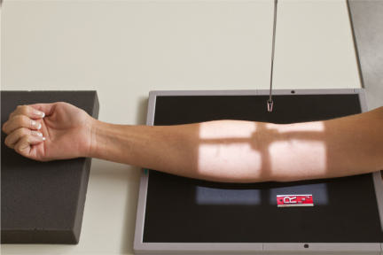
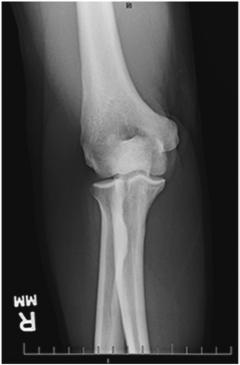
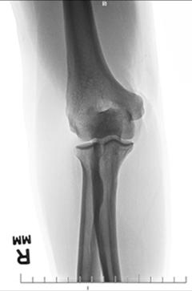

# Rx Cot AP (Antero-Posterior) (Cot FULLY EXTENDED)

  📷 Radiografie Convențională (Rx)
  <strong>Actualizat:</strong> 2026-09-15
  <strong>Autor:</strong> Departamentul de Radiologie / Referință Bontrager

---

-   __1. Rezumat Clinic & Indicații__

    ---

    === "Indicații Clinice"

        - suspiciune de fractură și luxație / subluxație articulară de Cot
        - Pathologic processes, such ca osteomielită / leziuni inflamatorii osoase și arthritis

    === "Ghid Național IRIS"

        !!! info "Referință Primară: Ghidul Național IRIS (Ordinul MS 1342/2012)"
            - **Capitol Ghid IRIS:** *Ghidul Național IRIS*
            - **Grad de Recomandare:** **De verificat pe indicație; fără grad atribuit automat**
            - **Nivel de Iradiere Estimată:** `De verificat pentru examinarea și populația selectate`

            [:octicons-search-16: Deschide Ghidul IRIS](../../iris.md){ .md-button .md-button--primary } [:material-open-in-new: Aplicația Oficială PWA](https://radiologie-pediatrica.ro/iris/){ .md-button target="_blank" rel="noopener" }
-   __2. Poziționare & Centrare Fascicul__

    ---

    - **Poziție Pacient:** Pacient: Seat pacient la end de table, cu Cot fully extins, if possible (see following page if pacient cannot fully extend Cot).; Regiune anatomică: Extend Cot, supinate Mână, și align braț și Antebraț cu axa longitudinală de receptorul de imagine (Fig. 4.122). Center Cot articulație la center de receptorul de imagine. Ask pacient la lean laterally ca necessary pentru true Incidență Antero-Posterioară (AP). Palpate humeral epicondyles la ensure that interepicondylar plane este paralel cu receptorul de imagine (RI). (interepicondylar plane este imaginary plane între medial și lateral epicondyles de distal Humerus. This plane este useful pentru Cot și Humerus positioning.) Support Mână ca needed la prevent mișcare.
    - **Punct de Centrare Fascicul:** perpendicular pe receptorul de imagine, orientat la midelbow articulație, which este approximately ¾ inch (2 cm) distal la midpoint de line între epicondyles
    - **Distanță Focar-Film (DFF / SID):** 100 cm
    - **Comandă Respiratorie:** Apnee pe durata expunerii (sau conform cooperării pacientului)

-   __3. Parametri Tehnici Expunere__

    ---

    | Parametru Tehnic | Valoare Configurare Generator / Tub |
    |:-----------------|:-------------------------------------|
    | **Tensiune Tub (kV)** | 65 kV |
    | **Sarcină / Produs Curent-Timp (mAs)** | DE CONFIGURAT PE APARAT |
    | **Distanță Focar-Film (DFF / SID)** | 100 cm |
    | **Grilă Antidifuzoare (Bucky)** | Fără grilă (expunere directă) |
    | **Dimensiune Focar** | Focar Mic (0.6 mm) |
    | **Camere de Ionizare AEC** | DE CONFIGURAT PE APARAT |
    | **Colimare Fascicul** | Field Size Collimate pe four sides la anatomy de interest. Cot ROUTINE AP Alternate AP—partial flexion Alternate AP—acute flexion oblic lateral (extern) medial (intern) lateral |
    | **Filtrare Tub** | Totală ≥ 2.5 mm Al echivalent |

-   __4. Criterii de Calitate & Reușită Imagine__

    ---

    - distal Humerus, Cot spații articulare, și proximal radius și ulna sunt vizibil (Figs. 4.123 și 4.124). poziție:
    - axa longitudinală de braț trebuie să fie aliniat cu axa longitudinală de receptorul de imagine.
    - Absența rotației anatomice: clavicule echidistante față de linia apofizelor spinoase este evidenced prin appearance de bilateral epicondyles seen în profile și cap radial, neck, și tubercles separated sau only slightly superimposed prin ulna.
    - olecran trebuie să fie Poziție Șezândă în olecran fossa cu fully extins braț.
    - Cot spații articulare appears open cu fully extins braț și corect raza centrală centering.
    - raza centrală și center de collimation field size trebuie să fie la midelbow articulație. expunere:
    - optim receptorul de imagine expunere și contrast cu fără mișcare trebuie să visualize părți moi detail; net, bony cortical margins; și clear, bony trabecular markings. Fig. 4.122 AP Cot (fully extins). Fig. 4.123 AP (extins). Capitulum epicondil lateral cap radial Radial tubercle Radius epicondil medial (epitrohlee) Humerus olecran Trochlea Coronoid tubercle Ulna Fig. 4.124 AP drept Cot (extins).

-   __5. Protecție Radiologică (ALARA)__

    ---

    - Ecranare gonadică și a organelor radiosensibile conform procedurilor locale de radioprotecție ALARA.
    - Colimare strictă la aria de interes pentru limitarea radiației difuze.
    - Verificarea posibilității unei sarcini la pacientele de vârstă fertilă înainte de expunere.

### 🖼️ Imagini

<figure class="protocol-image-card" markdown>

<figcaption><strong>Fig. 4.122 AP Cot (fully extins).</strong> — Poziționare pacient conform Ghidului Bontrager (Fig. 4.122 AP cot (fully extins).)</figcaption>

</figure>

<figure class="protocol-image-card" markdown>

<figcaption><strong>Fig. 4.123 AP (extins).</strong> — Aspect radiografic de referință conform Ghidului Bontrager (Fig. 4.123 AP (extins).)</figcaption>

</figure>

<figure class="protocol-image-card" markdown>

<figcaption><strong>Fig. 4.124 AP drept Cot (extins).</strong> — Aspect radiografic de referință conform Ghidului Bontrager (Fig. 4.124 AP drept cot (extins).)</figcaption>

</figure>

=== "Ghid Rapid de Execuție"

    1. **Identificarea și verificarea pacientului:** verificare identitate, zonă de examinat, consimțământ conform procedurii și evaluarea posibilității unei sarcini, când este relevantă.
    2. **Pregătire:** îndepărtarea oricăror obiecte radiopace (bijuterii, agrafe, fermoare, proteze, pansamente dense).
    3. **Poziționare precisă:** alinierea receptorului de imagine și a tubului la distanța prescrisă (100 cm).
    4. **Colimare strictă:** adaptarea fasciculului strict la regiunea de diagnostic pentru scăderea iradierii și reducerea radiației difuze.
    5. **Radioprotecție:** verificarea [politicii RX](../radioprotectie.md), cu măsuri distincte pentru pacient, personal și însoțitor.

## Surse de documentare

- [Bontrager's Textbook of Radiographic Positioning (Ed. 9/10), Pagina 177](https://www.elsevier.com/books/textbook-of-radiographic-positioning-and-related-anatomy/lampignano/978-0-323-65367-1)
