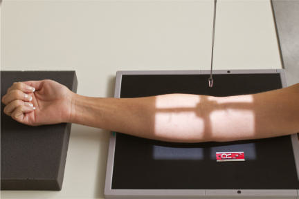
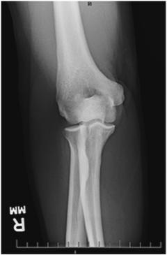
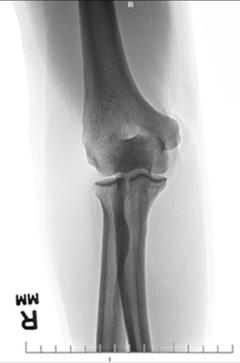

# Rx Cot AP (antero-posterior) (cot COMPLET EXTINS)

  📷 Radiografie Convențională (Rx)
  <strong>Actualizat:</strong> 2026-09-15
  <strong>Autor:</strong> Departamentul de Radiologie / Referință Bontrager

---

-   __1. Rezumat Clinic & Indicații__

    ---

    === "Indicații Clinice"

        - suspiciune de fractură și luxație / subluxație articulară a cotului
        - Procese patologice, cum ar fi osteomielita / leziuni inflamatorii osoase și artrita

    === "Ghid Național IRIS"

        !!! info "Referință Primară: Ghidul Național IRIS (Ordinul MS 1342/2012)"
            - **Capitol Ghid IRIS:** *Aparat locomotor & Membru superior*
            - **Grad de Recomandare:** **Grad A**
            - **Nivel de Iradiere Estimată:** `Clasa 1 (Minimă < 0.02 mSv)`

            [:octicons-search-16: Deschide Ghidul IRIS](../../iris.md){ .md-button .md-button--primary } [:material-open-in-new: Aplicația Oficială PWA](https://radiologie-pediatrica.ro/iris/){ .md-button target="_blank" rel="noopener" }

-   __2. Poziționare & Centrare Fascicul__

    ---

    - **Poziție Pacient:** Pacient: Așezați pacientul la capătul mesei, cu cotul complet extins, dacă este posibil (consultați pagina următoare dacă pacientul nu poate extinde complet cotul).; Regiune anatomică: Extindeți cotul, supinați mâna și aliniați brațul și antebrațul cu axa longitudinală a receptorului de imagine (Fig. 4.122). Centrați articulația cotului la centrul receptorului de imagine. Cereți pacientului să se încline lateral după cum este necesar pentru obținerea unei incidențe antero-posterioare (AP) adevărate. Palpați epicondilii humerali pentru a vă asigura că planul interepicondilian este paralel cu receptorul de imagine (RI). (Planul interepicondilian este planul imaginar dintre epicondilul medial și cel lateral ai humerusului distal. Acest plan este util pentru poziționarea cotului și a humerusului.) Sprijiniți mâna după cum este necesar pentru a preveni mișcarea.
    - **Punct de Centrare Fascicul:** perpendicular pe receptorul de imagine, orientat către articulația cotului, la aproximativ ¾ țol (2 cm) distal față de mijlocul liniei dintre epicondili
    - **Distanță Focar-Film (DFF / SID):** 100 cm
    - **Comandă Respiratorie:** Apnee pe durata expunerii (sau conform cooperării pacientului)

-   __3. Parametri Tehnici Expunere__

    ---

    | Parametru Tehnic | Valoare Configurare Generator / Tub |
    |:-----------------|:-------------------------------------|
    | **Tensiune Tub (kV)** | 65 kV |
    | **Sarcină / Produs Curent-Timp (mAs)** | DE CONFIGURAT PE APARAT |
    | **Distanță Focar-Film (DFF / SID)** | 100 cm |
    | **Grilă Antidifuzoare (Bucky)** | Fără grilă (expunere directă) |
    | **Dimensiune Focar** | Focar Mic (0.6 mm) |
    | **Camere de Ionizare AEC** | DE CONFIGURAT PE APARAT |
    | **Colimare Fascicul** | Dimensiunea câmpului: colimați pe cele patru laturi până la anatomia de interes. Cot AP DE RUTINĂ AP alternativ—flexie parțială AP alternativ—flexie acută oblic lateral (extern) medial (intern) lateral |
    | **Filtrare Tub** | Totală ≥ 2.5 mm Al echivalent |

-   __4. Criterii de Calitate & Reușită Imagine__

    ---

    - Humerusul distal, spațiile articulare ale cotului și radiusul și ulna proximale sunt vizibile (Fig. 4.123 și 4.124). Poziție:
    - Axa longitudinală a brațului trebuie să fie aliniată cu axa longitudinală a receptorului de imagine.
    - Absența rotației anatomice: claviculele echidistante față de linia apofizelor spinoase este evidențiată prin aspectul epicondililor bilaterali văzuți din profil și al capului radial, colului și tuberculilor, separate sau doar ușor suprapuse de ulnă.
    - Olecranul trebuie să fie poziționat în fosa olecraniană cu brațul complet extins.
    - Spațiile articulare ale cotului apar deschise cu brațul complet extins și cu centrarea corectă a razei centrale.
    - Raza centrală și centrul câmpului de colimare trebuie să fie la nivelul articulației cotului. Expunere:
    - Expunerea și contrastul optime ale receptorului de imagine, fără mișcare, trebuie să vizualizeze detaliile părților moi; marginile corticale osoase nete; și desenul trabecular osos clar. Fig. 4.122 AP cot (complet extins). Fig. 4.123 AP (extins). Capitul epicondil lateral cap radial tubercul radial radius epicondil medial (epitrohleea) humerus olecran trohlee tubercul coronoid ulnă Fig. 4.124 AP cot drept (extins).

-   __5. Protecție Radiologică (ALARA)__

    ---

    - Ecranare gonadică și a organelor radiosensibile conform procedurilor locale de radioprotecție ALARA.
    - Colimare strictă la aria de interes pentru limitarea radiației difuze.
    - Verificarea posibilității unei sarcini la pacientele de vârstă fertilă înainte de expunere.

### 🖼️ Imagini

<figure class="protocol-image-card" markdown>

<figcaption><strong>Fig. 4.122 AP cot (complet extins).</strong> — Poziționarea pacientului conform Ghidului Bontrager (Fig. 4.122 AP cot (complet extins).)</figcaption>

</figure>

<figure class="protocol-image-card" markdown>

<figcaption><strong>Fig. 4.123 AP (extins).</strong> — Aspect radiografic de referință conform Ghidului Bontrager (Fig. 4.123 AP (extins).)</figcaption>

</figure>

<figure class="protocol-image-card" markdown>

<figcaption><strong>Fig. 4.124 AP cot drept (extins).</strong> — Aspect radiografic de referință conform Ghidului Bontrager (Fig. 4.124 AP cot drept (extins).)</figcaption>

</figure>

=== "Ghid Rapid de Execuție"

    1. **Identificarea și verificarea pacientului:** verificare identitate, zonă de examinat, consimțământ conform procedurii și evaluarea posibilității unei sarcini, când este relevantă.
    2. **Pregătire:** îndepărtarea oricăror obiecte radiopace (bijuterii, agrafe, fermoare, proteze, pansamente dense).
    3. **Poziționare precisă:** alinierea receptorului de imagine și a tubului la distanța prescrisă (100 cm).
    4. **Colimare strictă:** adaptarea fasciculului strict la regiunea de diagnostic pentru scăderea iradierii și reducerea radiației difuze.
    5. **Radioprotecție:** verificarea [politicii RX](../radioprotectie.md), cu măsuri distincte pentru pacient, personal și însoțitor.

## Surse de documentare

- [Bontrager's Textbook of Radiographic Positioning (Ed. 9/10), Pagina 177](https://www.elsevier.com/books/textbook-of-radiographic-positioning-and-related-anatomy/lampignano/978-0-323-65367-1)
