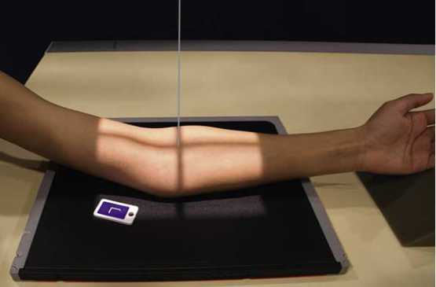
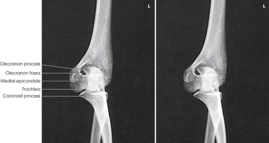

# Rx Cot — Oblică Antero-Posterioară (AP) — Rotație Internă (Medială) (Merrill)

  📷 Radiografie Convențională (Rx)
  <strong>Actualizat:</strong> 2026-09-16
  <strong>Autor:</strong> Referință Merrill

---

-   __1. Rezumat Clinic & Indicații__

    ---

    === "Indicații Clinice"

        - Conform reperelor anatomice standard din tratat

    === "Ghid Național IRIS"

        !!! info "Referință Primară: Ghidul Național IRIS (Ordinul MS 1342/2012)"
            - **Capitol Ghid IRIS:** *Ghidul Național IRIS*
            - **Grad de Recomandare:** **De verificat pe indicație; fără grad atribuit automat**
            - **Nivel de Iradiere Estimată:** `De verificat pentru examinarea și populația selectate`

            [:octicons-search-16: Deschide Ghidul IRIS](../../iris.md){ .md-button .md-button--primary } [:material-open-in-new: Aplicația Oficială PWA](https://radiologie-pediatrica.ro/iris/){ .md-button target="_blank" rel="noopener" }
-   __2. Poziționare & Centrare Fascicul__

    ---

    - **Poziție Pacient:** se așază pacientul pe scaun la end de masa radiologică, cu braț extins și în contact cu masa de examinare.; se extinde extremity în anatomic poziție, ensuring extremity este în same plane și paralel cu receptorul de imagine plane. se centrează midpoint de receptorul de imagine la Cot articulație Medially (internally) se rotește upper extremity la place humeral epicondyles 45 grade de la true anatomic poziție. This grade de obliquity usually clears proces coronoid de cap radial. Mână poate fie în pronație sau la a 45-grade angle (Fig. 5.116).
    - **Punct de Centrare Fascicul:** perpendicular pe Cot articulație
    - **Distanță Focar-Film (DFF / SID):** Nespecificat în fragmentul extras; de verificat în sursă
    - **Comandă Respiratorie:** Conform reperelor anatomice standard din tratat

-   __3. Parametri Tehnici Expunere__

    ---

    | Parametru Tehnic | Valoare Configurare Generator / Tub |
    |:-----------------|:-------------------------------------|
    | **Tensiune Tub (kV)** | DE CONFIGURAT PE APARAT |
    | **Sarcină / Produs Curent-Timp (mAs)** | DE CONFIGURAT PE APARAT |
    | **Distanță Focar-Film (DFF / SID)** | Nespecificat în fragmentul extras; de verificat în sursă |
    | **Grilă Antidifuzoare (Bucky)** | DE CONFIGURAT PE APARAT |
    | **Dimensiune Focar** | DE CONFIGURAT PE APARAT |
    | **Camere de Ionizare AEC** | DE CONFIGURAT PE APARAT |
    | **Colimare Fascicul** | Adjust câmp de iradiere la 3 inches (8 cm) proximal și distal la Cot articulație și 1 inch (2.5 cm) pe sides. Se plasează markerul de lateralitate în câmpul colimat. |
    | **Filtrare Tub** | DE CONFIGURAT PE APARAT |

-   __4. Criterii de Calitate & Reușită Imagine__

    ---

    - Criterii radiologice de calitate imaginii:
    - Colimare adecvată vizibilă și prezența markerului de lateralitate (D/S) plasat clear de anatomy de interest
    - Cot articulație centrat pe expunere field
    - 45-grade rotație internă (medială) de Cot:
    - proces coronoid în profile
    - Elongated medial humeral epicondyle
    - Ulna superimposed prin cap radial și neck
    - Trochlea
    - olecran within olecran fossa
    - Bony detalii trabeculare osoase și surrounding soft tissues

-   __5. Protecție Radiologică (ALARA)__

    ---

    - Nespecificat în fragmentul extras; de verificat în sursă

!!! note "Observații Clinice & Tehnice"
    Pronation de Mână only poate nu se rotește Cot articulație necessary 45 grade la evidențiază ulnar proces coronoid în profile. se efectuează ecranarea gonadelor cu șorț plumbat.

### 🖼️ Imagini

<figure class="protocol-image-card" markdown>

<figcaption><strong>Merrill — pagina PDF 326, imaginea 1</strong> — Imagine din fragmentul sursă; asocierea necesită revizie.</figcaption>

</figure>

<figure class="protocol-image-card" markdown>

<figcaption><strong>Merrill — pagina PDF 327, imaginea 2</strong> — Imagine din fragmentul sursă; asocierea necesită revizie.</figcaption>

</figure>

=== "Ghid Rapid de Execuție"

    1. **Identificarea și verificarea pacientului:** verificare identitate, zonă de examinat, consimțământ conform procedurii și evaluarea posibilității unei sarcini, când este relevantă.
    2. **Pregătire:** îndepărtarea oricăror obiecte radiopace (bijuterii, agrafe, fermoare, proteze, pansamente dense).
    3. **Poziționare precisă:** alinierea receptorului de imagine și a tubului la distanța prescrisă (Nespecificat în fragmentul extras; de verificat în sursă).
    4. **Colimare strictă:** adaptarea fasciculului strict la regiunea de diagnostic pentru scăderea iradierii și reducerea radiației difuze.
    5. **Radioprotecție:** verificarea [politicii RX](../radioprotectie.md), cu măsuri distincte pentru pacient, personal și însoțitor.

## Surse de documentare

- [Merrill’s Atlas, 5. Upper Extremity, pagini PDF 325–327](../../assets/protocols/sources/a56d45c16829_Merrills_Atlas_of_Radiographic_Positioning__Procedures_3Vol_Set.pdf#page=325)

## Fragmente sursă traduse (referință tehnică)

### anatomy

oblic incidență de cot cu proces coronoid projected liber de superimposition (Fig. 5.117).

### collimation

• Adjust câmp de iradiere la 3 inches (8 cm) proximal și distal la cot articulație și 1 inch (2.5 cm) pe sides. Place marker de lateralitate (D/S) în collimated expunere field.

### cr

• perpendicular pe cot articulație

### criteria

Criterii radiologice de calitate imaginii:
• Colimare adecvată vizibilă și prezența markerului de lateralitate (D/S) plasat clear de anatomy de interest
• cot articulație centrat pe expunere field
• 45-grade rotație internă (medială) de cot:
• proces coronoid în profile
• Elongated medial humeral epicondyle
• Ulna superimposed prin cap radial și neck
• Trochlea
• olecran within olecran fossa
• Bony detalii trabeculare osoase și surrounding soft tissues

### notes

Pronation de mână only poate nu se rotește cot articulație necessary 45 grade la evidențiază ulnar proces coronoid în
profile.
• se efectuează ecranarea gonadelor cu șorț plumbat.

### part_pos

• se extinde extremity în anatomic poziție, ensuring extremity este în same plane și paralel cu receptorul de imagine plane.
• se centrează midpoint de receptorul de imagine la cot articulație
• Medially (internally) se rotește upper extremity la place humeral epicondyles 45 grade de la true anatomic poziție. This grade
de obliquity usually clears proces coronoid de cap radial. mână poate fie în pronație sau la a 45-grade angle (Fig. 5.116).

### patient_pos

• se așază pacientul pe scaun la end de masa radiologică, cu braț extins și în contact cu masa de examinare.

### tech

poziționat prin manufacturer sau department protocol pentru corect anatomy display orientation; raza centrală plate: 10 × 12 inches (24 × 30 cm) longitudinal.

