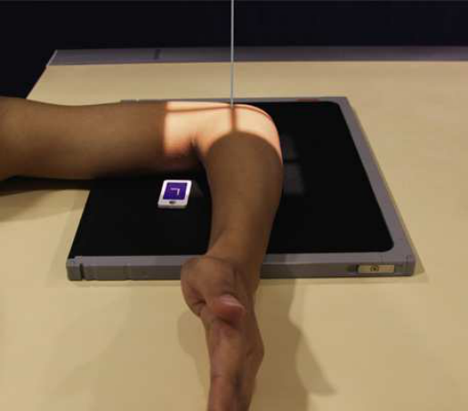
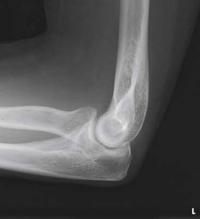
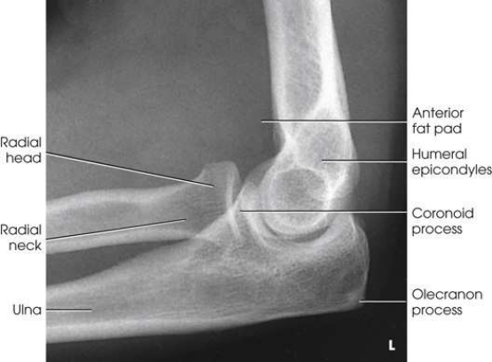
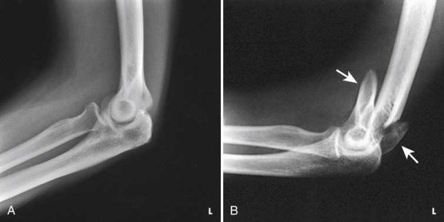

# Rx Cot — Incidență de Profil (Lateral) — Latero-Medial pathology. (Merrill)

  📷 Radiografie Convențională (Rx)
  <strong>Actualizat:</strong> 2026-09-16
  <strong>Autor:</strong> Referință Merrill

---

-   __1. Rezumat Clinic & Indicații__

    ---

    === "Indicații Clinice"

        - Conform reperelor anatomice standard din tratat

    === "Ghid Național IRIS"

        !!! info "Referință Primară: Ghidul Național IRIS (Ordinul MS 1342/2012)"
            - **Capitol Ghid IRIS:** *Ghidul Național IRIS*
            - **Grad de Recomandare:** **De verificat pe indicație; fără grad atribuit automat**
            - **Nivel de Iradiere Estimată:** `De verificat pentru examinarea și populația selectate`

            [:octicons-search-16: Deschide Ghidul IRIS](../../iris.md){ .md-button .md-button--primary } [:material-open-in-new: Aplicația Oficială PWA](https://radiologie-pediatrica.ro/iris/){ .md-button target="_blank" rel="noopener" }
-   __2. Poziționare & Centrare Fascicul__

    ---

    - **Poziție Pacient:** se așază pacientul pe scaun la end de masa radiologică, low enough la place Humerus și Cot articulație în same plane.; de la Decubit dorsal poziție, se flectează Cot 90 grade, și place Humerus și Antebraț în contact cu masa de examinare. se centrează receptorul de imagine la Cot articulație. se ajustează Cot articulație so that its axa longitudinală este paralel cu axa longitudinală de Antebraț (Fig. 5.112). pe pacienți cu muscular forearms, elevate Pumn (Articulație Radiocarpiană) la place Antebraț paralel cu receptorul de imagine. la obtain Incidență de Profil (lateral) de Cot, se ajustează Mână și Pumn (Articulație Radiocarpiană) în Incidență de Profil (lateral) și ensure that humeral epicondyles sunt perpendicular pe plane de receptorul de imagine. se efectuează ecranarea gonadelor cu șorț plumbat.
    - **Punct de Centrare Fascicul:** perpendicular pe Cot articulație, regardless de its location pe receptorul de imagine
    - **Distanță Focar-Film (DFF / SID):** Nespecificat în fragmentul extras; de verificat în sursă
    - **Comandă Respiratorie:** Conform reperelor anatomice standard din tratat

-   __3. Parametri Tehnici Expunere__

    ---

    | Parametru Tehnic | Valoare Configurare Generator / Tub |
    |:-----------------|:-------------------------------------|
    | **Tensiune Tub (kV)** | DE CONFIGURAT PE APARAT |
    | **Sarcină / Produs Curent-Timp (mAs)** | DE CONFIGURAT PE APARAT |
    | **Distanță Focar-Film (DFF / SID)** | Nespecificat în fragmentul extras; de verificat în sursă |
    | **Grilă Antidifuzoare (Bucky)** | DE CONFIGURAT PE APARAT |
    | **Dimensiune Focar** | DE CONFIGURAT PE APARAT |
    | **Camere de Ionizare AEC** | DE CONFIGURAT PE APARAT |
    | **Colimare Fascicul** | Adjust câmp de iradiere la 3 inches (8 cm) proximal și distal la Cot articulație. Se plasează markerul de lateralitate în câmpul colimat. |
    | **Filtrare Tub** | DE CONFIGURAT PE APARAT |

-   __4. Criterii de Calitate & Reușită Imagine__

    ---

    - Criterii radiologice de calitate imaginii:
    - Colimare adecvată vizibilă și prezența markerului de lateralitate (D/S) plasat clear de anatomy de interest
    - Cot articulație centrat pe expunere field
    - Cot în true Incidență de Profil (lateral):
    - Superimposed humeral epicondyles
    - tuberozitate radială bicipitală facing anteriorly
    - cap radial partially superimposing proces coronoid
    - olecran în profile
    - Cot flectat 90 grade
    - Bony detalii trabeculare osoase și orice ridicat fat pads în părți moi la anterior și posterior distal Humerus și anterior proximal Antebraț

-   __5. Protecție Radiologică (ALARA)__

    ---

    - Nespecificat în fragmentul extras; de verificat în sursă

!!! note "Observații Clinice & Tehnice"
    When injury la părți moi around Cot este suspected, articulație trebuie să fie flectat only 30 sau 35 grade (Fig. 5.115). This partial flexion does nu compress sau stretch soft structures ca does full 90-grade lateral flexion. posterior fat pad poate become vizibil în this poziție.

### 🖼️ Imagini

<figure class="protocol-image-card" markdown>

<figcaption><strong>Merrill — pagina PDF 323, imaginea 1</strong> — Imagine din fragmentul sursă; asocierea necesită revizie.</figcaption>

</figure>

<figure class="protocol-image-card" markdown>

<figcaption><strong>Merrill — pagina PDF 324, imaginea 2</strong> — Imagine din fragmentul sursă; asocierea necesită revizie.</figcaption>

</figure>

<figure class="protocol-image-card" markdown>

<figcaption><strong>Merrill — pagina PDF 325, imaginea 3</strong> — Imagine din fragmentul sursă; asocierea necesită revizie.</figcaption>

</figure>

<figure class="protocol-image-card" markdown>

<figcaption><strong>Merrill — pagina PDF 325, imaginea 4</strong> — Imagine din fragmentul sursă; asocierea necesită revizie.</figcaption>

</figure>

=== "Ghid Rapid de Execuție"

    1. **Identificarea și verificarea pacientului:** verificare identitate, zonă de examinat, consimțământ conform procedurii și evaluarea posibilității unei sarcini, când este relevantă.
    2. **Pregătire:** îndepărtarea oricăror obiecte radiopace (bijuterii, agrafe, fermoare, proteze, pansamente dense).
    3. **Poziționare precisă:** alinierea receptorului de imagine și a tubului la distanța prescrisă (Nespecificat în fragmentul extras; de verificat în sursă).
    4. **Colimare strictă:** adaptarea fasciculului strict la regiunea de diagnostic pentru scăderea iradierii și reducerea radiației difuze.
    5. **Radioprotecție:** verificarea [politicii RX](../radioprotectie.md), cu măsuri distincte pentru pacient, personal și însoțitor.

## Surse de documentare

- [Merrill’s Atlas, 5. Upper Extremity, pagini PDF 322–325](../../assets/protocols/sources/a56d45c16829_Merrills_Atlas_of_Radiographic_Positioning__Procedures_3Vol_Set.pdf#page=322)

## Fragmente sursă traduse (referință tehnică)

### anatomy

lateral incidență shows cot articulație, distal braț, și proximal forearm (see Figs. 5.113 și 5.114).

### collimation

• Adjust câmp de iradiere la 3 inches (8 cm) proximal și distal la cot articulație. Se plasează markerul de lateralitate în câmpul colimat.

### cr

• perpendicular pe cot articulație, regardless de its location pe receptorul de imagine

### criteria

Criterii radiologice de calitate imaginii:
• Colimare adecvată vizibilă și prezența markerului de lateralitate (D/S) plasat clear de anatomy de interest
• cot articulație centrat pe expunere field
• cot în true poziție de profil (lateral):
• Superimposed humeral epicondyles
• tuberozitate radială bicipitală facing anteriorly
• cap radial partially superimposing proces coronoid
• olecran în profile
• cot flectat 90 grade
• Bony detalii trabeculare osoase și orice ridicat fat pads în părți moi la anterior și posterior distal humerus și anterior
proximal forearm

### notes

When injury la părți moi around cot este suspected, articulație trebuie să fie flectat only 30 sau 35 grade (Fig. 5.115). This partial
flexion does nu compress sau stretch soft structures ca does full 90-grade lateral flexion. posterior fat pad poate become vizibil în
this poziție.

### part_pos

• de la decubit dorsal, se flectează cot 90 grade, și place humerus și forearm în contact cu masa de examinare.
• se centrează receptorul de imagine la cot articulație. se ajustează cot articulație so that its axa longitudinală este paralel cu axa longitudinală de forearm (Fig. 5.112). pe
pacienți cu muscular forearms, elevate wrist la place forearm paralel cu receptorul de imagine.
• la obtain lateral incidență de cot, se ajustează mână și wrist în poziție de profil (lateral) și ensure that humeral epicondyles
sunt perpendicular pe plane de receptorul de imagine.
• se efectuează ecranarea gonadelor cu șorț plumbat.

### patient_pos

• se așază pacientul pe scaun la end de masa radiologică, low enough la place humerus și cot articulație în same plane.

### tech

poziționat prin manufacturer sau department protocol pentru corect anatomy display orientation; raza centrală plate: 10 × 12 inches (24 × 30 cm) longitudinal.

