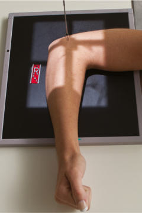
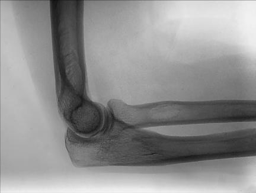
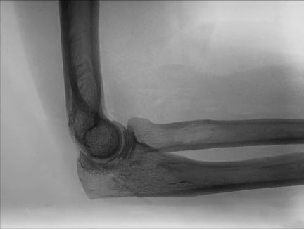

# Rx Cot LATEROMEDIAL PROJECTION

  📷 Radiografie Convențională (Rx)
  <strong>Actualizat:</strong> 2026-09-15
  <strong>Autor:</strong> Departamentul de Radiologie / Referință Bontrager

---

-   __1. Rezumat Clinic & Indicații__

    ---

    === "Indicații Clinice"

        - suspiciune de fractură and luxație / subluxație articulară of the Cot
        - Certain bony pathologic processes, such as osteomielită / leziuni inflamatorii osoase and arthritis
        - Elevated or displaced fat pads of the Cot joint may be visualized

    === "Ghid Național IRIS"

        !!! info "Referință Primară: Ghidul Național IRIS (Ordinul MS 1342/2012)"
            - **Capitol Ghid IRIS:** *Ghidul Național IRIS*
            - **Grad de Recomandare:** **De verificat pe indicație; fără grad atribuit automat**
            - **Nivel de Iradiere Estimată:** `De verificat pentru examinarea și populația selectate`

            [:octicons-search-16: Deschide Ghidul IRIS](../../iris.md){ .md-button .md-button--primary } [:material-open-in-new: Aplicația Oficială PWA](https://radiologie-pediatrica.ro/iris/){ .md-button target="_blank" rel="noopener" }
-   __2. Poziționare & Centrare Fascicul__

    ---

    - **Poziție Pacient:** Pacient: Seat patient at end of table, with Cot flexed 90° (see NOTE).; Regiune anatomică: Align long axis of Antebraț with long axis of IR. Center Cot joint to CR and to center of IR. Drop Umăr so that Humerus and Antebraț are on same horizontal plane. Rotate Mână and Pumn (Articulație Radiocarpiană) into true Incidență de Profil (Lateral), Police side up. Place interepicondylar plane perpendicular to the IR (Fig. 4.143). Place support under Mână and Pumn (Articulație Radiocarpiană) to elevate Mână and distal Antebraț as needed for heavy muscular Antebraț so that Antebraț is parallel to IR for true lateral Cot.
    - **Punct de Centrare Fascicul:** perpendicular to IR, directed to midelbow joint (a point approximately 1½ inches [4 cm] medial to easily palpated posterior surface of olecranon process)
    - **Distanță Focar-Film (DFF / SID):** 100 cm
    - **Comandă Respiratorie:** Apnee pe durata expunerii (sau conform cooperării pacientului)

-   __3. Parametri Tehnici Expunere__

    ---

    | Parametru Tehnic | Valoare Configurare Generator / Tub |
    |:-----------------|:-------------------------------------|
    | **Tensiune Tub (kV)** | 65 kV |
    | **Sarcină / Produs Curent-Timp (mAs)** | DE CONFIGURAT PE APARAT |
    | **Distanță Focar-Film (DFF / SID)** | 100 cm |
    | **Grilă Antidifuzoare (Bucky)** | Fără grilă (expunere directă) |
    | **Dimensiune Focar** | Focar Mic (0.6 mm) |
    | **Camere de Ionizare AEC** | DE CONFIGURAT PE APARAT |
    | **Colimare Fascicul** | Field Size Collimate on four sides to anatomy of interest. |
    | **Filtrare Tub** | Totală ≥ 2.5 mm Al echivalent |

-   __4. Criterii de Calitate & Reușită Imagine__

    ---

    - Incidență de Profil (Lateral) of distal Humerus and proximal Antebraț, olecranon process, and soft tissues and fat pads of the Cot joint are visible (Figs. 4.144 and 4.145). Position:
    - Long axis of the Antebraț should be aligned with long axis of IR, with the Cot joint flexed 90°.
    - About onehalf of radial head should be superimposed by the coronoid process, and olecranon process should be visualized in profile.
    - True lateral view is indicated by three concentric arcs of the trochlear sulcus, double ridges of the capitulum and trochlea, and the trochlear notch of the ulna. In addition, superimposition of the humeral epicondyles occurs.
    - CR and center of collimation field size should be midpoint of the Cot joint. Exposure:
    - No motion and optimal image receptor exposure and contrast should visualize sharp cortical margins and clear trabecular markings as well as soft tissue margins of the anterior and posterior fat pads. Fig. 4.143 Lateral—Cot flexed 90° (Antebraț parallel to IR). Anterior fat pad Coronoid process Supinator fat strip R Radial head Trochlear sulcus Trochlear notch Olecranon process Epicondyles Fig. 4.145 Lateromedial projection of right Cot.

-   __5. Protecție Radiologică (ALARA)__

    ---

    - Ecranare gonadică și a organelor radiosensibile conform procedurilor locale de radioprotecție ALARA.
    - Colimare strictă la aria de interes pentru limitarea radiației difuze.
    - Verificarea posibilității unei sarcini la pacientele de vârstă fertilă înainte de expunere.

!!! note "Observații Clinice & Tehnice"
    Diagnosis of certain important joint pathologic processes (e.g., possible visualization of the posterior fat pad) depends on 90° flexion of the Cot joint.3 eXCepTION: Certain soft tissue diagnoses may require less flexion (30° to 35°), but these views should be taken only when specifically indicated. Cot ROUTINE AP Alternate AP—partial flexion Alternate AP—acute flexion Oblique Lateral (external) Medial (internal) Lateral Fig. 4.144 Lateromedial projection of right Cot.

### 🖼️ Imagini

<figure class="protocol-image-card" markdown>

<figcaption><strong>Fig. 4.144 Lateromedial projection of right Cot.</strong> — Poziționare pacient conform Ghidului Bontrager (Fig. 4.144 Lateromedial projection of right elbow.)</figcaption>

</figure>

<figure class="protocol-image-card" markdown>

<figcaption><strong>Fig. 4.143 Lateral—Cot flexed 90° (Antebraț parallel to IR).</strong> — Aspect radiografic de referință conform Ghidului Bontrager (Fig. 4.143 Lateral—elbow flexed 90° (forearm parallel to IR).)</figcaption>

</figure>

<figure class="protocol-image-card" markdown>

<figcaption><strong>Fig. 4.145 Lateromedial projection of right Cot.</strong> — Aspect radiografic de referință conform Ghidului Bontrager (Fig. 4.145 Lateromedial projection of right elbow.)</figcaption>

</figure>

=== "Ghid Rapid de Execuție"

    1. **Identificarea și verificarea pacientului:** verificare identitate, zonă de examinat, consimțământ conform procedurii și evaluarea posibilității unei sarcini, când este relevantă.
    2. **Pregătire:** îndepărtarea oricăror obiecte radiopace (bijuterii, agrafe, fermoare, proteze, pansamente dense).
    3. **Poziționare precisă:** alinierea receptorului de imagine și a tubului la distanța prescrisă (100 cm).
    4. **Colimare strictă:** adaptarea fasciculului strict la regiunea de diagnostic pentru scăderea iradierii și reducerea radiației difuze.
    5. **Radioprotecție:** verificarea [politicii RX](../radioprotectie.md), cu măsuri distincte pentru pacient, personal și însoțitor.

## Surse de documentare

- [Bontrager's Textbook of Radiographic Positioning (Ed. 9/10), Pagina 183](https://www.elsevier.com/books/textbook-of-radiographic-positioning-and-related-anatomy/lampignano/978-0-323-65367-1)
