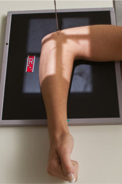
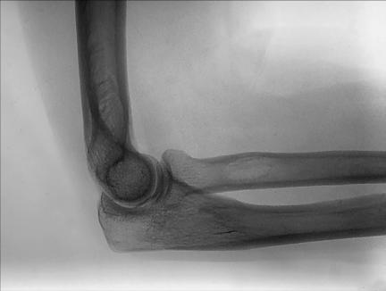
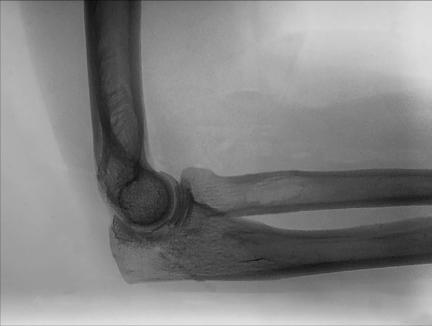

# Rx cot incidență latero-medială

  📷 Radiografie Convențională (Rx)
  <strong>Actualizat:</strong> 2026-09-15
  <strong>Autor:</strong> Departamentul de Radiologie / Referință Bontrager

---

-   __1. Rezumat Clinic & Indicații__

    ---

    === "Indicații Clinice"

        - suspiciune de fractură și luxație / subluxație articulară a cotului
        - Anumite procese patologice osoase, precum osteomielita / leziunile inflamatorii osoase și artrita
        - pernuțele adipoase ridicate sau deplasate ale articulației cotului pot fi vizualizate

    === "Ghid Național IRIS"

        !!! info "Referință Primară: Ghidul Național IRIS (Ordinul MS 1342/2012)"
            - **Capitol Ghid IRIS:** *Aparat locomotor & Membru superior*
            - **Grad de Recomandare:** **Grad A**
            - **Nivel de Iradiere Estimată:** `Clasa 1 (Minimă < 0.02 mSv)`

            [:octicons-search-16: Deschide Ghidul IRIS](../../iris.md){ .md-button .md-button--primary } [:material-open-in-new: Aplicația Oficială PWA](https://radiologie-pediatrica.ro/iris/){ .md-button target="_blank" rel="noopener" }

-   __2. Poziționare & Centrare Fascicul__

    ---

    - **Poziție Pacient:** Pacient: Așezați pacientul la capătul mesei, cu cotul flectat la 90° (vezi NOTĂ).; Regiune anatomică: Aliniați axa longitudinală a antebrațului cu axa longitudinală a receptorului de imagine. Centrați articulația cotului pe raza centrală și în centrul receptorului de imagine. Coborâți umărul astfel încât humerusul și antebrațul să fie în același plan orizontal. Rotiți mâna și pumnul (articulația radiocarpiană) în incidență de profil adevărată, cu partea policelui în sus. Plasați planul interepicondilian perpendicular pe receptorul de imagine (RI) (Fig. 4.143). Plasați un suport sub mână și pumn (articulația radiocarpiană) pentru a ridica mâna și antebrațul distal, după cum este necesar pentru antebrațul cu musculatură voluminoasă, astfel încât antebrațul să fie paralel cu receptorul de imagine pentru o incidență de profil adevărată a cotului.
    - **Punct de Centrare Fascicul:** perpendicular pe receptorul de imagine, orientat spre articulația cotului, la mijloc (punct situat aproximativ la 1½ țoli [4 cm] medial față de suprafața posterioară ușor palpabilă a olecranului)
    - **Distanță Focar-Film (DFF / SID):** 100 cm
    - **Comandă Respiratorie:** Apnee pe durata expunerii (sau conform cooperării pacientului)

-   __3. Parametri Tehnici Expunere__

    ---

    | Parametru Tehnic | Valoare Configurare Generator / Tub |
    |:-----------------|:-------------------------------------|
    | **Tensiune Tub (kV)** | 65 kV |
    | **Sarcină / Produs Curent-Timp (mAs)** | DE CONFIGURAT PE APARAT |
    | **Distanță Focar-Film (DFF / SID)** | 100 cm |
    | **Grilă Antidifuzoare (Bucky)** | Fără grilă (expunere directă) |
    | **Dimensiune Focar** | Focar Mic (0.6 mm) |
    | **Camere de Ionizare AEC** | DE CONFIGURAT PE APARAT |
    | **Colimare Fascicul** | Dimensiunea câmpului Colimați pe cele patru laturi la regiunea anatomică de interes. |
    | **Filtrare Tub** | Totală ≥ 2.5 mm Al echivalent |

-   __4. Criterii de Calitate & Reușită Imagine__

    ---

    - Incidența de profil a humerusului distal și antebrațului proximal, olecranului, țesuturilor moi și pernițelor adipoase ale articulației cotului sunt vizibile (Figs. 4.144 și 4.145). Poziție:
    - Axa longitudinală a antebrațului trebuie să fie aliniată cu axa longitudinală a receptorului de imagine, cu articulația cotului flectată la 90°.
    - Aproximativ jumătate din capul radial trebuie să fie suprapusă de procesul coronoid, iar olecranul trebuie să fie vizualizat de profil.
    - Incidența de profil adevărată este indicată de trei arcuri concentrice ale șanțului trohlear, de crestele duble ale capitulului și trohleei și de incizura trohleară a ulnei. În plus, apare suprapunerea epicondililor humerali.
    - Raza centrală și centrul câmpului de colimare trebuie să fie la mijlocul articulației cotului. Expunere:
    - Fără mișcare și cu expunere și contrast optime ale receptorului de imagine, trebuie vizualizate marginile corticale nete și desenul trabecular clar, precum și marginile țesuturilor moi ale pernițelor adipoase anterioară și posterioară. Fig. 4.143 profil—cot flectat la 90° (antebraț paralel cu receptorul de imagine). Perniță adipoasă anterioară; proces coronoid; bandă adipoasă supinatoare; R cap radial; șanț trohlear; incizură trohleară; olecran; epicondili. Fig. 4.145 Incidență latero-medială a cotului drept.

-   __5. Protecție Radiologică (ALARA)__

    ---

    - Ecranare gonadică și a organelor radiosensibile conform procedurilor locale de radioprotecție ALARA.
    - Colimare strictă la aria de interes pentru limitarea radiației difuze.
    - Verificarea posibilității unei sarcini la pacientele de vârstă fertilă înainte de expunere.

!!! note "Observații Clinice & Tehnice"
    Diagnosticul anumitor procese patologice articulare importante (de exemplu, posibila vizualizare a pernuței adipoase posterioare) depinde de flexia la 90° a articulației cotului.3 eXCepTION: Anumite diagnostice ale părților moi pot necesita o flexie mai mică (30° la 35°), dar aceste incidențe trebuie efectuate numai când sunt indicate în mod specific. Cot RUTINĂ AP AP alternativă — flexie parțială AP alternativă — flexie acută oblică laterală (externă) medială (internă) laterală Fig. 4.144 Incidență latero-medială a cotului drept.

### 🖼️ Imagini

<figure class="protocol-image-card" markdown>

<figcaption><strong>Fig. 4.144 Incidență latero-medială a cotului drept.</strong> — Poziționarea pacientului conform Ghidului Bontrager (Fig. 4.144 Incidență latero-medială a cotului drept.)</figcaption>

</figure>

<figure class="protocol-image-card" markdown>

<figcaption><strong>Fig. 4.143 Profil—cot flectat la 90° (antebraț paralel cu receptorul de imagine).</strong> — Aspect radiografic de referință conform Ghidului Bontrager (Fig. 4.143 profil—cot flectat la 90° (antebraț paralel cu receptorul de imagine).)</figcaption>

</figure>

<figure class="protocol-image-card" markdown>

<figcaption><strong>Fig. 4.145 Incidență latero-medială a cotului drept.</strong> — Aspect radiografic de referință conform Ghidului Bontrager (Fig. 4.145 Incidență latero-medială a cotului drept.)</figcaption>

</figure>

=== "Ghid Rapid de Execuție"

    1. **Identificarea și verificarea pacientului:** verificare identitate, zonă de examinat, consimțământ conform procedurii și evaluarea posibilității unei sarcini, când este relevantă.
    2. **Pregătire:** îndepărtarea oricăror obiecte radiopace (bijuterii, agrafe, fermoare, proteze, pansamente dense).
    3. **Poziționare precisă:** alinierea receptorului de imagine și a tubului la distanța prescrisă (100 cm).
    4. **Colimare strictă:** adaptarea fasciculului strict la regiunea de diagnostic pentru scăderea iradierii și reducerea radiației difuze.
    5. **Radioprotecție:** verificarea [politicii RX](../radioprotectie.md), cu măsuri distincte pentru pacient, personal și însoțitor.

## Surse de documentare

- [Bontrager's Textbook of Radiographic Positioning (Ed. 9/10), Pagina 183](https://www.elsevier.com/books/textbook-of-radiographic-positioning-and-related-anatomy/lampignano/978-0-323-65367-1)
