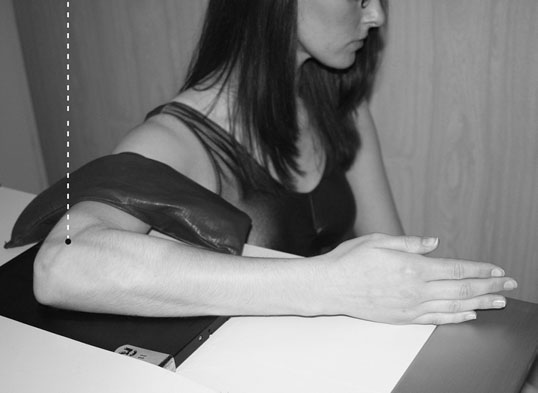
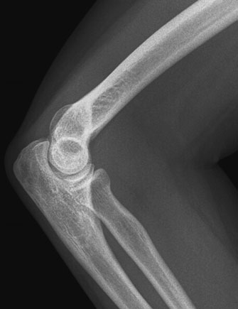
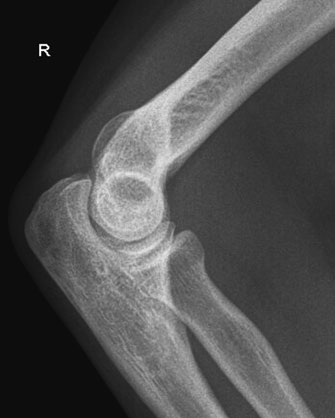

# Rx Cot Profil (Lateral)

  📷 Radiografie Convențională (Rx)
  <strong>Actualizat:</strong> 2026-09-16
  <strong>Autor:</strong> Departamentul de Radiologie / Referință Clark (Ed. 12)

---

-   __1. Rezumat Clinic & Indicații__

    ---

    === "Indicații Clinice"

        - 61 2 Cot most satisfactory incidențe de Cot articulație sunt obtained when upper braț este în same plane ca Antebraț (Radius și Ulna). pentru many examinations, pacientul will fie așezat pe scaun la masa de examinare cu Umăr lowered, astfel încât upper braț, Cot și Antebraț (Radius și Ulna) sunt pe same orizontal level. la gain pacientul’s confidence, Profil (lateral) incidență este taken first, because pacientul will find it easier la adopt this poziție. în changing poziție de la that pentru Profil (lateral) incidență la that pentru Antero-posterior (AP) incidență, Humerus trebuie să fie rotit through 90 grade la make sure that two incidențe la drept-angles sunt obtained de Humerus ca well ca ulna și radius. Alternatively, if limb cannot fie moved, two incidențe la drept-angles la fiecare other poate fie taken prin keeping limb în same poziție și moving tubul through 90 grade între incidențe. pentru Profil (lateral) incidență, raza centrală trebuie să pass paralel la line joining epicondyles de Humerus. pentru anteroposterior incidență, raza centrală trebuie să pass la drept-angles la this line. în some instances, tube angulation will fie necessary. If pacientul cannot se extinde Cot fully, modified positioning este necessary pentru Antero-posterior (AP) incidență. Basic Profil (lateral) și Antero-posterior (AP) incidențe poate fie taken pe same casetă using lead rubber la mask off fiecare half de caseta în turn. pentru fiecare incidență, care trebuie să fie taken la place Cot în centre de half de film radiologic being used, astfel încât two incidențe de articulație sunt la same eye level when viewed. Profil (lateral)

    === "Ghid Național IRIS"

        !!! info "Referință Primară: Ghidul Național IRIS (Ordinul MS 1342/2012)"
            - **Capitol Ghid IRIS:** *Ghidul Național IRIS*
            - **Grad de Recomandare:** **De verificat pe indicație; fără grad atribuit automat**
            - **Nivel de Iradiere Estimată:** `De verificat pentru examinarea și populația selectate`

            [:octicons-search-16: Deschide Ghidul IRIS](../../iris.md){ .md-button .md-button--primary } [:material-open-in-new: Aplicația Oficială PWA](https://radiologie-pediatrica.ro/iris/){ .md-button target="_blank" rel="noopener" }
-   __2. Poziționare & Centrare Fascicul__

    ---

    - **Poziție Pacient:** • Pacientul stă așezat pe scaun lângă masa de examinare, cu partea afectată sprijinită pe masă.
• Cot este flectat la 90 grade și palm de Mână este rotit so that it este la 90 grade la tabletop.
• Umăr este lowered so that it este la same height ca Cot și Pumn (Articulație Radiocarpiană), astfel încât medial aspect de entire braț este în contact cu tabletop.
• half de caseta being used este plasat under pacientul’s Cot, cu its centre la Cot articulație și its short axis paralel cu Antebraț (Radius și Ulna).
• limb este imobilizat using săculeți cu nisip.
    - **Punct de Centrare Fascicul:** • Raza centrală verticală este centrată pe Profil (lateral) epicondyle de Humerus.
    - **Distanță Focar-Film (DFF / SID):** 100 cm
    - **Comandă Respiratorie:** Apnee pe durata expunerii (apnee în inspir pentru torace; expir pentru Abdomen/bazin).

-   __3. Parametri Tehnici Expunere__

    ---

    | Parametru Tehnic | Valoare Configurare Generator / Tub |
    |:-----------------|:-------------------------------------|
    | **Tensiune Tub (kV)** | DE CONFIGURAT PE APARAT |
    | **Sarcină / Produs Curent-Timp (mAs)** | Conform AEC / grosime anatomică |
    | **Distanță Focar-Film (DFF / SID)** | 100 cm |
    | **Grilă Antidifuzoare (Bucky)** | Conform grosimii anatomice (> 10-12 cm cu grilă) |
    | **Dimensiune Focar** | Focar Mic (0.6 mm) |
    | **Camere de Ionizare AEC** | DE CONFIGURAT PE APARAT |
    | **Colimare Fascicul** | Colimare strictă la aria anatomică de interes diagnostic |
    | **Filtrare Tub** | Totală ≥ 2.5 mm Al echivalent (conform Clark: 3.0 mm Al eq.) |

-   __4. Criterii de Calitate & Reușită Imagine__

    ---

    - raza centrală trebuie să pass through spații articulare la 90 grade la Humerus, i.e. epicondyles trebuie să fie superimposed.
    - imagine trebuie să evidențiază distal third de Humerus și proximal third de radius și ulna. Supracondyalar ridge Epicondyles olecran Trochlear notch Shaft de ulna Tuberosity de radius proces coronoid cap de radius Trochlear surface Capitulum Shaft de Humerus Profil (lateral) radiografie de Cot Normal Profil (lateral) radiografie de Cot

-   __5. Protecție Radiologică (ALARA)__

    ---

    - Ecranare gonadică cu șorț plumbat dacă gonadele sunt în apropierea fasciculului util (regula ALARA).
    - Colimare precisă la dimensiunea anatomică strict necesară pentru reducerea dozei și a radiației difuze.
    - Verificarea posibilității unei sarcini la pacientele de vârstă fertilă înainte de expunere.

!!! note "Observații Clinice & Tehnice"
    Pregătirea pacientului prin îndepărtarea tuturor accesoriilor radio-opace.

### 🖼️ Imagini

<figure class="protocol-image-card" markdown>

<figcaption><strong>supracondylar suspiciune de fractură de Humerus, when Incidențe Standard de Bază</strong> — Poziționare pacient și centrare fascicul conform Clark (Ed. 12)</figcaption>

</figure>

<figure class="protocol-image-card" markdown>

<figcaption><strong>• raza centrală trebuie să pass through spații articulare la 90 grade</strong> — Aspect radiografic / ghid de poziționare conform tratatului Clark (Ed. 12)</figcaption>

</figure>

<figure class="protocol-image-card" markdown>

<figcaption><strong>Profil (lateral) radiografie de Cot</strong> — Aspect radiografic / ghid de poziționare conform tratatului Clark (Ed. 12)</figcaption>

</figure>

=== "Ghid Rapid de Execuție"

    1. **Identificarea și verificarea pacientului:** verificare identitate, zonă de examinat, consimțământ conform procedurii și evaluarea posibilității unei sarcini, când este relevantă.
    2. **Pregătire:** îndepărtarea oricăror obiecte radiopace (bijuterii, agrafe, fermoare, proteze, pansamente dense).
    3. **Poziționare precisă:** alinierea receptorului de imagine și a tubului la distanța prescrisă (100 cm).
    4. **Colimare strictă:** adaptarea fasciculului strict la regiunea de diagnostic pentru scăderea iradierii și reducerea radiației difuze.
    5. **Radioprotecție:** verificarea [politicii RX](../radioprotectie.md), cu măsuri distincte pentru pacient, personal și însoțitor.

## Surse de documentare

- [Clark's Positioning in Radiography (Ed. 12), Pagina 76](../../assets/protocols/sources/Clark___Positioning_in_Radiography__12th_edition.pdf#page=76)
