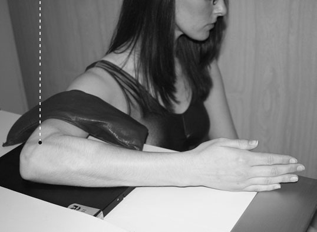
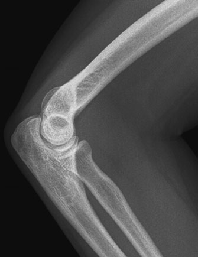
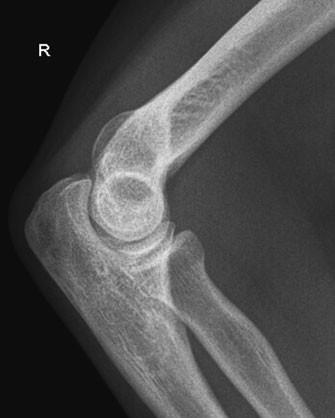

# Rx Cot Profil (Lateral)

  📷 Radiografie Convențională (Rx)
  <strong>Actualizat:</strong> 2026-09-16
  <strong>Autor:</strong> Departamentul de Radiologie / Referință Clark (Ed. 12)

---

-   __1. Rezumat Clinic & Indicații__

    ---

    === "Indicații Clinice"

        - Cot. Imaginile articulației cotului se obțin în condiții optime când brațul și antebrațul sunt în același plan. Pentru multe examinări, pacientul stă așezat la masa de examinare, cu umărul coborât, astfel încât brațul, cotul și antebrațul să fie la același nivel orizontal. Pentru a câștiga încrederea pacientului, se efectuează mai întâi incidența de profil, deoarece această poziție este mai ușor de adoptat. La trecerea de la incidența de profil la cea antero-posterioară, humerusul trebuie rotit cu 90 de grade, pentru a obține două incidențe perpendiculare atât ale humerusului, cât și ale ulnei și radiusului. Alternativ, dacă membrul nu poate fi mobilizat, se pot obține două incidențe perpendiculare menținând membrul în aceeași poziție și deplasând tubul cu 90 de grade între expuneri. Pentru incidența de profil, raza centrală trebuie să fie paralelă cu linia care unește epicondilii humerusului. Pentru incidența antero-posterioară, raza centrală trebuie să fie perpendiculară pe această linie. În unele cazuri este necesară angularea tubului. Dacă pacientul nu poate extinde complet cotul, poziționarea pentru incidența antero-posterioară trebuie adaptată. Incidențele standard de profil și antero-posterioară se pot efectua pe aceeași casetă, protejând succesiv fiecare jumătate cu cauciuc plumbat. Pentru fiecare incidență, cotul trebuie plasat în centrul jumătății de film utilizate, astfel încât cele două imagini ale articulației să fie la același nivel la vizualizare. Incidență de profil.

    === "Ghid Național IRIS"

        !!! info "Referință Primară: Ghidul Național IRIS (Ordinul MS 1342/2012)"
            - **Capitol Ghid IRIS:** *Ghidul Național IRIS*
            - **Grad de Recomandare:** **De verificat pe indicație; fără grad atribuit automat**
            - **Nivel de Iradiere Estimată:** `De verificat pentru examinarea și populația selectate`

            [:octicons-search-16: Deschide Ghidul IRIS](../../iris.md){ .md-button .md-button--primary } [:material-open-in-new: Aplicația Oficială PWA](https://radiologie-pediatrica.ro/iris/){ .md-button target="_blank" rel="noopener" }
-   __2. Poziționare & Centrare Fascicul__

    ---

    - **Poziție Pacient:** • Pacientul stă așezat pe scaun lângă masa de examinare, cu partea afectată sprijinită pe masă.
• Cotul este flectat la 90 de grade, iar palma este rotită astfel încât să fie perpendiculară pe suprafața mesei.
• Umărul este coborât la nivelul cotului și al pumnului, astfel încât fața medială a întregului membru superior să fie în contact cu suprafața mesei.
• Jumătatea de casetă utilizată este plasată sub cotul pacientului, cu centrul la nivelul articulației cotului și axa scurtă paralelă cu antebrațul.
• Membrul este imobilizat cu săculeți cu nisip.
    - **Punct de Centrare Fascicul:** • Raza centrală verticală este centrată pe epicondilul lateral al humerusului.
    - **Distanță Focar-Film (DFF / SID):** 100 cm
    - **Comandă Respiratorie:** Apnee pe durata expunerii (apnee în inspir pentru torace; expir pentru Abdomen/bazin).

-   __3. Parametri Tehnici Expunere__

    ---

    | Parametru Tehnic | Valoare Configurare Generator / Tub |
    |:-----------------|:-------------------------------------|
    | **Tensiune Tub (kV)** | DE CONFIGURAT PE APARAT |
    | **Sarcină / Produs Curent-Timp (mAs)** | Conform AEC / grosime anatomică |
    | **Distanță Focar-Film (DFF / SID)** | 100 cm |
    | **Grilă Antidifuzoare (Bucky)** | Conform grosimii anatomice (> 10-12 cm cu grilă) |
    | **Dimensiune Focar** | Focar Mic (0.6 mm) |
    | **Camere de Ionizare AEC** | DE CONFIGURAT PE APARAT |
    | **Colimare Fascicul** | Colimare strictă la aria anatomică de interes diagnostic |
    | **Filtrare Tub** | Totală ≥ 2.5 mm Al echivalent (conform Clark: 3.0 mm Al eq.) |

-   __4. Criterii de Calitate & Reușită Imagine__

    ---

    - Raza centrală trebuie să traverseze spațiile articulare perpendicular pe humerus, ceea ce presupune suprapunerea epicondililor.
    - Imaginea trebuie să evidențieze treimea distală a humerusului și treimea proximală a radiusului și a ulnei. Repere anatomice: creasta supracondiliană; epicondilii; olecranul; incizura trohleară; diafiza ulnei; tuberozitatea radiusului; procesul coronoid; capul radiusului; suprafața trohleară; capitulul humeral; diafiza humerusului. Radiografie de profil a cotului. Radiografie normală de profil a cotului.

-   __5. Protecție Radiologică (ALARA)__

    ---

    - Ecranare gonadică cu șorț plumbat dacă gonadele sunt în apropierea fasciculului util (regula ALARA).
    - Colimare precisă la dimensiunea anatomică strict necesară pentru reducerea dozei și a radiației difuze.
    - Verificarea posibilității unei sarcini la pacientele de vârstă fertilă înainte de expunere.

!!! note "Observații Clinice & Tehnice"
    Pregătirea pacientului prin îndepărtarea tuturor accesoriilor radio-opace.

### 🖼️ Imagini

<figure class="protocol-image-card" markdown>

<figcaption><strong>Suspiciune de fractură supracondiliană a humerusului, când incidențele standard…</strong> — Poziționare pacient și centrare fascicul conform Clark (Ed. 12)</figcaption>

</figure>

<figure class="protocol-image-card" markdown>

<figcaption><strong>• Raza centrală trebuie să traverseze spațiile articulare la 90 de grade.</strong> — Aspect radiografic / ghid de poziționare conform tratatului Clark (Ed. 12)</figcaption>

</figure>

<figure class="protocol-image-card" markdown>

<figcaption><strong>Radiografie de profil a cotului</strong> — Aspect radiografic / ghid de poziționare conform tratatului Clark (Ed. 12)</figcaption>

</figure>

=== "Ghid Rapid de Execuție"

    1. **Identificarea și verificarea pacientului:** verificare identitate, zonă de examinat, consimțământ conform procedurii și evaluarea posibilității unei sarcini, când este relevantă.
    2. **Pregătire:** îndepărtarea oricăror obiecte radiopace (bijuterii, agrafe, fermoare, proteze, pansamente dense).
    3. **Poziționare precisă:** alinierea receptorului de imagine și a tubului la distanța prescrisă (100 cm).
    4. **Colimare strictă:** adaptarea fasciculului strict la regiunea de diagnostic pentru scăderea iradierii și reducerea radiației difuze.
    5. **Radioprotecție:** verificarea [politicii RX](../radioprotectie.md), cu măsuri distincte pentru pacient, personal și însoțitor.

## Surse de documentare

- [Clark's Positioning in Radiography (Ed. 12), Pagina 76](https://books.google.com/books/about/Clark_s_Positioning_in_Radiography.html?id=Xxu6MwEACAAJ)
