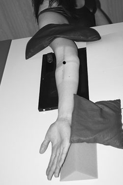
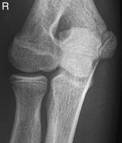
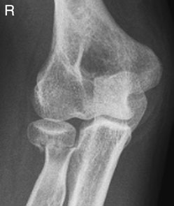
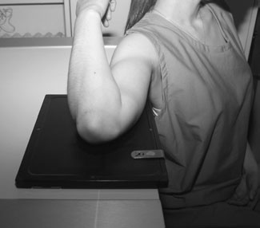
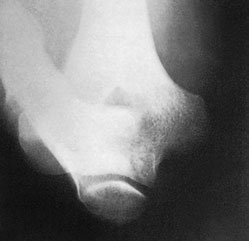
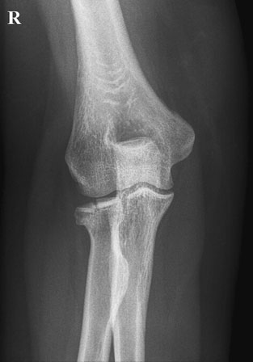
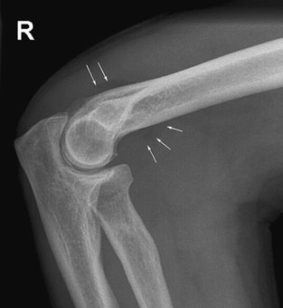
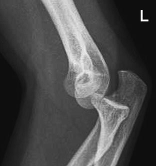
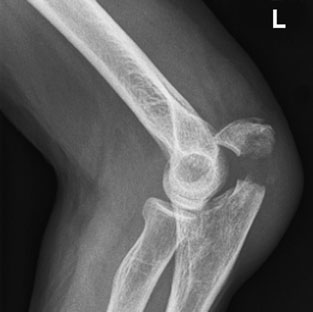
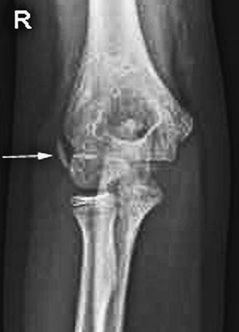

# Rx Cot Proximal radio - ulnar joint - Oblică

  📷 Radiografie Convențională (Rx)
  <strong>Actualizat:</strong> 2026-09-16
  <strong>Autor:</strong> Departamentul de Radiologie / Referință Clark (Ed. 12)

---

-   __1. Rezumat Clinic & Indicații__

    ---

    === "Indicații Clinice"

        - effusion este useful marker de disease și poate fie evidențiat în trauma, proces infecțios / inflamator și inflammatory conditions. It este seen ca elevation de fat pads anteriorly și posteriorly (see below) și requires good Profil (lateral) incidență cu Absența rotației anatomice (simetrie bilaterală perfectă). It poate fie important clue la otherwise occult suspiciune de fractură de cap radial sau supracondylar suspiciune de fractură de Humerus.
        - cap radial suspiciune de fractură poate fie nearly sau completely occult, evidențiind ca slightest cortical infraction sau trabecular irregularity la gâtul sau just articulație effusion.
        - Avulsion de one de epicondyles de Humerus poate fie missed if avulsed bone este hidden over other bone sau în olecran sau coronoid fossae. Recognition de their absence requires knowledge de when și where they trebuie să fie seen. 68 Profil (lateral) radiografie de Cot evidențiind elevation de anterior și posterior fat pads Antero-posterior (AP) radiografie de Cot evidențiind avulsion injury de Profil (lateral) epicondyle Antero-posterior (AP) radiografie de Cot evidențiind vertical suspiciune de fractură de capul de radius Profil (lateral) radiografie evidențiind luxație articulară de Cot Profil (lateral) radiografie evidențiind suspiciune de fractură through olecran, cu displacement due la triceps muscle pull

    === "Ghid Național IRIS"

        !!! info "Referință Primară: Ghidul Național IRIS (Ordinul MS 1342/2012)"
            - **Capitol Ghid IRIS:** *Ghidul Național IRIS*
            - **Grad de Recomandare:** **De verificat pe indicație; fără grad atribuit automat**
            - **Nivel de Iradiere Estimată:** `De verificat pentru examinarea și populația selectate`

            [:octicons-search-16: Deschide Ghidul IRIS](../../iris.md){ .md-button .md-button--primary } [:material-open-in-new: Aplicația Oficială PWA](https://radiologie-pediatrica.ro/iris/){ .md-button target="_blank" rel="noopener" }
-   __2. Poziționare & Centrare Fascicul__

    ---

    - **Poziție Pacient:** • pacientul este așezat pe scaun alongside masa radiologică, cu partea afectată nearest masa de examinare.
• Cot este fully flectat, și posterior aspect de upper braț este plasat în contact cu tabletop.
• caseta este poziționat under lower end de Humerus, cu its centre midway între epicondyles de Humerus.
• cu Cot still fully flectat, braț este externally rotit through 45 grade și sprijinit în this poziție.
    - **Punct de Centrare Fascicul:** • Raza centrală verticală este centrată pe epicondil medial (epitrohlee) de Humerus.
    - **Distanță Focar-Film (DFF / SID):** 100 cm
    - **Comandă Respiratorie:** Apnee pe durata expunerii (apnee în inspir pentru torace; expir pentru Abdomen/bazin).

-   __3. Parametri Tehnici Expunere__

    ---

    | Parametru Tehnic | Valoare Configurare Generator / Tub |
    |:-----------------|:-------------------------------------|
    | **Tensiune Tub (kV)** | DE CONFIGURAT PE APARAT |
    | **Sarcină / Produs Curent-Timp (mAs)** | Conform AEC / grosime anatomică |
    | **Distanță Focar-Film (DFF / SID)** | 100 cm |
    | **Grilă Antidifuzoare (Bucky)** | Conform grosimii anatomice (> 10-12 cm cu grilă) |
    | **Dimensiune Focar** | Focar Mic (0.6 mm) |
    | **Camere de Ionizare AEC** | DE CONFIGURAT PE APARAT |
    | **Colimare Fascicul** | Colimare strictă adaptată pe receptor 18 x 24 cm |
    | **Filtrare Tub** | Totală ≥ 2.5 mm Al echivalent (conform Clark: 3.0 mm Al eq.) |

-   __4. Criterii de Calitate & Reușită Imagine__

    ---

    - expunere este chosen la evidențiază ulnar groove în profile. Normal suspiciune de fractură cap radial Oblică radiografii de Cot la show proximal radio-ulnar articulație radiografie de Cot evidențiind ulnar groove

-   __5. Protecție Radiologică (ALARA)__

    ---

    - Ecranare gonadică cu șorț plumbat dacă gonadele sunt în apropierea fasciculului util (regula ALARA).
    - Colimare precisă la dimensiunea anatomică strict necesară pentru reducerea dozei și a radiației difuze.
    - Verificarea posibilității unei sarcini la pacientele de vârstă fertilă înainte de expunere.

!!! note "Observații Clinice & Tehnice"
    well-collimated fascicul este used la reduce degradation de imagine prin scattered radiation.

### 🖼️ Imagini

<figure class="protocol-image-card" markdown>

<figcaption><strong>• imagine trebuie să evidențiază clearly spații articulare între</strong> — Poziționare pacient și centrare fascicul conform Clark (Ed. 12)</figcaption>

</figure>

<figure class="protocol-image-card" markdown>

<figcaption><strong>suspiciune de fractură cap radial</strong> — Aspect radiografic / ghid de poziționare conform tratatului Clark (Ed. 12)</figcaption>

</figure>

<figure class="protocol-image-card" markdown>

<figcaption><strong>Oblică radiografii de Cot la show proximal radio-ulnar articulație</strong> — Aspect radiografic / ghid de poziționare conform tratatului Clark (Ed. 12)</figcaption>

</figure>

<figure class="protocol-image-card" markdown>

<figcaption><strong>radiografie de Cot evidențiind ulnar groove</strong> — Aspect radiografic / ghid de poziționare conform tratatului Clark (Ed. 12)</figcaption>

</figure>

<figure class="protocol-image-card" markdown>

<figcaption><strong>Figura 5: Aspect radiografic / Poziționare (Clark Ed. 12)</strong> — Aspect radiografic / ghid de poziționare conform tratatului Clark (Ed. 12)</figcaption>

</figure>

<figure class="protocol-image-card" markdown>

<figcaption><strong>tion. It poate fie important clue la otherwise occult suspiciune de fractură</strong> — Aspect radiografic / ghid de poziționare conform tratatului Clark (Ed. 12)</figcaption>

</figure>

<figure class="protocol-image-card" markdown>

<figcaption><strong>de cap radial sau supracondylar suspiciune de fractură de Humerus.</strong> — Aspect radiografic / ghid de poziționare conform tratatului Clark (Ed. 12)</figcaption>

</figure>

<figure class="protocol-image-card" markdown>

<figcaption><strong>• cap radial suspiciune de fractură poate fie nearly sau completely occult,</strong> — Aspect radiografic / ghid de poziționare conform tratatului Clark (Ed. 12)</figcaption>

</figure>

<figure class="protocol-image-card" markdown>

<figcaption><strong>evidențiind ca slightest cortical infraction sau trabecular irreg-</strong> — Aspect radiografic / ghid de poziționare conform tratatului Clark (Ed. 12)</figcaption>

</figure>

<figure class="protocol-image-card" markdown>

<figcaption><strong>Profil (lateral) radiografie de Cot evidențiind elevation de anterior și</strong> — Aspect radiografic / ghid de poziționare conform tratatului Clark (Ed. 12)</figcaption>

</figure>

=== "Ghid Rapid de Execuție"

    1. **Identificarea și verificarea pacientului:** verificare identitate, zonă de examinat, consimțământ conform procedurii și evaluarea posibilității unei sarcini, când este relevantă.
    2. **Pregătire:** îndepărtarea oricăror obiecte radiopace (bijuterii, agrafe, fermoare, proteze, pansamente dense).
    3. **Poziționare precisă:** alinierea receptorului de imagine și a tubului la distanța prescrisă (100 cm).
    4. **Colimare strictă:** adaptarea fasciculului strict la regiunea de diagnostic pentru scăderea iradierii și reducerea radiației difuze.
    5. **Radioprotecție:** verificarea [politicii RX](../radioprotectie.md), cu măsuri distincte pentru pacient, personal și însoțitor.

## Surse de documentare

- [Clark's Positioning in Radiography (Ed. 12), Pagina 82](../../assets/protocols/sources/Clark___Positioning_in_Radiography__12th_edition.pdf#page=82)
