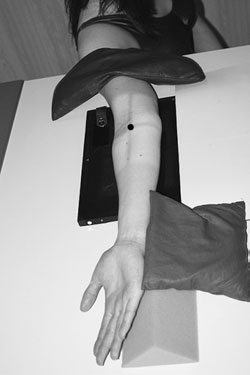
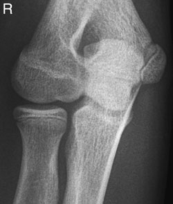
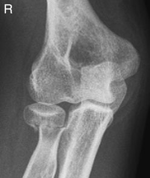
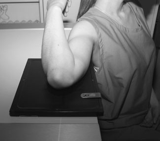
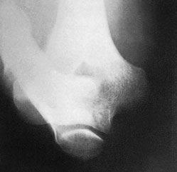
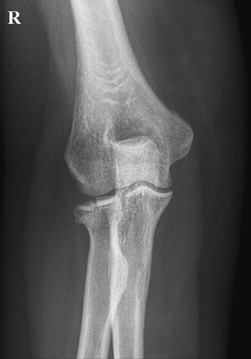
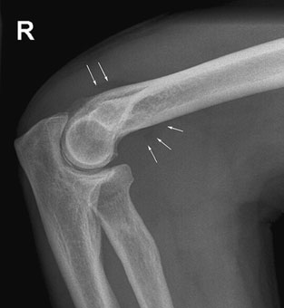
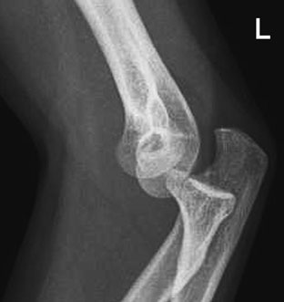
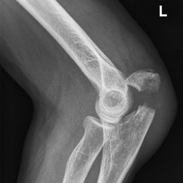
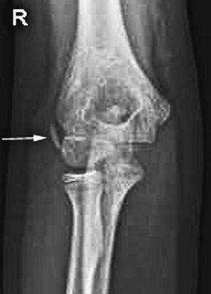

# Rx cot articulația radioulnară proximală – oblică

  📷 Radiografie Convențională (Rx)
  <strong>Actualizat:</strong> 2026-09-16
  <strong>Autor:</strong> Departamentul de Radiologie / Referință Clark (Ed. 12)

---

-   __1. Rezumat Clinic & Indicații__

    ---

    === "Indicații Clinice"

        - Revărsatul este un marker util al bolii și poate fi evidențiat în traumatisme, procese infecțioase/inflamatorii și afecțiuni inflamatorii. Este vizualizat ca o elevare a pernițelor adipoase anterioară și posterioară (vezi mai jos) și necesită o incidență de profil bună, cu absența rotației anatomice (simetrie bilaterală perfectă). Poate fi un indiciu important pentru o fractură ocultă suspectă a capului radial sau pentru o fractură supracondiliană suspectă a humerusului.
        - Fractura suspectă a capului radial poate fi aproape sau complet ocultă, evidențiindu-se ca o minimă întrerupere corticală sau neregularitate trabeculară la nivelul colului ori doar prin revărsat articular.
        - Avulsia unuia dintre epicondilii humerusului poate fi omisă dacă osul avulsionat este ascuns peste alt os sau în fosele olecraniană ori coronoidă. Recunoașterea absenței lor necesită cunoașterea momentului și locului în care trebuie vizualizați. 68 Radiografie de profil a cotului evidențiind elevarea pernițelor adipoase anterioară și posterioară; radiografie antero-posterioară (AP) a cotului evidențiind leziune de avulsie a epicondilului lateral; radiografie antero-posterioară (AP) a cotului evidențiind fractură verticală suspectă a capului radial; radiografie de profil evidențiind luxație articulară a cotului; radiografie de profil evidențiind fractură suspectă prin olecran, cu deplasare datorată tracțiunii mușchiului triceps.

    === "Ghid Național IRIS"

        !!! info "Referință Primară: Ghidul Național IRIS (Ordinul MS 1342/2012)"
            - **Capitol Ghid IRIS:** *Aparat locomotor & Membru superior*
            - **Grad de Recomandare:** **Grad A**
            - **Nivel de Iradiere Estimată:** `Clasa 1 (Minimă < 0.02 mSv)`

            [:octicons-search-16: Deschide Ghidul IRIS](../../iris.md){ .md-button .md-button--primary } [:material-open-in-new: Aplicația Oficială PWA](https://radiologie-pediatrica.ro/iris/){ .md-button target="_blank" rel="noopener" }

-   __2. Poziționare & Centrare Fascicul__

    ---

    - **Poziție Pacient:**
        - Pacientul este așezat pe scaun lângă masa radiologică, cu partea afectată cât mai aproape de masa de examinare.
        - Cotul este complet flectat, iar fața posterioară a brațului este plasată în contact cu suprafața mesei.
        - Caseta este poziționată sub extremitatea inferioară a humerusului, cu centrul la jumătatea distanței dintre epicondilii humerusului.
        - Cu cotul menținut complet flectat, brațul este rotit extern cu 45 de grade și susținut în această poziție.
    - **Punct de Centrare Fascicul:** • Raza centrală verticală este centrată pe epicondilul medial (epitrohlee) al humerusului.
    - **Distanță Focar-Film (DFF / SID):** 100 cm
    - **Comandă Respiratorie:** Apnee pe durata expunerii (apnee în inspir pentru torace; expir pentru Abdomen/bazin).

-   __3. Parametri Tehnici Expunere__

    ---

    | Parametru Tehnic | Valoare Configurare Generator / Tub |
    |:-----------------|:-------------------------------------|
    | **Tensiune Tub (kV)** | DE CONFIGURAT PE APARAT |
    | **Sarcină / Produs Curent-Timp (mAs)** | Conform AEC / grosimii anatomice |
    | **Distanță Focar-Film (DFF / SID)** | 100 cm |
    | **Grilă Antidifuzoare (Bucky)** | Conform grosimii anatomice (> 10-12 cm cu grilă) |
    | **Dimensiune Focar** | Focar Mic (0.6 mm) |
    | **Camere de Ionizare AEC** | DE CONFIGURAT PE APARAT |
    | **Colimare Fascicul** | Colimare strictă adaptată pe receptor 18 x 24 cm |
    | **Filtrare Tub** | Totală ≥ 2.5 mm Al echivalent (conform Clark: 3.0 mm Al echivalent) |

-   __4. Criterii de Calitate & Reușită Imagine__

    ---

    - Expunerea este aleasă pentru a evidenția șanțul ulnar de profil. Fractură normală suspectă a capului radial. Radiografii oblice ale cotului pentru evidențierea articulației radioulnare proximale. Radiografie a cotului evidențiind șanțul ulnar.

-   __5. Protecție Radiologică (ALARA)__

    ---

    - Ecranare gonadică cu șorț plumbat dacă gonadele sunt în apropierea fasciculului util (regula ALARA).
    - Colimare precisă la dimensiunea anatomică strict necesară pentru reducerea dozei și a radiației difuze.
    - Verificarea posibilității unei sarcini la pacientele de vârstă fertilă înainte de expunere.

!!! note "Observații Clinice & Tehnice"
    Un fascicul bine colimat este utilizat pentru a reduce degradarea imaginii prin radiația împrăștiată.

### 🖼️ Imagini

<figure class="protocol-image-card" markdown>

<figcaption><strong>• Imaginea trebuie să evidențieze clar spațiile articulare dintre</strong> — Poziționarea pacientului și centrarea fasciculului conform Clark (Ed. 12)</figcaption>

</figure>

<figure class="protocol-image-card" markdown>

<figcaption><strong>Fractură suspectă a capului radial</strong> — Aspect radiografic / ghid de poziționare conform tratatului Clark (Ed. 12)</figcaption>

</figure>

<figure class="protocol-image-card" markdown>

<figcaption><strong>Radiografii oblice ale cotului pentru evidențierea articulației radioulnare proximale</strong> — Aspect radiografic / ghid de poziționare conform tratatului Clark (Ed. 12)</figcaption>

</figure>

<figure class="protocol-image-card" markdown>

<figcaption><strong>Radiografie a cotului evidențiind șanțul ulnar</strong> — Aspect radiografic / ghid de poziționare conform tratatului Clark (Ed. 12)</figcaption>

</figure>

<figure class="protocol-image-card" markdown>

<figcaption><strong>Figura 5: Aspect radiografic / Poziționare (Clark Ed. 12)</strong> — Aspect radiografic / ghid de poziționare conform tratatului Clark (Ed. 12)</figcaption>

</figure>

<figure class="protocol-image-card" markdown>

<figcaption><strong>ție. Poate fi un indiciu important pentru o fractură suspectă, altfel ocultă</strong> — Aspect radiografic / ghid de poziționare conform tratatului Clark (Ed. 12)</figcaption>

</figure>

<figure class="protocol-image-card" markdown>

<figcaption><strong>a capului radial sau pentru o fractură supracondiliană suspectă a humerusului.</strong> — Aspect radiografic / ghid de poziționare conform tratatului Clark (Ed. 12)</figcaption>

</figure>

<figure class="protocol-image-card" markdown>

<figcaption><strong>• Fractura suspectă a capului radial poate fi aproape sau complet ocultă,</strong> — Aspect radiografic / ghid de poziționare conform tratatului Clark (Ed. 12)</figcaption>

</figure>

<figure class="protocol-image-card" markdown>

<figcaption><strong>evidențiindu-se ca o minimă întrerupere corticală sau neregularitate trabeculară-</strong> — Aspect radiografic / ghid de poziționare conform tratatului Clark (Ed. 12)</figcaption>

</figure>

<figure class="protocol-image-card" markdown>

<figcaption><strong>Radiografie de profil a cotului evidențiind elevarea perniței adipoase anterioare și</strong> — Aspect radiografic / ghid de poziționare conform tratatului Clark (Ed. 12)</figcaption>

</figure>

=== "Ghid Rapid de Execuție"

    1. **Identificarea și verificarea pacientului:** verificare identitate, zonă de examinat, consimțământ conform procedurii și evaluarea posibilității unei sarcini, când este relevantă.
    2. **Pregătire:** îndepărtarea oricăror obiecte radiopace (bijuterii, agrafe, fermoare, proteze, pansamente dense).
    3. **Poziționare precisă:** alinierea receptorului de imagine și a tubului la distanța prescrisă (100 cm).
    4. **Colimare strictă:** adaptarea fasciculului strict la regiunea de diagnostic pentru scăderea iradierii și reducerea radiației difuze.
    5. **Radioprotecție:** verificarea [politicii RX](../radioprotectie.md), cu măsuri distincte pentru pacient, personal și însoțitor.

## Surse de documentare

- [Clark's Positioning in Radiography (Ed. 12), Pagina 82](https://books.google.com/books/about/Clark_s_Positioning_in_Radiography.html?id=Xxu6MwEACAAJ)
