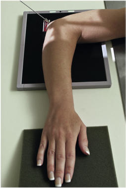
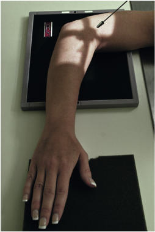
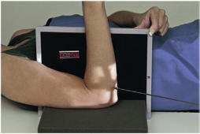
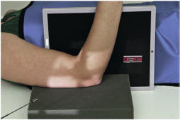
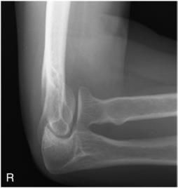
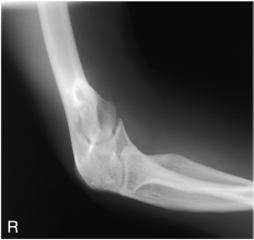
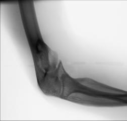
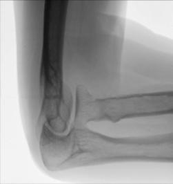

# Rx Cot traumatism acuttism / Regim Urgență AXIAL Incidență Latero-Medială (COYLE METHOD16)

  📷 Radiografie Convențională (Rx)
  <strong>Actualizat:</strong> 2026-09-15
  <strong>Autor:</strong> Departamentul de Radiologie / Referință Bontrager

---

-   __1. Rezumat Clinic & Indicații__

    ---

    === "Indicații Clinice"

        - suspiciune de fractură și luxație / subluxație articulară de Cot, particularly cap radial (part poziție 1) și proces coronoid (part poziție 2 pentru proces coronoid)

    === "Ghid Național IRIS"

        !!! info "Referință Primară: Ghidul Național IRIS (Ordinul MS 1342/2012)"
            - **Capitol Ghid IRIS:** *Ghidul Național IRIS*
            - **Grad de Recomandare:** **De verificat pe indicație; fără grad atribuit automat**
            - **Nivel de Iradiere Estimată:** `De verificat pentru examinarea și populația selectate`

            [:octicons-search-16: Deschide Ghidul IRIS](../../iris.md){ .md-button .md-button--primary } [:material-open-in-new: Aplicația Oficială PWA](https://radiologie-pediatrica.ro/iris/){ .md-button target="_blank" rel="noopener" }
-   __2. Poziționare & Centrare Fascicul__

    ---

    - **Poziție Pacient:** Pacient: Seat pacient la end de masa de examinare pentru Ortostatism poziție sau Decubit dorsal pe masa de examinare pentru orizontal fascicul imaging.; Regiune anatomică: 2: proces coronoid–axial Mediolateral incidență Cot flectat only 80° de la extins poziție (because >80° poate obscure proces coronoid) și Mână în pronație
    - **Punct de Centrare Fascicul:** înclinat 45° de la Umăr, into midelbow articulație (Figs. 4.147 și 4.149)
    - **Distanță Focar-Film (DFF / SID):** 100 cm
    - **Comandă Respiratorie:** Apnee pe durata expunerii (sau conform cooperării pacientului)

-   __3. Parametri Tehnici Expunere__

    ---

    | Parametru Tehnic | Valoare Configurare Generator / Tub |
    |:-----------------|:-------------------------------------|
    | **Tensiune Tub (kV)** | 70 kV |
    | **Sarcină / Produs Curent-Timp (mAs)** | DE CONFIGURAT PE APARAT |
    | **Distanță Focar-Film (DFF / SID)** | 100 cm |
    | **Grilă Antidifuzoare (Bucky)** | Fără grilă (expunere directă) |
    | **Dimensiune Focar** | Focar Mic (0.6 mm) |
    | **Camere de Ionizare AEC** | DE CONFIGURAT PE APARAT |
    | **Colimare Fascicul** | Field Size Collimate pe four sides la anatomy de interest. |
    | **Filtrare Tub** | Totală ≥ 2.5 mm Al echivalent |

-   __4. Criterii de Calitate & Reușită Imagine__

    ---

    - cap radial:
    - spații articulare între cap radial și capitulum trebuie să fie open și clear.
    - cap radial, neck, și tuberosity trebuie să fie în profile și liber de superimposition except pentru small part de proces coronoid.
    - distal Humerus și epicondyles appear distorted because de 45° angle (Figs. 4.150 și 4.152). proces coronoid:
    - anterior portion de coronoid appears elongated but în profile.
    - spații articulare între proces coronoid și trochlea trebuie să fie open și clear.
    - cap radial și neck trebuie să fie superimposed prin ulna.
    - optim parametri de expunere trebuie să visualize clearly proces coronoid în profile. Bony margins de superimposed cap radial și neck trebuie să fie visualized faintly through proximal ulna (Figs. 4.151 și 4.153). Fig. 4.149 Decubit dorsal, înclinat 45° pentru proces coronoid—flectat 80°. Fig. 4.150 pentru cap radial. Capitulum col radial R Radial tubercle cap radial Fig. 4.152 axial lateromedial incidență pentru cap radial. Fig. 4.151 pentru proces coronoid. Trochlea proces coronoid R Fig. 4.153 axial mediolateral incidență pentru proces coronoid.

-   __5. Protecție Radiologică (ALARA)__

    ---

    - Ecranare gonadică și a organelor radiosensibile conform procedurilor locale de radioprotecție ALARA.
    - Colimare strictă la aria de interes pentru limitarea radiației difuze.
    - Verificarea posibilității unei sarcini la pacientele de vârstă fertilă înainte de expunere.

!!! note "Observații Clinice & Tehnice"
    Increase parametri de expunere prin 4 la 6 kVp de la lateral Cot because de înclinat raza centrală. These incidențe sunt effective cu sau fără splint. Cot SPECIAL traumatism acuttism / Regim Urgență axial laterals (Coyle method) Fig. 4.146 Ortostatism pentru cap radial—flectat 90°. Fig. 4.148 Decubit dorsal, înclinat 45° pentru cap radial—flectat 90°. Fig. 4.147 Ortostatism pentru proces coronoid—flectat 80°.

### 🖼️ Imagini

<figure class="protocol-image-card" markdown>

<figcaption><strong>Fig. 4.146 Ortostatism pentru radial</strong> — Poziționare pacient conform Ghidului Bontrager (Fig. 4.146 în ortostatism pentru radial)</figcaption>

</figure>

<figure class="protocol-image-card" markdown>

<figcaption><strong>Fig. 4.148 Decubit dorsal, înclinat 45° pentru</strong> — Aspect radiografic de referință conform Ghidului Bontrager (Fig. 4.148 în decubit dorsal, înclinat 45° pentru)</figcaption>

</figure>

<figure class="protocol-image-card" markdown>

<figcaption><strong>Fig. 4.147 Ortostatism pentru coronoid</strong> — Aspect radiografic de referință conform Ghidului Bontrager (Fig. 4.147 în ortostatism pentru coronoid)</figcaption>

</figure>

<figure class="protocol-image-card" markdown>

<figcaption><strong>Fig. 4.149 Decubit dorsal, înclinat 45° pentru</strong> — Aspect radiografic de referință conform Ghidului Bontrager (Fig. 4.149 în decubit dorsal, înclinat 45° pentru)</figcaption>

</figure>

<figure class="protocol-image-card" markdown>

<figcaption><strong>Fig. 4.150 pentru cap radial.</strong> — Aspect radiografic de referință conform Ghidului Bontrager (Fig. 4.150 pentru cap radial.)</figcaption>

</figure>

<figure class="protocol-image-card" markdown>

<figcaption><strong>Fig. 4.152 axial lateromedial</strong> — Aspect radiografic de referință conform Ghidului Bontrager (Fig. 4.152 axial lateromedial)</figcaption>

</figure>

<figure class="protocol-image-card" markdown>

<figcaption><strong>Fig. 4.151 pentru proces coronoid.</strong> — Aspect radiografic de referință conform Ghidului Bontrager (Fig. 4.151 pentru proces coronoid.)</figcaption>

</figure>

<figure class="protocol-image-card" markdown>

<figcaption><strong>Fig. 4.153 axial mediolateral</strong> — Aspect radiografic de referință conform Ghidului Bontrager (Fig. 4.153 axial mediolateral)</figcaption>

</figure>

=== "Ghid Rapid de Execuție"

    1. **Identificarea și verificarea pacientului:** verificare identitate, zonă de examinat, consimțământ conform procedurii și evaluarea posibilității unei sarcini, când este relevantă.
    2. **Pregătire:** îndepărtarea oricăror obiecte radiopace (bijuterii, agrafe, fermoare, proteze, pansamente dense).
    3. **Poziționare precisă:** alinierea receptorului de imagine și a tubului la distanța prescrisă (100 cm).
    4. **Colimare strictă:** adaptarea fasciculului strict la regiunea de diagnostic pentru scăderea iradierii și reducerea radiației difuze.
    5. **Radioprotecție:** verificarea [politicii RX](../radioprotectie.md), cu măsuri distincte pentru pacient, personal și însoțitor.

## Surse de documentare

- [Bontrager's Textbook of Radiographic Positioning (Ed. 9/10), Pagina 184](https://www.elsevier.com/books/textbook-of-radiographic-positioning-and-related-anatomy/lampignano/978-0-323-65367-1)
