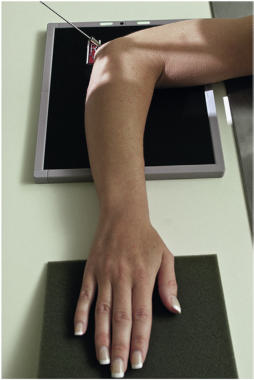
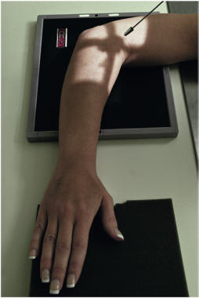
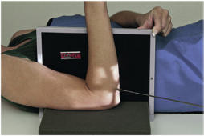
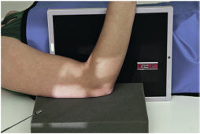
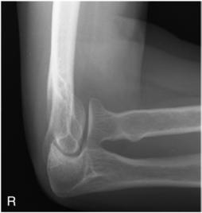
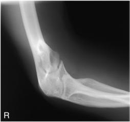
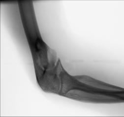
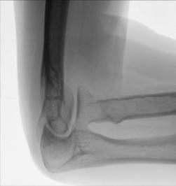

# Rx cot — traumatism acut / regim de urgență — incidență axială latero-medială (metoda COYLE 16)

  📷 Radiografie Convențională (Rx)
  <strong>Actualizat:</strong> 2026-09-15
  <strong>Autor:</strong> Departamentul de Radiologie / Referință Bontrager

---

-   __1. Rezumat Clinic & Indicații__

    ---

    === "Indicații Clinice"

        - Fractură suspectă și luxație/subluxație articulară a cotului, în special a capului radial (parte poziția 1) și a procesului coronoid (parte poziția 2 pentru procesul coronoid)

    === "Ghid Național IRIS"

        !!! info "Referință Primară: Ghidul Național IRIS (Ordinul MS 1342/2012)"
            - **Capitol Ghid IRIS:** *Aparat locomotor & Membru superior*
            - **Grad de Recomandare:** **Grad A**
            - **Nivel de Iradiere Estimată:** `Clasa 1 (Minimă < 0.02 mSv)`

            [:octicons-search-16: Deschide Ghidul IRIS](../../iris.md){ .md-button .md-button--primary } [:material-open-in-new: Aplicația Oficială PWA](https://radiologie-pediatrica.ro/iris/){ .md-button target="_blank" rel="noopener" }

-   __2. Poziționare & Centrare Fascicul__

    ---

    - **Poziție Pacient:** Pacient: Așezați pacientul la capătul mesei de examinare pentru poziția în ortostatism sau în decubit dorsal pe masa de examinare pentru imagistică cu fascicul orizontal.; Regiune anatomică: 2: proces coronoid–incidență axială mediolaterală, cot flectat la numai 80° față de poziția extinsă (deoarece >80° poate obscura procesul coronoid) și mâna în pronație
    - **Punct de Centrare Fascicul:** înclinat la 45° de la umăr, spre articulația cotului (Figs. 4.147 și 4.149)
    - **Distanță Focar-Film (DFF / SID):** 100 cm
    - **Comandă Respiratorie:** Apnee pe durata expunerii (sau conform cooperării pacientului)

-   __3. Parametri Tehnici Expunere__

    ---

    | Parametru Tehnic | Valoare Configurare Generator / Tub |
    |:-----------------|:-------------------------------------|
    | **Tensiune Tub (kV)** | 70 kV |
    | **Sarcină / Produs Curent-Timp (mAs)** | DE CONFIGURAT PE APARAT |
    | **Distanță Focar-Film (DFF / SID)** | 100 cm |
    | **Grilă Antidifuzoare (Bucky)** | Fără grilă (expunere directă) |
    | **Dimensiune Focar** | Focar Mic (0.6 mm) |
    | **Camere de Ionizare AEC** | DE CONFIGURAT PE APARAT |
    | **Colimare Fascicul** | Dimensiunea câmpului Colimați pe cele patru laturi la regiunea anatomică de interes. |
    | **Filtrare Tub** | Totală ≥ 2.5 mm Al echivalent |

-   __4. Criterii de Calitate & Reușită Imagine__

    ---

    - Cap radial:
    - Spațiile articulare dintre capul radial și capitul trebuie să fie deschise și clare.
    - Capul radial, colul și tuberozitatea trebuie să fie vizualizate de profil și libere de suprapunere, cu excepția unei mici porțiuni a procesului coronoid.
    - Humerusul distal și epicondilii apar deformați din cauza unghiului de 45° (Figs. 4.150 și 4.152). Proces coronoid:
    - Porțiunea anterioară a procesului coronoid apare alungită, dar de profil.
    - Spațiile articulare dintre procesul coronoid și trohlee trebuie să fie deschise și clare.
    - Capul radial și colul trebuie să fie suprapuse de ulnă.
    - Parametrii optimi de expunere trebuie să vizualizeze clar procesul coronoid de profil. Marginile osoase ale capului radial și colului suprapuse trebuie să fie vizualizate discret prin ulna proximală (Figs. 4.151 și 4.153). Fig. 4.149 Decubit dorsal, înclinat la 45° pentru procesul coronoid—flectat la 80°. Fig. 4.150 pentru capul radial. Capitulum; col radial; R tubercul radial; cap radial. Fig. 4.152 incidență axială latero-medială pentru capul radial. Fig. 4.151 pentru procesul coronoid. Trohlee; proces coronoid; R. Fig. 4.153 incidență axială medio-laterală pentru procesul coronoid.

-   __5. Protecție Radiologică (ALARA)__

    ---

    - Ecranare gonadică și a organelor radiosensibile conform procedurilor locale de radioprotecție ALARA.
    - Colimare strictă la aria de interes pentru limitarea radiației difuze.
    - Verificarea posibilității unei sarcini la pacientele de vârstă fertilă înainte de expunere.

!!! note "Observații Clinice & Tehnice"
    Creșteți parametrii de expunere cu 4 la 6 kVp față de cotul de profil, din cauza înclinării razei centrale. Aceste incidențe sunt eficiente cu sau fără atelă. Cot SPECIAL, traumatism acut/Regim de urgență, incidențe axiale de profil (metoda Coyle). Fig. 4.146 Ortostatism pentru capul radial—flectat la 90°. Fig. 4.148 Decubit dorsal, înclinat la 45° pentru capul radial—flectat la 90°. Fig. 4.147 Ortostatism pentru procesul coronoid—flectat la 80°.

### 🖼️ Imagini

<figure class="protocol-image-card" markdown>

<figcaption><strong>Fig. 4.146 Ortostatism pentru procesul radial</strong> — Poziționarea pacientului conform Ghidului Bontrager (Fig. 4.146 în ortostatism pentru procesul radial)</figcaption>

</figure>

<figure class="protocol-image-card" markdown>

<figcaption><strong>Fig. 4.148 Decubit dorsal, înclinat la 45° pentru</strong> — Aspect radiografic de referință conform Ghidului Bontrager (Fig. 4.148 în decubit dorsal, înclinat la 45° pentru)</figcaption>

</figure>

<figure class="protocol-image-card" markdown>

<figcaption><strong>Fig. 4.147 Ortostatism pentru procesul coronoid</strong> — Aspect radiografic de referință conform Ghidului Bontrager (Fig. 4.147 în ortostatism pentru procesul coronoid)</figcaption>

</figure>

<figure class="protocol-image-card" markdown>

<figcaption><strong>Fig. 4.149 Decubit dorsal, înclinat la 45° pentru</strong> — Aspect radiografic de referință conform Ghidului Bontrager (Fig. 4.149 în decubit dorsal, înclinat la 45° pentru)</figcaption>

</figure>

<figure class="protocol-image-card" markdown>

<figcaption><strong>Fig. 4.150 pentru capul radial.</strong> — Aspect radiografic de referință conform Ghidului Bontrager (Fig. 4.150 pentru capul radial.)</figcaption>

</figure>

<figure class="protocol-image-card" markdown>

<figcaption><strong>Fig. 4.152 axială latero-medială</strong> — Aspect radiografic de referință conform Ghidului Bontrager (Fig. 4.152 axială latero-medială)</figcaption>

</figure>

<figure class="protocol-image-card" markdown>

<figcaption><strong>Fig. 4.151 pentru procesul coronoid.</strong> — Aspect radiografic de referință conform Ghidului Bontrager (Fig. 4.151 pentru procesul coronoid.)</figcaption>

</figure>

<figure class="protocol-image-card" markdown>

<figcaption><strong>Fig. 4.153 axială medio-laterală</strong> — Aspect radiografic de referință conform Ghidului Bontrager (Fig. 4.153 axială medio-laterală)</figcaption>

</figure>

=== "Ghid Rapid de Execuție"

    1. **Identificarea și verificarea pacientului:** verificare identitate, zonă de examinat, consimțământ conform procedurii și evaluarea posibilității unei sarcini, când este relevantă.
    2. **Pregătire:** îndepărtarea oricăror obiecte radiopace (bijuterii, agrafe, fermoare, proteze, pansamente dense).
    3. **Poziționare precisă:** alinierea receptorului de imagine și a tubului la distanța prescrisă (100 cm).
    4. **Colimare strictă:** adaptarea fasciculului strict la regiunea de diagnostic pentru scăderea iradierii și reducerea radiației difuze.
    5. **Radioprotecție:** verificarea [politicii RX](../radioprotectie.md), cu măsuri distincte pentru pacient, personal și însoțitor.

## Surse de documentare

- [Bontrager's Textbook of Radiographic Positioning (Ed. 9/10), Pagina 184](https://www.elsevier.com/books/textbook-of-radiographic-positioning-and-related-anatomy/lampignano/978-0-323-65367-1)
