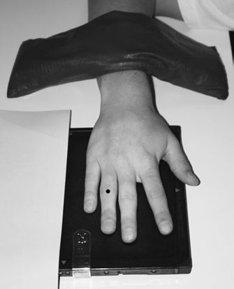
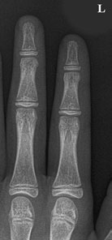
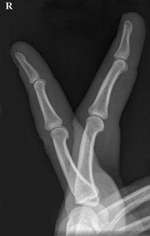
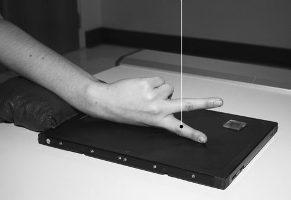
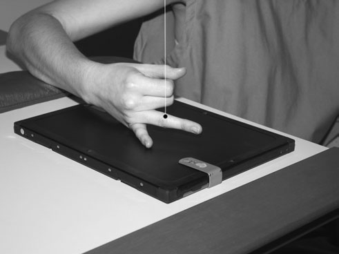
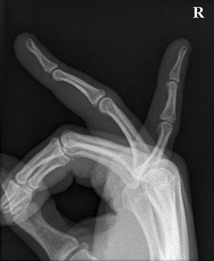
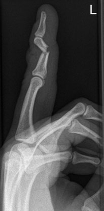
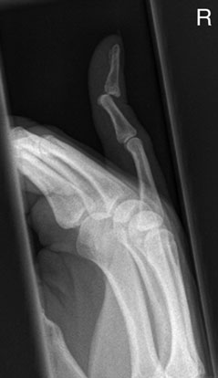

# Rx Degete Mână Incidențe Standard de Bază

  📷 Radiografie Convențională (Rx)
  <strong>Actualizat:</strong> 2026-09-16
  <strong>Autor:</strong> Departamentul de Radiologie / Referință Clark (Ed. 12)

---

-   __1. Rezumat Clinic & Indicații__

    ---

    === "Indicații Clinice"

        - Scleroderma (one cause de Raynaud’s disease) causes wasting și calcificări patologice de părți moi de finger pulp.
        - Chip suspiciune de fractură de base de dorsal aspect de distal phalanx este associated cu avulsion de insertion de extensor digitorum tendon, leading la mallet finger deformity. Profil (lateral) radiografie de middle finger evidențiind suspiciune de fractură de middle phalanx Profil (lateral) radiografie de little finger evidențiind luxație articulară de distal articulații interfalangiene (IF) Normal Profil (lateral) radiografie de ring și little Degete Mână

    === "Ghid Național IRIS"

        !!! info "Referință Primară: Ghidul Național IRIS (Ordinul MS 1342/2012)"
            - **Capitol Ghid IRIS:** *Ghidul Național IRIS*
            - **Grad de Recomandare:** **De verificat pe indicație; fără grad atribuit automat**
            - **Nivel de Iradiere Estimată:** `De verificat pentru examinarea și populația selectate`

            [:octicons-search-16: Deschide Ghidul IRIS](../../iris.md){ .md-button .md-button--primary } [:material-open-in-new: Aplicația Oficială PWA](https://radiologie-pediatrica.ro/iris/){ .md-button target="_blank" rel="noopener" }
-   __2. Poziționare & Centrare Fascicul__

    ---

    - **Poziție Pacient:** • Pacientul este așezat pe scaun lângă masa de examinare cu braț în abducție și medially rotit la bring Profil (lateral) aspect de index finger into contact cu caseta.
• raised Antebraț (Radius și Ulna) este sprijinit.
• index finger este fully extins și middle finger slightly flectat la avoid superimposition.
• middle finger este sprijinit pe non-opaque pad.
• remaining Degete Mână sunt fully flectat into palm de Mână și held there prin Police.

• Pacientul este așezat pe scaun lângă masa de examinare cu palm de Mână la drept-angles la masa de examinare și medial aspect de little finger în contact cu film radiologic.
• affected finger este extins și remaining Degete Mână sunt fully flectat into palm de Mână și held there prin Police în order la prevent superimposition.
• It poate fie necessary la support ring finger pe nonopaque pad la ensure that it este paralel cu film radiologic.
    - **Punct de Centrare Fascicul:** • Raza centrală verticală este centrată pe proximal articulații interfalangiene (IF) de affected finger.
46 Postero-anterior (PA) radiografie de index și middle Degete Mână Profil (lateral) radiografie de index și middle Degete Mână

• Raza centrală verticală este centrată pe proximal articulații interfalangiene (IF) de affected finger.
    - **Distanță Focar-Film (DFF / SID):** 100 cm
    - **Comandă Respiratorie:** Apnee pe durata expunerii (apnee în inspir pentru torace; expir pentru Abdomen/bazin).

-   __3. Parametri Tehnici Expunere__

    ---

    | Parametru Tehnic | Valoare Configurare Generator / Tub |
    |:-----------------|:-------------------------------------|
    | **Tensiune Tub (kV)** | DE CONFIGURAT PE APARAT |
    | **Sarcină / Produs Curent-Timp (mAs)** | Conform AEC / grosime anatomică |
    | **Distanță Focar-Film (DFF / SID)** | 100 cm |
    | **Grilă Antidifuzoare (Bucky)** | Conform grosimii anatomice (> 10-12 cm cu grilă) |
    | **Dimensiune Focar** | Focar Mic (0.6 mm) |
    | **Camere de Ionizare AEC** | DE CONFIGURAT PE APARAT |
    | **Colimare Fascicul** | Colimare strictă adaptată pe receptor 18 x 24 cm |
    | **Filtrare Tub** | Totală ≥ 2.5 mm Al echivalent (conform Clark: 3.0 mm Al eq.) |

-   __4. Criterii de Calitate & Reușită Imagine__

    ---

    - imagine trebuie să include fingertip și distal third de oase metacarpiene.
    - condyles trebuie să fie superimposed la avoid obscuring volar plate suspiciune de fractură.
    - imagine trebuie să include tip de finger și distal third de oase metacarpiene.

-   __5. Protecție Radiologică (ALARA)__

    ---

    - Ecranare gonadică cu șorț plumbat dacă gonadele sunt în apropierea fasciculului util (regula ALARA).
    - Colimare precisă la dimensiunea anatomică strict necesară pentru reducerea dozei și a radiației difuze.
    - Verificarea posibilității unei sarcini la pacientele de vârstă fertilă înainte de expunere.

!!! note "Observații Clinice & Tehnice"
    în cases de severe trauma, when Degete Mână cannot fie flectat, it poate fie necessary la take Profil (lateral) incidență de toate Degete Mână superimposed, ca pentru Profil (lateral) incidență de Mână, but centring over proximal inter-phalangeal articulație de index finger.

### 🖼️ Imagini

<figure class="protocol-image-card" markdown>

<figcaption><strong>Postero-anterior (PA) radiografie de the</strong> — Poziționare pacient și centrare fascicul conform Clark (Ed. 12)</figcaption>

</figure>

<figure class="protocol-image-card" markdown>

<figcaption><strong>Profil (lateral) radiografie de</strong> — Aspect radiografic / ghid de poziționare conform tratatului Clark (Ed. 12)</figcaption>

</figure>

<figure class="protocol-image-card" markdown>

<figcaption><strong>volar plate suspiciune de fractură.</strong> — Aspect radiografic / ghid de poziționare conform tratatului Clark (Ed. 12)</figcaption>

</figure>

<figure class="protocol-image-card" markdown>

<figcaption><strong>Figura 4: Aspect radiografic / Poziționare (Clark Ed. 12)</strong> — Aspect radiografic / ghid de poziționare conform tratatului Clark (Ed. 12)</figcaption>

</figure>

<figure class="protocol-image-card" markdown>

<figcaption><strong>tring over proximal inter-phalangeal articulație de index finger.</strong> — Aspect radiografic / ghid de poziționare conform tratatului Clark (Ed. 12)</figcaption>

</figure>

<figure class="protocol-image-card" markdown>

<figcaption><strong>și calcificări patologice de părți moi de finger pulp.</strong> — Aspect radiografic / ghid de poziționare conform tratatului Clark (Ed. 12)</figcaption>

</figure>

<figure class="protocol-image-card" markdown>

<figcaption><strong>• Chip suspiciune de fractură de base de dorsal aspect de distal pha-</strong> — Aspect radiografic / ghid de poziționare conform tratatului Clark (Ed. 12)</figcaption>

</figure>

<figure class="protocol-image-card" markdown>

<figcaption><strong>Profil (lateral) radiografie de</strong> — Aspect radiografic / ghid de poziționare conform tratatului Clark (Ed. 12)</figcaption>

</figure>

=== "Ghid Rapid de Execuție"

    1. **Identificarea și verificarea pacientului:** verificare identitate, zonă de examinat, consimțământ conform procedurii și evaluarea posibilității unei sarcini, când este relevantă.
    2. **Pregătire:** îndepărtarea oricăror obiecte radiopace (bijuterii, agrafe, fermoare, proteze, pansamente dense).
    3. **Poziționare precisă:** alinierea receptorului de imagine și a tubului la distanța prescrisă (100 cm).
    4. **Colimare strictă:** adaptarea fasciculului strict la regiunea de diagnostic pentru scăderea iradierii și reducerea radiației difuze.
    5. **Radioprotecție:** verificarea [politicii RX](../radioprotectie.md), cu măsuri distincte pentru pacient, personal și însoțitor.

## Surse de documentare

- [Clark's Positioning in Radiography (Ed. 12), Pagina 61](../../assets/protocols/sources/Clark___Positioning_in_Radiography__12th_edition.pdf#page=61)
