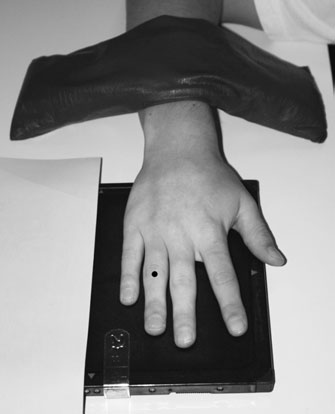
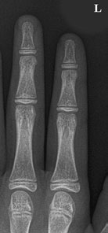
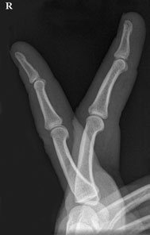
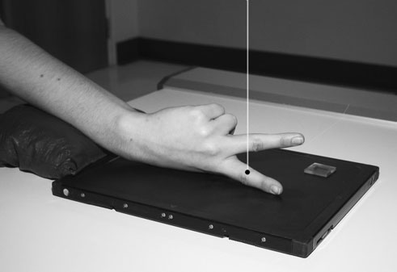
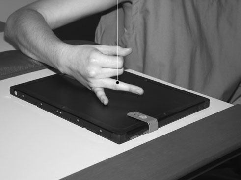
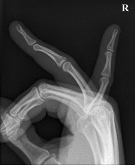
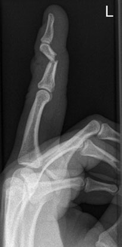
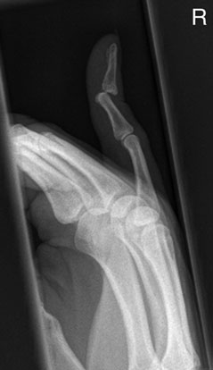

# Rx degete ale mâinii — incidențe standard de bază

  📷 Radiografie Convențională (Rx)
  <strong>Actualizat:</strong> 2026-09-16
  <strong>Autor:</strong> Departamentul de Radiologie / Referință Clark (Ed. 12)

---

-   __1. Rezumat Clinic & Indicații__

    ---

    === "Indicații Clinice"

        - Sclerodermia (o cauză a bolii Raynaud) determină atrofie și calcificări patologice ale părților moi ale pulpei degetului.
        - O suspiciune de fractură prin smulgere la baza aspectului dorsal al falangei distale este asociată cu avulsia inserției tendonului extensor lung al degetului, ducând la deformarea în deget în ciocan. Radiografie de profil (laterală) a degetului mijlociu, evidențiind o suspiciune de fractură a falangei mijlocii; radiografie de profil (laterală) a degetului mic, evidențiind luxația articulației interfalangiene distale (IF); radiografie normală de profil (laterală) a degetelor inelar și mic ale mâinii

    === "Ghid Național IRIS"

        !!! info "Referință Primară: Ghidul Național IRIS (Ordinul MS 1342/2012)"
            - **Capitol Ghid IRIS:** *Aparat locomotor & Membru superior*
            - **Grad de Recomandare:** **Grad A**
            - **Nivel de Iradiere Estimată:** `Clasa 1 (Minimă < 0.01 mSv)`

            [:octicons-search-16: Deschide Ghidul IRIS](../../iris.md){ .md-button .md-button--primary } [:material-open-in-new: Aplicația Oficială PWA](https://radiologie-pediatrica.ro/iris/){ .md-button target="_blank" rel="noopener" }

-   __2. Poziționare & Centrare Fascicul__

    ---

    - **Poziție Pacient:**
        - Pacientul este așezat pe scaun lângă masa de examinare, cu brațul în abducție și rotit medial, pentru a aduce aspectul de profil (lateral) al degetului arătător în contact cu caseta.
        - Antebrațul ridicat (radiusul și ulna) este sprijinit.
        - Degetul arătător este complet extins, iar degetul mijlociu este ușor flectat pentru a evita suprapunerea.
        - Degetul mijlociu este sprijinit pe un suport radiotransparent.
        - Celelalte degete ale mâinii sunt complet flectate în palma mâinii și menținute acolo cu ajutorul policelui.
        - Pacientul este așezat pe scaun lângă masa de examinare, cu palma mâinii perpendiculară pe masa de examinare și cu aspectul medial al degetului mic în contact cu filmul radiologic.
        - Degetul afectat este extins, iar celelalte degete ale mâinii sunt complet flectate în palma mâinii și menținute acolo cu ajutorul policelui, pentru a preveni suprapunerea.
        - Poate fi necesară sprijinirea degetului inelar pe un suport radiotransparent pentru a asigura paralelismul acestuia cu filmul radiologic.
    - **Punct de Centrare Fascicul:**
        - Raza centrală verticală este centrată pe articulația interfalangiană proximală (IF) a degetului afectat. 46 Radiografie postero-anterioară (PA) a degetului arătător și a degetului mijlociu al mâinii; radiografie de profil (laterală) a degetului arătător și a degetului mijlociu al mâinii
        - Raza centrală verticală este centrată pe articulația interfalangiană proximală (IF) a degetului afectat.
    - **Distanță Focar-Film (DFF / SID):** 100 cm
    - **Comandă Respiratorie:** Apnee pe durata expunerii (apnee în inspir pentru torace; expir pentru Abdomen/bazin).

-   __3. Parametri Tehnici Expunere__

    ---

    | Parametru Tehnic | Valoare Configurare Generator / Tub |
    |:-----------------|:-------------------------------------|
    | **Tensiune Tub (kV)** | DE CONFIGURAT PE APARAT |
    | **Sarcină / Produs Curent-Timp (mAs)** | Conform AEC / grosimii anatomice |
    | **Distanță Focar-Film (DFF / SID)** | 100 cm |
    | **Grilă Antidifuzoare (Bucky)** | Conform grosimii anatomice (> 10-12 cm cu grilă) |
    | **Dimensiune Focar** | Focar Mic (0.6 mm) |
    | **Camere de Ionizare AEC** | DE CONFIGURAT PE APARAT |
    | **Colimare Fascicul** | Colimare strictă adaptată pe receptor 18 x 24 cm |
    | **Filtrare Tub** | Totală ≥ 2.5 mm Al echivalent (conform Clark: 3.0 mm Al echivalent) |

-   __4. Criterii de Calitate & Reușită Imagine__

    ---

    - Imaginea trebuie să includă vârful degetului și treimea distală a oaselor metacarpiene.
    - Condilii trebuie să fie suprapuși pentru a evita mascarea suspiciunii de fractură a plăcii palmare.
    - Imaginea trebuie să includă vârful degetului și treimea distală a oaselor metacarpiene.

-   __5. Protecție Radiologică (ALARA)__

    ---

    - Ecranare gonadică cu șorț plumbat dacă gonadele sunt în apropierea fasciculului util (regula ALARA).
    - Colimare precisă la dimensiunea anatomică strict necesară pentru reducerea dozei și a radiației difuze.
    - Verificarea posibilității unei sarcini la pacientele de vârstă fertilă înainte de expunere.

!!! note "Observații Clinice & Tehnice"
    În cazurile de traumatism sever, când degetele mâinii nu pot fi flectate, poate fi necesară efectuarea unei incidențe de profil (laterală) a tuturor degetelor mâinii suprapuse, ca pentru incidența de profil (laterală) a mâinii, dar cu centrarea pe articulația interfalangiană proximală a degetului arătător.

### 🖼️ Imagini

<figure class="protocol-image-card" markdown>

<figcaption><strong>Radiografie postero-anterioară (PA) a degetului</strong> — Poziționarea pacientului și centrarea fasciculului conform Clark (Ed. 12)</figcaption>

</figure>

<figure class="protocol-image-card" markdown>

<figcaption><strong>Radiografie de profil (laterală) a</strong> — Aspect radiografic / ghid de poziționare conform tratatului Clark (Ed. 12)</figcaption>

</figure>

<figure class="protocol-image-card" markdown>

<figcaption><strong>Suspiciune de fractură a plăcii palmare.</strong> — Aspect radiografic / ghid de poziționare conform tratatului Clark (Ed. 12)</figcaption>

</figure>

<figure class="protocol-image-card" markdown>

<figcaption><strong>Figura 4: Aspect radiografic / Poziționare (Clark Ed. 12)</strong> — Aspect radiografic / ghid de poziționare conform tratatului Clark (Ed. 12)</figcaption>

</figure>

<figure class="protocol-image-card" markdown>

<figcaption><strong>Centrare pe articulația interfalangiană proximală a degetului arătător.</strong> — Aspect radiografic / ghid de poziționare conform tratatului Clark (Ed. 12)</figcaption>

</figure>

<figure class="protocol-image-card" markdown>

<figcaption><strong>și calcificări patologice ale părților moi ale pulpei degetului.</strong> — Aspect radiografic / ghid de poziționare conform tratatului Clark (Ed. 12)</figcaption>

</figure>

<figure class="protocol-image-card" markdown>

<figcaption><strong>• Suspiciune de fractură prin smulgere la baza aspectului dorsal al falangei distale</strong> — Aspect radiografic / ghid de poziționare conform tratatului Clark (Ed. 12)</figcaption>

</figure>

<figure class="protocol-image-card" markdown>

<figcaption><strong>Radiografie de profil (laterală) a</strong> — Aspect radiografic / ghid de poziționare conform tratatului Clark (Ed. 12)</figcaption>

</figure>

=== "Ghid Rapid de Execuție"

    1. **Identificarea și verificarea pacientului:** verificare identitate, zonă de examinat, consimțământ conform procedurii și evaluarea posibilității unei sarcini, când este relevantă.
    2. **Pregătire:** îndepărtarea oricăror obiecte radiopace (bijuterii, agrafe, fermoare, proteze, pansamente dense).
    3. **Poziționare precisă:** alinierea receptorului de imagine și a tubului la distanța prescrisă (100 cm).
    4. **Colimare strictă:** adaptarea fasciculului strict la regiunea de diagnostic pentru scăderea iradierii și reducerea radiației difuze.
    5. **Radioprotecție:** verificarea [politicii RX](../radioprotectie.md), cu măsuri distincte pentru pacient, personal și însoțitor.

## Surse de documentare

- [Clark's Positioning in Radiography (Ed. 12), Pagina 61](https://books.google.com/books/about/Clark_s_Positioning_in_Radiography.html?id=Xxu6MwEACAAJ)
