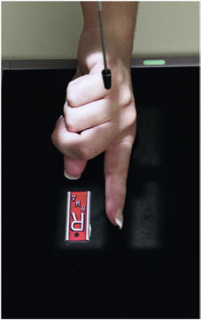
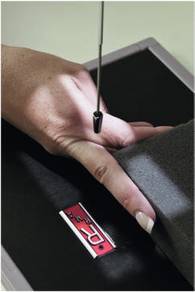
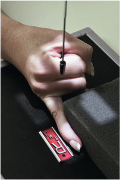
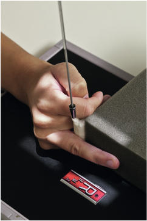
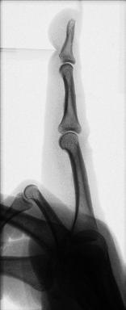

# Rx Degete Mână LATEROMEDIAL OR MEDIOLATERAL PROJECTIONS

  📷 Radiografie Convențională (Rx)
  <strong>Actualizat:</strong> 2026-09-15
  <strong>Autor:</strong> Departamentul de Radiologie / Referință Bontrager

---

-   __1. Rezumat Clinic & Indicații__

    ---

    === "Indicații Clinice"

        - suspiciune de fractură and luxație / subluxație articulară of the distal, middle, and proximal phalanges; distal metacarpal; and associated joints
        - Pathologic processes, such as osteoporosis and artroză / modificări degenerative articulare

    === "Ghid Național IRIS"

        !!! info "Referință Primară: Ghidul Național IRIS (Ordinul MS 1342/2012)"
            - **Capitol Ghid IRIS:** *Ghidul Național IRIS*
            - **Grad de Recomandare:** **De verificat pe indicație; fără grad atribuit automat**
            - **Nivel de Iradiere Estimată:** `De verificat pentru examinarea și populația selectate`

            [:octicons-search-16: Deschide Ghidul IRIS](../../iris.md){ .md-button .md-button--primary } [:material-open-in-new: Aplicația Oficială PWA](https://radiologie-pediatrica.ro/iris/){ .md-button target="_blank" rel="noopener" }
-   __2. Poziționare & Centrare Fascicul__

    ---

    - **Poziție Pacient:** Pacient: Seat patient at end of table, with Cot flexed about 90° with Mână and Pumn (Articulație Radiocarpiană) resting on IR and Degete Mână extended.; Regiune anatomică: Place Mână in Incidență de Profil (Lateral) (Police side up) with finger to be examined fully extended and centered to portion of IR being exposed (see NOTE for second digit lateral). Align and center finger to long axis of IR and to CR. Use sponge block or other radiolucent device to support finger and prevent motion. Flex unaffected Degete Mână (Fig. 4.45). Ensure that long axis of finger is parallel to IR (Figs. 4.46 to 4.48).
    - **Punct de Centrare Fascicul:** perpendicular to IR, directed to pIp joint
    - **Distanță Focar-Film (DFF / SID):** 100 cm
    - **Comandă Respiratorie:** Apnee pe durata expunerii (sau conform cooperării pacientului)

-   __3. Parametri Tehnici Expunere__

    ---

    | Parametru Tehnic | Valoare Configurare Generator / Tub |
    |:-----------------|:-------------------------------------|
    | **Tensiune Tub (kV)** | 55 kV |
    | **Sarcină / Produs Curent-Timp (mAs)** | DE CONFIGURAT PE APARAT |
    | **Distanță Focar-Film (DFF / SID)** | 100 cm |
    | **Grilă Antidifuzoare (Bucky)** | Fără grilă (expunere directă) |
    | **Dimensiune Focar** | Focar Mic (0.6 mm) |
    | **Camere de Ionizare AEC** | DE CONFIGURAT PE APARAT |
    | **Colimare Fascicul** | Field Size Collimate on four sides to affected finger and distal aspect of metacarpal. |
    | **Filtrare Tub** | Totală ≥ 2.5 mm Al echivalent |

-   __4. Criterii de Calitate & Reușită Imagine__

    ---

    - Lateral views of distal, middle, and proximal phalanges; distal metacarpal; and associated joints are visible (Figs. 4.49 and 4.50). Position:
    - Long axis of finger should be aligned with the side border of IR.
    - Finger should be in true Incidență de Profil (Lateral), as indicated by the concave appearance of the anterior surface of the shaft of the phalanges.
    - Interphalangeal and metacarpophalangeal joint spaces should be open, indicating correct CR location and that the phalanges are parallel to the IR.
    - CR and center of collimation field size should be to the pIp joint. Exposure:
    - Optimal image receptor exposure and contrast with no motion demonstrate soft tissue margins and clear, Contururi osoase și travee trabeculare nete, fără artefacte de mișcare. Degete Mână ROUTINE
    - PA
    - PA oblique
    - Lateral R Fig. 4.49 Fourth digit. Distal phalanx Middle phalanx PIP joint (CR) Proximal phalanx R Fig. 4.50 Fourth digit.

-   __5. Protecție Radiologică (ALARA)__

    ---

    - Ecranare gonadică și a organelor radiosensibile conform procedurilor locale de radioprotecție ALARA.
    - Colimare strictă la aria de interes pentru limitarea radiației difuze.
    - Verificarea posibilității unei sarcini la pacientele de vârstă fertilă înainte de expunere.

!!! note "Observații Clinice & Tehnice"
    For second digit, a mediolateral is advised (see Fig. 4.45) if the patient can assume this position. Place the second digit in contact with IR. (Definition is improved with less object–image receptor distance [OID].) Fig. 4.45 Second digit (mediolateral). Fig. 4.46 Third digit (lateromedial). Fig. 4.47 Fourth digit (lateromedial). Fig. 4.48 Fourth digit (lateromedial).

### 🖼️ Imagini

<figure class="protocol-image-card" markdown>

<figcaption><strong>Fig. 4.45 Second digit</strong> — Poziționare pacient conform Ghidului Bontrager (Fig. 4.45 Second digit)</figcaption>

</figure>

<figure class="protocol-image-card" markdown>

<figcaption><strong>Fig. 4.46 Third digit (lateromedial).</strong> — Aspect radiografic de referință conform Ghidului Bontrager (Fig. 4.46 Third digit (lateromedial).)</figcaption>

</figure>

<figure class="protocol-image-card" markdown>

<figcaption><strong>Fig. 4.47 Fourth digit</strong> — Aspect radiografic de referință conform Ghidului Bontrager (Fig. 4.47 Fourth digit)</figcaption>

</figure>

<figure class="protocol-image-card" markdown>

<figcaption><strong>Fig. 4.48 Fourth digit</strong> — Aspect radiografic de referință conform Ghidului Bontrager (Fig. 4.48 Fourth digit)</figcaption>

</figure>

<figure class="protocol-image-card" markdown>

<figcaption><strong>Fig. 4.49 Fourth digit.</strong> — Aspect radiografic de referință conform Ghidului Bontrager (Fig. 4.49 Fourth digit.)</figcaption>

</figure>

<figure class="protocol-image-card" markdown>

<figcaption><strong>Fig. 4.50 Fourth digit.</strong> — Aspect radiografic de referință conform Ghidului Bontrager (Fig. 4.50 Fourth digit.)</figcaption>

</figure>

=== "Ghid Rapid de Execuție"

    1. **Identificarea și verificarea pacientului:** verificare identitate, zonă de examinat, consimțământ conform procedurii și evaluarea posibilității unei sarcini, când este relevantă.
    2. **Pregătire:** îndepărtarea oricăror obiecte radiopace (bijuterii, agrafe, fermoare, proteze, pansamente dense).
    3. **Poziționare precisă:** alinierea receptorului de imagine și a tubului la distanța prescrisă (100 cm).
    4. **Colimare strictă:** adaptarea fasciculului strict la regiunea de diagnostic pentru scăderea iradierii și reducerea radiației difuze.
    5. **Radioprotecție:** verificarea [politicii RX](../radioprotectie.md), cu măsuri distincte pentru pacient, personal și însoțitor.

## Surse de documentare

- [Bontrager's Textbook of Radiographic Positioning (Ed. 9/10), Pagina 154](https://www.elsevier.com/books/textbook-of-radiographic-positioning-and-related-anatomy/lampignano/978-0-323-65367-1)
