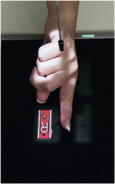
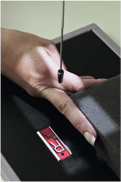
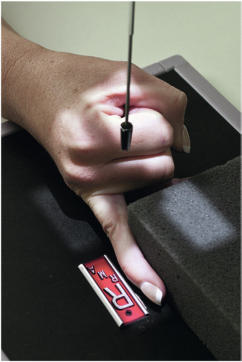
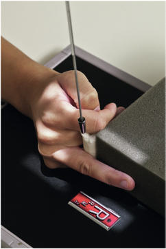
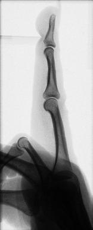

# Rx degete ale mâinii — incidență latero-medială sau medio-laterală

  📷 Radiografie Convențională (Rx)
  <strong>Actualizat:</strong> 2026-09-15
  <strong>Autor:</strong> Departamentul de Radiologie / Referință Bontrager

---

-   __1. Rezumat Clinic & Indicații__

    ---

    === "Indicații Clinice"

        - suspiciune de fractură și luxație / subluxație articulară a falangelor distale, mijlocii și proximale; a metacarpianului distal; și a articulațiilor asociate
        - Procese patologice, precum osteoporoza și artroza / modificările degenerative articulare

    === "Ghid Național IRIS"

        !!! info "Referință Primară: Ghidul Național IRIS (Ordinul MS 1342/2012)"
            - **Capitol Ghid IRIS:** *Aparat locomotor & Membru superior*
            - **Grad de Recomandare:** **Grad A**
            - **Nivel de Iradiere Estimată:** `Clasa 1 (Minimă < 0.01 mSv)`

            [:octicons-search-16: Deschide Ghidul IRIS](../../iris.md){ .md-button .md-button--primary } [:material-open-in-new: Aplicația Oficială PWA](https://radiologie-pediatrica.ro/iris/){ .md-button target="_blank" rel="noopener" }

-   __2. Poziționare & Centrare Fascicul__

    ---

    - **Poziție Pacient:** Pacient: Așezați pacientul la capătul mesei, cu cotul flectat la aproximativ 90°, cu mâna și pumnul (articulația radiocarpiană) sprijinite pe receptorul de imagine și cu degetele mâinii extinse. Regiune anatomică: Așezați mâna în incidență de profil (laterală) (cu partea policelui în sus), cu degetul examinat complet extins și centrat pe porțiunea receptorului de imagine care urmează să fie expusă (vezi NOTA pentru incidența laterală a celei de-a doua falange). Aliniați și centrați degetul pe axa longitudinală a receptorului de imagine și pe raza centrală. Utilizați un bloc de burete sau un alt dispozitiv radiotransparent pentru a sprijini degetul și a preveni mișcarea. Flectați degetele neafectate ale mâinii (Fig. 4.45). Asigurați-vă că axa longitudinală a degetului este paralelă cu receptorul de imagine (Fig. 4.46–4.48).
    - **Punct de Centrare Fascicul:** perpendicular pe receptorul de imagine, orientat spre articulația IFP
    - **Distanță Focar-Film (DFF / SID):** 100 cm
    - **Comandă Respiratorie:** Apnee pe durata expunerii (sau conform cooperării pacientului)

-   __3. Parametri Tehnici Expunere__

    ---

    | Parametru Tehnic | Valoare Configurare Generator / Tub |
    |:-----------------|:-------------------------------------|
    | **Tensiune Tub (kV)** | 55 kV |
    | **Sarcină / Produs Curent-Timp (mAs)** | DE CONFIGURAT PE APARAT |
    | **Distanță Focar-Film (DFF / SID)** | 100 cm |
    | **Grilă Antidifuzoare (Bucky)** | Fără grilă (expunere directă) |
    | **Dimensiune Focar** | Focar Mic (0.6 mm) |
    | **Camere de Ionizare AEC** | DE CONFIGURAT PE APARAT |
    | **Colimare Fascicul** | Dimensiunea câmpului: Colimați pe cele patru laturi la nivelul degetului afectat și al aspectului distal al metacarpianului. |
    | **Filtrare Tub** | Totală ≥ 2.5 mm Al echivalent |

-   __4. Criterii de Calitate & Reușită Imagine__

    ---

    - Incidențele laterale ale falangelor distale, mijlocii și proximale; ale metacarpianului distal; și ale articulațiilor asociate sunt vizibile (Fig. 4.49 și 4.50). Poziție:
    - Axa longitudinală a degetului trebuie să fie aliniată cu marginea laterală a receptorului de imagine.
    - Degetul trebuie să fie în adevărată incidență de profil (laterală), după cum indică aspectul concav al suprafeței anterioare a diafizei falangei.
    - Spațiile interfalangiene și metacarpofalangiene (MCF) trebuie să fie deschise, indicând localizarea corectă a razei centrale și faptul că falangele sunt paralele cu receptorul de imagine (RI).
    - Raza centrală și centrul câmpului de colimare trebuie să fie la nivelul articulației IFP. Expunere:
    - Expunerea optimă a receptorului de imagine și contrastul, fără mișcare, evidențiază marginile părților moi și contururi osoase și travee trabeculare clare, fără artefacte de mișcare. DEGETELE MÂINII — DE RUTINĂ
    - PA
    - PA oblică
    - laterală R Fig. 4.49 A patra falangă. Falanga distală; falanga mijlocie; articulația IFP (raza centrală); falanga proximală; R Fig. 4.50 A patra falangă.

-   __5. Protecție Radiologică (ALARA)__

    ---

    - Ecranare gonadică și a organelor radiosensibile conform procedurilor locale de radioprotecție ALARA.
    - Colimare strictă la aria de interes pentru limitarea radiației difuze.
    - Verificarea posibilității unei sarcini la pacientele de vârstă fertilă înainte de expunere.

!!! note "Observații Clinice & Tehnice"
    pentru a doua falangă, se recomandă incidența medio-laterală (vezi Fig. 4.45), dacă pacientul poate adopta această poziție. Așezați a doua falangă în contact cu receptorul de imagine. (Definiția este îmbunătățită prin reducerea distanței obiect–receptor de imagine [OID].) Fig. 4.45 A doua falangă (medio-laterală). Fig. 4.46 A treia falangă (latero-medială). Fig. 4.47 A patra falangă (latero-medială). Fig. 4.48 A patra falangă (latero-medială).

### 🖼️ Imagini

<figure class="protocol-image-card" markdown>

<figcaption><strong>Fig. 4.45 A doua falangă</strong> — Poziționarea pacientului conform Ghidului Bontrager (Fig. 4.45 A doua falangă)</figcaption>

</figure>

<figure class="protocol-image-card" markdown>

<figcaption><strong>Fig. 4.46 A treia falangă (latero-medială).</strong> — Aspect radiografic de referință conform Ghidului Bontrager (Fig. 4.46 A treia falangă (latero-medială).)</figcaption>

</figure>

<figure class="protocol-image-card" markdown>

<figcaption><strong>Fig. 4.47 A patra falangă</strong> — Aspect radiografic de referință conform Ghidului Bontrager (Fig. 4.47 A patra falangă)</figcaption>

</figure>

<figure class="protocol-image-card" markdown>

<figcaption><strong>Fig. 4.48 A patra falangă</strong> — Aspect radiografic de referință conform Ghidului Bontrager (Fig. 4.48 A patra falangă)</figcaption>

</figure>

<figure class="protocol-image-card" markdown>

<figcaption><strong>Fig. 4.49 A patra falangă.</strong> — Aspect radiografic de referință conform Ghidului Bontrager (Fig. 4.49 A patra falangă.)</figcaption>

</figure>

<figure class="protocol-image-card" markdown>

<figcaption><strong>Fig. 4.50 A patra falangă.</strong> — Aspect radiografic de referință conform Ghidului Bontrager (Fig. 4.50 A patra falangă.)</figcaption>

</figure>

=== "Ghid Rapid de Execuție"

    1. **Identificarea și verificarea pacientului:** verificare identitate, zonă de examinat, consimțământ conform procedurii și evaluarea posibilității unei sarcini, când este relevantă.
    2. **Pregătire:** îndepărtarea oricăror obiecte radiopace (bijuterii, agrafe, fermoare, proteze, pansamente dense).
    3. **Poziționare precisă:** alinierea receptorului de imagine și a tubului la distanța prescrisă (100 cm).
    4. **Colimare strictă:** adaptarea fasciculului strict la regiunea de diagnostic pentru scăderea iradierii și reducerea radiației difuze.
    5. **Radioprotecție:** verificarea [politicii RX](../radioprotectie.md), cu măsuri distincte pentru pacient, personal și însoțitor.

## Surse de documentare

- [Bontrager's Textbook of Radiographic Positioning (Ed. 9/10), Pagina 154](https://www.elsevier.com/books/textbook-of-radiographic-positioning-and-related-anatomy/lampignano/978-0-323-65367-1)
