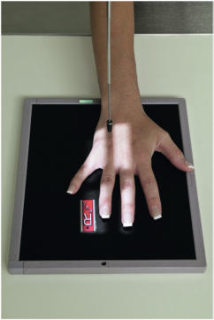
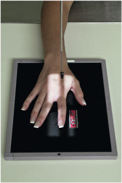
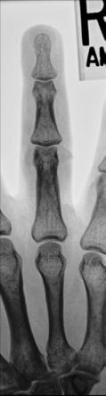
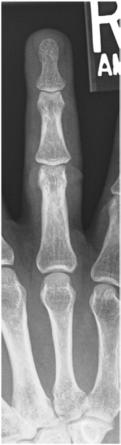

# Rx Degete Mână PA (Postero-Anterior)

  📷 Radiografie Convențională (Rx)
  <strong>Actualizat:</strong> 2026-09-15
  <strong>Autor:</strong> Departamentul de Radiologie / Referință Bontrager

---

-   __1. Rezumat Clinic & Indicații__

    ---

    === "Indicații Clinice"

        - suspiciune de fractură and luxație / subluxație articulară of the distal, middle, and proximal phalanges; distal metacarpal; and associated joints
        - Pathologic processes, such as osteoporosis and artroză / modificări degenerative articulare

    === "Ghid Național IRIS"

        !!! info "Referință Primară: Ghidul Național IRIS (Ordinul MS 1342/2012)"
            - **Capitol Ghid IRIS:** *Ghidul Național IRIS*
            - **Grad de Recomandare:** **De verificat pe indicație; fără grad atribuit automat**
            - **Nivel de Iradiere Estimată:** `De verificat pentru examinarea și populația selectate`

            [:octicons-search-16: Deschide Ghidul IRIS](../../iris.md){ .md-button .md-button--primary } [:material-open-in-new: Aplicația Oficială PWA](https://radiologie-pediatrica.ro/iris/){ .md-button target="_blank" rel="noopener" }
-   __2. Poziționare & Centrare Fascicul__

    ---

    - **Poziție Pacient:** Pacient: Seat patient at end of table, with Cot flexed about 90° and with Mână and Antebraț resting on the table (Fig. 4.35).; Regiune anatomică: Pronate Mână with Degete Mână extended Center and align long axis of affected finger with long axis of IR Separate adjoining Degete Mână from affected finger (Fig. 4.36)
    - **Punct de Centrare Fascicul:** perpendicular to IR, directed to pIp joint
    - **Distanță Focar-Film (DFF / SID):** 100 cm
    - **Comandă Respiratorie:** Apnee pe durata expunerii (sau conform cooperării pacientului)

-   __3. Parametri Tehnici Expunere__

    ---

    | Parametru Tehnic | Valoare Configurare Generator / Tub |
    |:-----------------|:-------------------------------------|
    | **Tensiune Tub (kV)** | 55 kV |
    | **Sarcină / Produs Curent-Timp (mAs)** | DE CONFIGURAT PE APARAT |
    | **Distanță Focar-Film (DFF / SID)** | 100 cm |
    | **Grilă Antidifuzoare (Bucky)** | Fără grilă (expunere directă) |
    | **Dimensiune Focar** | Focar Mic (0.6 mm) |
    | **Camere de Ionizare AEC** | DE CONFIGURAT PE APARAT |
    | **Colimare Fascicul** | Field Size Collimate on four sides to area of affected finger and distal aspect of metacarpal Fig. 4.35 PA—second digit. Fig. 4.36 PA—fourth digit. |
    | **Filtrare Tub** | Totală ≥ 2.5 mm Al echivalent |

-   __4. Criterii de Calitate & Reușită Imagine__

    ---

    - Distal, middle, and proximal phalanges; distal metacarpal; and associated joints. Position:
    - Long axis of finger should be aligned with and parallel to side border of IR.
    - Absența rotației anatomice: clavicule echidistante față de linia apofizelor spinoase of Degete Mână is evidenced by symmetric appearance of both sides or concavities of the shafts of the phalanges and distal metacarpals.
    - The amount of tissue on each side of the phalanges should appear equal.
    - Degete Mână should be separated with no overlapping of soft tissues.
    - Interphalangeal joints should appear open, indicating that Mână was fully pronated and the correct CR position was used (Figs. 4.37 and 4.38).
    - CR and midpoint of collimation field size should be to the pIp joint. Exposure:
    - Optimal image receptor exposure and contrast with no motion demonstrate soft tissue margins and clear, Contururi osoase și travee trabeculare nete, fără artefacte de mișcare. Degete Mână ROUTINE
    - PA
    - PA oblique
    - Lateral Fig. 4.37 PA—fourth digit. Distal phalanx Middle phalanx (CR) Proximal phalanx 4th metacarpal 4th MCP joint Proximal IP joint Distal IP joint Fig. 4.38 PA—fourth digit.

-   __5. Protecție Radiologică (ALARA)__

    ---

    - Ecranare gonadică și a organelor radiosensibile conform procedurilor locale de radioprotecție ALARA.
    - Colimare strictă la aria de interes pentru limitarea radiației difuze.
    - Verificarea posibilității unei sarcini la pacientele de vârstă fertilă înainte de expunere.

!!! note "Observații Clinice & Tehnice"
    A possible alternative routine involves a larger IR to include the entire Mână for the Incidență Postero-Anterioară (PA) of the finger for possible secondary traumatism acuttism / Regim Urgență or pathology to other aspects of the Mână and Pumn (Articulație Radiocarpiană). Then oblique and lateral projections of the affected finger only would be taken.

### 🖼️ Imagini

<figure class="protocol-image-card" markdown>

<figcaption><strong>Fig. 4.35 PA—second digit.</strong> — Poziționare pacient conform Ghidului Bontrager (Fig. 4.35 PA—second digit.)</figcaption>

</figure>

<figure class="protocol-image-card" markdown>

<figcaption><strong>Fig. 4.36 PA—fourth digit.</strong> — Aspect radiografic de referință conform Ghidului Bontrager (Fig. 4.36 PA—fourth digit.)</figcaption>

</figure>

<figure class="protocol-image-card" markdown>

<figcaption><strong>Fig. 4.37 PA—fourth digit.</strong> — Aspect radiografic de referință conform Ghidului Bontrager (Fig. 4.37 PA—fourth digit.)</figcaption>

</figure>

<figure class="protocol-image-card" markdown>

<figcaption><strong>Fig. 4.38 PA—fourth digit.</strong> — Aspect radiografic de referință conform Ghidului Bontrager (Fig. 4.38 PA—fourth digit.)</figcaption>

</figure>

=== "Ghid Rapid de Execuție"

    1. **Identificarea și verificarea pacientului:** verificare identitate, zonă de examinat, consimțământ conform procedurii și evaluarea posibilității unei sarcini, când este relevantă.
    2. **Pregătire:** îndepărtarea oricăror obiecte radiopace (bijuterii, agrafe, fermoare, proteze, pansamente dense).
    3. **Poziționare precisă:** alinierea receptorului de imagine și a tubului la distanța prescrisă (100 cm).
    4. **Colimare strictă:** adaptarea fasciculului strict la regiunea de diagnostic pentru scăderea iradierii și reducerea radiației difuze.
    5. **Radioprotecție:** verificarea [politicii RX](../radioprotectie.md), cu măsuri distincte pentru pacient, personal și însoțitor.

## Surse de documentare

- [Bontrager's Textbook of Radiographic Positioning (Ed. 9/10), Pagina 152](https://www.elsevier.com/books/textbook-of-radiographic-positioning-and-related-anatomy/lampignano/978-0-323-65367-1)
