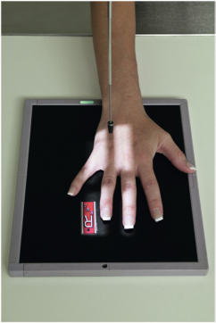
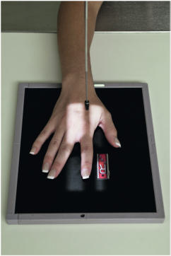
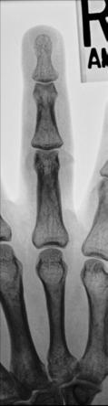
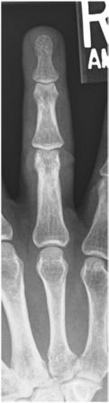

# Rx Degete Mână PA (Postero-Anterior)

  📷 Radiografie Convențională (Rx)
  <strong>Actualizat:</strong> 2026-09-15
  <strong>Autor:</strong> Departamentul de Radiologie / Referință Bontrager

---

-   __1. Rezumat Clinic & Indicații__

    ---

    === "Indicații Clinice"

        - suspiciune de fractură și luxație / subluxație articulară a falangelor distale, mijlocii și proximale; a metacarpianului distal; și a articulațiilor asociate
        - Procese patologice, precum osteoporoza și artroza / modificările degenerative articulare

    === "Ghid Național IRIS"

        !!! info "Referință Primară: Ghidul Național IRIS (Ordinul MS 1342/2012)"
            - **Capitol Ghid IRIS:** *Aparat locomotor & Membru superior*
            - **Grad de Recomandare:** **Grad A**
            - **Nivel de Iradiere Estimată:** `Clasa 1 (Minimă < 0.01 mSv)`

            [:octicons-search-16: Deschide Ghidul IRIS](../../iris.md){ .md-button .md-button--primary } [:material-open-in-new: Aplicația Oficială PWA](https://radiologie-pediatrica.ro/iris/){ .md-button target="_blank" rel="noopener" }

-   __2. Poziționare & Centrare Fascicul__

    ---

    - **Poziție Pacient:** Pacient: Așezați pacientul la capătul mesei, cu cotul flectat aproximativ 90° și cu mâna și antebrațul sprijinite pe masa de examinare (Fig. 4.35).; Regiune anatomică: Pronați mâna cu degetele extinse. Centrați și aliniați axa longitudinală a degetului afectat cu axa longitudinală a receptorului de imagine. Separați degetele adiacente de degetul afectat (Fig. 4.36).
    - **Punct de Centrare Fascicul:** perpendicular pe receptorul de imagine, orientat spre articulația IFP
    - **Distanță Focar-Film (DFF / SID):** 100 cm
    - **Comandă Respiratorie:** Apnee pe durata expunerii (sau conform cooperării pacientului)

-   __3. Parametri Tehnici Expunere__

    ---

    | Parametru Tehnic | Valoare Configurare Generator / Tub |
    |:-----------------|:-------------------------------------|
    | **Tensiune Tub (kV)** | 55 kV |
    | **Sarcină / Produs Curent-Timp (mAs)** | DE CONFIGURAT PE APARAT |
    | **Distanță Focar-Film (DFF / SID)** | 100 cm |
    | **Grilă Antidifuzoare (Bucky)** | Fără grilă (expunere directă) |
    | **Dimensiune Focar** | Focar Mic (0.6 mm) |
    | **Camere de Ionizare AEC** | DE CONFIGURAT PE APARAT |
    | **Colimare Fascicul** | Dimensiunea câmpului: Colimați pe patru laturi până la regiunea degetului afectat și aspectul distal al metacarpianului. Fig. 4.35 PA—falanga a doua. Fig. 4.36 PA—falanga a patra. |
    | **Filtrare Tub** | Totală ≥ 2.5 mm Al echivalent |

-   __4. Criterii de Calitate & Reușită Imagine__

    ---

    - falanga distală, mijlocie și proximală; metacarpianul distal; și articulațiile asociate. Poziție:
    - Axa longitudinală a degetului trebuie să fie aliniată cu marginea laterală a receptorului de imagine și paralelă cu aceasta.
    - Absența rotației anatomice: claviculele echidistante față de linia apofizelor spinoase de Degete Mână este evidențiată prin aspectul simetric de ambele părți (bilateral) sau prin concavitățile diafizelor falangelor și ale oaselor metacarpiene distale.
    - Cantitatea de țesut de pe fiecare parte a falangei trebuie să pară egală.
    - Degetele mâinii trebuie să fie separate, fără suprapunerea țesuturilor moi.
    - Articulațiile interfalangiene (IF) trebuie să apară deschise, indicând că mâna a fost complet în pronație și că a fost utilizată poziția corectă a razei centrale (Figs. 4.37 și 4.38).
    - Raza centrală și punctul median al dimensiunii câmpului de colimare trebuie să fie la nivelul articulației PIP. Expunere:
    - Expunerea optimă a receptorului de imagine și contrastul, fără mișcare, evidențiază marginile părților moi și contururi osoase și travee trabeculare clare, fără artefacte de mișcare. DEGETELE MÂINII — DE RUTINĂ
    - PA
    - PA oblică
    - profil Fig. 4.37 PA—falanga a patra. falanga distală falanga mijlocie (raza centrală) falanga proximală al 4-lea metacarpian articulațiile metacarpofalangiene (MCF) ale degetului al 4-lea articulațiile interfalangiene (IF) proximale articulațiile interfalangiene (IF) distale Fig. 4.38 PA—falanga a patra.

-   __5. Protecție Radiologică (ALARA)__

    ---

    - Ecranare gonadică și a organelor radiosensibile conform procedurilor locale de radioprotecție ALARA.
    - Colimare strictă la aria de interes pentru limitarea radiației difuze.
    - Verificarea posibilității unei sarcini la pacientele de vârstă fertilă înainte de expunere.

!!! note "Observații Clinice & Tehnice"
    O posibilă alternativă de rutină implică utilizarea unui receptor de imagine mai mare pentru a include întreaga mână pentru incidența postero-anterioară (PA) a degetului, în caz de posibil traumatism acut / regim de urgență secundar sau patologie la nivelul altor regiuni ale mâinii și pumnului (articulației radiocarpiene). Apoi se efectuează numai incidențele oblică și laterală ale degetului afectat.

### 🖼️ Imagini

<figure class="protocol-image-card" markdown>

<figcaption><strong>Fig. 4.35 PA—falanga a doua.</strong> — Poziționarea pacientului conform Ghidului Bontrager (Fig. 4.35 PA—falanga a doua.)</figcaption>

</figure>

<figure class="protocol-image-card" markdown>

<figcaption><strong>Fig. 4.36 PA—falanga a patra.</strong> — Aspect radiografic de referință conform Ghidului Bontrager (Fig. 4.36 PA—falanga a patra.)</figcaption>

</figure>

<figure class="protocol-image-card" markdown>

<figcaption><strong>Fig. 4.37 PA—falanga a patra.</strong> — Aspect radiografic de referință conform Ghidului Bontrager (Fig. 4.37 PA—falanga a patra.)</figcaption>

</figure>

<figure class="protocol-image-card" markdown>

<figcaption><strong>Fig. 4.38 PA—falanga a patra.</strong> — Aspect radiografic de referință conform Ghidului Bontrager (Fig. 4.38 PA—falanga a patra.)</figcaption>

</figure>

=== "Ghid Rapid de Execuție"

    1. **Identificarea și verificarea pacientului:** verificare identitate, zonă de examinat, consimțământ conform procedurii și evaluarea posibilității unei sarcini, când este relevantă.
    2. **Pregătire:** îndepărtarea oricăror obiecte radiopace (bijuterii, agrafe, fermoare, proteze, pansamente dense).
    3. **Poziționare precisă:** alinierea receptorului de imagine și a tubului la distanța prescrisă (100 cm).
    4. **Colimare strictă:** adaptarea fasciculului strict la regiunea de diagnostic pentru scăderea iradierii și reducerea radiației difuze.
    5. **Radioprotecție:** verificarea [politicii RX](../radioprotectie.md), cu măsuri distincte pentru pacient, personal și însoțitor.

## Surse de documentare

- [Bontrager's Textbook of Radiographic Positioning (Ed. 9/10), Pagina 152](https://www.elsevier.com/books/textbook-of-radiographic-positioning-and-related-anatomy/lampignano/978-0-323-65367-1)
