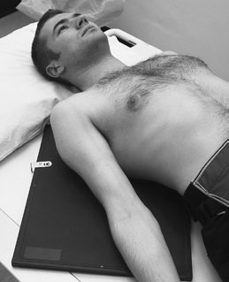
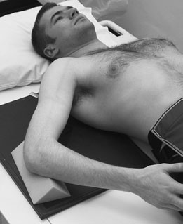
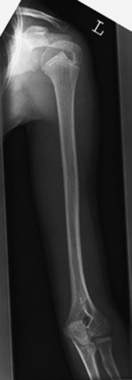
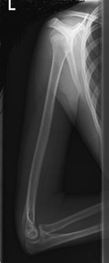

# Rx Diafiză Humerală Antero-Posterior (AP) - Decubit Dorsal

  📷 Radiografie Convențională (Rx)
  <strong>Actualizat:</strong> 2026-09-16
  <strong>Autor:</strong> Departamentul de Radiologie / Referință Clark (Ed. 12)

---

-   __1. Rezumat Clinic & Indicații__

    ---

    === "Indicații Clinice"

        - 71 2 Humerus – shaft Antero-posterior (AP) – Decubit dorsal When movement de pacientul’s braț este restricted, modified technique poate fie required.

    === "Ghid Național IRIS"

        !!! info "Referință Primară: Ghidul Național IRIS (Ordinul MS 1342/2012)"
            - **Capitol Ghid IRIS:** *Ghidul Național IRIS*
            - **Grad de Recomandare:** **De verificat pe indicație; fără grad atribuit automat**
            - **Nivel de Iradiere Estimată:** `De verificat pentru examinarea și populația selectate`

            [:octicons-search-16: Deschide Ghidul IRIS](../../iris.md){ .md-button .md-button--primary } [:material-open-in-new: Aplicația Oficială PWA](https://radiologie-pediatrica.ro/iris/){ .md-button target="_blank" rel="noopener" }
-   __2. Poziționare & Centrare Fascicul__

    ---

    - **Poziție Pacient:** • de la Antero-posterior (AP) poziție, Cot articulație este flectat la 90 grade.
• braț este în abducție și then medially rotit through 90 grade la bring medial aspect de braț, Cot și Antebraț (Radius și Ulna) în contact cu masa de examinare.
• caseta este plasat under braț și ajustat la include ambele Umăr și Cot articulații.
• Humerus este ajustat la ensure that medial și Profil (lateral) epicondyles de Humerus sunt superimposed.
• Antebrațul este imobilizat cu ajutorul unui săculeț cu nisip.
    - **Punct de Centrare Fascicul:** • raza centrală verticală centrală este centred la point midway între Umăr și Cot articulații.
    - **Distanță Focar-Film (DFF / SID):** 100 cm
    - **Comandă Respiratorie:** Apnee pe durata expunerii (apnee în inspir pentru torace; expir pentru Abdomen/bazin).

-   __3. Parametri Tehnici Expunere__

    ---

    | Parametru Tehnic | Valoare Configurare Generator / Tub |
    |:-----------------|:-------------------------------------|
    | **Tensiune Tub (kV)** | DE CONFIGURAT PE APARAT |
    | **Sarcină / Produs Curent-Timp (mAs)** | Conform AEC / grosime anatomică |
    | **Distanță Focar-Film (DFF / SID)** | 100 cm |
    | **Grilă Antidifuzoare (Bucky)** | Conform grosimii anatomice (> 10-12 cm cu grilă) |
    | **Dimensiune Focar** | Focar Mic (0.6 mm) |
    | **Camere de Ionizare AEC** | DE CONFIGURAT PE APARAT |
    | **Colimare Fascicul** | Colimare strictă adaptată pe receptor 35 x 43 cm |
    | **Filtrare Tub** | Totală ≥ 2.5 mm Al echivalent (conform Clark: 3.0 mm Al eq.) |

-   __4. Criterii de Calitate & Reușită Imagine__

    ---

    - ambele articulații trebuie să fie seen pe imagine.
    - Cot articulație trebuie să fie seen în true Profil (lateral) și anteroposterior poziții. Normal Antero-posterior (AP) radiografie de Humerus Normal Profil (lateral) radiografie de Humerus A 35  43-cm casetă fitted cu regular-speed screens poate fie used, providing it este large enough la evidențiază Cot și Umăr articulație pe one film radiologic. la reduce risk de pacient movement, expuneri sunt made pe arrested respirație.

-   __5. Protecție Radiologică (ALARA)__

    ---

    - Ecranare gonadică cu șorț plumbat dacă gonadele sunt în apropierea fasciculului util (regula ALARA).
    - Colimare precisă la dimensiunea anatomică strict necesară pentru reducerea dozei și a radiației difuze.
    - Verificarea posibilității unei sarcini la pacientele de vârstă fertilă înainte de expunere.

!!! note "Observații Clinice & Tehnice"
    • When rotating Humerus, it este essential la ensure that Antebraț (Radius și Ulna) și Mână rest pe tabletop și nu trunk.
• Humerus este normally examined cu pacientul Ortostatism și caseta plasat în Ortostatism casetă holder. radiographic technique este similar (except that orizontal raza centrală este used) but additional care trebuie să fie taken la ensure that pacientul este imobilizat adequately, ca described below.

### 🖼️ Imagini

<figure class="protocol-image-card" markdown>

<figcaption><strong>• Humerus este normally examined cu pacientul Ortostatism</strong> — Poziționare pacient și centrare fascicul conform Clark (Ed. 12)</figcaption>

</figure>

<figure class="protocol-image-card" markdown>

<figcaption><strong>Normal Antero-posterior (AP)</strong> — Aspect radiografic / ghid de poziționare conform tratatului Clark (Ed. 12)</figcaption>

</figure>

<figure class="protocol-image-card" markdown>

<figcaption><strong>radiografie de Humerus</strong> — Aspect radiografic / ghid de poziționare conform tratatului Clark (Ed. 12)</figcaption>

</figure>

<figure class="protocol-image-card" markdown>

<figcaption><strong>Normal Profil (lateral) radiografie de</strong> — Aspect radiografic / ghid de poziționare conform tratatului Clark (Ed. 12)</figcaption>

</figure>

=== "Ghid Rapid de Execuție"

    1. **Identificarea și verificarea pacientului:** verificare identitate, zonă de examinat, consimțământ conform procedurii și evaluarea posibilității unei sarcini, când este relevantă.
    2. **Pregătire:** îndepărtarea oricăror obiecte radiopace (bijuterii, agrafe, fermoare, proteze, pansamente dense).
    3. **Poziționare precisă:** alinierea receptorului de imagine și a tubului la distanța prescrisă (100 cm).
    4. **Colimare strictă:** adaptarea fasciculului strict la regiunea de diagnostic pentru scăderea iradierii și reducerea radiației difuze.
    5. **Radioprotecție:** verificarea [politicii RX](../radioprotectie.md), cu măsuri distincte pentru pacient, personal și însoțitor.

## Surse de documentare

- [Clark's Positioning in Radiography (Ed. 12), Pagina 86](../../assets/protocols/sources/Clark___Positioning_in_Radiography__12th_edition.pdf#page=86)
