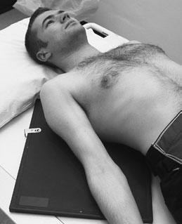
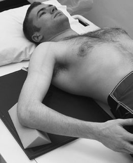
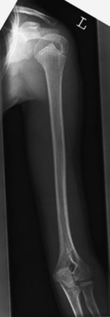
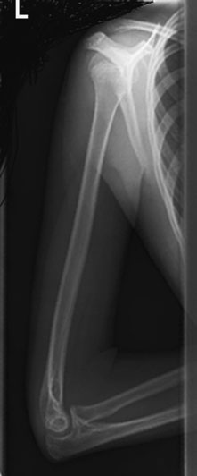

# Rx Diafiză Humerală Antero-Posterior (AP) - Decubit Dorsal

  📷 Radiografie Convențională (Rx)
  <strong>Actualizat:</strong> 2026-09-16
  <strong>Autor:</strong> Departamentul de Radiologie / Referință Clark (Ed. 12)

---

-   __1. Rezumat Clinic & Indicații__

    ---

    === "Indicații Clinice"

        - 71 2 Humerus – diafiză Incidență anteroposterioară (AP) – decubit dorsal Când mișcarea brațului pacientului este restricționată, poate fi necesară o tehnică modificată.

    === "Ghid Național IRIS"

        !!! info "Referință Primară: Ghidul Național IRIS (Ordinul MS 1342/2012)"
            - **Capitol Ghid IRIS:** *Aparat locomotor & Membru superior*
            - **Grad de Recomandare:** **Grad A**
            - **Nivel de Iradiere Estimată:** `Clasa 1 (Minimă < 0.01 mSv)`

            [:octicons-search-16: Deschide Ghidul IRIS](../../iris.md){ .md-button .md-button--primary } [:material-open-in-new: Aplicația Oficială PWA](https://radiologie-pediatrica.ro/iris/){ .md-button target="_blank" rel="noopener" }

-   __2. Poziționare & Centrare Fascicul__

    ---

    - **Poziție Pacient:**
        - Din poziția anteroposterioară (AP), articulația cotului este flectată la 90 grade.
        - Brațul este în abducție și apoi rotit medial cu 90 grade pentru a aduce aspectul medial al brațului, cotul și antebrațul (radiusul și ulna) în contact cu masa de examinare.
        - Caseta este plasată sub braț și ajustată pentru a include atât articulația umărului, cât și articulația cotului.
        - Humerusul este ajustat pentru a vă asigura că epicondilii medial și de profil (lateral) ai humerusului sunt suprapuși.
        - Antebrațul este imobilizat cu ajutorul unui săculeț cu nisip.
    - **Punct de Centrare Fascicul:** • Raza centrală verticală este centrată la punctul situat la jumătatea distanței dintre articulațiile umărului și cotului.
    - **Distanță Focar-Film (DFF / SID):** 100 cm
    - **Comandă Respiratorie:** Apnee pe durata expunerii (apnee în inspir pentru torace; expir pentru Abdomen/bazin).

-   __3. Parametri Tehnici Expunere__

    ---

    | Parametru Tehnic | Valoare Configurare Generator / Tub |
    |:-----------------|:-------------------------------------|
    | **Tensiune Tub (kV)** | DE CONFIGURAT PE APARAT |
    | **Sarcină / Produs Curent-Timp (mAs)** | Conform AEC / grosimii anatomice |
    | **Distanță Focar-Film (DFF / SID)** | 100 cm |
    | **Grilă Antidifuzoare (Bucky)** | Conform grosimii anatomice (> 10-12 cm cu grilă) |
    | **Dimensiune Focar** | Focar Mic (0.6 mm) |
    | **Camere de Ionizare AEC** | DE CONFIGURAT PE APARAT |
    | **Colimare Fascicul** | Colimare strictă adaptată pe receptor 35 x 43 cm |
    | **Filtrare Tub** | Totală ≥ 2.5 mm Al echivalent (conform Clark: 3.0 mm Al echivalent) |

-   __4. Criterii de Calitate & Reușită Imagine__

    ---

    - Ambele articulații trebuie să fie vizibile pe imagine.
    - Articulația cotului trebuie să fie vizualizată în poziții de profil (lateral) adevărat și anteroposterioară. Radiografie anteroposterioară (AP) normală a humerusului. Radiografie de profil (lateral) normală a humerusului. O casetă de 35 × 43-cm echipată cu ecrane cu viteză normală poate fi utilizată, cu condiția să fie suficient de mare pentru a evidenția articulațiile cotului și umărului pe o singură imagine radiologică. Pentru a reduce riscul mișcării pacientului, expunerile se efectuează în apnee.

-   __5. Protecție Radiologică (ALARA)__

    ---

    - Ecranare gonadică cu șorț plumbat dacă gonadele sunt în apropierea fasciculului util (regula ALARA).
    - Colimare precisă la dimensiunea anatomică strict necesară pentru reducerea dozei și a radiației difuze.
    - Verificarea posibilității unei sarcini la pacientele de vârstă fertilă înainte de expunere.

!!! note "Observații Clinice & Tehnice"
    - La rotirea humerusului, este esențial să vă asigurați că antebrațul (radiusul și ulna) și mâna se sprijină pe masa radiologică, nu pe trunchi.
    - Humerusul este examinat de obicei cu pacientul în ortostatism și caseta plasată în suportul vertical pentru casetă. Tehnica radiografică este similară (cu excepția faptului că se utilizează o rază centrală orizontală), dar trebuie acordată o atenție suplimentară pentru a vă asigura că pacientul este imobilizat adecvat, conform descrierii de mai jos.

### 🖼️ Imagini

<figure class="protocol-image-card" markdown>

<figcaption><strong>• Humerusul este examinat de obicei cu pacientul în ortostatism.</strong> — Poziționarea pacientului și centrarea fasciculului conform Clark (Ed. 12)</figcaption>

</figure>

<figure class="protocol-image-card" markdown>

<figcaption><strong>Anteroposterior (AP) normal</strong> — Aspect radiografic / ghid de poziționare conform tratatului Clark (Ed. 12)</figcaption>

</figure>

<figure class="protocol-image-card" markdown>

<figcaption><strong>radiografie a humerusului</strong> — Aspect radiografic / ghid de poziționare conform tratatului Clark (Ed. 12)</figcaption>

</figure>

<figure class="protocol-image-card" markdown>

<figcaption><strong>Radiografie de profil (lateral) normală a</strong> — Aspect radiografic / ghid de poziționare conform tratatului Clark (Ed. 12)</figcaption>

</figure>

=== "Ghid Rapid de Execuție"

    1. **Identificarea și verificarea pacientului:** verificare identitate, zonă de examinat, consimțământ conform procedurii și evaluarea posibilității unei sarcini, când este relevantă.
    2. **Pregătire:** îndepărtarea oricăror obiecte radiopace (bijuterii, agrafe, fermoare, proteze, pansamente dense).
    3. **Poziționare precisă:** alinierea receptorului de imagine și a tubului la distanța prescrisă (100 cm).
    4. **Colimare strictă:** adaptarea fasciculului strict la regiunea de diagnostic pentru scăderea iradierii și reducerea radiației difuze.
    5. **Radioprotecție:** verificarea [politicii RX](../radioprotectie.md), cu măsuri distincte pentru pacient, personal și însoțitor.

## Surse de documentare

- [Clark's Positioning in Radiography (Ed. 12), Pagina 86](https://books.google.com/books/about/Clark_s_Positioning_in_Radiography.html?id=Xxu6MwEACAAJ)
