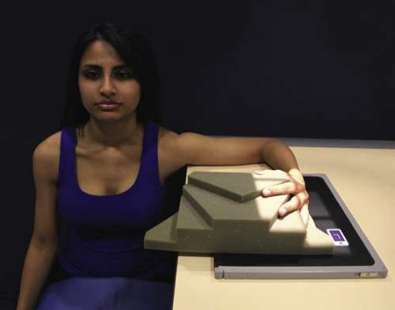
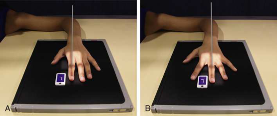
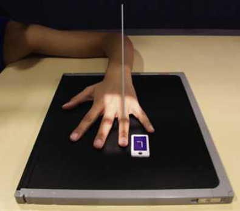
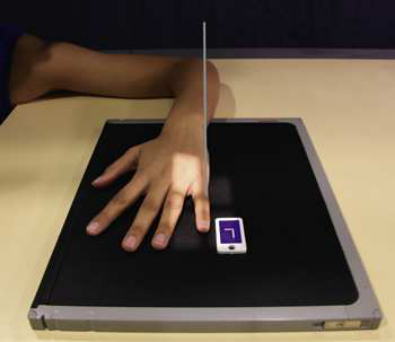
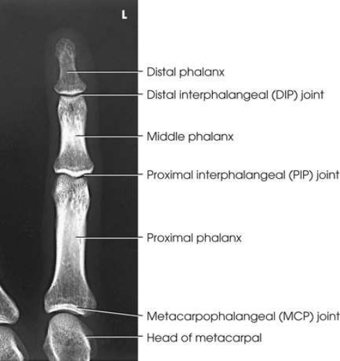
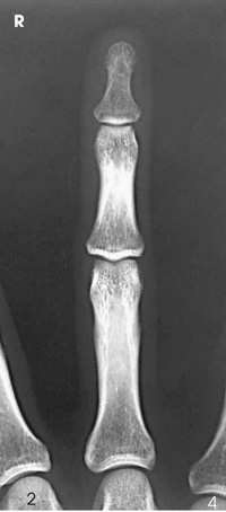
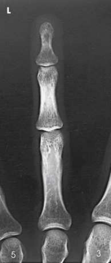
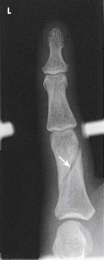

# Rx Digits (Second Through Fifth) — Incidență Postero-Anterioară (PA) (Merrill)

  📷 Radiografie Convențională (Rx)
  <strong>Actualizat:</strong> 2026-09-16
  <strong>Autor:</strong> Referință Merrill

---

-   __1. Rezumat Clinic & Indicații__

    ---

    === "Indicații Clinice"

        - Conform reperelor anatomice standard din tratat

    === "Ghid Național IRIS"

        !!! info "Referință Primară: Ghidul Național IRIS (Ordinul MS 1342/2012)"
            - **Capitol Ghid IRIS:** *Ghidul Național IRIS*
            - **Grad de Recomandare:** **De verificat pe indicație; fără grad atribuit automat**
            - **Nivel de Iradiere Estimată:** `De verificat pentru examinarea și populația selectate`

            [:octicons-search-16: Deschide Ghidul IRIS](../../iris.md){ .md-button .md-button--primary } [:material-open-in-new: Aplicația Oficială PWA](https://radiologie-pediatrica.ro/iris/){ .md-button target="_blank" rel="noopener" }
-   __2. Poziționare & Centrare Fascicul__

    ---

    - **Poziție Pacient:** se așază pacientul pe scaun la end de masa radiologică.; When radiographing individual falange (except first), take following steps: Place extins falange cu palmar surface down pe receptorul de imagine. Separate falange slightly, și se centrează falange under examination la center de receptorul de imagine. se centrează PIP articulație la receptorul de imagine (Figs. 5.13 through 5.15). se efectuează ecranarea gonadelor cu șorț plumbat.
    - **Punct de Centrare Fascicul:** perpendicular pe PIP articulație de afected falange
    - **Distanță Focar-Film (DFF / SID):** Nespecificat în fragmentul extras; de verificat în sursă
    - **Comandă Respiratorie:** Conform reperelor anatomice standard din tratat

-   __3. Parametri Tehnici Expunere__

    ---

    | Parametru Tehnic | Valoare Configurare Generator / Tub |
    |:-----------------|:-------------------------------------|
    | **Tensiune Tub (kV)** | DE CONFIGURAT PE APARAT |
    | **Sarcină / Produs Curent-Timp (mAs)** | DE CONFIGURAT PE APARAT |
    | **Distanță Focar-Film (DFF / SID)** | Nespecificat în fragmentul extras; de verificat în sursă |
    | **Grilă Antidifuzoare (Bucky)** | DE CONFIGURAT PE APARAT |
    | **Dimensiune Focar** | DE CONFIGURAT PE APARAT |
    | **Camere de Ionizare AEC** | DE CONFIGURAT PE APARAT |
    | **Colimare Fascicul** | Adjust câmp de iradiere la 1 inch (2.5 cm) pe toate sides de falange, including 1 inch (2.5 cm) proximal la articulații metacarpofalangiene (MCF). Se plasează markerul de lateralitate în câmpul colimat. Computed radiografie pentru toate incidențe, falange trebuie să fie centrat pe plate sau plate section cu four collimator margins. Two sau more imagini poate fie projected pe one transversal IP; however, there trebuie să fie four collimator margins pentru fiecare incidență. lead blocker trebuie să cover unexposed side when multiple imagini sunt made pe one IP. |
    | **Filtrare Tub** | DE CONFIGURAT PE APARAT |

-   __4. Criterii de Calitate & Reușită Imagine__

    ---

    - Criterii radiologice de calitate imaginii:
    - Colimare adecvată vizibilă și prezența markerului de lateralitate (D/S) plasat clear de anatomy de interest
    - Entire falange de la fingertip la distal portion de adjoining metacarpal
    - fără părți moi overlap de la adjacent falange
    - Absența rotației anatomice (simetrie bilaterală perfectă):
    - Equal concavity pe ambele părți (bilateral) de phalangeal corpuri
    - Equal amount de părți moi pe ambele părți (bilateral) de falange
    - Fingernail, if seen, centrat over distal phalanx
    - Open IP și articulații metacarpofalangiene (MCF) spaces
    - Bony detalii trabeculare osoase și surrounding soft tissues

-   __5. Protecție Radiologică (ALARA)__

    ---

    - Nespecificat în fragmentul extras; de verificat în sursă

!!! note "Observații Clinice & Tehnice"
    falange that cannot fie extins poate fie examined în small sections. When articulație injury este suspected, Incidență Antero-Posterioară (AP) instead de Incidență Postero-Anterioară (PA) este recommended.

### 🖼️ Imagini

<figure class="protocol-image-card" markdown>

<figcaption><strong>Merrill — pagina PDF 243, imaginea 1</strong> — Imagine din fragmentul sursă; asocierea necesită revizie.</figcaption>

</figure>

<figure class="protocol-image-card" markdown>

<figcaption><strong>Merrill — pagina PDF 244, imaginea 2</strong> — Imagine din fragmentul sursă; asocierea necesită revizie.</figcaption>

</figure>

<figure class="protocol-image-card" markdown>

<figcaption><strong>Merrill — pagina PDF 244, imaginea 3</strong> — Imagine din fragmentul sursă; asocierea necesită revizie.</figcaption>

</figure>

<figure class="protocol-image-card" markdown>

<figcaption><strong>Merrill — pagina PDF 245, imaginea 4</strong> — Imagine din fragmentul sursă; asocierea necesită revizie.</figcaption>

</figure>

<figure class="protocol-image-card" markdown>

<figcaption><strong>Merrill — pagina PDF 246, imaginea 5</strong> — Imagine din fragmentul sursă; asocierea necesită revizie.</figcaption>

</figure>

<figure class="protocol-image-card" markdown>

<figcaption><strong>Merrill — pagina PDF 247, imaginea 6</strong> — Imagine din fragmentul sursă; asocierea necesită revizie.</figcaption>

</figure>

<figure class="protocol-image-card" markdown>

<figcaption><strong>Merrill — pagina PDF 248, imaginea 7</strong> — Imagine din fragmentul sursă; asocierea necesită revizie.</figcaption>

</figure>

<figure class="protocol-image-card" markdown>

<figcaption><strong>Merrill — pagina PDF 248, imaginea 8</strong> — Imagine din fragmentul sursă; asocierea necesită revizie.</figcaption>

</figure>

=== "Ghid Rapid de Execuție"

    1. **Identificarea și verificarea pacientului:** verificare identitate, zonă de examinat, consimțământ conform procedurii și evaluarea posibilității unei sarcini, când este relevantă.
    2. **Pregătire:** îndepărtarea oricăror obiecte radiopace (bijuterii, agrafe, fermoare, proteze, pansamente dense).
    3. **Poziționare precisă:** alinierea receptorului de imagine și a tubului la distanța prescrisă (Nespecificat în fragmentul extras; de verificat în sursă).
    4. **Colimare strictă:** adaptarea fasciculului strict la regiunea de diagnostic pentru scăderea iradierii și reducerea radiației difuze.
    5. **Radioprotecție:** verificarea [politicii RX](../radioprotectie.md), cu măsuri distincte pentru pacient, personal și însoțitor.

## Surse de documentare

- [Merrill’s Atlas, 5. Upper Extremity, pagini PDF 243–248](../../assets/protocols/sources/a56d45c16829_Merrills_Atlas_of_Radiographic_Positioning__Procedures_3Vol_Set.pdf#page=243)

## Fragmente sursă traduse (referință tehnică)

### anatomy

PA incidență de appropriate falange și adjoining distal metacarpal (Figs. 5.16 through 5.19).

### collimation

• Adjust câmp de iradiere la 1 inch (2.5 cm) pe toate sides de falange, including 1 inch (2.5 cm) proximal la articulații metacarpofalangiene (MCF). Place marker de lateralitate (D/S)
în collimated expunere field.
Computed radiografie
pentru toate incidențe, falange trebuie să fie centrat pe plate sau plate section cu four collimator margins. Two sau more imagini poate fie projected
pe one transversal IP; however, there trebuie să fie four collimator margins pentru fiecare incidență. lead blocker trebuie să cover unexposed side when
multiple imagini sunt made pe one IP.

### cr

• perpendicular pe PIP articulație de afected falange

### criteria

Criterii radiologice de calitate imaginii:
• Colimare adecvată vizibilă și prezența markerului de lateralitate (D/S) plasat clear de anatomy de interest
• Entire falange de la fingertip la distal portion de adjoining metacarpal
• fără părți moi overlap de la adjacent falange
• Absența rotației anatomice (simetrie bilaterală perfectă):
• Equal concavity pe ambele părți (bilateral) de phalangeal corpuri
• Equal amount de părți moi pe ambele părți (bilateral) de falange
• Fingernail, if seen, centrat over distal phalanx
• Open IP și articulații metacarpofalangiene (MCF) spaces
• Bony detalii trabeculare osoase și surrounding soft tissues

### notes

falange that cannot fie extins poate fie examined în small sections. When articulație injury este suspected, AP incidență instead de PA
incidență este recommended.

### part_pos

When radiographing individual falange (except first), take following steps:
• Place extins falange cu palmar surface down pe receptorul de imagine.
• Separate falange slightly, și se centrează falange under examination la center de receptorul de imagine.
• se centrează PIP articulație la receptorul de imagine (Figs. 5.13 through 5.15).
• se efectuează ecranarea gonadelor cu șorț plumbat.

### patient_pos

• se așază pacientul pe scaun la end de masa radiologică.

### tech

poziționat prin manufacturer sau department protocol pentru corect anatomy display orientation; raza centrală plate: 10 × 12 inches (24 × 30 cm) longitudinal.

