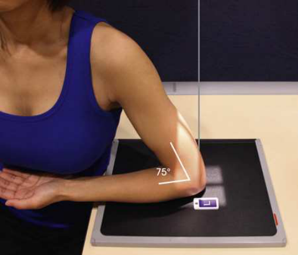

# Rx Distal Humerus — Incidență PA Axială (Merrill)

  📷 Radiografie Convențională (Rx)
  <strong>Actualizat:</strong> 2026-09-16
  <strong>Autor:</strong> Referință Merrill

---

-   __1. Rezumat Clinic & Indicații__

    ---

    === "Indicații Clinice"

        - Conform reperelor anatomice standard din tratat

    === "Ghid Național IRIS"

        !!! info "Referință Primară: Ghidul Național IRIS (Ordinul MS 1342/2012)"
            - **Capitol Ghid IRIS:** *Ghidul Național IRIS*
            - **Grad de Recomandare:** **De verificat pe indicație; fără grad atribuit automat**
            - **Nivel de Iradiere Estimată:** `De verificat pentru examinarea și populația selectate`

            [:octicons-search-16: Deschide Ghidul IRIS](../../iris.md){ .md-button .md-button--primary } [:material-open-in-new: Aplicația Oficială PWA](https://radiologie-pediatrica.ro/iris/){ .md-button target="_blank" rel="noopener" }
-   __2. Poziționare & Centrare Fascicul__

    ---

    - **Poziție Pacient:** se așază pacientul pe scaun high enough la enable Antebraț la rest pe masa radiologică, cu braț în vertical poziție. pacientul trebuie să fie Poziție Șezândă astfel încât Antebraț poate fie ajustat paralel cu axa longitudinală de masa de examinare.; Se instruiește pacientul să rest Antebraț pe masa de examinare, și then se ajustează Antebraț so that its axa longitudinală este paralel cu table. Center point midway între epicondyles și center de receptorul de imagine. se flectează pacient’s Cot la place braț în nearly vertical poziție astfel încât Humerus forms angle de approximately 75 grade de la Antebraț (approximately 15 grade între raza centrală și axa longitudinală de Humerus). Confirm that pacientul este nu leaning anteriorly sau posteriorly. Supinate Mână la prevent rotație de Humerus și ulna, și Se instruiește pacientul să immobilize it cu opposite Mână (Fig. 5.145). se efectuează ecranarea gonadelor cu șorț plumbat.
    - **Punct de Centrare Fascicul:** perpendicular pe ulnar sulcus, entering la point just medial la olecran
    - **Distanță Focar-Film (DFF / SID):** Nespecificat în fragmentul extras; de verificat în sursă
    - **Comandă Respiratorie:** Conform reperelor anatomice standard din tratat

-   __3. Parametri Tehnici Expunere__

    ---

    | Parametru Tehnic | Valoare Configurare Generator / Tub |
    |:-----------------|:-------------------------------------|
    | **Tensiune Tub (kV)** | DE CONFIGURAT PE APARAT |
    | **Sarcină / Produs Curent-Timp (mAs)** | DE CONFIGURAT PE APARAT |
    | **Distanță Focar-Film (DFF / SID)** | Nespecificat în fragmentul extras; de verificat în sursă |
    | **Grilă Antidifuzoare (Bucky)** | DE CONFIGURAT PE APARAT |
    | **Dimensiune Focar** | DE CONFIGURAT PE APARAT |
    | **Camere de Ionizare AEC** | DE CONFIGURAT PE APARAT |
    | **Colimare Fascicul** | Adjust câmp de iradiere la include distal third de Humerus și extend 2 inches (5 cm) beyond olecran și 1 inch (2.5 cm) beyond sides pe Cot. Se plasează markerul de lateralitate în câmpul colimat. |
    | **Filtrare Tub** | DE CONFIGURAT PE APARAT |

-   __4. Criterii de Calitate & Reușită Imagine__

    ---

    - Criterii radiologice de calitate imaginii:
    - Colimare adecvată vizibilă și prezența markerului de lateralitate (D/S) plasat clear de anatomy de interest
    - Outline de ulnar sulcus (groove)
    - Antebraț și Humerus superimposed, fără rotație
    - Bony detalii trabeculare osoase și surrounding soft tissues

-   __5. Protecție Radiologică (ALARA)__

    ---

    - Nespecificat în fragmentul extras; de verificat în sursă

!!! note "Observații Clinice & Tehnice"
    Long și Rafert 35 describe AP oblic distal Humerus incidență that specifically shows ulnar sulcus.

### 🖼️ Imagini

<figure class="protocol-image-card" markdown>

<figcaption><strong>Merrill — pagina PDF 348, imaginea 1</strong> — Imagine din fragmentul sursă; asocierea necesită revizie.</figcaption>

</figure>

=== "Ghid Rapid de Execuție"

    1. **Identificarea și verificarea pacientului:** verificare identitate, zonă de examinat, consimțământ conform procedurii și evaluarea posibilității unei sarcini, când este relevantă.
    2. **Pregătire:** îndepărtarea oricăror obiecte radiopace (bijuterii, agrafe, fermoare, proteze, pansamente dense).
    3. **Poziționare precisă:** alinierea receptorului de imagine și a tubului la distanța prescrisă (Nespecificat în fragmentul extras; de verificat în sursă).
    4. **Colimare strictă:** adaptarea fasciculului strict la regiunea de diagnostic pentru scăderea iradierii și reducerea radiației difuze.
    5. **Radioprotecție:** verificarea [politicii RX](../radioprotectie.md), cu măsuri distincte pentru pacient, personal și însoțitor.

## Surse de documentare

- [Merrill’s Atlas, 5. Upper Extremity, pagini PDF 347–348](../../assets/protocols/sources/a56d45c16829_Merrills_Atlas_of_Radiographic_Positioning__Procedures_3Vol_Set.pdf#page=347)

## Fragmente sursă traduse (referință tehnică)

### anatomy

epicondyles, trochlea, ulnar sulcus (groove între epicondil medial (epitrohlee) și trochlea), și olecran fossa (Fig. 5.146). incidență este
used în radiohumeral bursitis (tennis cot) la detect otherwise obscured calcifications located în ulnar sulcus.

### collimation

• Adjust câmp de iradiere la include distal third de humerus și extend 2 inches (5 cm) beyond olecran și 1 inch (2.5 cm)
beyond sides pe cot. Se plasează markerul de lateralitate în câmpul colimat.

### cr

• perpendicular pe ulnar sulcus, entering la point just medial la olecran

### criteria

Criterii radiologice de calitate imaginii:
• Colimare adecvată vizibilă și prezența markerului de lateralitate (D/S) plasat clear de anatomy de interest
• Outline de ulnar sulcus (groove)
• Forearm și humerus superimposed, fără rotație
• Bony detalii trabeculare osoase și surrounding soft tissues

### notes

Long și Rafert 35 describe AP oblic distal humerus incidență that specifically shows ulnar sulcus.

### part_pos

• Se instruiește pacientul să rest forearm pe masa de examinare, și then se ajustează forearm so that its axa longitudinală este paralel cu table.
• Center point midway între epicondyles și center de receptorul de imagine.
• se flectează pacient’s cot la place braț în nearly vertical poziție astfel încât humerus forms angle de approximately 75 grade
de la forearm (approximately 15 grade între raza centrală și axa longitudinală de humerus).
• Confirm that pacientul este nu leaning anteriorly sau posteriorly.
• Supinate mână la prevent rotație de humerus și ulna, și Se instruiește pacientul să immobilize it cu opposite mână (Fig. 5.145).
• se efectuează ecranarea gonadelor cu șorț plumbat.

### patient_pos

• se așază pacientul pe scaun high enough la enable forearm la rest pe masa radiologică, cu braț în vertical poziție. pacientul
trebuie să fie așezat pe scaun astfel încât forearm poate fie ajustat paralel cu axa longitudinală de masa de examinare.

### tech

poziționat prin manufacturer sau department protocol pentru corect anatomy display orientation; raza centrală plate: 10 × 12 inches (24 × 30 cm) longitudinal.

