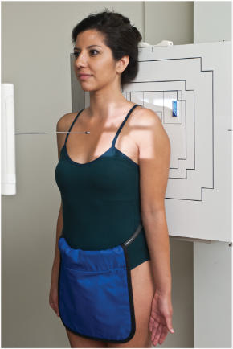
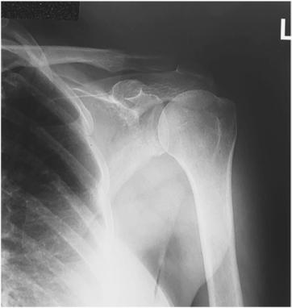
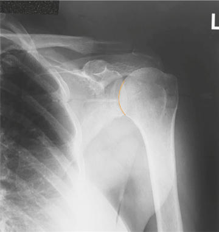

# Rx EXTERNAL ROTATION AP (Antero-Posterior) (Umăr (NONtraumatism acut) - AP PROXIMAL Humerus)

  📷 Radiografie Convențională (Rx)
  <strong>Actualizat:</strong> 2026-09-15
  <strong>Autor:</strong> Departamentul de Radiologie / Referință Bontrager

---

-   __1. Rezumat Clinic & Indicații__

    ---

    === "Indicații Clinice"

        - suspiciune de fractură or luxație / subluxație articulară of proximal Humerus and Umăr girdle
        - Calcium deposits in muscles, tendons, or bursal structures
        - Degenerative conditions, including osteoporosis and artroză / modificări degenerative articulare

    === "Ghid Național IRIS"

        !!! info "Referință Primară: Ghidul Național IRIS (Ordinul MS 1342/2012)"
            - **Capitol Ghid IRIS:** *Ghidul Național IRIS*
            - **Grad de Recomandare:** **De verificat pe indicație; fără grad atribuit automat**
            - **Nivel de Iradiere Estimată:** `De verificat pentru examinarea și populația selectate`

            [:octicons-search-16: Deschide Ghidul IRIS](../../iris.md){ .md-button .md-button--primary } [:material-open-in-new: Aplicația Oficială PWA](https://radiologie-pediatrica.ro/iris/){ .md-button target="_blank" rel="noopener" }
-   __2. Poziționare & Centrare Fascicul__

    ---

    - **Poziție Pacient:** Pacient: Perform radiograph with patient in an Ortostatism or a Decubit Dorsal position. (The Ortostatism position is usually less painful for patient, if condition allows.) Rotate body slightly toward affected side if necessary to place Umăr in contact with IR or tabletop (Fig. 5.40).; Regiune anatomică: Position patient to center scapulohumeral joint to center of IR. Abduct extended arm slightly; externally rotate arm (supinate Mână) until epicondyles of distal Humerus are parallel to IR.
    - **Punct de Centrare Fascicul:** perpendicular to IR, directed to 1 inch (2.5 cm) inferior to coracoid process (see NOTE)
    - **Distanță Focar-Film (DFF / SID):** 100 cm
    - **Comandă Respiratorie:** Suspend respiration during exposure.

-   __3. Parametri Tehnici Expunere__

    ---

    | Parametru Tehnic | Valoare Configurare Generator / Tub |
    |:-----------------|:-------------------------------------|
    | **Tensiune Tub (kV)** | 70-85 kV |
    | **Sarcină / Produs Curent-Timp (mAs)** | DE CONFIGURAT PE APARAT |
    | **Distanță Focar-Film (DFF / SID)** | 100 cm |
    | **Grilă Antidifuzoare (Bucky)** | Cu grilă antidifuzoare Bucky |
    | **Dimensiune Focar** | Focar Mic (0.6 mm) |
    | **Camere de Ionizare AEC** | Camerele laterale (sau camera centrală funcție de regiune) |
    | **Colimare Fascicul** | Field Size Collimate on four sides, with lateral and upper borders adjusted to soft tissue margins. |
    | **Filtrare Tub** | Totală ≥ 2.5 mm Al echivalent |

-   __4. Criterii de Calitate & Reușită Imagine__

    ---

    - Incidență Antero-Posterioară (AP) of proximal Humerus and lateral twothirds of Claviculă and upper Omoplat (Scapulă), including relationship of the humeral head to the glenoid cavity (Figs. 5.41 and 5.42). Position:
    - Full external rotation is evidenced by greater tubercle visualized in full profile on the lateral aspect of the proximal Humerus.
    - Lesser tubercle is superimposed over humeral head.
    - Collimation field size to area of interest. Exposure:
    - Optimal image receptor exposure and contrast with no motion demonstrate clear, Contururi osoase și travee trabeculare nete, fără artefacte de mișcare with soft tissue detail visible for possible calcium deposits. Umăr (Nontraumatism acut) ROUTINE
    - AP external rotation (AP)
    - AP internal rotation (lateral)

-   __5. Protecție Radiologică (ALARA)__

    ---

    - Ecranare gonadică și a organelor radiosensibile conform procedurilor locale de radioprotecție ALARA.
    - Colimare strictă la aria de interes pentru limitarea radiației difuze.
    - Verificarea posibilității unei sarcini la pacientele de vârstă fertilă înainte de expunere.

!!! note "Observații Clinice & Tehnice"
    The coracoid process may be difficult to palpate directly on most patients, but it can be approximated; it is approximately 2 inches (5 cm) inferior to the lateral portion of the more readily palpated AC joint. Fig. 5.41 External rotation—AP. Acromion Head of Humerus Proximal Humerus Coracoid process Greater tubercle Scapulohumeral joint Lesser tubercle Fig. 5.42 External rotation. Fig. 5.40 External rotation—AP.

### 🖼️ Imagini

<figure class="protocol-image-card" markdown>

<figcaption><strong>Fig. 5.41 External rotation—AP.</strong> — Poziționare pacient conform Ghidului Bontrager (Fig. 5.41 External rotation—AP.)</figcaption>

</figure>

<figure class="protocol-image-card" markdown>

<figcaption><strong>Fig. 5.42 External rotation.</strong> — Aspect radiografic de referință conform Ghidului Bontrager (Fig. 5.42 External rotation.)</figcaption>

</figure>

<figure class="protocol-image-card" markdown>

<figcaption><strong>Fig. 5.40 External rotation—AP.</strong> — Aspect radiografic de referință conform Ghidului Bontrager (Fig. 5.40 External rotation—AP.)</figcaption>

</figure>

=== "Ghid Rapid de Execuție"

    1. **Identificarea și verificarea pacientului:** verificare identitate, zonă de examinat, consimțământ conform procedurii și evaluarea posibilității unei sarcini, când este relevantă.
    2. **Pregătire:** îndepărtarea oricăror obiecte radiopace (bijuterii, agrafe, fermoare, proteze, pansamente dense).
    3. **Poziționare precisă:** alinierea receptorului de imagine și a tubului la distanța prescrisă (100 cm).
    4. **Colimare strictă:** adaptarea fasciculului strict la regiunea de diagnostic pentru scăderea iradierii și reducerea radiației difuze.
    5. **Radioprotecție:** verificarea [politicii RX](../radioprotectie.md), cu măsuri distincte pentru pacient, personal și însoțitor.

## Surse de documentare

- [Bontrager's Textbook of Radiographic Positioning (Ed. 9/10), Pagina 203](https://www.elsevier.com/books/textbook-of-radiographic-positioning-and-related-anatomy/lampignano/978-0-323-65367-1)
