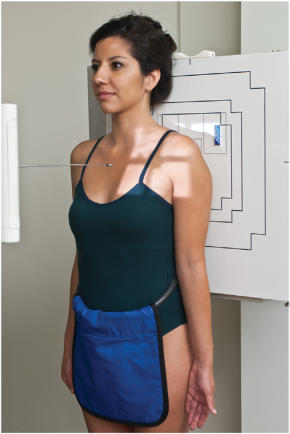
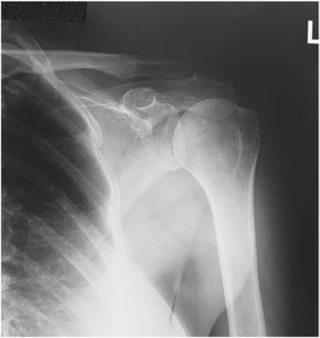
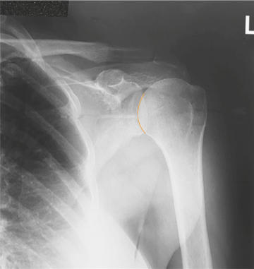

# Rx rotație externă AP (antero-posterioră) (umăr (NONtraumatism acut) — AP humerus proximal)

  📷 Radiografie Convențională (Rx)
  <strong>Actualizat:</strong> 2026-09-15
  <strong>Autor:</strong> Departamentul de Radiologie / Referință Bontrager

---

-   __1. Rezumat Clinic & Indicații__

    ---

    === "Indicații Clinice"

        - Suspiciune de fractură sau luxație/subluxație articulară a humerusului proximal și a centurii scapulare
        - Depozite de calciu în mușchi, tendoane sau structuri bursale
        - Afecțiuni degenerative, inclusiv osteoporoză și artroză/modificări degenerative articulare

    === "Ghid Național IRIS"

        !!! info "Referință Primară: Ghidul Național IRIS (Ordinul MS 1342/2012)"
            - **Capitol Ghid IRIS:** *Aparat locomotor & Membru superior*
            - **Grad de Recomandare:** **Grad A**
            - **Nivel de Iradiere Estimată:** `Clasa 1 (Minimă < 0.05 mSv)`

            [:octicons-search-16: Deschide Ghidul IRIS](../../iris.md){ .md-button .md-button--primary } [:material-open-in-new: Aplicația Oficială PWA](https://radiologie-pediatrica.ro/iris/){ .md-button target="_blank" rel="noopener" }

-   __2. Poziționare & Centrare Fascicul__

    ---

    - **Poziție Pacient:** Pacient: Se efectuează radiografia cu pacientul în ortostatism sau în decubit dorsal. Poziția în ortostatism este de obicei mai puțin dureroasă pentru pacient, dacă starea permite. Se rotește ușor corpul spre partea afectată, dacă este necesar, pentru a plasa umărul în contact cu receptorul de imagine sau cu masa radiologică (Fig. 5.40). Regiune anatomică: Se poziționează pacientul pentru a centra articulația scapulohumerală la centrul receptorului de imagine. Se abduce ușor brațul extins; se rotește extern brațul (se supinează mâna) până când epicondilii humerusului distal sunt paraleli cu receptorul de imagine.
    - **Punct de Centrare Fascicul:** Perpendicular pe receptorul de imagine, orientat la 1 țol (2.5 cm) inferior față de procesul coracoid (vezi NOTĂ)
    - **Distanță Focar-Film (DFF / SID):** 100 cm
    - **Comandă Respiratorie:** Apnee pe durata expunerii.

-   __3. Parametri Tehnici Expunere__

    ---

    | Parametru Tehnic | Valoare Configurare Generator / Tub |
    |:-----------------|:-------------------------------------|
    | **Tensiune Tub (kV)** | 70-85 kV |
    | **Sarcină / Produs Curent-Timp (mAs)** | DE CONFIGURAT PE APARAT |
    | **Distanță Focar-Film (DFF / SID)** | 100 cm |
    | **Grilă Antidifuzoare (Bucky)** | Cu grilă antidifuzoare Bucky |
    | **Dimensiune Focar** | Focar Mic (0.6 mm) |
    | **Camere de Ionizare AEC** | Camerele laterale (sau camera centrală, în funcție de regiune) |
    | **Colimare Fascicul** | Dimensiunea câmpului. Se colimează pe patru laturi, cu marginile laterală și superioară ajustate la marginile părților moi. |
    | **Filtrare Tub** | Totală ≥ 2.5 mm Al echivalent |

-   __4. Criterii de Calitate & Reușită Imagine__

    ---

    - Incidență antero-posterioară (AP) a humerusului proximal și a celor două treimi laterale ale claviculei și omoplatului (scapulei), inclusiv relația capului humeral cu cavitatea glenoidă (Figs. 5.41 și 5.42). Poziție:
    - Rotația externă completă este evidențiată prin vizualizarea marii tuberozități humerale (trohiter) în profil complet pe aspectul lateral al humerusului proximal.
    - Mica tuberozitate humerală (trohin) este suprapusă peste capul humeral.
    - Dimensiunea câmpului de colimare până la aria de interes diagnostic. Expunere:
    - Expunerea și contrastul optime ale receptorului de imagine, fără mișcare, evidențiază contururi osoase și travee trabeculare clare și nete, fără artefacte de mișcare, cu detalii ale părților moi vizibile pentru posibile depozite de calciu. Umăr (nontraumatism acut) — de rutină
    - AP — rotație externă (AP)
    - AP — rotație internă (lateral)

-   __5. Protecție Radiologică (ALARA)__

    ---

    - Ecranare gonadică și a organelor radiosensibile conform procedurilor locale de radioprotecție ALARA.
    - Colimare strictă la aria de interes pentru limitarea radiației difuze.
    - Verificarea posibilității unei sarcini la pacientele de vârstă fertilă înainte de expunere.

!!! note "Observații Clinice & Tehnice"
    Procesul coracoid poate fi dificil de palpat direct la majoritatea pacienților, dar poziția sa poate fi aproximată; se află la aproximativ 2 țoli (5 cm) inferior față de porțiunea laterală a articulației acromioclaviculare, mai ușor palpabilă. Fig. 5.41 rotație externă—AP. Acromion. Capul humeral. Humerus proximal. Proces coracoid. Marea tuberozitate humerală (trohiter). Articulația scapulohumerală. Mica tuberozitate humerală (trohin). Fig. 5.42 rotație externă. Fig. 5.40 rotație externă—AP.

### 🖼️ Imagini

<figure class="protocol-image-card" markdown>

<figcaption><strong>Fig. 5.41 rotație externă—AP.</strong> — Poziționarea pacientului conform Ghidului Bontrager (Fig. 5.41 rotație externă—AP.)</figcaption>

</figure>

<figure class="protocol-image-card" markdown>

<figcaption><strong>Fig. 5.42 rotație externă.</strong> — Aspect radiografic de referință conform Ghidului Bontrager (Fig. 5.42 rotație externă.)</figcaption>

</figure>

<figure class="protocol-image-card" markdown>

<figcaption><strong>Fig. 5.40 rotație externă—AP.</strong> — Aspect radiografic de referință conform Ghidului Bontrager (Fig. 5.40 rotație externă—AP.)</figcaption>

</figure>

=== "Ghid Rapid de Execuție"

    1. **Identificarea și verificarea pacientului:** verificare identitate, zonă de examinat, consimțământ conform procedurii și evaluarea posibilității unei sarcini, când este relevantă.
    2. **Pregătire:** îndepărtarea oricăror obiecte radiopace (bijuterii, agrafe, fermoare, proteze, pansamente dense).
    3. **Poziționare precisă:** alinierea receptorului de imagine și a tubului la distanța prescrisă (100 cm).
    4. **Colimare strictă:** adaptarea fasciculului strict la regiunea de diagnostic pentru scăderea iradierii și reducerea radiației difuze.
    5. **Radioprotecție:** verificarea [politicii RX](../radioprotectie.md), cu măsuri distincte pentru pacient, personal și însoțitor.

## Surse de documentare

- [Bontrager's Textbook of Radiographic Positioning (Ed. 9/10), Pagina 203](https://www.elsevier.com/books/textbook-of-radiographic-positioning-and-related-anatomy/lampignano/978-0-323-65367-1)
