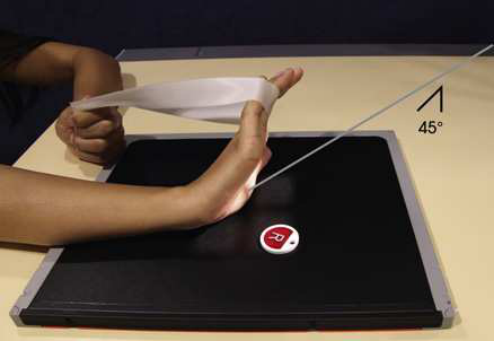
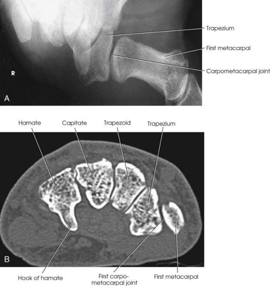

# Rx First Carpometacarpal Joint — Incidență Antero-Posterioară (AP) — Burman Method than is seen on the standard Incidență Antero-Posterioară (AP). (Merrill)

  📷 Radiografie Convențională (Rx)
  <strong>Actualizat:</strong> 2026-09-16
  <strong>Autor:</strong> Referință Merrill

---

-   __1. Rezumat Clinic & Indicații__

    ---

    === "Indicații Clinice"

        - Conform reperelor anatomice standard din tratat

    === "Ghid Național IRIS"

        !!! info "Referință Primară: Ghidul Național IRIS (Ordinul MS 1342/2012)"
            - **Capitol Ghid IRIS:** *Ghidul Național IRIS*
            - **Grad de Recomandare:** **De verificat pe indicație; fără grad atribuit automat**
            - **Nivel de Iradiere Estimată:** `De verificat pentru examinarea și populația selectate`

            [:octicons-search-16: Deschide Ghidul IRIS](../../iris.md){ .md-button .md-button--primary } [:material-open-in-new: Aplicația Oficială PWA](https://radiologie-pediatrica.ro/iris/){ .md-button target="_blank" rel="noopener" }
-   __2. Poziționare & Centrare Fascicul__

    ---

    - **Poziție Pacient:** se așază pacientul pe scaun la end de masa radiologică astfel încât Antebraț poate fie ajustat la lie approximately paralel cu axa longitudinală de receptorul de imagine.; Place receptorul de imagine under Pumn (Articulație Radiocarpiană), și se centrează first articulații carpometacarpiene (CMC) la center de receptorul de imagine. Hyperextend Mână, și Se instruiește pacientul să hold poziție cu opposite Mână sau cu bandage looped around falange. se rotește Mână internally și abduct Police so that it este flat pe receptorul de imagine (Fig. 5.49). se efectuează ecranarea gonadelor cu șorț plumbat.
    - **Punct de Centrare Fascicul:** Through first articulații carpometacarpiene (CMC) la a 45-grade angle spre Cot
    - **Distanță Focar-Film (DFF / SID):** 18 inches is recommended to produce a magnified image that creates a greater field of view of the concavoconvex aspect of this joint.
    - **Comandă Respiratorie:** Conform reperelor anatomice standard din tratat

-   __3. Parametri Tehnici Expunere__

    ---

    | Parametru Tehnic | Valoare Configurare Generator / Tub |
    |:-----------------|:-------------------------------------|
    | **Tensiune Tub (kV)** | DE CONFIGURAT PE APARAT |
    | **Sarcină / Produs Curent-Timp (mAs)** | DE CONFIGURAT PE APARAT |
    | **Distanță Focar-Film (DFF / SID)** | 18 inches is recommended to produce a magnified image that creates a greater field of view of the concavoconvex aspect of this joint. |
    | **Grilă Antidifuzoare (Bucky)** | DE CONFIGURAT PE APARAT |
    | **Dimensiune Focar** | DE CONFIGURAT PE APARAT |
    | **Camere de Ionizare AEC** | DE CONFIGURAT PE APARAT |
    | **Colimare Fascicul** | Conform reperelor anatomice standard din tratat |
    | **Filtrare Tub** | DE CONFIGURAT PE APARAT |

-   __4. Criterii de Calitate & Reușită Imagine__

    ---

    - Criterii radiologice de calitate imaginii:
    - Colimare adecvată vizibilă și prezența markerului de lateralitate (D/S) plasat clear de anatomy de interest
    - First metacarpal
    - Trapezium în concave profile
    - Base de first metacarpal în convex profile
    - First articulații carpometacarpiene (CMC), unobscured prin adjacent oase carpiene
    - Bony detalii trabeculare osoase și surrounding soft tissues

-   __5. Protecție Radiologică (ALARA)__

    ---

    - Nespecificat în fragmentul extras; de verificat în sursă

!!! note "Observații Clinice & Tehnice"
    Conform reperelor anatomice standard din tratat

### 🖼️ Imagini

<figure class="protocol-image-card" markdown>

<figcaption><strong>Merrill — pagina PDF 270, imaginea 1</strong> — Imagine din fragmentul sursă; asocierea necesită revizie.</figcaption>

</figure>

<figure class="protocol-image-card" markdown>

<figcaption><strong>Merrill — pagina PDF 271, imaginea 2</strong> — Imagine din fragmentul sursă; asocierea necesită revizie.</figcaption>

</figure>

=== "Ghid Rapid de Execuție"

    1. **Identificarea și verificarea pacientului:** verificare identitate, zonă de examinat, consimțământ conform procedurii și evaluarea posibilității unei sarcini, când este relevantă.
    2. **Pregătire:** îndepărtarea oricăror obiecte radiopace (bijuterii, agrafe, fermoare, proteze, pansamente dense).
    3. **Poziționare precisă:** alinierea receptorului de imagine și a tubului la distanța prescrisă (18 inches is recommended to produce a magnified image that creates a greater field of view of the concavoconvex aspect of this joint.).
    4. **Colimare strictă:** adaptarea fasciculului strict la regiunea de diagnostic pentru scăderea iradierii și reducerea radiației difuze.
    5. **Radioprotecție:** verificarea [politicii RX](../radioprotectie.md), cu măsuri distincte pentru pacient, personal și însoțitor.

## Surse de documentare

- [Merrill’s Atlas, 5. Upper Extremity, pagini PDF 269–271](../../assets/protocols/sources/a56d45c16829_Merrills_Atlas_of_Radiographic_Positioning__Procedures_3Vol_Set.pdf#page=269)

## Fragmente sursă traduse (referință tehnică)

### anatomy

magnified concavoconvex outline de first articulații carpometacarpiene (CMC) (Fig. 5.50).

### cr

• Through first articulații carpometacarpiene (CMC) la a 45-grade angle spre cot

### criteria

Criterii radiologice de calitate imaginii:
• Colimare adecvată vizibilă și prezența markerului de lateralitate (D/S) plasat clear de anatomy de interest
• First metacarpal
• Trapezium în concave profile
• Base de first metacarpal în convex profile
• First articulații carpometacarpiene (CMC), unobscured prin adjacent oase carpiene
• Bony detalii trabeculare osoase și surrounding soft tissues

### part_pos

• Place receptorul de imagine under wrist, și se centrează first articulații carpometacarpiene (CMC) la center de receptorul de imagine.
• Hyperextend mână, și Se instruiește pacientul să hold poziție cu opposite mână sau cu bandage looped around falange.
• se rotește mână internally și abduct policele so that it este flat pe receptorul de imagine (Fig. 5.49).
• se efectuează ecranarea gonadelor cu șorț plumbat.

### patient_pos

• se așază pacientul pe scaun la end de masa radiologică astfel încât forearm poate fie ajustat la lie approximately paralel cu axa longitudinală
de receptorul de imagine.

### sid

18 inches este recommended la produce magnified imagine that creates greater field de incidență de concavoconvex aspect de this articulație.

### tech

poziționat prin manufacturer sau department protocol pentru corect anatomy display orientation; raza centrală plate: 10 × 12 inches (24 × 30 cm) longitudinal.

