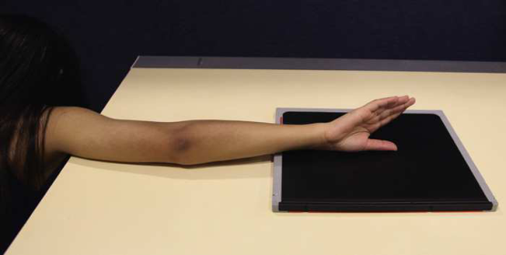
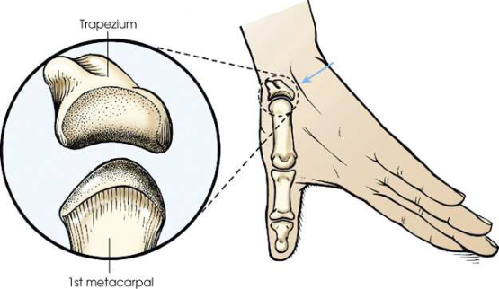
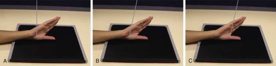
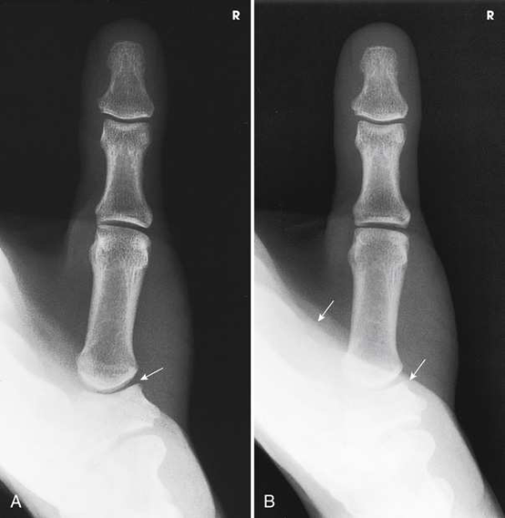

# Rx First Carpometacarpal Joint — Incidență Antero-Posterioară (AP) — Robert Method (Merrill)

  📷 Radiografie Convențională (Rx)
  <strong>Actualizat:</strong> 2026-09-16
  <strong>Autor:</strong> Referință Merrill

---

-   __1. Rezumat Clinic & Indicații__

    ---

    === "Indicații Clinice"

        - Conform reperelor anatomice standard din tratat

    === "Ghid Național IRIS"

        !!! info "Referință Primară: Ghidul Național IRIS (Ordinul MS 1342/2012)"
            - **Capitol Ghid IRIS:** *Ghidul Național IRIS*
            - **Grad de Recomandare:** **De verificat pe indicație; fără grad atribuit automat**
            - **Nivel de Iradiere Estimată:** `De verificat pentru examinarea și populația selectate`

            [:octicons-search-16: Deschide Ghidul IRIS](../../iris.md){ .md-button .md-button--primary } [:material-open-in-new: Aplicația Oficială PWA](https://radiologie-pediatrica.ro/iris/){ .md-button target="_blank" rel="noopener" }
-   __2. Poziționare & Centrare Fascicul__

    ---

    - **Poziție Pacient:** se așază pacientul pe scaun sideways la end de masa radiologică. pacientul trebuie să fie poziționat low enough la place Umăr, Cot, și Pumn (Articulație Radiocarpiană) pe same plane. entire extremity trebuie să fie pe same plane la prevent elevation de oase carpiene și closing de first articulații carpometacarpiene (CMC) (Fig. 5.45).; se extinde extremity straight out pe masa radiologică. se rotește braț internally la place posterior aspect de Police pe receptorul de imagine cu thumbnail down (see Fig. 5.45). Place Police în center de receptorul de imagine. Hyperextend Mână astfel încât părți moi over ulnar aspect does nu obscure first articulații carpometacarpiene (CMC) (Fig. 5.46). Ensure that Police este nu oblic. Long și Rafert 6 stated that pacientul poate hold Degete Mână back cu other Mână. Steady Mână pe sponge if necessary. se efectuează ecranarea gonadelor cu șorț plumbat. perpendicular entering la first articulații carpometacarpiene (CMC) Long și Rafert modification înclinat 15 grade proximally along axa longitudinală de Police și entering first articulații carpometacarpiene (CMC) Lewis modification înclinat 10 la 15 grade proximally along axa longitudinală de Police și entering first articulații metacarpofalangiene (MCF)
    - **Punct de Centrare Fascicul:** Conform reperelor anatomice standard din tratat
    - **Distanță Focar-Film (DFF / SID):** Nespecificat în fragmentul extras; de verificat în sursă
    - **Comandă Respiratorie:** Conform reperelor anatomice standard din tratat

-   __3. Parametri Tehnici Expunere__

    ---

    | Parametru Tehnic | Valoare Configurare Generator / Tub |
    |:-----------------|:-------------------------------------|
    | **Tensiune Tub (kV)** | DE CONFIGURAT PE APARAT |
    | **Sarcină / Produs Curent-Timp (mAs)** | DE CONFIGURAT PE APARAT |
    | **Distanță Focar-Film (DFF / SID)** | Nespecificat în fragmentul extras; de verificat în sursă |
    | **Grilă Antidifuzoare (Bucky)** | DE CONFIGURAT PE APARAT |
    | **Dimensiune Focar** | DE CONFIGURAT PE APARAT |
    | **Camere de Ionizare AEC** | DE CONFIGURAT PE APARAT |
    | **Colimare Fascicul** | Adjust câmp de iradiere la 1 inch (2.5 cm) pe toate sides de falange, including 1 inch (2.5 cm) proximal la articulații carpometacarpiene (CMC). Se plasează markerul de lateralitate în câmpul colimat. |
    | **Filtrare Tub** | DE CONFIGURAT PE APARAT |

-   __4. Criterii de Calitate & Reușită Imagine__

    ---

    - Criterii radiologice de calitate imaginii:
    - Colimare adecvată vizibilă și prezența markerului de lateralitate (D/S) plasat clear de anatomy de interest
    - First articulații carpometacarpiene (CMC) liber de superimposition de Mână sau other bony elements
    - First metacarpal cu base în convex profile
    - Trapezium
    - Bony detalii trabeculare osoase și surrounding soft tissues

-   __5. Protecție Radiologică (ALARA)__

    ---

    - Nespecificat în fragmentul extras; de verificat în sursă

!!! note "Observații Clinice & Tehnice"
    Angulation de raza centrală serves two purposes: (1) It poate help la project părți moi de Mână away de la first articulații carpometacarpiene (CMC), și (2) it poate help la open spații articulare when space este nu vizualizat cu perpendicular raza centrală.

### 🖼️ Imagini

<figure class="protocol-image-card" markdown>

<figcaption><strong>Merrill — pagina PDF 267, imaginea 1</strong> — Imagine din fragmentul sursă; asocierea necesită revizie.</figcaption>

</figure>

<figure class="protocol-image-card" markdown>

<figcaption><strong>Merrill — pagina PDF 267, imaginea 2</strong> — Imagine din fragmentul sursă; asocierea necesită revizie.</figcaption>

</figure>

<figure class="protocol-image-card" markdown>

<figcaption><strong>Merrill — pagina PDF 268, imaginea 3</strong> — Imagine din fragmentul sursă; asocierea necesită revizie.</figcaption>

</figure>

<figure class="protocol-image-card" markdown>

<figcaption><strong>Merrill — pagina PDF 269, imaginea 4</strong> — Imagine din fragmentul sursă; asocierea necesită revizie.</figcaption>

</figure>

=== "Ghid Rapid de Execuție"

    1. **Identificarea și verificarea pacientului:** verificare identitate, zonă de examinat, consimțământ conform procedurii și evaluarea posibilității unei sarcini, când este relevantă.
    2. **Pregătire:** îndepărtarea oricăror obiecte radiopace (bijuterii, agrafe, fermoare, proteze, pansamente dense).
    3. **Poziționare precisă:** alinierea receptorului de imagine și a tubului la distanța prescrisă (Nespecificat în fragmentul extras; de verificat în sursă).
    4. **Colimare strictă:** adaptarea fasciculului strict la regiunea de diagnostic pentru scăderea iradierii și reducerea radiației difuze.
    5. **Radioprotecție:** verificarea [politicii RX](../radioprotectie.md), cu măsuri distincte pentru pacient, personal și însoțitor.

## Surse de documentare

- [Merrill’s Atlas, 5. Upper Extremity, pagini PDF 266–269](../../assets/protocols/sources/a56d45c16829_Merrills_Atlas_of_Radiographic_Positioning__Procedures_3Vol_Set.pdf#page=266)

## Fragmente sursă traduse (referință tehnică)

### anatomy

first articulații carpometacarpiene (CMC) liber de superimposition de soft tissues de mână (Fig. 5.48).

### collimation

• Adjust câmp de iradiere la 1 inch (2.5 cm) pe toate sides de falange, including 1 inch (2.5 cm) proximal la articulații carpometacarpiene (CMC). Place marker de lateralitate (D/S)
în collimated expunere field.

### criteria

Criterii radiologice de calitate imaginii:
• Colimare adecvată vizibilă și prezența markerului de lateralitate (D/S) plasat clear de anatomy de interest
• First articulații carpometacarpiene (CMC) liber de superimposition de mână sau other bony elements
• First metacarpal cu base în convex profile
• Trapezium
• Bony detalii trabeculare osoase și surrounding soft tissues

### notes

Angulation de raza centrală serves two purposes: (1) It poate help la project părți moi de mână away de la first articulații carpometacarpiene (CMC), și (2)
it poate help la open spații articulare when space este nu vizualizat cu perpendicular raza centrală.

### part_pos

• se extinde extremity straight out pe masa radiologică.
• se rotește braț internally la place posterior aspect de policele pe receptorul de imagine cu thumbnail down (see Fig. 5.45).
• Place policele în center de receptorul de imagine.
• Hyperextend mână astfel încât părți moi over ulnar aspect does nu obscure first articulații carpometacarpiene (CMC) (Fig. 5.46). Ensure that thumb este nu oblic.
• Long și Rafert 6 stated that pacientul poate hold degetele back cu other mână.
• Steady mână pe sponge if necessary.
• se efectuează ecranarea gonadelor cu șorț plumbat.
• perpendicular entering la first articulații carpometacarpiene (CMC)
Long și Rafert modification
• înclinat 15 grade proximally along axa longitudinală de policele și entering first articulații carpometacarpiene (CMC)
Lewis modification
• înclinat 10 la 15 grade proximally along axa longitudinală de policele și entering first articulații metacarpofalangiene (MCF)

### patient_pos

• se așază pacientul pe scaun sideways la end de masa radiologică. pacientul trebuie să fie poziționat low enough la place umăr,
cot, și wrist pe same plane. entire extremity trebuie să fie pe same plane la prevent elevation de oase carpiene și
closing de first articulații carpometacarpiene (CMC) (Fig. 5.45).

### tech

poziționat prin manufacturer sau department protocol pentru corect anatomy display orientation; raza centrală plate: 10 × 12 inches (24 × 30 cm) longitudinal.

