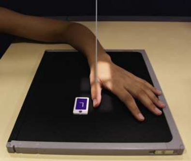
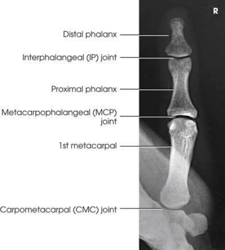
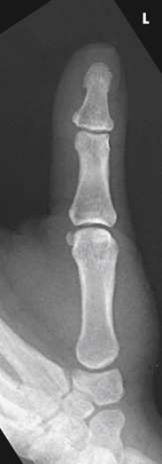
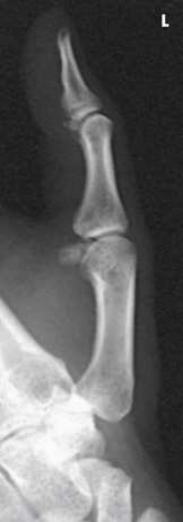
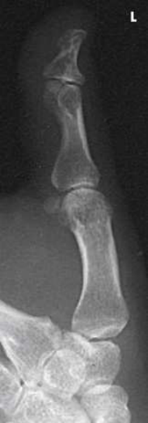

# Rx First Digit (Police) — Oblică Postero-Anterioară (PA) (Merrill)

  📷 Radiografie Convențională (Rx)
  <strong>Actualizat:</strong> 2026-09-16
  <strong>Autor:</strong> Referință Merrill

---

-   __1. Rezumat Clinic & Indicații__

    ---

    === "Indicații Clinice"

        - Conform reperelor anatomice standard din tratat

    === "Ghid Național IRIS"

        !!! info "Referință Primară: Ghidul Național IRIS (Ordinul MS 1342/2012)"
            - **Capitol Ghid IRIS:** *Ghidul Național IRIS*
            - **Grad de Recomandare:** **De verificat pe indicație; fără grad atribuit automat**
            - **Nivel de Iradiere Estimată:** `De verificat pentru examinarea și populația selectate`

            [:octicons-search-16: Deschide Ghidul IRIS](../../iris.md){ .md-button .md-button--primary } [:material-open-in-new: Aplicația Oficială PWA](https://radiologie-pediatrica.ro/iris/){ .md-button target="_blank" rel="noopener" }
-   __2. Poziționare & Centrare Fascicul__

    ---

    - **Poziție Pacient:** se așază pacientul pe scaun la end de masa radiologică, cu palm de Mână resting pe receptorul de imagine.; cu Police în abducție, place palmar surface de Mână în contact cu receptorul de imagine. Ulnar deviate Mână slightly. This relatively normal placement poziții Police în Incidență Oblică. se aliniază longitudinal axis de Police cu axa longitudinală de receptorul de imagine. se centrează receptorul de imagine la articulații metacarpofalangiene (MCF) (Fig. 5.40). se efectuează ecranarea gonadelor cu șorț plumbat.
    - **Punct de Centrare Fascicul:** perpendicular pe articulații metacarpofalangiene (MCF) pentru AP, PA, lateral, și oblic incidențe
    - **Distanță Focar-Film (DFF / SID):** Nespecificat în fragmentul extras; de verificat în sursă
    - **Comandă Respiratorie:** Conform reperelor anatomice standard din tratat

-   __3. Parametri Tehnici Expunere__

    ---

    | Parametru Tehnic | Valoare Configurare Generator / Tub |
    |:-----------------|:-------------------------------------|
    | **Tensiune Tub (kV)** | DE CONFIGURAT PE APARAT |
    | **Sarcină / Produs Curent-Timp (mAs)** | DE CONFIGURAT PE APARAT |
    | **Distanță Focar-Film (DFF / SID)** | Nespecificat în fragmentul extras; de verificat în sursă |
    | **Grilă Antidifuzoare (Bucky)** | DE CONFIGURAT PE APARAT |
    | **Dimensiune Focar** | DE CONFIGURAT PE APARAT |
    | **Camere de Ionizare AEC** | DE CONFIGURAT PE APARAT |
    | **Colimare Fascicul** | Adjust câmp de iradiere la 1 inch (2.5 cm) pe toate sides de falange, including 1 inch (2.5 cm) proximal la articulații carpometacarpiene (CMC). Se plasează markerul de lateralitate în câmpul colimat. |
    | **Filtrare Tub** | DE CONFIGURAT PE APARAT |

-   __4. Criterii de Calitate & Reușită Imagine__

    ---

    - AP și PA Police Criterii radiologice de calitate imaginii:
    - Colimare adecvată vizibilă și prezența markerului de lateralitate (D/S) plasat clear de anatomy de interest
    - Area de la distal tip de Police la trapezium
    - Absența rotației anatomice (simetrie bilaterală perfectă)
    - Concavity de phalangeal și metacarpal corpuri
    - Equal amount de părți moi pe ambele părți (bilateral) de falange
    - Thumbnail, if visualized, în center de distal Police
    - Overlap de părți moi profile de palm over midshaft de first metacarpal
    - Open IP și articulații metacarpofalangiene (MCF) spaces fără overlap de bones
    - Bony detalii trabeculare osoase și surrounding soft tissues
    - PA Police incidență will fie magnified compared cu Incidență Antero-Posterioară (AP) lateral Police Criterii radiologice de calitate imaginii:
    - Colimare adecvată vizibilă și prezența markerului de lateralitate (D/S) plasat clear de anatomy de interest
    - Area de la distal tip de Police la trapezium
    - Absența rotației anatomice (simetrie bilaterală perfectă)
    - Concave anterior surface de proximal phalanx și metacarpal
    - Thumbnail, if visualized și normal, în profile
    - Open IP și articulații metacarpofalangiene (MCF) spaces
    - Bony detalii trabeculare osoase și surrounding soft tissues oblic Police Criterii radiologice de calitate imaginii:
    - Colimare adecvată vizibilă și prezența markerului de lateralitate (D/S) plasat clear de anatomy de interest
    - Area de la distal tip de Police la trapezium
    - corect rotație, evidențiat prin concave surface de ridicat side de proximal phalanx și metacarpal
    - Open IP și articulații metacarpofalangiene (MCF) spaces
    - Bony detalii trabeculare osoase și surrounding soft tissues

-   __5. Protecție Radiologică (ALARA)__

    ---

    - Nespecificat în fragmentul extras; de verificat în sursă

!!! note "Observații Clinice & Tehnice"
    Conform reperelor anatomice standard din tratat

### 🖼️ Imagini

<figure class="protocol-image-card" markdown>

<figcaption><strong>Merrill — pagina PDF 263, imaginea 1</strong> — Imagine din fragmentul sursă; asocierea necesită revizie.</figcaption>

</figure>

<figure class="protocol-image-card" markdown>

<figcaption><strong>Merrill — pagina PDF 264, imaginea 2</strong> — Imagine din fragmentul sursă; asocierea necesită revizie.</figcaption>

</figure>

<figure class="protocol-image-card" markdown>

<figcaption><strong>Merrill — pagina PDF 264, imaginea 3</strong> — Imagine din fragmentul sursă; asocierea necesită revizie.</figcaption>

</figure>

<figure class="protocol-image-card" markdown>

<figcaption><strong>Merrill — pagina PDF 265, imaginea 4</strong> — Imagine din fragmentul sursă; asocierea necesită revizie.</figcaption>

</figure>

<figure class="protocol-image-card" markdown>

<figcaption><strong>Merrill — pagina PDF 266, imaginea 5</strong> — Imagine din fragmentul sursă; asocierea necesită revizie.</figcaption>

</figure>

=== "Ghid Rapid de Execuție"

    1. **Identificarea și verificarea pacientului:** verificare identitate, zonă de examinat, consimțământ conform procedurii și evaluarea posibilității unei sarcini, când este relevantă.
    2. **Pregătire:** îndepărtarea oricăror obiecte radiopace (bijuterii, agrafe, fermoare, proteze, pansamente dense).
    3. **Poziționare precisă:** alinierea receptorului de imagine și a tubului la distanța prescrisă (Nespecificat în fragmentul extras; de verificat în sursă).
    4. **Colimare strictă:** adaptarea fasciculului strict la regiunea de diagnostic pentru scăderea iradierii și reducerea radiației difuze.
    5. **Radioprotecție:** verificarea [politicii RX](../radioprotectie.md), cu măsuri distincte pentru pacient, personal și însoțitor.

## Surse de documentare

- [Merrill’s Atlas, 5. Upper Extremity, pagini PDF 262–266](../../assets/protocols/sources/a56d45c16829_Merrills_Atlas_of_Radiographic_Positioning__Procedures_3Vol_Set.pdf#page=262)

## Fragmente sursă traduse (referință tehnică)

### anatomy

AP, PA, lateral, și PA oblic incidențe de policele și first metacarpal, including trapezium (Figs. 5.41 through 5.44).

### collimation

• Adjust câmp de iradiere la 1 inch (2.5 cm) pe toate sides de falange, including 1 inch (2.5 cm) proximal la articulații carpometacarpiene (CMC). Place marker de lateralitate (D/S)
în collimated expunere field.

### cr

• perpendicular pe articulații metacarpofalangiene (MCF) pentru AP, PA, lateral, și oblic incidențe

### criteria

AP și PA Thumb
Criterii radiologice de calitate imaginii:
• Colimare adecvată vizibilă și prezența markerului de lateralitate (D/S) plasat clear de anatomy de interest
• Area de la distal tip de policele la trapezium
• Absența rotației anatomice (simetrie bilaterală perfectă)
• Concavity de phalangeal și metacarpal corpuri
• Equal amount de părți moi pe ambele părți (bilateral) de falange
• Thumbnail, if visualized, în center de distal thumb
• Overlap de părți moi profile de palm over midshaft de first metacarpal
• Open IP și articulații metacarpofalangiene (MCF) spaces fără overlap de bones
• Bony detalii trabeculare osoase și surrounding soft tissues
• PA thumb incidență will fie magnified compared cu AP incidență
lateral thumb
Criterii radiologice de calitate imaginii:
• Colimare adecvată vizibilă și prezența markerului de lateralitate (D/S) plasat clear de anatomy de interest
• Area de la distal tip de policele la trapezium
• Absența rotației anatomice (simetrie bilaterală perfectă)
• Concave anterior surface de proximal phalanx și metacarpal
• Thumbnail, if visualized și normal, în profile
• Open IP și articulații metacarpofalangiene (MCF) spaces
• Bony detalii trabeculare osoase și surrounding soft tissues
oblic thumb
Criterii radiologice de calitate imaginii:
• Colimare adecvată vizibilă și prezența markerului de lateralitate (D/S) plasat clear de anatomy de interest
• Area de la distal tip de policele la trapezium
• corect rotație, evidențiat prin concave surface de ridicat side de proximal phalanx și metacarpal
• Open IP și articulații metacarpofalangiene (MCF) spaces
• Bony detalii trabeculare osoase și surrounding soft tissues

### part_pos

• cu policele în abducție, place palmar surface de mână în contact cu receptorul de imagine. Ulnar deviate mână slightly. This relatively
normal placement poziții policele în oblic poziție.
• se aliniază longitudinal axis de policele cu axa longitudinală de receptorul de imagine. se centrează receptorul de imagine la articulații metacarpofalangiene (MCF) (Fig. 5.40).
• se efectuează ecranarea gonadelor cu șorț plumbat.

### patient_pos

• se așază pacientul pe scaun la end de masa radiologică, cu palm de mână resting pe receptorul de imagine.

