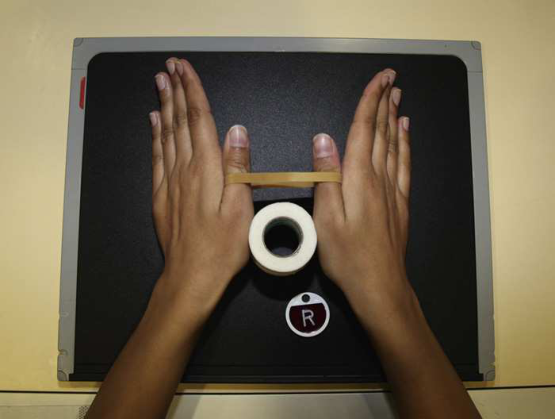

# Rx First Metacarpophalangeal Joint — Incidență Postero-Anterioară (PA) — Folio Method Police.” 8 (Merrill)

  📷 Radiografie Convențională (Rx)
  <strong>Actualizat:</strong> 2026-09-16
  <strong>Autor:</strong> Referință Merrill

---

-   __1. Rezumat Clinic & Indicații__

    ---

    === "Indicații Clinice"

        - Conform reperelor anatomice standard din tratat

    === "Ghid Național IRIS"

        !!! info "Referință Primară: Ghidul Național IRIS (Ordinul MS 1342/2012)"
            - **Capitol Ghid IRIS:** *Ghidul Național IRIS*
            - **Grad de Recomandare:** **De verificat pe indicație; fără grad atribuit automat**
            - **Nivel de Iradiere Estimată:** `De verificat pentru examinarea și populația selectate`

            [:octicons-search-16: Deschide Ghidul IRIS](../../iris.md){ .md-button .md-button--primary } [:material-open-in-new: Aplicația Oficială PWA](https://radiologie-pediatrica.ro/iris/){ .md-button target="_blank" rel="noopener" }
-   __2. Poziționare & Centrare Fascicul__

    ---

    - **Poziție Pacient:** se așază pacientul pe scaun la end de masa radiologică.; se poziționează pacientul’s mâini pe receptorul de imagine, resting them pe their medial aspects. Tightly wrap rubber band around distal portion de ambele thumbs și place roll de medical tape între corpuri de first oase metacarpiene. Ensure thumbs remain în PA plane prin keeping thumbnails paralel cu receptorul de imagine (RI) (Fig. 5.51). Before expunere, Se instruiește pacientul să pull thumbs apart și hold. se efectuează ecranarea gonadelor cu șorț plumbat.
    - **Punct de Centrare Fascicul:** perpendicular la point midway între ambele mâini la nivelul articulații metacarpofalangiene (MCF)
    - **Distanță Focar-Film (DFF / SID):** Nespecificat în fragmentul extras; de verificat în sursă
    - **Comandă Respiratorie:** Conform reperelor anatomice standard din tratat

-   __3. Parametri Tehnici Expunere__

    ---

    | Parametru Tehnic | Valoare Configurare Generator / Tub |
    |:-----------------|:-------------------------------------|
    | **Tensiune Tub (kV)** | DE CONFIGURAT PE APARAT |
    | **Sarcină / Produs Curent-Timp (mAs)** | DE CONFIGURAT PE APARAT |
    | **Distanță Focar-Film (DFF / SID)** | Nespecificat în fragmentul extras; de verificat în sursă |
    | **Grilă Antidifuzoare (Bucky)** | DE CONFIGURAT PE APARAT |
    | **Dimensiune Focar** | DE CONFIGURAT PE APARAT |
    | **Camere de Ionizare AEC** | DE CONFIGURAT PE APARAT |
    | **Colimare Fascicul** | Adjust câmp de iradiere pentru include third oase metacarpiene pe sides, bases de thumbs proximally și 1 inch (2.5 cm) distal la thumbnails. Se plasează markerul de lateralitate în câmpul colimat. |
    | **Filtrare Tub** | DE CONFIGURAT PE APARAT |

-   __4. Criterii de Calitate & Reușită Imagine__

    ---

    - Criterii radiologice de calitate imaginii:
    - Colimare adecvată vizibilă și prezența markerului de lateralitate (D/S) plasat clear de anatomy de interest
    - Thumbs în Incidență Postero-Anterioară (PA) cu Absența rotației anatomice (simetrie bilaterală perfectă)
    - First oase metacarpiene
    - First articulații metacarpofalangiene (MCF)
    - Rubber band și medical tape în correct poziție
    - Thumbs centrat pe center de imagine
    - Bony detalii trabeculare osoase și surrounding soft tissues

-   __5. Protecție Radiologică (ALARA)__

    ---

    - Nespecificat în fragmentul extras; de verificat în sursă

!!! note "Observații Clinice & Tehnice"
    la avoid mișcare, have correct technical factors set pe generator și fie ready la Se declanșează expunerea before instructing pacientul la pull thumbs apart.

### 🖼️ Imagini

<figure class="protocol-image-card" markdown>

<figcaption><strong>Merrill — pagina PDF 272, imaginea 1</strong> — Imagine din fragmentul sursă; asocierea necesită revizie.</figcaption>

</figure>

=== "Ghid Rapid de Execuție"

    1. **Identificarea și verificarea pacientului:** verificare identitate, zonă de examinat, consimțământ conform procedurii și evaluarea posibilității unei sarcini, când este relevantă.
    2. **Pregătire:** îndepărtarea oricăror obiecte radiopace (bijuterii, agrafe, fermoare, proteze, pansamente dense).
    3. **Poziționare precisă:** alinierea receptorului de imagine și a tubului la distanța prescrisă (Nespecificat în fragmentul extras; de verificat în sursă).
    4. **Colimare strictă:** adaptarea fasciculului strict la regiunea de diagnostic pentru scăderea iradierii și reducerea radiației difuze.
    5. **Radioprotecție:** verificarea [politicii RX](../radioprotectie.md), cu măsuri distincte pentru pacient, personal și însoțitor.

## Surse de documentare

- [Merrill’s Atlas, 5. Upper Extremity, pagini PDF 271–272](../../assets/protocols/sources/a56d45c16829_Merrills_Atlas_of_Radiographic_Positioning__Procedures_3Vol_Set.pdf#page=271)

## Fragmente sursă traduse (referință tehnică)

### anatomy

articulații metacarpofalangiene (MCF) și MCP angles bilaterally (Fig. 5.52).

### collimation

• Adjust câmp de iradiere pentru include third oase metacarpiene pe sides, bases de thumbs proximally și 1 inch (2.5 cm) distal la thumbnails. Se plasează markerul de lateralitate în câmpul colimat.

### cr

• perpendicular la point midway între ambele mâini la nivelul articulații metacarpofalangiene (MCF)

### criteria

Criterii radiologice de calitate imaginii:
• Colimare adecvată vizibilă și prezența markerului de lateralitate (D/S) plasat clear de anatomy de interest
• Thumbs în PA incidență cu Absența rotației anatomice (simetrie bilaterală perfectă)
• First oase metacarpiene
• First articulații metacarpofalangiene (MCF)
• Rubber band și medical tape în correct poziție
• Thumbs centrat pe center de imagine
• Bony detalii trabeculare osoase și surrounding soft tissues

### notes

la avoid mișcare, have correct technical factors set pe generator și fie ready la Se declanșează expunerea before instructing pacient la pull thumbs apart.

### part_pos

• se poziționează pacientul’s mâini pe receptorul de imagine, resting them pe their medial aspects.
• Tightly wrap rubber band around distal portion de ambele thumbs și place roll de medical tape între corpuri de first
oase metacarpiene.
• Ensure thumbs remain în PA plane prin keeping thumbnails paralel cu receptorul de imagine (RI) (Fig. 5.51).
• Before expunere, Se instruiește pacientul să pull thumbs apart și hold.
• se efectuează ecranarea gonadelor cu șorț plumbat.

### patient_pos

• se așază pacientul pe scaun la end de masa radiologică.

### tech

poziționat prin manufacturer sau department protocol pentru corect anatomy display orientation; raza centrală plate: 10 × 12 inches (24 × 30 cm) transversal.

