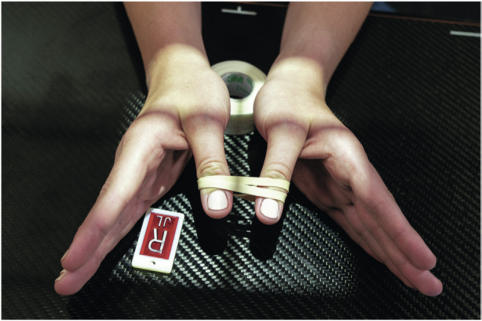
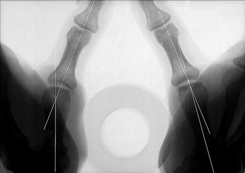

# Rx FOLIO METHOD9 PA STRESS Police Incidență

  📷 Radiografie Convențională (Rx)
  <strong>Actualizat:</strong> 2026-09-15
  <strong>Autor:</strong> Departamentul de Radiologie / Referință Bontrager

---

-   __1. Rezumat Clinic & Indicații__

    ---

    === "Indicații Clinice"

        - Sprain sau tearing de ulnar collateral ligament de Police la articulații metacarpofalangiene (MCF) ca result de acute hyperextension de Police; also referred la ca a “skier’s Police” injury

    === "Ghid Național IRIS"

        !!! info "Referință Primară: Ghidul Național IRIS (Ordinul MS 1342/2012)"
            - **Capitol Ghid IRIS:** *Ghidul Național IRIS*
            - **Grad de Recomandare:** **De verificat pe indicație; fără grad atribuit automat**
            - **Nivel de Iradiere Estimată:** `De verificat pentru examinarea și populația selectate`

            [:octicons-search-16: Deschide Ghidul IRIS](../../iris.md){ .md-button .md-button--primary } [:material-open-in-new: Aplicația Oficială PWA](https://radiologie-pediatrica.ro/iris/){ .md-button target="_blank" rel="noopener" }
-   __2. Poziționare & Centrare Fascicul__

    ---

    - **Poziție Pacient:** Pacient: Seat pacient la end de table cu ambele mâini extins și în pronație pe receptorul de imagine.; Regiune anatomică: poziție ambele mâini side prin side la center de receptorul de imagine, rotit laterally into ±45° Incidență Oblică, resulting în Incidență Postero-Anterioară (PA) de ambele thumbs. Place supports ca needed under ambele Pumn (Articulație Radiocarpiană) și proximal Police regions la prevent mișcare. Ensure that mâini sunt rotit enough la place thumbs paralel cu receptorul de imagine pentru Incidență Postero-Anterioară (PA) de ambele thumbs. Place round spacer, such ca roll de medical tape, între proximal Police regions; wrap rubber bands around distal thumbs (Fig. 4.64). Immediately before expunere, ask pacient la pull thumbs apart firmly și hold.
    - **Punct de Centrare Fascicul:** perpendicular pe receptorul de imagine orientat la midway între articulații metacarpofalangiene (MCF)
    - **Distanță Focar-Film (DFF / SID):** 100 cm
    - **Comandă Respiratorie:** Apnee pe durata expunerii (sau conform cooperării pacientului)

-   __3. Parametri Tehnici Expunere__

    ---

    | Parametru Tehnic | Valoare Configurare Generator / Tub |
    |:-----------------|:-------------------------------------|
    | **Tensiune Tub (kV)** | 55 kV |
    | **Sarcină / Produs Curent-Timp (mAs)** | DE CONFIGURAT PE APARAT |
    | **Distanță Focar-Film (DFF / SID)** | 100 cm |
    | **Grilă Antidifuzoare (Bucky)** | Fără grilă (expunere directă) |
    | **Dimensiune Focar** | Focar Mic (0.6 mm) |
    | **Camere de Ionizare AEC** | DE CONFIGURAT PE APARAT |
    | **Colimare Fascicul** | Field Size Collimate pe four sides la include second oase metacarpiene și entire thumbs, de la articulații carpometacarpiene (CMC) proximally la distal falange distally. Police SPECIAL AP axial, modified Robert method PA stress (Folio method) Fig. 4.64 PA stress incidență de bilateral thumbs; Raza centrală perpendiculară la midway între articulații metacarpofalangiene (MCF), firm tension applied. |
    | **Filtrare Tub** | Totală ≥ 2.5 mm Al echivalent |

-   __4. Criterii de Calitate & Reușită Imagine__

    ---

    - Entire thumbs de la first oase metacarpiene la distal falange (Fig. 4.65).
    - evidențiază metacarpophalangeal angles și spații articulare la articulații metacarpofalangiene (MCF) (Fig. 4.66). poziție:
    - Absența rotației anatomice: clavicule echidistante față de linia apofizelor spinoase de thumbs ca evidenced prin simetric appearance de concavities de shafts de first oase metacarpiene și falange.
    - distal falange trebuie să appear la fie pulled together, indicating that tension was applied.
    - MCP și articulații interfalangiene (IF) trebuie să appear open, indicating that thumbs were paralel cu receptorul de imagine și perpendicular la raza centrală.
    - raza centrală și center de collimation field size trebuie să fie midway între two articulații metacarpofalangiene (MCF). expunere:
    - optim receptorul de imagine expunere și contrast cu fără mișcare evidențiază părți moi margins și clear, net bony edges și trabecular markings. 20° 7° R Fig. 4.65 PA stress incidență de bilateral thumbs cu tension applied. 20° MCP angle pe stâng indicates sprain sau torn ulnar collateral ligament. (de la Frank ED, Long BW, Smith BJ: Merrill’s atlas de radiographic poziții și radiologic procedures, ed 11, St Louis, 2007, Mosby.) 20° 7° distal phalanx articulații interfalangiene (IF) Torn ulnar collateral ligament Metacarpophalangeal angle proximal phalanx articulații metacarpofalangiene (MCF) 1st metacarpal Fig. 4.66 PA stress incidență de bilateral thumbs cu tension applied (evidențiază torn ulnar collateral ligament pe stâng).

-   __5. Protecție Radiologică (ALARA)__

    ---

    - Ecranare gonadică și a organelor radiosensibile conform procedurilor locale de radioprotecție ALARA.
    - Colimare strictă la aria de interes pentru limitarea radiației difuze.
    - Verificarea posibilității unei sarcini la pacientele de vârstă fertilă înainte de expunere.

!!! note "Observații Clinice & Tehnice"
    Explain procedure carefully la pacient și observe pacient while applying tension pe rubber band fără estompare cinetică de mișcare before initiating expunere. Work quickly because this poate fie painful pentru pacient.

### 🖼️ Imagini

<figure class="protocol-image-card" markdown>

<figcaption><strong>Fig. 4.64 PA stress incidență de bilateral thumbs; Raza centrală perpendiculară la</strong> — Poziționare pacient conform Ghidului Bontrager (Fig. 4.64 PA stress incidență de bilateral thumbs; raza centrală perpendicular la)</figcaption>

</figure>

<figure class="protocol-image-card" markdown>

<figcaption><strong>Fig. 4.65 PA stress incidență de bilateral thumbs cu tension</strong> — Aspect radiografic de referință conform Ghidului Bontrager (Fig. 4.65 PA stress incidență de bilateral thumbs cu tension)</figcaption>

</figure>

=== "Ghid Rapid de Execuție"

    1. **Identificarea și verificarea pacientului:** verificare identitate, zonă de examinat, consimțământ conform procedurii și evaluarea posibilității unei sarcini, când este relevantă.
    2. **Pregătire:** îndepărtarea oricăror obiecte radiopace (bijuterii, agrafe, fermoare, proteze, pansamente dense).
    3. **Poziționare precisă:** alinierea receptorului de imagine și a tubului la distanța prescrisă (100 cm).
    4. **Colimare strictă:** adaptarea fasciculului strict la regiunea de diagnostic pentru scăderea iradierii și reducerea radiației difuze.
    5. **Radioprotecție:** verificarea [politicii RX](../radioprotectie.md), cu măsuri distincte pentru pacient, personal și însoțitor.

## Surse de documentare

- [Bontrager's Textbook of Radiographic Positioning (Ed. 9/10), Pagina 159](https://www.elsevier.com/books/textbook-of-radiographic-positioning-and-related-anatomy/lampignano/978-0-323-65367-1)
