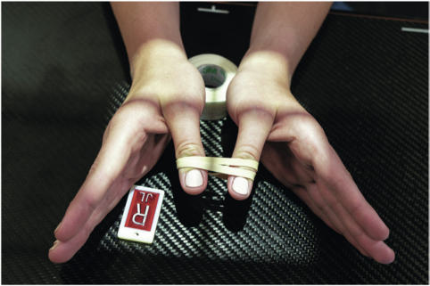
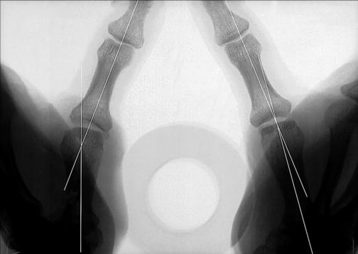

# Rx incidență PA de stres a policelui, METODA FOLIO 9

  📷 Radiografie Convențională (Rx)
  <strong>Actualizat:</strong> 2026-09-15
  <strong>Autor:</strong> Departamentul de Radiologie / Referință Bontrager

---

-   __1. Rezumat Clinic & Indicații__

    ---

    === "Indicații Clinice"

        - Entorsă sau ruptură a ligamentului colateral ulnar al policelui la articulația metacarpofalangiană (MCF), ca rezultat al hiperextensiei acute a policelui; denumită și leziune de tip „policele schiorului”

    === "Ghid Național IRIS"

        !!! info "Referință Primară: Ghidul Național IRIS (Ordinul MS 1342/2012)"
            - **Capitol Ghid IRIS:** *Aparat locomotor & Membru superior*
            - **Grad de Recomandare:** **Grad A**
            - **Nivel de Iradiere Estimată:** `Clasa 1 (Minimă < 0.01 mSv)`

            [:octicons-search-16: Deschide Ghidul IRIS](../../iris.md){ .md-button .md-button--primary } [:material-open-in-new: Aplicația Oficială PWA](https://radiologie-pediatrica.ro/iris/){ .md-button target="_blank" rel="noopener" }

-   __2. Poziționare & Centrare Fascicul__

    ---

    - **Poziție Pacient:** Pacient: Așezați pacientul la capătul mesei, cu ambele mâini extinse și în pronație pe receptorul de imagine.; Regiune anatomică: poziționați ambele mâini una lângă cealaltă, centrate pe receptorul de imagine, rotite lateral în incidență oblică la ±45°, rezultând o incidență postero-anterioară (PA) a ambelor police. Plasați suporturi, după cum este necesar, sub ambele pumni (articulații radiocarpiene) și regiunile proximale ale policelor pentru a preveni mișcarea. Asigurați-vă că mâinile sunt rotite suficient pentru a poziționa policelor paralel cu receptorul de imagine pentru incidența postero-anterioară (PA) a ambelor police. Plasați un distanțier rotund, cum ar fi o rolă de bandă medicală, între regiunile proximale ale policelor; înfășurați benzi elastice în jurul falangelor distale ale policelor (Fig. 4.64). Imediat înaintea expunerii, cereți pacientului să îndepărteze ferm policele unul de celălalt și să mențină poziția.
    - **Punct de Centrare Fascicul:** perpendicular pe receptorul de imagine, orientat la mijloc între articulațiile metacarpofalangiene (MCF)
    - **Distanță Focar-Film (DFF / SID):** 100 cm
    - **Comandă Respiratorie:** Apnee pe durata expunerii (sau conform cooperării pacientului)

-   __3. Parametri Tehnici Expunere__

    ---

    | Parametru Tehnic | Valoare Configurare Generator / Tub |
    |:-----------------|:-------------------------------------|
    | **Tensiune Tub (kV)** | 55 kV |
    | **Sarcină / Produs Curent-Timp (mAs)** | DE CONFIGURAT PE APARAT |
    | **Distanță Focar-Film (DFF / SID)** | 100 cm |
    | **Grilă Antidifuzoare (Bucky)** | Fără grilă (expunere directă) |
    | **Dimensiune Focar** | Focar Mic (0.6 mm) |
    | **Camere de Ionizare AEC** | DE CONFIGURAT PE APARAT |
    | **Colimare Fascicul** | Dimensiunea câmpului: Colimați pe cele patru laturi pentru a include al doilea oase metacarpiene și policele în întregime, de la articulațiile carpometacarpiene (CMC) proximal până la falangele distale distal. POLICE, SPECIALĂ AP axială, metoda Robert modificată, PA de stres (metoda Folio). Fig. 4.64 Incidență PA de stres a ambelor police; raza centrală perpendiculară pe punctul situat la jumătatea distanței dintre articulațiile metacarpofalangiene (MCF), cu tensiune fermă aplicată. |
    | **Filtrare Tub** | Totală ≥ 2.5 mm Al echivalent |

-   __4. Criterii de Calitate & Reușită Imagine__

    ---

    - Policele în întregime, de la primele oase metacarpiene până la falangele distale (Fig. 4.65).
    - Evidențiază unghiurile metacarpofalangiene și spațiile articulare ale articulațiilor metacarpofalangiene (MCF) (Fig. 4.66). Poziție: [fragment incomplet în sursă]
    - Absența rotației anatomice: claviculele echidistante față de linia apofizelor spinoase ale policelor, evidențiată prin aspectul simetric al concavităților diafizelor primelor oase metacarpiene și ale falangelor.
    - Falangele distale trebuie să apară apropiate, indicând aplicarea tensiunii.
    - Articulațiile MCF și interfalangiene (IF) trebuie să apară deschise, indicând faptul că policele au fost poziționate paralel cu receptorul de imagine și perpendicular pe raza centrală.
    - Raza centrală și centrul câmpului de colimare trebuie să fie la jumătatea distanței dintre cele două articulații metacarpofalangiene (MCF). Expunere:
    - Expunerea optimă a receptorului de imagine și contrastul, în absența mișcării, evidențiază contururile părților moi, marginile osoase clare și nete și desenul trabecular. 20° 7° R Fig. 4.65 Incidență PA de stres a ambelor police, cu tensiune aplicată. Unghiul metacarpofalangian (MCP) de 20° pe stânga indică o entorsă sau o ruptură a ligamentului colateral ulnar. (Din Frank ED, Long BW, Smith BJ: Atlasul Merrill de poziționări radiografice și proceduri radiologice, ediția 11, St Louis, 2007, Mosby.) 20° 7° Falangă distală; articulații interfalangiene (IF); ligament colateral ulnar rupt; unghi metacarpofalangian; falangă proximală; articulații metacarpofalangiene (MCF); metacarpianul 1. Fig. 4.66 Incidență PA de stres a ambelor police, cu tensiune aplicată (evidențiază ruptura ligamentului colateral ulnar pe stânga).

-   __5. Protecție Radiologică (ALARA)__

    ---

    - Ecranare gonadică și a organelor radiosensibile conform procedurilor locale de radioprotecție ALARA.
    - Colimare strictă la aria de interes pentru limitarea radiației difuze.
    - Verificarea posibilității unei sarcini la pacientele de vârstă fertilă înainte de expunere.

!!! note "Observații Clinice & Tehnice"
    Se explică procedura cu atenție pacientului și se observă pacientul în timp ce se aplică tensiune pe banda elastică, fără estompare cinetică a mișcării, înainte de inițierea expunerii. Se lucrează rapid deoarece acest lucru poate fi dureros pentru pacient.

### 🖼️ Imagini

<figure class="protocol-image-card" markdown>

<figcaption><strong>Fig. 4.64 Incidență PA de stres a ambelor police; raza centrală perpendiculară pe</strong> — Poziționarea pacientului conform Ghidului Bontrager (Fig. 4.64 Incidență PA de stres a ambelor police; raza centrală perpendiculară pe)</figcaption>

</figure>

<figure class="protocol-image-card" markdown>

<figcaption><strong>Fig. 4.65 Incidență PA de stres a ambelor police, cu tensiune</strong> — Aspect radiografic de referință conform Ghidului Bontrager (Fig. 4.65 Incidență PA de stres a ambelor police, cu tensiune)</figcaption>

</figure>

=== "Ghid Rapid de Execuție"

    1. **Identificarea și verificarea pacientului:** verificare identitate, zonă de examinat, consimțământ conform procedurii și evaluarea posibilității unei sarcini, când este relevantă.
    2. **Pregătire:** îndepărtarea oricăror obiecte radiopace (bijuterii, agrafe, fermoare, proteze, pansamente dense).
    3. **Poziționare precisă:** alinierea receptorului de imagine și a tubului la distanța prescrisă (100 cm).
    4. **Colimare strictă:** adaptarea fasciculului strict la regiunea de diagnostic pentru scăderea iradierii și reducerea radiației difuze.
    5. **Radioprotecție:** verificarea [politicii RX](../radioprotectie.md), cu măsuri distincte pentru pacient, personal și însoțitor.

## Surse de documentare

- [Bontrager's Textbook of Radiographic Positioning (Ed. 9/10), Pagina 159](https://www.elsevier.com/books/textbook-of-radiographic-positioning-and-related-anatomy/lampignano/978-0-323-65367-1)
