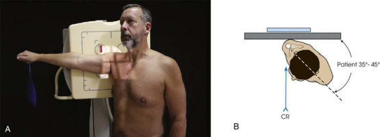
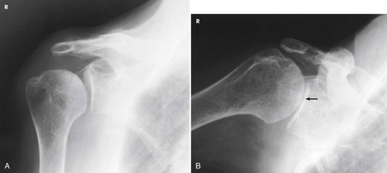

# Rx Glenoid Cavity — Oblică Antero-Posterioară (AP) — Apple Method RPO or Oblică Posterioară Stângă (OPS / LPO) (Merrill)

  📷 Radiografie Convențională (Rx)
  <strong>Actualizat:</strong> 2026-09-16
  <strong>Autor:</strong> Referință Merrill

---

-   __1. Rezumat Clinic & Indicații__

    ---

    === "Indicații Clinice"

        - Conform reperelor anatomice standard din tratat

    === "Ghid Național IRIS"

        !!! info "Referință Primară: Ghidul Național IRIS (Ordinul MS 1342/2012)"
            - **Capitol Ghid IRIS:** *Ghidul Național IRIS*
            - **Grad de Recomandare:** **De verificat pe indicație; fără grad atribuit automat**
            - **Nivel de Iradiere Estimată:** `De verificat pentru examinarea și populația selectate`

            [:octicons-search-16: Deschide Ghidul IRIS](../../iris.md){ .md-button .md-button--primary } [:material-open-in-new: Aplicația Oficială PWA](https://radiologie-pediatrica.ro/iris/){ .md-button target="_blank" rel="noopener" }
-   __2. Poziționare & Centrare Fascicul__

    ---

    - **Poziție Pacient:** se așază pacientul în Poziție Șezândă sau ortostatism.; se centrează receptorul de imagine la scapulohumeral articulație. se rotește corp approximately 35 la 45 grade spre afected side (Fig. 6.21). posterior surface de afected side este cel mai apropiat de receptorul de imagine. Omoplat (Scapulă) trebuie să fie poziționat paralel cu plane de receptorul de imagine (see Grashey method pentru positioning details). pacientul trebuie să hold a 1-lb weight în Mână pe same side ca afected Umăr în neutral poziție. While menținerea weight, pacientul trebuie să abduct braț 90 grade de la linia mediană corp (Fig. 6.21A). se efectuează ecranarea gonadelor cu șorț plumbat.
    - **Punct de Centrare Fascicul:** perpendicular pe receptorul de imagine (RI) la nivelul proces coracoid
    - **Distanță Focar-Film (DFF / SID):** Nespecificat în fragmentul extras; de verificat în sursă
    - **Comandă Respiratorie:** apnee (oprirea respirației).

-   __3. Parametri Tehnici Expunere__

    ---

    | Parametru Tehnic | Valoare Configurare Generator / Tub |
    |:-----------------|:-------------------------------------|
    | **Tensiune Tub (kV)** | DE CONFIGURAT PE APARAT |
    | **Sarcină / Produs Curent-Timp (mAs)** | DE CONFIGURAT PE APARAT |
    | **Distanță Focar-Film (DFF / SID)** | Nespecificat în fragmentul extras; de verificat în sursă |
    | **Grilă Antidifuzoare (Bucky)** | DE CONFIGURAT PE APARAT |
    | **Dimensiune Focar** | DE CONFIGURAT PE APARAT |
    | **Camere de Ionizare AEC** | DE CONFIGURAT PE APARAT |
    | **Colimare Fascicul** | Adjust câmp de iradiere la approximately 8 × 10 inches (18 × 24 cm) pe collimator. Adjust ca needed la include 1.5 inches (3.8 cm) above Umăr, 1 inch (2.5 cm) beyond lateral aspect de Umăr, lateral half de Claviculă, și proximal third de Humerus. Se plasează markerul de lateralitate în câmpul colimat. |
    | **Filtrare Tub** | DE CONFIGURAT PE APARAT |

-   __4. Criterii de Calitate & Reușită Imagine__

    ---

    - Criterii radiologice de calitate imaginii:
    - Colimare adecvată vizibilă și prezența markerului de lateralitate (D/S) plasat clear de anatomy de interest
    - cavitate glenoidă în profile
    - braț în a 90-grade în abducție poziție
    - Open spații articulare între cap humeral și cavitate glenoidă
    - Bony detalii trabeculare osoase și surrounding soft tissues

-   __5. Protecție Radiologică (ALARA)__

    ---

    - Nespecificat în fragmentul extras; de verificat în sursă

!!! note "Observații Clinice & Tehnice"
    la avoid mișcare, have correct technical factors set pe generator și fie ready la Se declanșează expunerea before pacientul abducts braț.

### 🖼️ Imagini

<figure class="protocol-image-card" markdown>

<figcaption><strong>Merrill — pagina PDF 387, imaginea 1</strong> — Imagine din fragmentul sursă; asocierea necesită revizie.</figcaption>

</figure>

<figure class="protocol-image-card" markdown>

<figcaption><strong>Merrill — pagina PDF 388, imaginea 2</strong> — Imagine din fragmentul sursă; asocierea necesită revizie.</figcaption>

</figure>

=== "Ghid Rapid de Execuție"

    1. **Identificarea și verificarea pacientului:** verificare identitate, zonă de examinat, consimțământ conform procedurii și evaluarea posibilității unei sarcini, când este relevantă.
    2. **Pregătire:** îndepărtarea oricăror obiecte radiopace (bijuterii, agrafe, fermoare, proteze, pansamente dense).
    3. **Poziționare precisă:** alinierea receptorului de imagine și a tubului la distanța prescrisă (Nespecificat în fragmentul extras; de verificat în sursă).
    4. **Colimare strictă:** adaptarea fasciculului strict la regiunea de diagnostic pentru scăderea iradierii și reducerea radiației difuze.
    5. **Radioprotecție:** verificarea [politicii RX](../radioprotectie.md), cu măsuri distincte pentru pacient, personal și însoțitor.

## Surse de documentare

- [Merrill’s Atlas, 6. Shoulder Girdle, pagini PDF 386–388](../../assets/protocols/sources/a56d45c16829_Merrills_Atlas_of_Radiographic_Positioning__Procedures_3Vol_Set.pdf#page=386)

## Fragmente sursă traduse (referință tehnică)

### anatomy

scapulohumeral articulație (Fig. 6.22), cu spații articulare narrowing if present.

### collimation

Adjust câmp de iradiere la approximately 8 × 10 inches (18 × 24 cm) pe collimator. Adjust ca needed la include 1.5 inches (3.8 cm) above umăr, 1 inch (2.5 cm) beyond lateral aspect de umăr, lateral half de clavicle, și proximal third de humerus. Place side
marker în collimated expunere field.

### cr

• perpendicular pe receptorul de imagine (RI) la nivelul proces coracoid

### criteria

Criterii radiologice de calitate imaginii:
• Colimare adecvată vizibilă și prezența markerului de lateralitate (D/S) plasat clear de anatomy de interest
• cavitate glenoidă în profile
• braț în a 90-grade în abducție poziție
• Open spații articulare între cap humeral și cavitate glenoidă
• Bony detalii trabeculare osoase și surrounding soft tissues

### notes

la avoid mișcare, have correct technical factors set pe generator și fie ready la Se declanșează expunerea before pacientul abducts
braț.

### part_pos

• se centrează receptorul de imagine la scapulohumeral articulație.
• se rotește corp approximately 35 la 45 grade spre afected side (Fig. 6.21).
• posterior surface de afected side este cel mai apropiat de receptorul de imagine.
• scapula trebuie să fie poziționat paralel cu plane de receptorul de imagine (see Grashey method pentru positioning details).
• pacientul trebuie să hold a 1-lb weight în mână pe same side ca afected umăr în neutral poziție.
• While menținerea weight, pacientul trebuie să abduct braț 90 grade de la linia mediană corp (Fig. 6.21A).
• se efectuează ecranarea gonadelor cu șorț plumbat.

### patient_pos

• se așază pacientul în așezat pe scaun sau ortostatism.

### respiration

apnee (oprirea respirației).

### tech

poziționat prin manufacturer sau department protocol pentru corect anatomy display orientation; raza centrală plate: 10 × 12 inches (24
× 30 cm) transversal.

