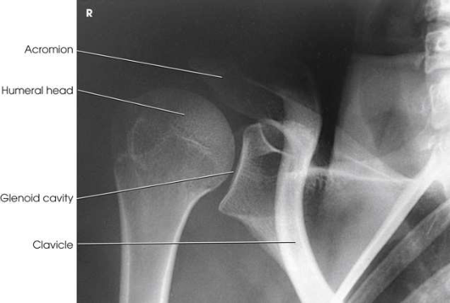
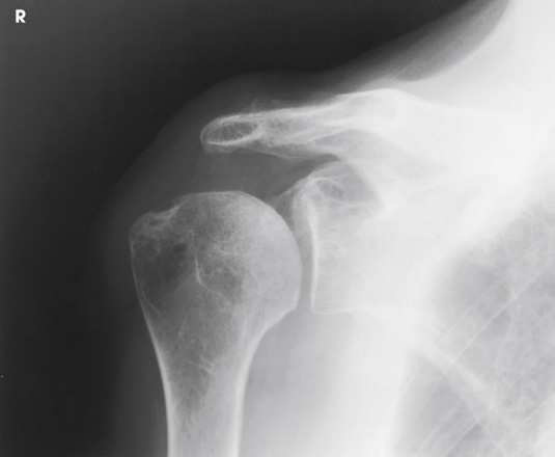

# Rx Glenoid Cavity — Oblică Antero-Posterioară (AP) — Grashey Method RPO or Oblică Posterioară Stângă (OPS / LPO) (Merrill)

  📷 Radiografie Convențională (Rx)
  <strong>Actualizat:</strong> 2026-09-16
  <strong>Autor:</strong> Referință Merrill

---

-   __1. Rezumat Clinic & Indicații__

    ---

    === "Indicații Clinice"

        - Conform reperelor anatomice standard din tratat

    === "Ghid Național IRIS"

        !!! info "Referință Primară: Ghidul Național IRIS (Ordinul MS 1342/2012)"
            - **Capitol Ghid IRIS:** *Ghidul Național IRIS*
            - **Grad de Recomandare:** **De verificat pe indicație; fără grad atribuit automat**
            - **Nivel de Iradiere Estimată:** `De verificat pentru examinarea și populația selectate`

            [:octicons-search-16: Deschide Ghidul IRIS](../../iris.md){ .md-button .md-button--primary } [:material-open-in-new: Aplicația Oficială PWA](https://radiologie-pediatrica.ro/iris/){ .md-button target="_blank" rel="noopener" }
-   __2. Poziționare & Centrare Fascicul__

    ---

    - **Poziție Pacient:** se așază pacientul în Decubit dorsal sau ortostatism. ortostatism este more comfortable pentru pacientul și assists în precis adjustment de part.; se centrează receptorul de imagine la scapulohumeral articulație. articulație este 2 inches (5 cm) medial și 2 inches (5 cm) inferior la superolateral margine de Umăr. se rotește corp 35 la 45 grade spre afected side (Fig. 6.17). se ajustează grade de rotație la place Omoplat (Scapulă) paralel cu plane de receptorul de imagine. This este accomplished prin orienting plane through superior angle de Omoplat (Scapulă) și acromial tip, paralel cu receptorul de imagine (RI).capul de Humerus este în contact cu receptorul de imagine. If pacientul este în Decubit poziție, corp poate need la fie rotit more than 45 grade (up la 60 grade) la place Omoplat (Scapulă) paralel cu receptorul de imagine (RI). Support ridicat Umăr și Șold pe săculeți cu nisip (Fig. 6.18). Abduct braț slightly în intern rotație și place palm de Mână pe abdomenul. Other braț poziții poate fie dictated prin department protocol. se efectuează ecranarea gonadelor cu șorț plumbat.
    - **Punct de Centrare Fascicul:** perpendicular pe receptorul de imagine (RI); raza centrală trebuie să fie la point 2 inches (5 cm) medial și 2 inches (5 cm) inferior la superolateral margine de Umăr
    - **Distanță Focar-Film (DFF / SID):** Nespecificat în fragmentul extras; de verificat în sursă
    - **Comandă Respiratorie:** apnee (oprirea respirației).

-   __3. Parametri Tehnici Expunere__

    ---

    | Parametru Tehnic | Valoare Configurare Generator / Tub |
    |:-----------------|:-------------------------------------|
    | **Tensiune Tub (kV)** | DE CONFIGURAT PE APARAT |
    | **Sarcină / Produs Curent-Timp (mAs)** | DE CONFIGURAT PE APARAT |
    | **Distanță Focar-Film (DFF / SID)** | Nespecificat în fragmentul extras; de verificat în sursă |
    | **Grilă Antidifuzoare (Bucky)** | DE CONFIGURAT PE APARAT |
    | **Dimensiune Focar** | DE CONFIGURAT PE APARAT |
    | **Camere de Ionizare AEC** | DE CONFIGURAT PE APARAT |
    | **Colimare Fascicul** | Adjust câmp de iradiere la approximately 8 × 10 inches (18 × 24 cm) pe collimator. If transversal, include 1.5 inches (3.8 cm) above Umăr, 1 inch (2.5 cm) beyond lateral aspect de Umăr, lateral half de Claviculă, și proximal third de Humerus. If longitudinal, more Humerus și less Claviculă will fie included. Se plasează markerul de lateralitate în câmpul colimat. |
    | **Filtrare Tub** | DE CONFIGURAT PE APARAT |

-   __4. Criterii de Calitate & Reușită Imagine__

    ---

    - Criterii radiologice de calitate imaginii:
    - Colimare adecvată vizibilă și prezența markerului de lateralitate (D/S) plasat clear de anatomy de interest
    - Open spații articulare între cap humeral și cavitate glenoidă
    - cavitate glenoidă în profile
    - Bony detalii trabeculare osoase și surrounding soft tissues

-   __5. Protecție Radiologică (ALARA)__

    ---

    - Nespecificat în fragmentul extras; de verificat în sursă

!!! note "Observații Clinice & Tehnice"
    Conform reperelor anatomice standard din tratat

### 🖼️ Imagini

<figure class="protocol-image-card" markdown>

<figcaption><strong>Merrill — pagina PDF 385, imaginea 1</strong> — Imagine din fragmentul sursă; asocierea necesită revizie.</figcaption>

</figure>

<figure class="protocol-image-card" markdown>

<figcaption><strong>Merrill — pagina PDF 386, imaginea 2</strong> — Imagine din fragmentul sursă; asocierea necesită revizie.</figcaption>

</figure>

=== "Ghid Rapid de Execuție"

    1. **Identificarea și verificarea pacientului:** verificare identitate, zonă de examinat, consimțământ conform procedurii și evaluarea posibilității unei sarcini, când este relevantă.
    2. **Pregătire:** îndepărtarea oricăror obiecte radiopace (bijuterii, agrafe, fermoare, proteze, pansamente dense).
    3. **Poziționare precisă:** alinierea receptorului de imagine și a tubului la distanța prescrisă (Nespecificat în fragmentul extras; de verificat în sursă).
    4. **Colimare strictă:** adaptarea fasciculului strict la regiunea de diagnostic pentru scăderea iradierii și reducerea radiației difuze.
    5. **Radioprotecție:** verificarea [politicii RX](../radioprotectie.md), cu măsuri distincte pentru pacient, personal și însoțitor.

## Surse de documentare

- [Merrill’s Atlas, 6. Shoulder Girdle, pagini PDF 384–386](../../assets/protocols/sources/a56d45c16829_Merrills_Atlas_of_Radiographic_Positioning__Procedures_3Vol_Set.pdf#page=384)

## Fragmente sursă traduse (referință tehnică)

### anatomy

spații articulare între cap humeral și cavitate glenoidă (scapulohumeral sau glenohumeral articulație) (Figs. 6.19 și 6.20).

### collimation

• Adjust câmp de iradiere la approximately 8 × 10 inches (18 × 24 cm) pe collimator. If transversal, include 1.5 inches (3.8 cm) above umăr, 1 inch (2.5 cm) beyond lateral aspect de umăr, lateral half de clavicle, și proximal third de humerus. If longitudinal, more humerus și less clavicle will fie included. Se plasează markerul de lateralitate în câmpul colimat.

### cr

• perpendicular pe receptorul de imagine (RI); raza centrală trebuie să fie la point 2 inches (5 cm) medial și 2 inches (5 cm) inferior la superolateral margine de
umăr

### criteria

Criterii radiologice de calitate imaginii:
• Colimare adecvată vizibilă și prezența markerului de lateralitate (D/S) plasat clear de anatomy de interest
• Open spații articulare între cap humeral și cavitate glenoidă
• cavitate glenoidă în profile
• Bony detalii trabeculare osoase și surrounding soft tissues

### part_pos

• se centrează receptorul de imagine la scapulohumeral articulație. articulație este 2 inches (5 cm) medial și 2 inches (5 cm) inferior la superolateral margine de
umăr.
• se rotește corp 35 la 45 grade spre afected side (Fig. 6.17).
• se ajustează grade de rotație la place scapula paralel cu plane de receptorul de imagine. This este accomplished prin orienting plane through
superior angle de scapula și acromial tip, paralel cu receptorul de imagine (RI).capul de humerus este în contact cu receptorul de imagine.
• If pacientul este în recumbent poziție, corp poate need la fie rotit more than 45 grade (up la 60 grade) la place scapula paralel cu receptorul de imagine (RI).
• Support ridicat umăr și hip pe săculeți cu nisip (Fig. 6.18).
• Abduct braț slightly în intern rotație și place palm de mână pe abdomenul. Other braț poziții poate fie dictated prin
department protocol.
• se efectuează ecranarea gonadelor cu șorț plumbat.

### patient_pos

• se așază pacientul în decubit dorsal sau ortostatism. ortostatism este more comfortable pentru pacientul și assists în precis
adjustment de part.

### respiration

apnee (oprirea respirației).

### tech

poziționat prin manufacturer sau department protocol pentru corect anatomy display orientation; raza centrală plate: 10 × 12 inches (24 ×
30 cm), transversal la include entire clavicle, longitudinal la include more humerus.

