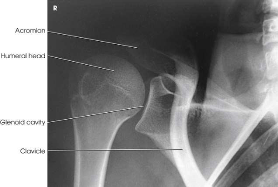
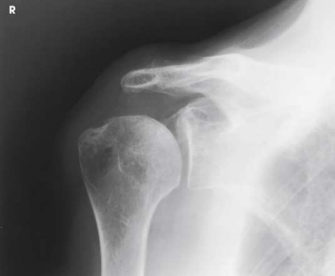

# Rx cavitate glenoidă — oblică anteroposterioară (AP) — metoda Grashey RPO sau oblică posterioară stângă (OPS / LPO) (Merrill)

  📷 Radiografie Convențională (Rx)
  <strong>Actualizat:</strong> 2026-09-16
  <strong>Autor:</strong> Referință Merrill

---

-   __1. Rezumat Clinic & Indicații__

    ---

    === "Indicații Clinice"

        - Conform reperelor anatomice standard din tratat

    === "Ghid Național IRIS"

        !!! info "Referință Primară: Ghidul Național IRIS (Ordinul MS 1342/2012)"
            - **Capitol Ghid IRIS:** *Aparat locomotor & Membru superior*
            - **Grad de Recomandare:** **Grad A**
            - **Nivel de Iradiere Estimată:** `Clasa 1 (Minimă < 0.01 mSv)`

            [:octicons-search-16: Deschide Ghidul IRIS](../../iris.md){ .md-button .md-button--primary } [:material-open-in-new: Aplicația Oficială PWA](https://radiologie-pediatrica.ro/iris/){ .md-button target="_blank" rel="noopener" }

-   __2. Poziționare & Centrare Fascicul__

    ---

    - **Poziție Pacient:** Așezați pacientul în decubit dorsal sau în ortostatism. Ortostatismul este mai confortabil pentru pacient și ajută la ajustarea precisă a regiunii.; centrați receptorul de imagine pe articulația scapulohumerală. Articulația se află la 2 țol (5 cm) medial și 2 țol (5 cm) inferior față de marginea superolaterală a umărului. Rotiți corpul cu 35 până la 45 de grade spre partea afectată (Fig. 6.17). Ajustați gradul de rotație pentru a poziționa omoplatul paralel cu planul receptorului de imagine. Acest lucru se realizează prin orientarea planului care trece prin unghiul superior al omoplatului și vârful acromionului, paralel cu receptorul de imagine (RI). Capul humerusului este în contact cu receptorul de imagine. Dacă pacientul se află în decubit, corpul poate necesita o rotație mai mare de 45 de grade (până la 60 de grade) pentru a poziționa omoplatul paralel cu receptorul de imagine (RI). Sprijiniți umărul și șoldul ridicate pe săculeți cu nisip (Fig. 6.18). Abduceți ușor brațul, în rotație internă, și așezați palma mâinii pe abdomen. Alte poziții ale brațului pot fi stabilite prin protocolul departamentului. Efectuați ecranarea gonadelor cu șorț plumbat.
    - **Punct de Centrare Fascicul:** Perpendicular pe receptorul de imagine (RI); raza centrală trebuie să fie la un punct situat la 2 țol (5 cm) medial și 2 țol (5 cm) inferior față de marginea superolaterală a umărului
    - **Distanță Focar-Film (DFF / SID):** Nespecificat în fragmentul extras; de verificat în sursă
    - **Comandă Respiratorie:** apnee (oprirea respirației).

-   __3. Parametri Tehnici Expunere__

    ---

    | Parametru Tehnic | Valoare Configurare Generator / Tub |
    |:-----------------|:-------------------------------------|
    | **Tensiune Tub (kV)** | DE CONFIGURAT PE APARAT |
    | **Sarcină / Produs Curent-Timp (mAs)** | DE CONFIGURAT PE APARAT |
    | **Distanță Focar-Film (DFF / SID)** | Nespecificat în fragmentul extras; de verificat în sursă |
    | **Grilă Antidifuzoare (Bucky)** | DE CONFIGURAT PE APARAT |
    | **Dimensiune Focar** | DE CONFIGURAT PE APARAT |
    | **Camere de Ionizare AEC** | DE CONFIGURAT PE APARAT |
    | **Colimare Fascicul** | Se ajustează câmpul de iradiere la aproximativ 8 × 10 țoli (18 × 24 cm) pe colimator. Dacă este transversal, se includ 1.5 țoli (3.8 cm) deasupra umărului, 1 țol (2.5 cm) dincolo de aspectul lateral al umărului, jumătatea laterală a claviculei și treimea proximală a humerusului. Dacă este longitudinal, se va include mai mult humerus și mai puțină claviculă. Se plasează markerul de lateralitate în câmpul colimat. |
    | **Filtrare Tub** | DE CONFIGURAT PE APARAT |

-   __4. Criterii de Calitate & Reușită Imagine__

    ---

    - Criterii radiologice de calitate a imaginii:
    - Colimare adecvată vizibilă și prezența markerului de lateralitate (D/S) plasat în afara structurilor anatomice de interes
    - Spații articulare deschise între capul humeral și cavitatea glenoidă
    - Cavitatea glenoidă în profil
    - Detalii trabeculare osoase și țesuturile moi înconjurătoare

-   __5. Protecție Radiologică (ALARA)__

    ---

    - Nespecificat în fragmentul extras; de verificat în sursă

!!! note "Observații Clinice & Tehnice"
    Conform reperelor anatomice standard din tratat

### 🖼️ Imagini

<figure class="protocol-image-card" markdown>

<figcaption><strong>Merrill — pagina 385, imaginea 1</strong> — Imagine din fragmentul sursă; asocierea necesită revizie.</figcaption>

</figure>

<figure class="protocol-image-card" markdown>

<figcaption><strong>Merrill — pagina 386, imaginea 2</strong> — Imagine din fragmentul sursă; asocierea necesită revizie.</figcaption>

</figure>

=== "Ghid Rapid de Execuție"

    1. **Identificarea și verificarea pacientului:** verificare identitate, zonă de examinat, consimțământ conform procedurii și evaluarea posibilității unei sarcini, când este relevantă.
    2. **Pregătire:** îndepărtarea oricăror obiecte radiopace (bijuterii, agrafe, fermoare, proteze, pansamente dense).
    3. **Poziționare precisă:** alinierea receptorului de imagine și a tubului la distanța prescrisă (Nespecificat în fragmentul extras; de verificat în sursă).
    4. **Colimare strictă:** adaptarea fasciculului strict la regiunea de diagnostic pentru scăderea iradierii și reducerea radiației difuze.
    5. **Radioprotecție:** verificarea [politicii RX](../radioprotectie.md), cu măsuri distincte pentru pacient, personal și însoțitor.

## Surse de documentare

- [Merrill’s Atlas, 6. Shoulder Girdle, pagini 384–386](https://books.google.com/books/about/Merrill_s_Atlas_of_Radiographic_Position.html?id=BM0lEQAAQBAJ)
