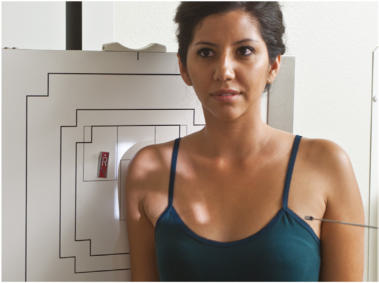
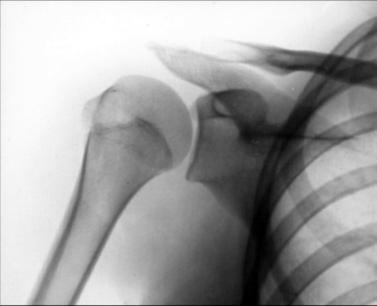
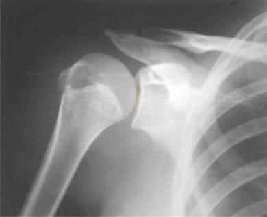
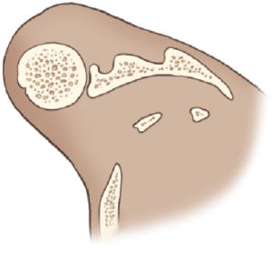

# Rx GLENOID CAVITY AP Oblică (Umăr (NONtraumatism acut) - GRASHEY METHOD)

  📷 Radiografie Convențională (Rx)
  <strong>Actualizat:</strong> 2026-09-15
  <strong>Autor:</strong> Departamentul de Radiologie / Referință Bontrager

---

-   __1. Rezumat Clinic & Indicații__

    ---

    === "Indicații Clinice"

        - suspiciune de fractură or luxație / subluxație articulară of proximal Humerus
        - suspiciune de fractură of glenoid labrum or brim
        - Bankart lesion, erosion of glenoid rim, the integrity of the scapulohumeral joint, and other degenerative conditions

    === "Ghid Național IRIS"

        !!! info "Referință Primară: Ghidul Național IRIS (Ordinul MS 1342/2012)"
            - **Capitol Ghid IRIS:** *Ghidul Național IRIS*
            - **Grad de Recomandare:** **De verificat pe indicație; fără grad atribuit automat**
            - **Nivel de Iradiere Estimată:** `De verificat pentru examinarea și populația selectate`

            [:octicons-search-16: Deschide Ghidul IRIS](../../iris.md){ .md-button .md-button--primary } [:material-open-in-new: Aplicația Oficială PWA](https://radiologie-pediatrica.ro/iris/){ .md-button target="_blank" rel="noopener" }
-   __2. Poziționare & Centrare Fascicul__

    ---

    - **Poziție Pacient:** Pacient: Perform radiograph with patient in an Ortostatism or a Decubit Dorsal position. (The Ortostatism position is usually less painful for patient, if condition allows.); Regiune anatomică: Rotate body 35° to 45° toward affected side (see NOTE) (Fig. 5.58). If the position is performed with the patient in the Decubit position, place supports under elevated Umăr and Șold to maintain this position. Center midscapulohumeral joint to CR and center of IR. Adjust image receptor so that top of IR is approximately 2 inches (5 cm) above Umăr and side of IR is approximately 2 inches (5 cm) from lateral border of Humerus (Fig. 5.59). Abduct arm slightly with arm flexed and in neutral rotation.
    - **Punct de Centrare Fascicul:** Humerus Omoplat (Scapulă) 35°-45° Fig. 5.58 Superior view of the AP oblique. Fig. 5.60 AP Incidență Oblică (Grashey method).
    - **Distanță Focar-Film (DFF / SID):** 100 cm
    - **Comandă Respiratorie:** Suspend respiration during exposure.

-   __3. Parametri Tehnici Expunere__

    ---

    | Parametru Tehnic | Valoare Configurare Generator / Tub |
    |:-----------------|:-------------------------------------|
    | **Tensiune Tub (kV)** | 70-85 kV |
    | **Sarcină / Produs Curent-Timp (mAs)** | DE CONFIGURAT PE APARAT |
    | **Distanță Focar-Film (DFF / SID)** | 100 cm |
    | **Grilă Antidifuzoare (Bucky)** | Cu grilă antidifuzoare Bucky |
    | **Dimensiune Focar** | Focar Mic (0.6 mm) |
    | **Camere de Ionizare AEC** | Camerele laterale (sau camera centrală funcție de regiune) |
    | **Colimare Fascicul** | Field Size Collimate so that upper and lateral borders of the field are to the soft tissue margins. |
    | **Filtrare Tub** | Totală ≥ 2.5 mm Al echivalent |

-   __4. Criterii de Calitate & Reușită Imagine__

    ---

    - Glenoid cavity should be seen in profile without superimposition of humeral head (Figs. 5.60 and 5.61). Position:
    - Scapulohumeral joint space should be open.
    - Anterior and posterior rims of glenoid cavity are superimposed.
    - Collimation field size to area of interest. Exposure:
    - Optimal image receptor exposure and contrast with no motion visualize soft tissue margins and clear, Contururi osoase și travee trabeculare nete, fără artefacte de mișcare.
    - Soft tissue detail of the joint space and axilla should be visualized. Fig. 5.59 AP Incidență Oblică—right posterior oblique (RPO) position. R Acromion Glenoid cavity Head of Humerus Scapulohumeral joint Coracoid process Fig. 5.61 AP Incidență Oblică (Grashey method).

-   __5. Protecție Radiologică (ALARA)__

    ---

    - Ecranare gonadică și a organelor radiosensibile conform procedurilor locale de radioprotecție ALARA.
    - Colimare strictă la aria de interes pentru limitarea radiației difuze.
    - Verificarea posibilității unei sarcini la pacientele de vârstă fertilă înainte de expunere.

!!! note "Observații Clinice & Tehnice"
    Degree of rotation varies, depending on how flat or round the patient’s shoulders are or if position is performed Decubit rather than Ortostatism. Having a rounded or curved Umăr or using the Decubit position requires more rotation to place the body of the Omoplat (Scapulă) parallel to the IR. Umăr (Nontraumatism acut) SPECIAL AP Incidență Oblică (Grashey method) Apical Incidență AP Axială 2 inches

### 🖼️ Imagini

<figure class="protocol-image-card" markdown>

<figcaption><strong>Fig. 5.58 Superior view of the AP oblique.</strong> — Poziționare pacient conform Ghidului Bontrager (Fig. 5.58 Superior view of the AP oblique.)</figcaption>

</figure>

<figure class="protocol-image-card" markdown>

<figcaption><strong>Fig. 5.60 AP Incidență Oblică (Grashey method).</strong> — Aspect radiografic de referință conform Ghidului Bontrager (Fig. 5.60 AP oblique projection (Grashey method).)</figcaption>

</figure>

<figure class="protocol-image-card" markdown>

<figcaption><strong>Fig. 5.59 AP Incidență Oblică—right posterior oblique (RPO)</strong> — Aspect radiografic de referință conform Ghidului Bontrager (Fig. 5.59 AP oblique projection—right posterior oblique (RPO))</figcaption>

</figure>

<figure class="protocol-image-card" markdown>

<figcaption><strong>Fig. 5.61 AP Incidență Oblică (Grashey method).</strong> — Aspect radiografic de referință conform Ghidului Bontrager (Fig. 5.61 AP oblique projection (Grashey method).)</figcaption>

</figure>

=== "Ghid Rapid de Execuție"

    1. **Identificarea și verificarea pacientului:** verificare identitate, zonă de examinat, consimțământ conform procedurii și evaluarea posibilității unei sarcini, când este relevantă.
    2. **Pregătire:** îndepărtarea oricăror obiecte radiopace (bijuterii, agrafe, fermoare, proteze, pansamente dense).
    3. **Poziționare precisă:** alinierea receptorului de imagine și a tubului la distanța prescrisă (100 cm).
    4. **Colimare strictă:** adaptarea fasciculului strict la regiunea de diagnostic pentru scăderea iradierii și reducerea radiației difuze.
    5. **Radioprotecție:** verificarea [politicii RX](../radioprotectie.md), cu măsuri distincte pentru pacient, personal și însoțitor.

## Surse de documentare

- [Bontrager's Textbook of Radiographic Positioning (Ed. 9/10), Pagina 209](https://www.elsevier.com/books/textbook-of-radiographic-positioning-and-related-anatomy/lampignano/978-0-323-65367-1)
