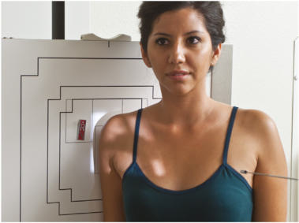
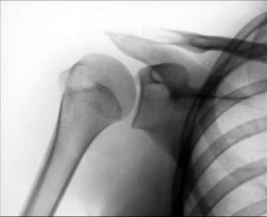
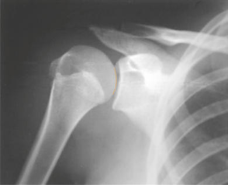
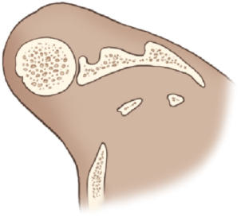

# Rx cavitate glenoidă — incidență AP oblică (umăr (nontraumatism acut) — metoda Grashey)

  📷 Radiografie Convențională (Rx)
  <strong>Actualizat:</strong> 2026-09-15
  <strong>Autor:</strong> Departamentul de Radiologie / Referință Bontrager

---

-   __1. Rezumat Clinic & Indicații__

    ---

    === "Indicații Clinice"

        - Suspiciune de fractură sau luxație / subluxație articulară a humerusului proximal
        - Suspiciune de fractură a labrumului glenoid sau a marginii glenoide
        - Leziune Bankart, eroziunea marginii glenoide, integritatea articulației scapulohumerale și alte afecțiuni degenerative

    === "Ghid Național IRIS"

        !!! info "Referință Primară: Ghidul Național IRIS (Ordinul MS 1342/2012)"
            - **Capitol Ghid IRIS:** *Aparat locomotor & Membru superior*
            - **Grad de Recomandare:** **Grad A**
            - **Nivel de Iradiere Estimată:** `Clasa 1 (Minimă < 0.05 mSv)`

            [:octicons-search-16: Deschide Ghidul IRIS](../../iris.md){ .md-button .md-button--primary } [:material-open-in-new: Aplicația Oficială PWA](https://radiologie-pediatrica.ro/iris/){ .md-button target="_blank" rel="noopener" }

-   __2. Poziționare & Centrare Fascicul__

    ---

    - **Poziție Pacient:** Pacient: Se efectuează radiografia cu pacientul în ortostatism sau în decubit dorsal. (Poziția în ortostatism este de obicei mai puțin dureroasă pentru pacient, dacă starea permite.); Regiune anatomică: Se rotește corpul cu 35° la 45° spre partea afectată (vezi NOTA) (Fig. 5.58). Dacă poziționarea se efectuează cu pacientul în decubit, se plasează suporturi sub umărul și șoldul ridicate pentru a menține această poziție. Se centrează articulația midscapulohumerală la raza centrală și la centrul receptorului de imagine. Se ajustează receptorul de imagine astfel încât partea superioară a receptorului de imagine să fie la aproximativ 2 țoli (5 cm) deasupra umărului, iar partea laterală a receptorului de imagine să fie la aproximativ 2 țoli (5 cm) față de marginea laterală a humerusului (Fig. 5.59). Se abduce ușor brațul, cu cotul flectat și în rotație neutră.
    - **Punct de Centrare Fascicul:** Humerus Omoplat (Scapulă) 35°-45° Fig. 5.58 incidență AP oblică superioară. Fig. 5.60 Incidență AP oblică (metoda Grashey).
    - **Distanță Focar-Film (DFF / SID):** 100 cm
    - **Comandă Respiratorie:** Apnee pe durata expunerii.

-   __3. Parametri Tehnici Expunere__

    ---

    | Parametru Tehnic | Valoare Configurare Generator / Tub |
    |:-----------------|:-------------------------------------|
    | **Tensiune Tub (kV)** | 70-85 kV |
    | **Sarcină / Produs Curent-Timp (mAs)** | DE CONFIGURAT PE APARAT |
    | **Distanță Focar-Film (DFF / SID)** | 100 cm |
    | **Grilă Antidifuzoare (Bucky)** | Cu grilă antidifuzoare Bucky |
    | **Dimensiune Focar** | Focar Mic (0.6 mm) |
    | **Camere de Ionizare AEC** | Camerele laterale (sau camera centrală, în funcție de regiune) |
    | **Colimare Fascicul** | Dimensiunea câmpului: Se colimează astfel încât marginile superioară și laterală ale câmpului să fie la nivelul marginilor țesuturilor moi. |
    | **Filtrare Tub** | Totală ≥ 2.5 mm Al echivalent |

-   __4. Criterii de Calitate & Reușită Imagine__

    ---

    - Cavitatea glenoidă trebuie să fie vizibilă în profil, fără suprapunerea capului humeral (Figs. 5.60 și 5.61). Poziție:
    - Spațiile articulare scapulohumerale trebuie să fie deschise.
    - Marginile anterioară și posterioară ale cavității glenoide sunt suprapuse.
    - Dimensiunea câmpului de colimare până la aria de interes diagnostic. Expunere:
    - Expunere și contrast optime ale receptorului de imagine, fără mișcare; vizualizare a marginilor țesuturilor moi și a contururilor osoase clare, precum și a traveelor trabeculare nete, fără artefacte de mișcare.
    - Detaliile țesuturilor moi ale spațiilor articulare și axilei trebuie să fie vizualizate. Fig. 5.59 Incidență AP oblică — poziție oblică posterioară dreaptă (RPO). R acromion cavitate glenoidă capul humerusului articulație scapulohumerală proces coracoid Fig. 5.61 Incidență AP oblică (metoda Grashey).

-   __5. Protecție Radiologică (ALARA)__

    ---

    - Ecranare gonadică și a organelor radiosensibile conform procedurilor locale de radioprotecție ALARA.
    - Colimare strictă la aria de interes pentru limitarea radiației difuze.
    - Verificarea posibilității unei sarcini la pacientele de vârstă fertilă înainte de expunere.

!!! note "Observații Clinice & Tehnice"
    Gradul de rotație variază în funcție de cât de plați sau rotunjiți sunt umerii pacientului sau dacă poziționarea se efectuează în decubit în loc de ortostatism. Umerii rotunjiți sau curbați ori utilizarea poziției în decubit necesită o rotație mai mare pentru a plasa corpul omoplatului (scapulei) paralel cu receptorul de imagine (RI). Umăr (nontraumatism acut) incidență AP oblică specială Incidență AP axială apicală 2 țoli

### 🖼️ Imagini

<figure class="protocol-image-card" markdown>

<figcaption><strong>Fig. 5.58 incidență AP oblică superioară.</strong> — Poziționarea pacientului conform Ghidului Bontrager (Fig. 5.58 incidență AP oblică superioară.)</figcaption>

</figure>

<figure class="protocol-image-card" markdown>

<figcaption><strong>Fig. 5.60 Incidență AP oblică (metoda Grashey).</strong> — Aspect radiografic de referință conform Ghidului Bontrager (Fig. 5.60 incidență AP oblică (metoda Grashey).)</figcaption>

</figure>

<figure class="protocol-image-card" markdown>

<figcaption><strong>Fig. 5.59 Incidență AP oblică — oblică posterioară dreaptă (RPO)</strong> — Aspect radiografic de referință conform Ghidului Bontrager (Fig. 5.59 incidență AP oblică — oblică posterioară dreaptă (RPO))</figcaption>

</figure>

<figure class="protocol-image-card" markdown>

<figcaption><strong>Fig. 5.61 Incidență AP oblică (metoda Grashey).</strong> — Aspect radiografic de referință conform Ghidului Bontrager (Fig. 5.61 incidență AP oblică (metoda Grashey).)</figcaption>

</figure>

=== "Ghid Rapid de Execuție"

    1. **Identificarea și verificarea pacientului:** verificare identitate, zonă de examinat, consimțământ conform procedurii și evaluarea posibilității unei sarcini, când este relevantă.
    2. **Pregătire:** îndepărtarea oricăror obiecte radiopace (bijuterii, agrafe, fermoare, proteze, pansamente dense).
    3. **Poziționare precisă:** alinierea receptorului de imagine și a tubului la distanța prescrisă (100 cm).
    4. **Colimare strictă:** adaptarea fasciculului strict la regiunea de diagnostic pentru scăderea iradierii și reducerea radiației difuze.
    5. **Radioprotecție:** verificarea [politicii RX](../radioprotectie.md), cu măsuri distincte pentru pacient, personal și însoțitor.

## Surse de documentare

- [Bontrager's Textbook of Radiographic Positioning (Ed. 9/10), Pagina 209](https://www.elsevier.com/books/textbook-of-radiographic-positioning-and-related-anatomy/lampignano/978-0-323-65367-1)
