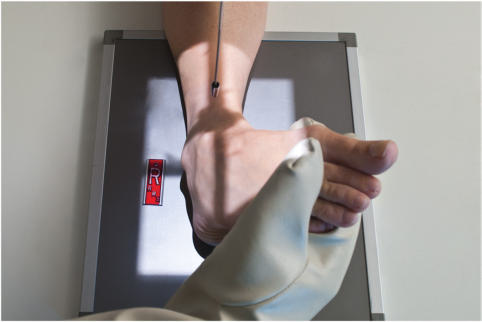
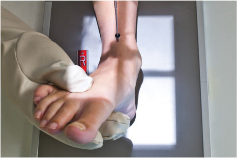
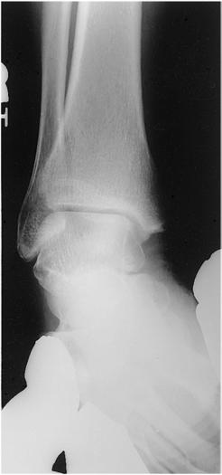
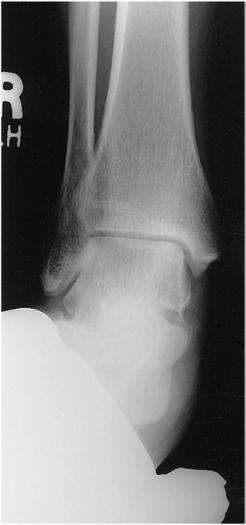

# Rx Gleznă (Articulație Talocrurală) AP STRESS PROJECTIONS (INVERSION AND EVERSION POSITIONS)

  📷 Radiografie Convențională (Rx)
  <strong>Actualizat:</strong> 2026-09-15
  <strong>Autor:</strong> Departamentul de Radiologie / Referință Bontrager

---

-   __1. Rezumat Clinic & Indicații__

    ---

    === "Indicații Clinice"

        - Pathology involving Gleznă (Articulație Talocrurală) joint separation secondary to ligament tear or rupture

    === "Ghid Național IRIS"

        !!! info "Referință Primară: Ghidul Național IRIS (Ordinul MS 1342/2012)"
            - **Capitol Ghid IRIS:** *Ghidul Național IRIS*
            - **Grad de Recomandare:** **De verificat pe indicație; fără grad atribuit automat**
            - **Nivel de Iradiere Estimată:** `De verificat pentru examinarea și populația selectate`

            [:octicons-search-16: Deschide Ghidul IRIS](../../iris.md){ .md-button .md-button--primary } [:material-open-in-new: Aplicația Oficială PWA](https://radiologie-pediatrica.ro/iris/){ .md-button target="_blank" rel="noopener" }
-   __2. Poziționare & Centrare Fascicul__

    ---

    - **Poziție Pacient:** Pacient: Place patient in Decubit Dorsal position; place pillow under patient’s head; leg should be fully extended, with support under Genunchi.; Regiune anatomică: Center and align Gleznă (Articulație Talocrurală) joint to CR and to long axis of portion of IR being exposed. Dorsiflex the Picior as near the right angle to the Gambă as possible. Stress is applied with leg and Gleznă (Articulație Talocrurală) in position for a true AP with Absența rotației anatomice: clavicule echidistante față de linia apofizelor spinoase, wherein the entire plantar surface is turned medially for inversion and laterally for eversion (Figs. 6.94 and 6.95) (see NOTE).
    - **Punct de Centrare Fascicul:** perpendicular to IR, directed to a point midway between malleoli
    - **Distanță Focar-Film (DFF / SID):** 100 cm
    - **Comandă Respiratorie:** Apnee pe durata expunerii (sau conform cooperării pacientului)

-   __3. Parametri Tehnici Expunere__

    ---

    | Parametru Tehnic | Valoare Configurare Generator / Tub |
    |:-----------------|:-------------------------------------|
    | **Tensiune Tub (kV)** | 60-75 kV |
    | **Sarcină / Produs Curent-Timp (mAs)** | DE CONFIGURAT PE APARAT |
    | **Distanță Focar-Film (DFF / SID)** | 100 cm |
    | **Grilă Antidifuzoare (Bucky)** | Fără grilă (expunere directă) |
    | **Dimensiune Focar** | Focar Mic (0.6 mm) |
    | **Camere de Ionizare AEC** | DE CONFIGURAT PE APARAT |
    | **Colimare Fascicul** | Collimate to lateral skin margins, including proximal metatarsals and distal tibiafibula. |
    | **Filtrare Tub** | Totală ≥ 2.5 mm Al echivalent |

-   __4. Criterii de Calitate & Reușită Imagine__

    ---

    - and Position:
    - Gleznă (Articulație Talocrurală) joint for evaluation of joint separation and ligament tear or rupture is shown.
    - Appearance of joint space may vary greatly depending on the severity of ligament damage.
    - Collimation to area of interest (Figs. 6.96 and 6.97). Exposure:
    - Optimal image receptor exposure and contrast with no motion, as evidenced by sharp bony margins and trabecular patterns.
    - Optimal exposure should visualize soft tissue, lateral and medial malleoli, talus, and distal tibia and fibula. Fig. 6.96 Inversion stress. Fig. 6.97 Eversion stress.

-   __5. Protecție Radiologică (ALARA)__

    ---

    - Ecranare gonadică și a organelor radiosensibile conform procedurilor locale de radioprotecție ALARA.
    - Colimare strictă la aria de interes pentru limitarea radiației difuze.
    - Verificarea posibilității unei sarcini la pacientele de vârstă fertilă înainte de expunere.

!!! note "Observații Clinice & Tehnice"
    A physician or another health professional must be present to hold the Picior and Gleznă (Articulație Talocrurală) in these stress views (or to strap into position with weights), or patient must hold this position with long gauze looped around ball of Picior. If this is too painful for the patient, a local anesthetic may be injected by the physician. Inversion Eversion Gleznă (Articulație Talocrurală) SPECIAL Oblique (45°) AP stress Fig. 6.94 AP Gleznă (Articulație Talocrurală)—inversion stress. Fig. 6.95 AP Gleznă (Articulație Talocrurală)—eversion stress.

### 🖼️ Imagini

<figure class="protocol-image-card" markdown>

<figcaption><strong>Fig. 6.94 AP Gleznă (Articulație Talocrurală)—inversion stress.</strong> — Poziționare pacient conform Ghidului Bontrager (Fig. 6.94 AP ankle—inversion stress.)</figcaption>

</figure>

<figure class="protocol-image-card" markdown>

<figcaption><strong>Fig. 6.95 AP Gleznă (Articulație Talocrurală)—eversion stress.</strong> — Aspect radiografic de referință conform Ghidului Bontrager (Fig. 6.95 AP ankle—eversion stress.)</figcaption>

</figure>

<figure class="protocol-image-card" markdown>

<figcaption><strong>Fig. 6.96 Inversion stress.</strong> — Aspect radiografic de referință conform Ghidului Bontrager (Fig. 6.96 Inversion stress.)</figcaption>

</figure>

<figure class="protocol-image-card" markdown>

<figcaption><strong>Fig. 6.97 Eversion stress.</strong> — Aspect radiografic de referință conform Ghidului Bontrager (Fig. 6.97 Eversion stress.)</figcaption>

</figure>

=== "Ghid Rapid de Execuție"

    1. **Identificarea și verificarea pacientului:** verificare identitate, zonă de examinat, consimțământ conform procedurii și evaluarea posibilității unei sarcini, când este relevantă.
    2. **Pregătire:** îndepărtarea oricăror obiecte radiopace (bijuterii, agrafe, fermoare, proteze, pansamente dense).
    3. **Poziționare precisă:** alinierea receptorului de imagine și a tubului la distanța prescrisă (100 cm).
    4. **Colimare strictă:** adaptarea fasciculului strict la regiunea de diagnostic pentru scăderea iradierii și reducerea radiației difuze.
    5. **Radioprotecție:** verificarea [politicii RX](../radioprotectie.md), cu măsuri distincte pentru pacient, personal și însoțitor.

## Surse de documentare

- [Bontrager's Textbook of Radiographic Positioning (Ed. 9/10), Pagina 258](https://www.elsevier.com/books/textbook-of-radiographic-positioning-and-related-anatomy/lampignano/978-0-323-65367-1)
