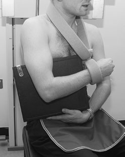
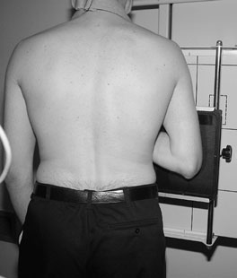
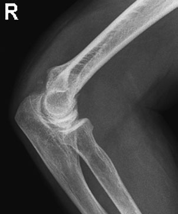
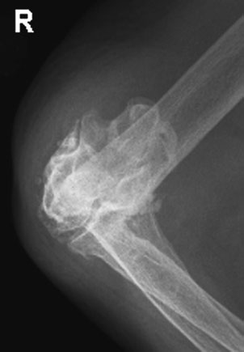
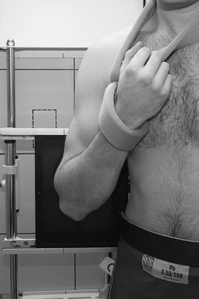
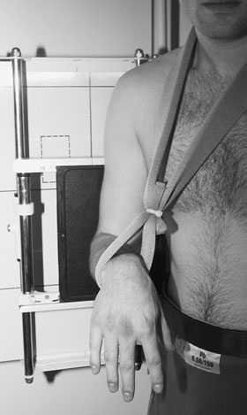
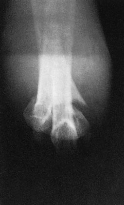
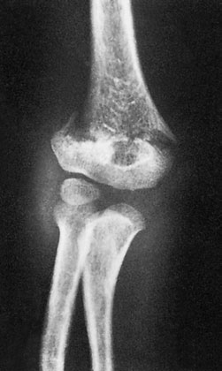

# Rx Humerus Distal (Regiune Supracondiliană) suspiciune de fractură

  📷 Radiografie Convențională (Rx)
  <strong>Actualizat:</strong> 2026-09-16
  <strong>Autor:</strong> Departamentul de Radiologie / Referință Clark (Ed. 12)

---

-   __1. Rezumat Clinic & Indicații__

    ---

    === "Indicații Clinice"

        - Signs de supracondylar suspiciune de fractură poate fie very subtle. Demonstration de poziție de condyles în relation la anterior cortical line de humeral shaft poate fie crucial și demands true Profil (lateral) imagine. 70 Antero-posterior (AP) radiografie în full flexion evidențiind supracondylar suspiciune de fractură Antero-posterior (AP) radiografie în partial flexion evidențiind supracondylar suspiciune de fractură

    === "Ghid Național IRIS"

        !!! info "Referință Primară: Ghidul Național IRIS (Ordinul MS 1342/2012)"
            - **Capitol Ghid IRIS:** *Ghidul Național IRIS*
            - **Grad de Recomandare:** **De verificat pe indicație; fără grad atribuit automat**
            - **Nivel de Iradiere Estimată:** `De verificat pentru examinarea și populația selectate`

            [:octicons-search-16: Deschide Ghidul IRIS](../../iris.md){ .md-button .md-button--primary } [:material-open-in-new: Aplicația Oficială PWA](https://radiologie-pediatrica.ro/iris/){ .md-button target="_blank" rel="noopener" }
-   __2. Poziționare & Centrare Fascicul__

    ---

    - **Poziție Pacient:** Method 1
• pacientul stă așezat sau stands facing X-ray tube.
• casetă este sprijinit între pacient’s trunk și Cot, cu medial aspect de Cot în contact cu caseta.
• lead-rubber sheet sau other radiation protection device este poziționat la protect pacientul’s trunk de la primary fascicul.
Method 2
• casetă este sprijinit vertically în casetă holder.
• pacientul stă în ortostatism sideways, cu Cot flectat și Profil (lateral) aspect de injured Cot în contact cu caseta.
braț este gently extins backwards de la Umăr. pacientul este rotit forwards until Cot este clear de rib cage but still în contact cu caseta, cu line joining epicondyles de Humerus la drept-angles la caseta.

• de la Profil (lateral) poziție, pacientul’s upper corp este rotit spre partea afectată.
• caseta este plasat în Ortostatism casetă holder, și pacientul’s poziție este ajustat astfel încât posterior aspect de upper braț este în contact cu caseta.
    - **Punct de Centrare Fascicul:** Method 1
• X-ray tube este înclinat astfel încât raza centrală este orientat perpendicular pe shaft de Humerus și centred la Profil (lateral) epicondyle.
Method 2
• raza centrală orizontală centrală este orientat la epicondil medial (epitrohlee) și fascicul collimated la Cot.

• If Cot articulație este fully flectat, raza centrală este orientat la drept-angles la Humerus la pass through Antebraț (Radius și Ulna) la point midway între epicondyles de Humerus.
• If Cot articulație este only partially flectat, raza centrală este orientat la drept-angles la Humerus la point midway între epicondyles de Humerus fără first passing through Antebraț (Radius și Ulna).
    - **Distanță Focar-Film (DFF / SID):** 100 cm
    - **Comandă Respiratorie:** Apnee pe durata expunerii (apnee în inspir pentru torace; expir pentru Abdomen/bazin).

-   __3. Parametri Tehnici Expunere__

    ---

    | Parametru Tehnic | Valoare Configurare Generator / Tub |
    |:-----------------|:-------------------------------------|
    | **Tensiune Tub (kV)** | DE CONFIGURAT PE APARAT |
    | **Sarcină / Produs Curent-Timp (mAs)** | Conform AEC / grosime anatomică |
    | **Distanță Focar-Film (DFF / SID)** | 100 cm |
    | **Grilă Antidifuzoare (Bucky)** | Conform grosimii anatomice (> 10-12 cm cu grilă) |
    | **Dimensiune Focar** | Focar Mic (0.6 mm) |
    | **Camere de Ionizare AEC** | DE CONFIGURAT PE APARAT |
    | **Colimare Fascicul** | Colimare strictă adaptată pe receptor 24 x 30 cm |
    | **Filtrare Tub** | Totală ≥ 2.5 mm Al echivalent (conform Clark: 3.0 mm Al eq.) |

-   __4. Criterii de Calitate & Reușită Imagine__

    ---

    - imagine trebuie să include lower end de Humerus și upper third de radius și ulna.
    - If Cot articulație este fully flectat, sufficient expunere trebuie să fie selected la provide adecvat penetration de Antebraț (Radius și Ulna).

-   __5. Protecție Radiologică (ALARA)__

    ---

    - Ecranare gonadică cu șorț plumbat dacă gonadele sunt în apropierea fasciculului util (regula ALARA).
    - Colimare precisă la dimensiunea anatomică strict necesară pentru reducerea dozei și a radiației difuze.
    - Verificarea posibilității unei sarcini la pacientele de vârstă fertilă înainte de expunere.

!!! note "Observații Clinice & Tehnice"
    • pacientul trebuie să fie made ca comfortable ca possible la assist imobilizare.
• Ortostatism casetă holder, sau similar device, poate fie used la assist pacientul în supporting caseta.
• X-ray fascicul trebuie să fie collimated carefully la ensure that primary fascicul does nu extend beyond area de caseta.
Profil (lateral) radiografie de Cot evidențiind undisplaced supracondylar suspiciune de fractură Profil (lateral) radiografie de Cot evidențiind supracondylar suspiciune de fractură cu displacement și bone disruption type de injury commonly found în children este suspiciune de fractură de lower end de Humerus just proximal la condyles. injury este very painful și even small movements de limb poate

• It este essential that fără movement de Cot articulație occurs during positioning de pacientul.
• Particular attention trebuie să fie paid la radiation protection measures.

### 🖼️ Imagini

<figure class="protocol-image-card" markdown>

<figcaption><strong>Profil (lateral) radiografie de Cot evidențiind undisplaced supracondylar suspiciune de fractură</strong> — Poziționare pacient și centrare fascicul conform Clark (Ed. 12)</figcaption>

</figure>

<figure class="protocol-image-card" markdown>

<figcaption><strong>Profil (lateral) radiografie de Cot evidențiind supracondylar suspiciune de fractură cu</strong> — Aspect radiografic / ghid de poziționare conform tratatului Clark (Ed. 12)</figcaption>

</figure>

<figure class="protocol-image-card" markdown>

<figcaption><strong>type de injury commonly found în children este suspiciune de fractură de the</strong> — Aspect radiografic / ghid de poziționare conform tratatului Clark (Ed. 12)</figcaption>

</figure>

<figure class="protocol-image-card" markdown>

<figcaption><strong>Figura 4: Aspect radiografic / Poziționare (Clark Ed. 12)</strong> — Aspect radiografic / ghid de poziționare conform tratatului Clark (Ed. 12)</figcaption>

</figure>

<figure class="protocol-image-card" markdown>

<figcaption><strong>• Signs de supracondylar suspiciune de fractură poate fie very subtle. Demon-</strong> — Aspect radiografic / ghid de poziționare conform tratatului Clark (Ed. 12)</figcaption>

</figure>

<figure class="protocol-image-card" markdown>

<figcaption><strong>Antero-posterior (AP) radiografie în</strong> — Aspect radiografic / ghid de poziționare conform tratatului Clark (Ed. 12)</figcaption>

</figure>

<figure class="protocol-image-card" markdown>

<figcaption><strong>full flexion evidențiind supracondylar</strong> — Aspect radiografic / ghid de poziționare conform tratatului Clark (Ed. 12)</figcaption>

</figure>

<figure class="protocol-image-card" markdown>

<figcaption><strong>Antero-posterior (AP) radiografie în</strong> — Aspect radiografic / ghid de poziționare conform tratatului Clark (Ed. 12)</figcaption>

</figure>

=== "Ghid Rapid de Execuție"

    1. **Identificarea și verificarea pacientului:** verificare identitate, zonă de examinat, consimțământ conform procedurii și evaluarea posibilității unei sarcini, când este relevantă.
    2. **Pregătire:** îndepărtarea oricăror obiecte radiopace (bijuterii, agrafe, fermoare, proteze, pansamente dense).
    3. **Poziționare precisă:** alinierea receptorului de imagine și a tubului la distanța prescrisă (100 cm).
    4. **Colimare strictă:** adaptarea fasciculului strict la regiunea de diagnostic pentru scăderea iradierii și reducerea radiației difuze.
    5. **Radioprotecție:** verificarea [politicii RX](../radioprotectie.md), cu măsuri distincte pentru pacient, personal și însoțitor.

## Surse de documentare

- [Clark's Positioning in Radiography (Ed. 12), Pagina 84](../../assets/protocols/sources/Clark___Positioning_in_Radiography__12th_edition.pdf#page=84)
