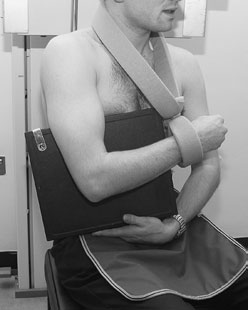
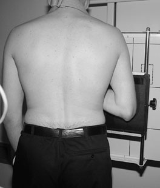
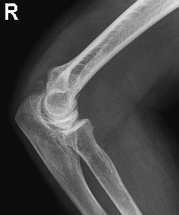
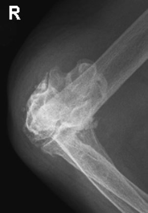
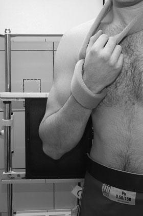
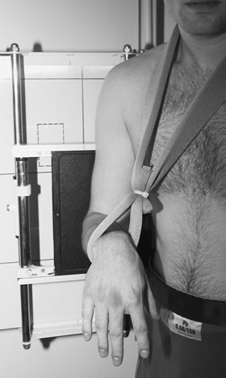
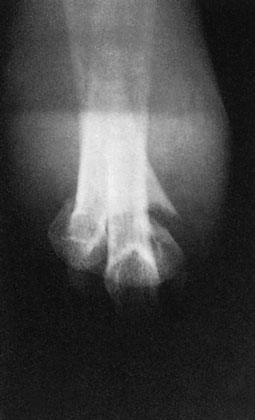
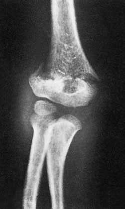

# Rx humerus distal (regiunea supracondiliană) — suspiciune de fractură

  📷 Radiografie Convențională (Rx)
  <strong>Actualizat:</strong> 2026-09-16
  <strong>Autor:</strong> Departamentul de Radiologie / Referință Clark (Ed. 12)

---

-   __1. Rezumat Clinic & Indicații__

    ---

    === "Indicații Clinice"

        - Semnele unei suspiciuni de fractură supracondiliană pot fi foarte subtile. Demonstrarea poziției condililor în raport cu linia corticală anterioară a diafizei humerale poate fi esențială și necesită o imagine de profil adevărată. 70 Radiografie anteroposterioară (AP) în flexie completă, evidențiind o suspiciune de fractură supracondiliană. Radiografie anteroposterioară (AP) în flexie parțială, evidențiind o suspiciune de fractură supracondiliană.

    === "Ghid Național IRIS"

        !!! info "Referință Primară: Ghidul Național IRIS (Ordinul MS 1342/2012)"
            - **Capitol Ghid IRIS:** *Aparat locomotor & Membru superior*
            - **Grad de Recomandare:** **Grad A**
            - **Nivel de Iradiere Estimată:** `Clasa 1 (Minimă < 0.02 mSv)`

            [:octicons-search-16: Deschide Ghidul IRIS](../../iris.md){ .md-button .md-button--primary } [:material-open-in-new: Aplicația Oficială PWA](https://radiologie-pediatrica.ro/iris/){ .md-button target="_blank" rel="noopener" }

-   __2. Poziționare & Centrare Fascicul__

    ---

    - **Poziție Pacient:**
        Metoda 1

        - Pacientul stă așezat sau în ortostatism, cu fața spre tubul radiogen.
        - Caseta este susținută între trunchiul pacientului și cot, cu aspectul medial al cotului în contact cu caseta.
        - O folie de cauciuc plumbat sau un alt dispozitiv de radioprotecție este poziționat pentru a proteja trunchiul pacientului de fasciculul primar. Metoda 2
        - Caseta este susținută vertical într-un suport de casetă.
        - Pacientul stă în ortostatism, lateral, cu cotul flectat și aspectul de profil al cotului lezat în contact cu caseta. Brațul este extins ușor posterior de la umăr. Pacientul este rotit anterior până când cotul este îndepărtat de cutia toracică, dar rămâne în contact cu caseta, cu linia care unește epicondilii humerusului în unghi drept față de casetă.
        - Din poziția de profil, partea superioară a corpului pacientului este rotită spre partea afectată.
        - Caseta este plasată în suportul de casetă pentru ortostatism, iar poziția pacientului este ajustată astfel încât aspectul posterior al brațului să fie în contact cu caseta.
    - **Punct de Centrare Fascicul:**
        Metoda 1

        - Tubul radiogen este înclinat astfel încât raza centrală să fie orientată perpendicular pe diafiza humerusului și centrată la epicondilul de profil (lateral). Metoda 2
        - Raza centrală orizontală este orientată la epicondilul medial (epitrohlee), iar fasciculul este colimat la cot.
        - Dacă articulația cotului este complet flectată, raza centrală este orientată în unghi drept față de humerus, pentru a trece prin antebraț (radius și ulna) în punctul situat la jumătatea distanței dintre epicondilii humerusului.
        - Dacă articulația cotului este doar parțial flectată, raza centrală este orientată în unghi drept față de humerus, în punctul situat la jumătatea distanței dintre epicondilii humerusului, fără a trece mai întâi prin antebraț (radius și ulna).
    - **Distanță Focar-Film (DFF / SID):** 100 cm
    - **Comandă Respiratorie:** Apnee pe durata expunerii (apnee în inspir pentru torace; expir pentru Abdomen/bazin).

-   __3. Parametri Tehnici Expunere__

    ---

    | Parametru Tehnic | Valoare Configurare Generator / Tub |
    |:-----------------|:-------------------------------------|
    | **Tensiune Tub (kV)** | DE CONFIGURAT PE APARAT |
    | **Sarcină / Produs Curent-Timp (mAs)** | Conform AEC / grosimii anatomice |
    | **Distanță Focar-Film (DFF / SID)** | 100 cm |
    | **Grilă Antidifuzoare (Bucky)** | Conform grosimii anatomice (> 10-12 cm cu grilă) |
    | **Dimensiune Focar** | Focar Mic (0.6 mm) |
    | **Camere de Ionizare AEC** | DE CONFIGURAT PE APARAT |
    | **Colimare Fascicul** | Colimare strictă adaptată pe receptor 24 x 30 cm |
    | **Filtrare Tub** | Totală ≥ 2.5 mm Al echivalent (conform Clark: 3.0 mm Al echivalent) |

-   __4. Criterii de Calitate & Reușită Imagine__

    ---

    - Imaginea trebuie să includă extremitatea inferioară a humerusului și treimea superioară a radiusului și ulnei.
    - Dacă articulația cotului este complet flectată, trebuie selectată o expunere suficientă pentru a asigura penetrarea adecvată a antebrațului (radius și ulna).

-   __5. Protecție Radiologică (ALARA)__

    ---

    - Ecranare gonadică cu șorț plumbat dacă gonadele sunt în apropierea fasciculului util (regula ALARA).
    - Colimare precisă la dimensiunea anatomică strict necesară pentru reducerea dozei și a radiației difuze.
    - Verificarea posibilității unei sarcini la pacientele de vârstă fertilă înainte de expunere.

!!! note "Observații Clinice & Tehnice"
    - Pacientul trebuie așezat cât mai confortabil posibil pentru a facilita imobilizarea.
    - Un suport de casetă pentru ortostatism sau un dispozitiv similar poate fi utilizat pentru a ajuta pacientul să susțină caseta.
    - Fasciculul radiogen trebuie colimat cu atenție pentru a se asigura că fasciculul primar nu depășește zona casetei. Radiografie de profil a cotului, evidențiind o suspiciune de fractură supracondiliană fără deplasare. Radiografie de profil a cotului, evidențiind o suspiciune de fractură supracondiliană cu deplasare și întreruperea osului. Tipul de leziune întâlnit frecvent la copii este suspiciunea de fractură a extremității inferioare a humerusului, imediat proximal de condili. Leziunea este foarte dureroasă și chiar și mișcările mici ale membrului pot
    - Este esențial să nu apară nicio mișcare a articulației cotului în timpul poziționării pacientului.
    - Trebuie acordată o atenție deosebită măsurilor de radioprotecție.

### 🖼️ Imagini

<figure class="protocol-image-card" markdown>

<figcaption><strong>Radiografie de profil a cotului, evidențiind o suspiciune de fractură supracondiliană fără deplasare</strong> — Poziționarea pacientului și centrarea fasciculului conform Clark (Ed. 12)</figcaption>

</figure>

<figure class="protocol-image-card" markdown>

<figcaption><strong>Radiografie de profil a cotului, evidențiind o suspiciune de fractură supracondiliană cu</strong> — Aspect radiografic / ghid de poziționare conform tratatului Clark (Ed. 12)</figcaption>

</figure>

<figure class="protocol-image-card" markdown>

<figcaption><strong>Tipul de leziune întâlnit frecvent la copii este suspiciunea de fractură a</strong> — Aspect radiografic / ghid de poziționare conform tratatului Clark (Ed. 12)</figcaption>

</figure>

<figure class="protocol-image-card" markdown>

<figcaption><strong>Figura 4: Aspect radiografic / Poziționare (Clark Ed. 12)</strong> — Aspect radiografic / ghid de poziționare conform tratatului Clark (Ed. 12)</figcaption>

</figure>

<figure class="protocol-image-card" markdown>

<figcaption><strong>• Semnele unei suspiciuni de fractură supracondiliană pot fi foarte subtile. Demon-</strong> — Aspect radiografic / ghid de poziționare conform tratatului Clark (Ed. 12)</figcaption>

</figure>

<figure class="protocol-image-card" markdown>

<figcaption><strong>Radiografie anteroposterioară (AP) în</strong> — Aspect radiografic / ghid de poziționare conform tratatului Clark (Ed. 12)</figcaption>

</figure>

<figure class="protocol-image-card" markdown>

<figcaption><strong>flexie completă, evidențiind o fractură supracondiliană</strong> — Aspect radiografic / ghid de poziționare conform tratatului Clark (Ed. 12)</figcaption>

</figure>

<figure class="protocol-image-card" markdown>

<figcaption><strong>Radiografie anteroposterioară (AP) în</strong> — Aspect radiografic / ghid de poziționare conform tratatului Clark (Ed. 12)</figcaption>

</figure>

=== "Ghid Rapid de Execuție"

    1. **Identificarea și verificarea pacientului:** verificare identitate, zonă de examinat, consimțământ conform procedurii și evaluarea posibilității unei sarcini, când este relevantă.
    2. **Pregătire:** îndepărtarea oricăror obiecte radiopace (bijuterii, agrafe, fermoare, proteze, pansamente dense).
    3. **Poziționare precisă:** alinierea receptorului de imagine și a tubului la distanța prescrisă (100 cm).
    4. **Colimare strictă:** adaptarea fasciculului strict la regiunea de diagnostic pentru scăderea iradierii și reducerea radiației difuze.
    5. **Radioprotecție:** verificarea [politicii RX](../radioprotectie.md), cu măsuri distincte pentru pacient, personal și însoțitor.

## Surse de documentare

- [Clark's Positioning in Radiography (Ed. 12), Pagina 84](https://books.google.com/books/about/Clark_s_Positioning_in_Radiography.html?id=Xxu6MwEACAAJ)
