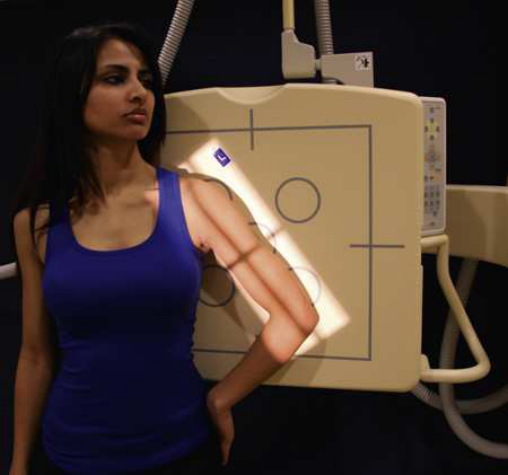
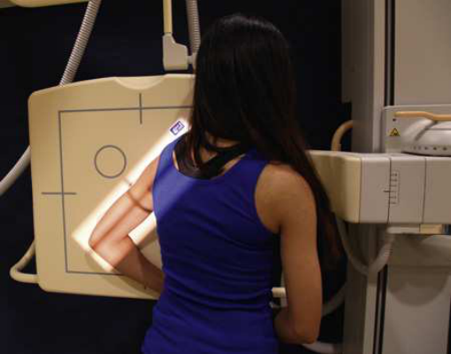
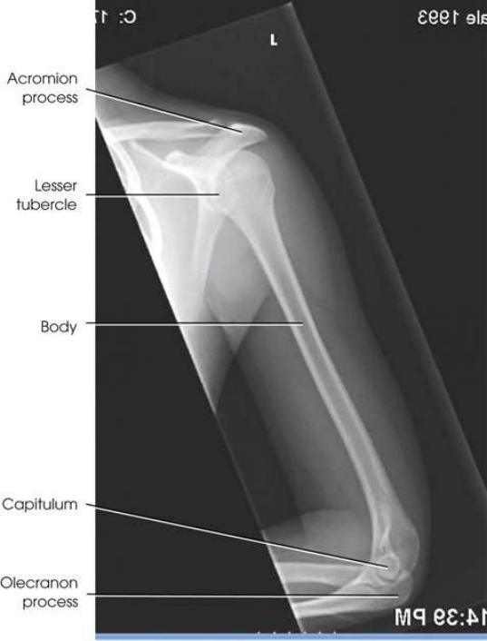

# Rx Humerus — Incidență de Profil (Lateral) — Latero-Medial, Medio-Lateral Ortostatism (Merrill)

  📷 Radiografie Convențională (Rx)
  <strong>Actualizat:</strong> 2026-09-16
  <strong>Autor:</strong> Referință Merrill

---

-   __1. Rezumat Clinic & Indicații__

    ---

    === "Indicații Clinice"

        - Conform reperelor anatomice standard din tratat

    === "Ghid Național IRIS"

        !!! info "Referință Primară: Ghidul Național IRIS (Ordinul MS 1342/2012)"
            - **Capitol Ghid IRIS:** *Ghidul Național IRIS*
            - **Grad de Recomandare:** **De verificat pe indicație; fără grad atribuit automat**
            - **Nivel de Iradiere Estimată:** `De verificat pentru examinarea și populația selectate`

            [:octicons-search-16: Deschide Ghidul IRIS](../../iris.md){ .md-button .md-button--primary } [:material-open-in-new: Aplicația Oficială PWA](https://radiologie-pediatrica.ro/iris/){ .md-button target="_blank" rel="noopener" }
-   __2. Poziționare & Centrare Fascicul__

    ---

    - **Poziție Pacient:** se așază pacientul în Poziție Șezândă-în ortostatism sau în ortostatism poziție facing x-ray tube. corp poziție, whether oblic sau facing spre sau away de la receptorul de imagine, este nu critical ca long ca true Incidență de Profil (lateral) de braț este obtained.; Place top margin de receptorul de imagine approximately 1½ inches (3.8 cm) deasupra nivelului cap humeral. Unless contraindicated prin possible suspiciune de fractură, internally se rotește braț, se flectează Cot approximately 90 grade, și se poziționează pacientul’s anterior Mână pe Șold. This places Humerus în Incidență de Profil (lateral). plan coronal passing through epicondyles trebuie să fie perpendicular cu receptorul de imagine plane (Fig. 5.153). pacient cu broken Humerus poate fie easier la poziție prin performing mediolateral incidență ca vizualizat în Fig. 5.154. Face așezat sau în ortostatism pacient spre receptorul de imagine și incline thorax ca necessary la se aliniază Humerus pentru mediolateral incidență. If pacientul este nu already menținerea Mână de broken braț, Se instruiește pacientul să do so. se efectuează ecranarea gonadelor cu șorț plumbat.
    - **Punct de Centrare Fascicul:** perpendicular pe midportion de Humerus și center de receptorul de imagine
    - **Distanță Focar-Film (DFF / SID):** Nespecificat în fragmentul extras; de verificat în sursă
    - **Comandă Respiratorie:** apnee (oprirea respirației).

-   __3. Parametri Tehnici Expunere__

    ---

    | Parametru Tehnic | Valoare Configurare Generator / Tub |
    |:-----------------|:-------------------------------------|
    | **Tensiune Tub (kV)** | DE CONFIGURAT PE APARAT |
    | **Sarcină / Produs Curent-Timp (mAs)** | DE CONFIGURAT PE APARAT |
    | **Distanță Focar-Film (DFF / SID)** | Nespecificat în fragmentul extras; de verificat în sursă |
    | **Grilă Antidifuzoare (Bucky)** | DE CONFIGURAT PE APARAT |
    | **Dimensiune Focar** | DE CONFIGURAT PE APARAT |
    | **Camere de Ionizare AEC** | DE CONFIGURAT PE APARAT |
    | **Colimare Fascicul** | Adjust câmp de iradiere la 2 inches (5 cm) distal la Cot articulație și superior la Umăr și 1 inch (2.5 cm) pe sides. Se plasează markerul de lateralitate în câmpul colimat. |
    | **Filtrare Tub** | DE CONFIGURAT PE APARAT |

-   __4. Criterii de Calitate & Reușită Imagine__

    ---

    - Criterii radiologice de calitate imaginii:
    - Colimare adecvată vizibilă și prezența markerului de lateralitate (D/S) plasat clear de anatomy de interest
    - Cot și Umăr articulații vizibil but slightly distorted due la fascicul divergence
    - Superimposed humeral epicondyles
    - mică tuberozitate humerală (trohin) în profile pe medial aspect
    - mare tuberozitate humerală (trohiter) superimposed over cap humeral
    - Bony detalii trabeculare osoase și surrounding soft tissues

-   __5. Protecție Radiologică (ALARA)__

    ---

    - Nespecificat în fragmentul extras; de verificat în sursă

!!! note "Observații Clinice & Tehnice"
    Conform reperelor anatomice standard din tratat

### 🖼️ Imagini

<figure class="protocol-image-card" markdown>

<figcaption><strong>Merrill — pagina PDF 356, imaginea 1</strong> — Imagine din fragmentul sursă; asocierea necesită revizie.</figcaption>

</figure>

<figure class="protocol-image-card" markdown>

<figcaption><strong>Merrill — pagina PDF 356, imaginea 2</strong> — Imagine din fragmentul sursă; asocierea necesită revizie.</figcaption>

</figure>

<figure class="protocol-image-card" markdown>

<figcaption><strong>Merrill — pagina PDF 357, imaginea 3</strong> — Imagine din fragmentul sursă; asocierea necesită revizie.</figcaption>

</figure>

=== "Ghid Rapid de Execuție"

    1. **Identificarea și verificarea pacientului:** verificare identitate, zonă de examinat, consimțământ conform procedurii și evaluarea posibilității unei sarcini, când este relevantă.
    2. **Pregătire:** îndepărtarea oricăror obiecte radiopace (bijuterii, agrafe, fermoare, proteze, pansamente dense).
    3. **Poziționare precisă:** alinierea receptorului de imagine și a tubului la distanța prescrisă (Nespecificat în fragmentul extras; de verificat în sursă).
    4. **Colimare strictă:** adaptarea fasciculului strict la regiunea de diagnostic pentru scăderea iradierii și reducerea radiației difuze.
    5. **Radioprotecție:** verificarea [politicii RX](../radioprotectie.md), cu măsuri distincte pentru pacient, personal și însoțitor.

## Surse de documentare

- [Merrill’s Atlas, 5. Upper Extremity, pagini PDF 354–357](../../assets/protocols/sources/a56d45c16829_Merrills_Atlas_of_Radiographic_Positioning__Procedures_3Vol_Set.pdf#page=354)

## Fragmente sursă traduse (referință tehnică)

### anatomy

lateral incidență shows entire length de humerus. true lateral imagine este confirmed prin superimposed epicondyles (Fig. 5.155).

### collimation

• Adjust câmp de iradiere la 2 inches (5 cm) distal la cot articulație și superior la umăr și 1 inch (2.5 cm) pe sides. Place
marker de lateralitate (D/S) în collimated expunere field.

### cr

• perpendicular pe midportion de humerus și center de receptorul de imagine

### criteria

Criterii radiologice de calitate imaginii:
• Colimare adecvată vizibilă și prezența markerului de lateralitate (D/S) plasat clear de anatomy de interest
• cot și umăr articulații vizibil but slightly distorted due la fascicul divergence
• Superimposed humeral epicondyles
• mică tuberozitate humerală (trohin) în profile pe medial aspect
• mare tuberozitate humerală (trohiter) superimposed over cap humeral
• Bony detalii trabeculare osoase și surrounding soft tissues

### part_pos

• Place top margin de receptorul de imagine approximately 1½ inches (3.8 cm) deasupra nivelului cap humeral.
• Unless contraindicated prin possible suspiciune de fractură, internally se rotește braț, se flectează cot approximately 90 grade, și se poziționează pacientul’s
anterior mână pe hip. This places humerus în poziție de profil (lateral). plan coronal passing through epicondyles trebuie să fie
perpendicular cu receptorul de imagine plane (Fig. 5.153).
• pacient cu broken humerus poate fie easier la poziție prin performing mediolateral incidență ca vizualizat în Fig. 5.154. Face așezat sau în ortostatism pacient spre receptorul de imagine și incline thorax ca necessary la se aliniază humerus pentru mediolateral incidență. If
pacientul este nu already menținerea mână de broken braț, Se instruiește pacientul să do so.
• se efectuează ecranarea gonadelor cu șorț plumbat.

### patient_pos

• se așază pacientul în așezat pe scaun-în ortostatism sau în ortostatism poziție facing x-ray tube. corp poziție, whether oblic sau facing spre sau
away de la receptorul de imagine, este nu critical ca long ca true lateral incidență de braț este obtained.

### respiration

apnee (oprirea respirației).

### tech

poziționat prin manufacturer sau department protocol pentru corect anatomy display orientation; raza centrală plate: 14 × 17 inches (35 × 43 cm) longitudinal.

