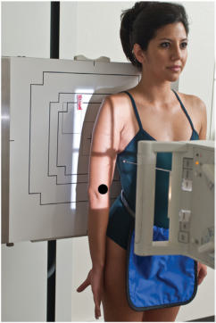
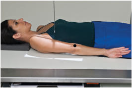
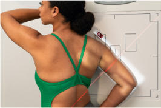
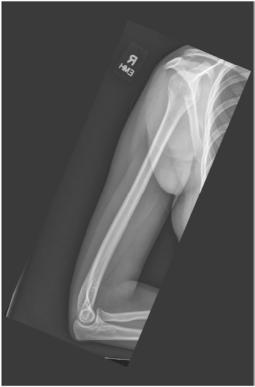
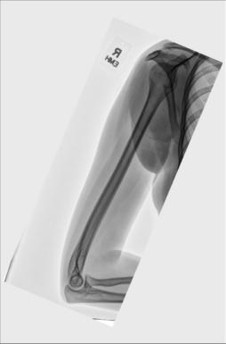

# Rx Humerus MEDIOLATERAL PROJECTIONS

  📷 Radiografie Convențională (Rx)
  <strong>Actualizat:</strong> 2026-09-15
  <strong>Autor:</strong> Departamentul de Radiologie / Referință Bontrager

---

-   __1. Rezumat Clinic & Indicații__

    ---

    === "Indicații Clinice"

        - suspiciune de fractură and luxație / subluxație articulară of the Humerus
        - Pathologic processes including osteoporosis

    === "Ghid Național IRIS"

        !!! info "Referință Primară: Ghidul Național IRIS (Ordinul MS 1342/2012)"
            - **Capitol Ghid IRIS:** *Ghidul Național IRIS*
            - **Grad de Recomandare:** **De verificat pe indicație; fără grad atribuit automat**
            - **Nivel de Iradiere Estimată:** `De verificat pentru examinarea și populația selectate`

            [:octicons-search-16: Deschide Ghidul IRIS](../../iris.md){ .md-button .md-button--primary } [:material-open-in-new: Aplicația Oficială PWA](https://radiologie-pediatrica.ro/iris/){ .md-button target="_blank" rel="noopener" }
-   __2. Poziționare & Centrare Fascicul__

    ---

    - **Poziție Pacient:** Conform incidenței standard descrise
    - **Punct de Centrare Fascicul:** perpendicular to IR, centered to midpoint of Humerus
    - **Distanță Focar-Film (DFF / SID):** 100 cm
    - **Comandă Respiratorie:** Suspend respiration during exposure. 35 (24) (30) Fig. 5.29 Ortostatism laterallateromedial projection, back to IR. Fig. 5.30 Decubit Dorsal Incidență de Profil (Lateral). Fig. 5.31 Ortostatism lateralmediolateral projection, facing IR. Fig. 5.32 Ortostatism mediolateral Humerus projection. (Courtesy Joss Wertz, DO.)

-   __3. Parametri Tehnici Expunere__

    ---

    | Parametru Tehnic | Valoare Configurare Generator / Tub |
    |:-----------------|:-------------------------------------|
    | **Tensiune Tub (kV)** | 70-85 kV |
    | **Sarcină / Produs Curent-Timp (mAs)** | DE CONFIGURAT PE APARAT |
    | **Distanță Focar-Film (DFF / SID)** | 100 cm |
    | **Grilă Antidifuzoare (Bucky)** | Fără grilă (expunere directă) |
    | **Dimensiune Focar** | Focar Mic (0.6 mm) |
    | **Camere de Ionizare AEC** | DE CONFIGURAT PE APARAT |
    | **Colimare Fascicul** | Field Size Collimate on four sides to soft tissue border of Humerus, ensuring that all of Umăr and Cot joints are included (Fig. 5.32). |
    | **Filtrare Tub** | Totală ≥ 2.5 mm Al echivalent |

-   __4. Criterii de Calitate & Reușită Imagine__

    ---

    - Incidență de Profil (Lateral) of the entire Humerus, including Cot and Umăr joints, is visible (see Fig. 5.32 and also Fig. 5.33). Position:
    - True Incidență de Profil (Lateral) is evidenced by the following: epicondyles are directly superimposed; lesser tubercle is shown in profile medially, partially superimposed by lower portion of glenoid cavity.
    - Collimation field size to area of interest. Exposure:
    - Optimal image receptor exposure and contrast with no motion visualize clear, Contururi osoase și travee trabeculare nete, fără artefacte de mișcare of entire Humerus. Humerus ROUTINE
    - AP
    - Rotational lateral Shaft (body) Head of Humerus Medial and lateral epicondyles superimposed Fig. 5.33 Mediolateral projection. (Courtesy Joss Wertz, DO.)

-   __5. Protecție Radiologică (ALARA)__

    ---

    - Ecranare gonadică și a organelor radiosensibile conform procedurilor locale de radioprotecție ALARA.
    - Colimare strictă la aria de interes pentru limitarea radiației difuze.
    - Verificarea posibilității unei sarcini la pacientele de vârstă fertilă înainte de expunere.

### 🖼️ Imagini

<figure class="protocol-image-card" markdown>

<figcaption><strong>Fig. 5.29 Ortostatism lateral-</strong> — Poziționare pacient conform Ghidului Bontrager (Fig. 5.29 Erect lateral-)</figcaption>

</figure>

<figure class="protocol-image-card" markdown>

<figcaption><strong>Fig. 5.30 Decubit Dorsal Incidență de Profil (Lateral).</strong> — Aspect radiografic de referință conform Ghidului Bontrager (Fig. 5.30 Supine lateral projection.)</figcaption>

</figure>

<figure class="protocol-image-card" markdown>

<figcaption><strong>Fig. 5.31 Ortostatism lateral-</strong> — Aspect radiografic de referință conform Ghidului Bontrager (Fig. 5.31 Erect lateral-)</figcaption>

</figure>

<figure class="protocol-image-card" markdown>

<figcaption><strong>Fig. 5.32 Ortostatism mediolateral Humerus projection. (Courtesy Joss</strong> — Aspect radiografic de referință conform Ghidului Bontrager (Fig. 5.32 Erect mediolateral humerus projection. (Courtesy Joss)</figcaption>

</figure>

<figure class="protocol-image-card" markdown>

<figcaption><strong>Fig. 5.32 and also Fig. 5.33).</strong> — Aspect radiografic de referință conform Ghidului Bontrager (Fig. 5.32 and also Fig. 5.33).)</figcaption>

</figure>

=== "Ghid Rapid de Execuție"

    1. **Identificarea și verificarea pacientului:** verificare identitate, zonă de examinat, consimțământ conform procedurii și evaluarea posibilității unei sarcini, când este relevantă.
    2. **Pregătire:** îndepărtarea oricăror obiecte radiopace (bijuterii, agrafe, fermoare, proteze, pansamente dense).
    3. **Poziționare precisă:** alinierea receptorului de imagine și a tubului la distanța prescrisă (100 cm).
    4. **Colimare strictă:** adaptarea fasciculului strict la regiunea de diagnostic pentru scăderea iradierii și reducerea radiației difuze.
    5. **Radioprotecție:** verificarea [politicii RX](../radioprotectie.md), cu măsuri distincte pentru pacient, personal și însoțitor.

## Surse de documentare

- [Bontrager's Textbook of Radiographic Positioning (Ed. 9/10), Pagina 200](https://www.elsevier.com/books/textbook-of-radiographic-positioning-and-related-anatomy/lampignano/978-0-323-65367-1)
