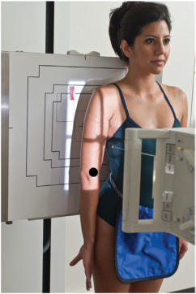
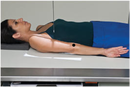
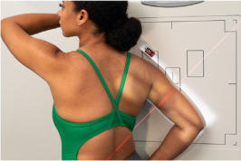
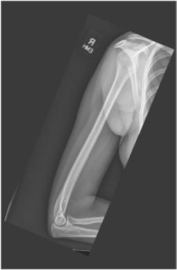
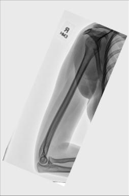

# Rx Humerus — Incidență mediolaterală

  📷 Radiografie Convențională (Rx)
  <strong>Actualizat:</strong> 2026-09-15
  <strong>Autor:</strong> Departamentul de Radiologie / Referință Bontrager

---

-   __1. Rezumat Clinic & Indicații__

    ---

    === "Indicații Clinice"

        - Suspiciune de fractură și luxație/subluxație articulară a humerusului.
        - Procese patologice, inclusiv osteoporoza.

    === "Ghid Național IRIS"

        !!! info "Referință Primară: Ghidul Național IRIS (Ordinul MS 1342/2012)"
            - **Capitol Ghid IRIS:** *Aparat locomotor & Membru superior*
            - **Grad de Recomandare:** **Grad A**
            - **Nivel de Iradiere Estimată:** `Clasa 1 (Minimă < 0.02 mSv)`

            [:octicons-search-16: Deschide Ghidul IRIS](../../iris.md){ .md-button .md-button--primary } [:material-open-in-new: Aplicația Oficială PWA](https://radiologie-pediatrica.ro/iris/){ .md-button target="_blank" rel="noopener" }

-   __2. Poziționare & Centrare Fascicul__

    ---

    - **Poziție Pacient:** Conform incidenței standard descrise
    - **Punct de Centrare Fascicul:** Perpendicular pe receptorul de imagine, centrat pe punctul median al humerusului.
    - **Distanță Focar-Film (DFF / SID):** 100 cm
    - **Comandă Respiratorie:** Apnee pe durata expunerii. 35 (24) (30) Fig. 5.29 Incidență latero-medială în ortostatism, cu spatele la receptorul de imagine. Fig. 5.30 Incidență de profil (lateral) în decubit dorsal. Fig. 5.31 Incidență latero-medială în ortostatism, cu fața spre receptorul de imagine. Fig. 5.32 Incidență mediolaterală a humerusului în ortostatism. (Cu amabilitatea lui Joss Wertz, DO.)

-   __3. Parametri Tehnici Expunere__

    ---

    | Parametru Tehnic | Valoare Configurare Generator / Tub |
    |:-----------------|:-------------------------------------|
    | **Tensiune Tub (kV)** | 70-85 kV |
    | **Sarcină / Produs Curent-Timp (mAs)** | DE CONFIGURAT PE APARAT |
    | **Distanță Focar-Film (DFF / SID)** | 100 cm |
    | **Grilă Antidifuzoare (Bucky)** | Fără grilă (expunere directă) |
    | **Dimensiune Focar** | Focar Mic (0.6 mm) |
    | **Camere de Ionizare AEC** | DE CONFIGURAT PE APARAT |
    | **Colimare Fascicul** | Dimensiunea câmpului: se colimează pe toate cele patru laturi până la marginea țesuturilor moi ale humerusului, asigurând includerea tuturor articulațiilor umărului și cotului (Fig. 5.32). |
    | **Filtrare Tub** | Totală ≥ 2.5 mm Al echivalent |

-   __4. Criterii de Calitate & Reușită Imagine__

    ---

    - Este vizibilă incidența de profil (lateral) a întregului humerus, inclusiv articulațiile cotului și umărului (vezi Fig. 5.32 și, de asemenea, Fig. 5.33). Poziție:
    - Incidența adevărată de profil (lateral) este demonstrată prin următoarele: epicondilii sunt suprapuși direct; tuberozitatea mică humerală (trohinul) este vizualizată în profil medial, suprapusă parțial peste porțiunea inferioară a cavității glenoide.
    - Dimensiunea câmpului de colimare până la aria de interes diagnostic. Expunere:
    - Expunere și contrast optime ale receptorului de imagine, fără mișcare, cu vizualizarea clară a contururilor osoase și a traveelor trabeculare, fără artefacte de mișcare ale întregului humerus. HUMERUS DE RUTINĂ
    - AP
    - Rotirea laterală a diafizei (corpului) humerusului; capul humerusului; epicondilii medial și lateral suprapuși. Fig. 5.33 Incidență mediolaterală. (Cu amabilitatea lui Joss Wertz, DO.)

-   __5. Protecție Radiologică (ALARA)__

    ---

    - Ecranare gonadică și a organelor radiosensibile conform procedurilor locale de radioprotecție ALARA.
    - Colimare strictă la aria de interes pentru limitarea radiației difuze.
    - Verificarea posibilității unei sarcini la pacientele de vârstă fertilă înainte de expunere.

### 🖼️ Imagini

<figure class="protocol-image-card" markdown>

<figcaption><strong>Fig. 5.29 Incidență latero-medială în ortostatism —</strong> — Poziționarea pacientului conform Ghidului Bontrager (Fig. 5.29 în ortostatism latero-medial —)</figcaption>

</figure>

<figure class="protocol-image-card" markdown>

<figcaption><strong>Fig. 5.30 Incidență de profil (lateral) în decubit dorsal.</strong> — Aspect radiografic de referință conform Ghidului Bontrager (Fig. 5.30, incidență laterală în decubit dorsal).</figcaption>

</figure>

<figure class="protocol-image-card" markdown>

<figcaption><strong>Fig. 5.31 Incidență latero-medială în ortostatism —</strong> — Aspect radiografic de referință conform Ghidului Bontrager (Fig. 5.31 în ortostatism latero-medial —)</figcaption>

</figure>

<figure class="protocol-image-card" markdown>

<figcaption><strong>Fig. 5.32 Incidență mediolaterală a humerusului în ortostatism. (Cu amabilitatea lui Joss</strong> — Aspect radiografic de referință conform Ghidului Bontrager (Fig. 5.32 în incidență mediolaterală a humerusului în ortostatism. (Cu amabilitatea lui Joss)</figcaption>

</figure>

<figure class="protocol-image-card" markdown>

<figcaption><strong>Fig. 5.32 și, de asemenea, Fig. 5.33).</strong> — Aspect radiografic de referință conform Ghidului Bontrager (Fig. 5.32 și, de asemenea, Fig. 5.33).)</figcaption>

</figure>

=== "Ghid Rapid de Execuție"

    1. **Identificarea și verificarea pacientului:** verificare identitate, zonă de examinat, consimțământ conform procedurii și evaluarea posibilității unei sarcini, când este relevantă.
    2. **Pregătire:** îndepărtarea oricăror obiecte radiopace (bijuterii, agrafe, fermoare, proteze, pansamente dense).
    3. **Poziționare precisă:** alinierea receptorului de imagine și a tubului la distanța prescrisă (100 cm).
    4. **Colimare strictă:** adaptarea fasciculului strict la regiunea de diagnostic pentru scăderea iradierii și reducerea radiației difuze.
    5. **Radioprotecție:** verificarea [politicii RX](../radioprotectie.md), cu măsuri distincte pentru pacient, personal și însoțitor.

## Surse de documentare

- [Bontrager's Textbook of Radiographic Positioning (Ed. 9/10), Pagina 200](https://www.elsevier.com/books/textbook-of-radiographic-positioning-and-related-anatomy/lampignano/978-0-323-65367-1)
