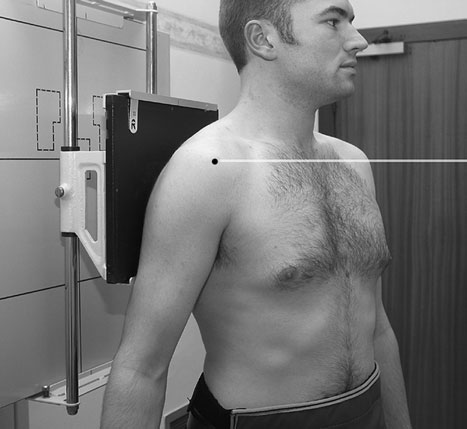
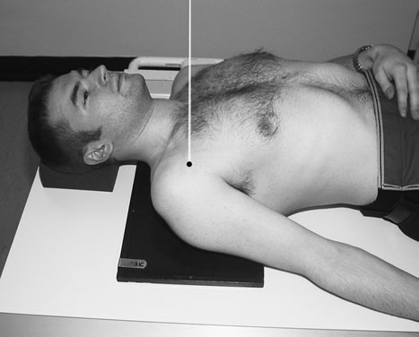
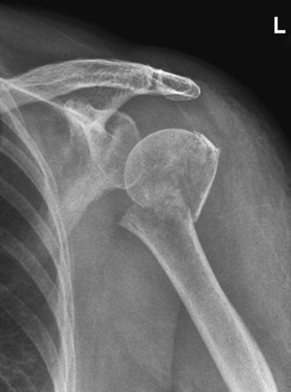

# Rx Humerus Proximal (Col Chirurgical) Antero-Posterior (AP)

  📷 Radiografie Convențională (Rx)
  <strong>Actualizat:</strong> 2026-09-16
  <strong>Autor:</strong> Departamentul de Radiologie / Referință Clark (Ed. 12)

---

-   __1. Rezumat Clinic & Indicații__

    ---

    === "Indicații Clinice"

        - Two incidențe la drept-angles sunt necessary: anteroposterior și Axială sau Profil (lateral) incidență. Movement de braț poate fie limited, și technique poate need la fie modified accordingly. Where possible, supporting sling trebuie să fie removed. Depending pe condition de pacientul, examination poate fie undertaken cu pacientul Ortostatism, providing adecvat imobilizare este used, Decubit dorsal pe masa radiologică, sau, în cases de multiple trauma, pe trolley. expunere este made pe arrested respirație. A 24  30-cm casetă fitted cu regular-speed screen este used. Antero-posterior (AP)

    === "Ghid Național IRIS"

        !!! info "Referință Primară: Ghidul Național IRIS (Ordinul MS 1342/2012)"
            - **Capitol Ghid IRIS:** *Ghidul Național IRIS*
            - **Grad de Recomandare:** **De verificat pe indicație; fără grad atribuit automat**
            - **Nivel de Iradiere Estimată:** `De verificat pentru examinarea și populația selectate`

            [:octicons-search-16: Deschide Ghidul IRIS](../../iris.md){ .md-button .md-button--primary } [:material-open-in-new: Aplicația Oficială PWA](https://radiologie-pediatrica.ro/iris/){ .md-button target="_blank" rel="noopener" }
-   __2. Poziționare & Centrare Fascicul__

    ---

    - **Poziție Pacient:** • pacientul stă în ortostatism sau lies Decubit dorsal facing X-ray tube.
• pacientul este rotit spre partea afectată la bring posterior aspect de injured Umăr into contact cu linia mediană casetă.
• caseta este poziționat pentru include acromion și proximal half de Humerus.
    - **Punct de Centrare Fascicul:** • raza centrală este orientat la drept-angles la Humerus și centred la capul de Humerus.
    - **Distanță Focar-Film (DFF / SID):** 100 cm
    - **Comandă Respiratorie:** expunere este made pe arrested respirație

-   __3. Parametri Tehnici Expunere__

    ---

    | Parametru Tehnic | Valoare Configurare Generator / Tub |
    |:-----------------|:-------------------------------------|
    | **Tensiune Tub (kV)** | DE CONFIGURAT PE APARAT |
    | **Sarcină / Produs Curent-Timp (mAs)** | Conform AEC / grosime anatomică |
    | **Distanță Focar-Film (DFF / SID)** | 100 cm |
    | **Grilă Antidifuzoare (Bucky)** | Conform grosimii anatomice (> 10-12 cm cu grilă) |
    | **Dimensiune Focar** | Focar Mic (0.6 mm) |
    | **Camere de Ionizare AEC** | DE CONFIGURAT PE APARAT |
    | **Colimare Fascicul** | Colimare strictă adaptată pe receptor 24 x 30 cm |
    | **Filtrare Tub** | Totală ≥ 2.5 mm Al echivalent (conform Clark: 3.0 mm Al eq.) |

-   __4. Criterii de Calitate & Reușită Imagine__

    ---

    - imagine trebuie să include acromion și proximal half de shaft de Humerus.
    - expunere trebuie să evidențiază adequately gâtul de Humerus clear de Torace.

-   __5. Protecție Radiologică (ALARA)__

    ---

    - Ecranare gonadică cu șorț plumbat dacă gonadele sunt în apropierea fasciculului util (regula ALARA).
    - Colimare precisă la dimensiunea anatomică strict necesară pentru reducerea dozei și a radiației difuze.
    - Verificarea posibilității unei sarcini la pacientele de vârstă fertilă înainte de expunere.

!!! note "Observații Clinice & Tehnice"
    • expunere trebuie să fie made pe arrested respirație.
• pacientul trebuie să se imobilizează affected Antebraț (Radius și Ulna) prin supporting its weight cu other braț. If pacientul este Decubit dorsal, săculeți cu nisip trebuie să fie plasat over Antebraț (Radius și Ulna).
74 Antero-posterior (AP) radiografie de neck de Humerus taken Ortostatism la show suspiciune de fractură de gâtul de Humerus

### 🖼️ Imagini

<figure class="protocol-image-card" markdown>

<figcaption><strong>most common reason pentru radiografie de gâtul de the</strong> — Poziționare pacient și centrare fascicul conform Clark (Ed. 12)</figcaption>

</figure>

<figure class="protocol-image-card" markdown>

<figcaption><strong>Humerus este suspected suspiciune de fractură, either pathological sau traumatic.</strong> — Aspect radiografic / ghid de poziționare conform tratatului Clark (Ed. 12)</figcaption>

</figure>

<figure class="protocol-image-card" markdown>

<figcaption><strong>Antero-posterior (AP) radiografie de neck de Humerus taken Ortostatism la show</strong> — Aspect radiografic / ghid de poziționare conform tratatului Clark (Ed. 12)</figcaption>

</figure>

=== "Ghid Rapid de Execuție"

    1. **Identificarea și verificarea pacientului:** verificare identitate, zonă de examinat, consimțământ conform procedurii și evaluarea posibilității unei sarcini, când este relevantă.
    2. **Pregătire:** îndepărtarea oricăror obiecte radiopace (bijuterii, agrafe, fermoare, proteze, pansamente dense).
    3. **Poziționare precisă:** alinierea receptorului de imagine și a tubului la distanța prescrisă (100 cm).
    4. **Colimare strictă:** adaptarea fasciculului strict la regiunea de diagnostic pentru scăderea iradierii și reducerea radiației difuze.
    5. **Radioprotecție:** verificarea [politicii RX](../radioprotectie.md), cu măsuri distincte pentru pacient, personal și însoțitor.

## Surse de documentare

- [Clark's Positioning in Radiography (Ed. 12), Pagina 89](../../assets/protocols/sources/Clark___Positioning_in_Radiography__12th_edition.pdf#page=89)
