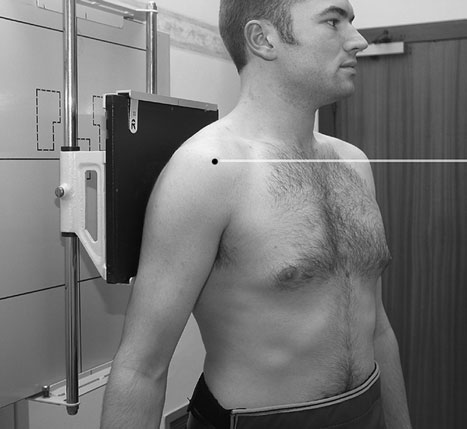
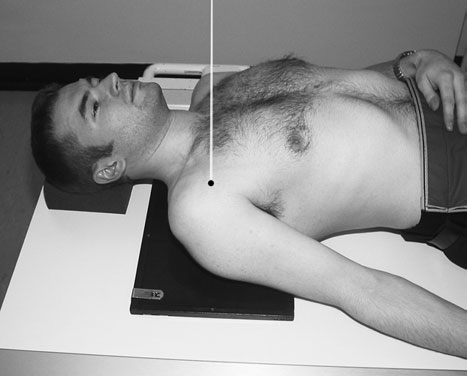
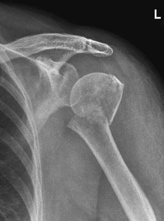

# Rx humerus proximal (col chirurgical) anteroposterioară (AP)

  📷 Radiografie Convențională (Rx)
  <strong>Actualizat:</strong> 2026-09-16
  <strong>Autor:</strong> Departamentul de Radiologie / Referință Clark (Ed. 12)

---

-   __1. Rezumat Clinic & Indicații__

    ---

    === "Indicații Clinice"

        - Sunt necesare două incidențe la unghi drept: anteroposterioară și axială sau de profil (laterală). Mișcarea brațului poate fi limitată, iar tehnica poate necesita modificări corespunzătoare. Atunci când este posibil, eșarfa de susținere trebuie îndepărtată. În funcție de starea pacientului, examinarea poate fi efectuată cu pacientul în ortostatism, cu imobilizare adecvată, în decubit dorsal pe masa radiologică sau, în cazurile de politraumatism, pe targa mobilă. Expunerea se efectuează în apnee. Se utilizează o casetă de 24 × 30 cm prevăzută cu ecran de viteză normală. Anteroposterioară (AP)

    === "Ghid Național IRIS"

        !!! info "Referință Primară: Ghidul Național IRIS (Ordinul MS 1342/2012)"
            - **Capitol Ghid IRIS:** *Aparat locomotor & Membru superior*
            - **Grad de Recomandare:** **Grad A**
            - **Nivel de Iradiere Estimată:** `Clasa 1 (Minimă < 0.02 mSv)`

            [:octicons-search-16: Deschide Ghidul IRIS](../../iris.md){ .md-button .md-button--primary } [:material-open-in-new: Aplicația Oficială PWA](https://radiologie-pediatrica.ro/iris/){ .md-button target="_blank" rel="noopener" }

-   __2. Poziționare & Centrare Fascicul__

    ---

    - **Poziție Pacient:**
        - Pacientul stă în ortostatism sau este culcat în decubit dorsal, cu fața spre tubul radiologic.
        - Pacientul este rotit spre partea afectată pentru a aduce aspectul posterior al umărului lezat în contact cu linia mediană a casetei.
        - Caseta este poziționată pentru a include acromionul și jumătatea proximală a humerusului.
    - **Punct de Centrare Fascicul:** • Raza centrală este orientată perpendicular pe humerus și centrată pe capul humerusului.
    - **Distanță Focar-Film (DFF / SID):** 100 cm
    - **Comandă Respiratorie:** Expunerea se efectuează în apnee.

-   __3. Parametri Tehnici Expunere__

    ---

    | Parametru Tehnic | Valoare Configurare Generator / Tub |
    |:-----------------|:-------------------------------------|
    | **Tensiune Tub (kV)** | DE CONFIGURAT PE APARAT |
    | **Sarcină / Produs Curent-Timp (mAs)** | Conform AEC / grosimii anatomice |
    | **Distanță Focar-Film (DFF / SID)** | 100 cm |
    | **Grilă Antidifuzoare (Bucky)** | Conform grosimii anatomice (> 10-12 cm cu grilă) |
    | **Dimensiune Focar** | Focar Mic (0.6 mm) |
    | **Camere de Ionizare AEC** | DE CONFIGURAT PE APARAT |
    | **Colimare Fascicul** | Colimare strictă adaptată pe receptor 24 x 30 cm |
    | **Filtrare Tub** | Totală ≥ 2.5 mm Al echivalent (conform Clark: 3.0 mm Al echivalent) |

-   __4. Criterii de Calitate & Reușită Imagine__

    ---

    - Imaginea trebuie să includă acromionul și jumătatea proximală a diafizei humerusului.
    - Expunerea trebuie să evidențieze adecvat colul humerusului, clar separat de torace.

-   __5. Protecție Radiologică (ALARA)__

    ---

    - Ecranare gonadică cu șorț plumbat dacă gonadele sunt în apropierea fasciculului util (regula ALARA).
    - Colimare precisă la dimensiunea anatomică strict necesară pentru reducerea dozei și a radiației difuze.
    - Verificarea posibilității unei sarcini la pacientele de vârstă fertilă înainte de expunere.

!!! note "Observații Clinice & Tehnice"
    - Expunerea trebuie efectuată în apnee.
    - Pacientul trebuie să imobilizeze antebrațul afectat (radiusul și ulna), susținându-i greutatea cu celălalt braț. Dacă pacientul este în decubit dorsal, trebuie așezați saci cu nisip peste antebrațul afectat (radiusul și ulna). 74 Radiografie anteroposterioară (AP) a colului humerusului, efectuată în ortostatism, pentru evidențierea suspiciunii de fractură a colului humerusului

### 🖼️ Imagini

<figure class="protocol-image-card" markdown>

<figcaption><strong>Cel mai frecvent motiv pentru efectuarea unei radiografii a colului humerusului</strong> — Poziționarea pacientului și centrarea fasciculului conform Clark (Ed. 12)</figcaption>

</figure>

<figure class="protocol-image-card" markdown>

<figcaption><strong>Humerusul prezintă suspiciune de fractură, fie patologică, fie traumatică.</strong> — Aspect radiografic / ghid de poziționare conform tratatului Clark (Ed. 12)</figcaption>

</figure>

<figure class="protocol-image-card" markdown>

<figcaption><strong>Radiografie anteroposterioară (AP) a colului humerusului, efectuată în ortostatism, pentru evidențierea</strong> — Aspect radiografic / ghid de poziționare conform tratatului Clark (Ed. 12)</figcaption>

</figure>

=== "Ghid Rapid de Execuție"

    1. **Identificarea și verificarea pacientului:** verificare identitate, zonă de examinat, consimțământ conform procedurii și evaluarea posibilității unei sarcini, când este relevantă.
    2. **Pregătire:** îndepărtarea oricăror obiecte radiopace (bijuterii, agrafe, fermoare, proteze, pansamente dense).
    3. **Poziționare precisă:** alinierea receptorului de imagine și a tubului la distanța prescrisă (100 cm).
    4. **Colimare strictă:** adaptarea fasciculului strict la regiunea de diagnostic pentru scăderea iradierii și reducerea radiației difuze.
    5. **Radioprotecție:** verificarea [politicii RX](../radioprotectie.md), cu măsuri distincte pentru pacient, personal și însoțitor.

## Surse de documentare

- [Clark's Positioning in Radiography (Ed. 12), Pagina 89](https://books.google.com/books/about/Clark_s_Positioning_in_Radiography.html?id=Xxu6MwEACAAJ)
