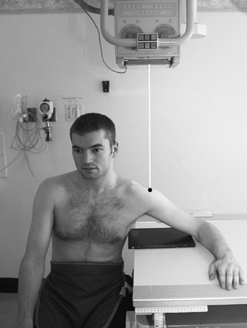
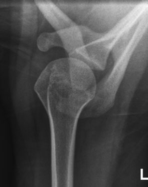
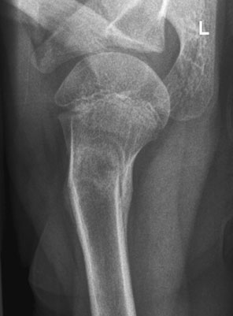

# Rx Humerus Proximal (Col Chirurgical) Axială Incidență

  📷 Radiografie Convențională (Rx)
  <strong>Actualizat:</strong> 2026-09-16
  <strong>Autor:</strong> Departamentul de Radiologie / Referință Clark (Ed. 12)

---

-   __1. Rezumat Clinic & Indicații__

    ---

    === "Indicații Clinice"

        - 75 2 Humerus – neck Axială incidență Positioning pentru Profil (lateral) incidență will depend pe how much movement de braț este possible. If pacientul este able la abduct braț, then Supero-Inferioară incidență este recommended cu pacientul Poziție Șezândă la end de masa radiologică. Alternatively, if pacientul este culcat pe trolley, then Infero-Superioară (Axială) incidență este acquired. If, however, braț este fully imobilizat, then alternative Profil (lateral) Oblică (ca pentru Profil (lateral) Omoplat (Scapulă)) poate fie taken. Profil (lateral) – Supero-Inferioară This incidență poate fie taken even when only small grade de abduction este possible. It este important that fără attempt trebuie să fie made la increase amount de movement that pacientul este able sau willing la make. An 18  24-cm casetă este selected.

    === "Ghid Național IRIS"

        !!! info "Referință Primară: Ghidul Național IRIS (Ordinul MS 1342/2012)"
            - **Capitol Ghid IRIS:** *Ghidul Național IRIS*
            - **Grad de Recomandare:** **De verificat pe indicație; fără grad atribuit automat**
            - **Nivel de Iradiere Estimată:** `De verificat pentru examinarea și populația selectate`

            [:octicons-search-16: Deschide Ghidul IRIS](../../iris.md){ .md-button .md-button--primary } [:material-open-in-new: Aplicația Oficială PWA](https://radiologie-pediatrica.ro/iris/){ .md-button target="_blank" rel="noopener" }
-   __2. Poziționare & Centrare Fascicul__

    ---

    - **Poziție Pacient:** • pacientul este așezat pe scaun la one end de masa de examinare, cu trunk leaning spre masa de examinare, braț de side being examined în its maximum abduction, și Cot resting pe masa de examinare.
• height de masa de examinare este ajustat la enable pacientul la adopt comfortable poziție și la maximize full coverage de gâtul de Humerus și Umăr articulație.
• caseta rests pe masa de examinare între Cot și trunk.
    - **Punct de Centrare Fascicul:** • raza centrală verticală centrală este orientat de la above la acromion de Omoplat (Scapulă).
• Owing la increased object-la-casetă distance, small focar tub together cu increased FFD trebuie să fie selected.
    - **Distanță Focar-Film (DFF / SID):** 100 cm
    - **Comandă Respiratorie:** Apnee pe durata expunerii (apnee în inspir pentru torace; expir pentru Abdomen/bazin).

-   __3. Parametri Tehnici Expunere__

    ---

    | Parametru Tehnic | Valoare Configurare Generator / Tub |
    |:-----------------|:-------------------------------------|
    | **Tensiune Tub (kV)** | DE CONFIGURAT PE APARAT |
    | **Sarcină / Produs Curent-Timp (mAs)** | Conform AEC / grosime anatomică |
    | **Distanță Focar-Film (DFF / SID)** | 100 cm |
    | **Grilă Antidifuzoare (Bucky)** | Conform grosimii anatomice (> 10-12 cm cu grilă) |
    | **Dimensiune Focar** | Focar Mic (0.6 mm) |
    | **Camere de Ionizare AEC** | DE CONFIGURAT PE APARAT |
    | **Colimare Fascicul** | Colimare strictă adaptată pe receptor 18 x 24 cm |
    | **Filtrare Tub** | Totală ≥ 2.5 mm Al echivalent (conform Clark: 3.0 mm Al eq.) |

-   __4. Criterii de Calitate & Reușită Imagine__

    ---

    - imagine trebuie să include acromion și coracoid processes, cavitate glenoidă și proximal cap și neck de Humerus.
    - expunere trebuie să evidențiază adequately gâtul de Humerus. Normal Supero-Inferioară incidență la show neck de Humerus Supero-Inferioară incidență pentru neck de Humerus, evidențiind healing angulated suspiciune de fractură de proximal shaft de Humerus

-   __5. Protecție Radiologică (ALARA)__

    ---

    - Ecranare gonadică cu șorț plumbat dacă gonadele sunt în apropierea fasciculului util (regula ALARA).
    - Colimare precisă la dimensiunea anatomică strict necesară pentru reducerea dozei și a radiației difuze.
    - Verificarea posibilității unei sarcini la pacientele de vârstă fertilă înainte de expunere.

!!! note "Observații Clinice & Tehnice"
    Pregătirea pacientului prin îndepărtarea tuturor accesoriilor radio-opace.

### 🖼️ Imagini

<figure class="protocol-image-card" markdown>

<figcaption><strong>Normal Supero-Inferioară incidență la show neck de Humerus</strong> — Poziționare pacient și centrare fascicul conform Clark (Ed. 12)</figcaption>

</figure>

<figure class="protocol-image-card" markdown>

<figcaption><strong>Supero-Inferioară incidență pentru neck de Humerus, evidențiind healing</strong> — Aspect radiografic / ghid de poziționare conform tratatului Clark (Ed. 12)</figcaption>

</figure>

<figure class="protocol-image-card" markdown>

<figcaption><strong>angulated suspiciune de fractură de proximal shaft de Humerus</strong> — Aspect radiografic / ghid de poziționare conform tratatului Clark (Ed. 12)</figcaption>

</figure>

=== "Ghid Rapid de Execuție"

    1. **Identificarea și verificarea pacientului:** verificare identitate, zonă de examinat, consimțământ conform procedurii și evaluarea posibilității unei sarcini, când este relevantă.
    2. **Pregătire:** îndepărtarea oricăror obiecte radiopace (bijuterii, agrafe, fermoare, proteze, pansamente dense).
    3. **Poziționare precisă:** alinierea receptorului de imagine și a tubului la distanța prescrisă (100 cm).
    4. **Colimare strictă:** adaptarea fasciculului strict la regiunea de diagnostic pentru scăderea iradierii și reducerea radiației difuze.
    5. **Radioprotecție:** verificarea [politicii RX](../radioprotectie.md), cu măsuri distincte pentru pacient, personal și însoțitor.

## Surse de documentare

- [Clark's Positioning in Radiography (Ed. 12), Pagina 90](../../assets/protocols/sources/Clark___Positioning_in_Radiography__12th_edition.pdf#page=90)
