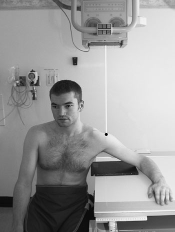
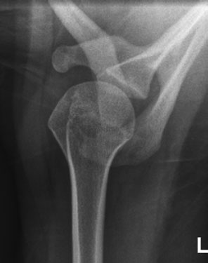
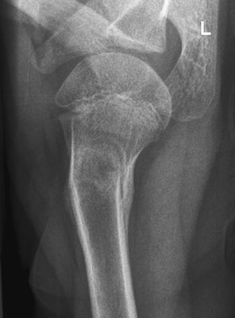

# Rx humerus proximal (col chirurgical) – incidență axială

  📷 Radiografie Convențională (Rx)
  <strong>Actualizat:</strong> 2026-09-16
  <strong>Autor:</strong> Departamentul de Radiologie / Referință Clark (Ed. 12)

---

-   __1. Rezumat Clinic & Indicații__

    ---

    === "Indicații Clinice"

        - 75 2 Humerus – colul – incidență axială. Poziționarea pentru incidența de profil (laterală) va depinde de amplitudinea mișcării posibile a brațului. Dacă pacientul poate efectua abducția brațului, se recomandă incidența superoinferioară, cu pacientul în poziție șezândă la capătul mesei radiologice. Alternativ, dacă pacientul este culcat pe targă, se efectuează incidența inferosuperioară (axială). Dacă, totuși, brațul este complet imobilizat, se poate efectua incidența oblică de profil (laterală) alternativă (ca pentru profilul lateral al scapulei). Profil (lateral) – superoinferioară. Această incidență poate fi efectuată chiar și atunci când este posibil un grad redus de abducție. Este important să nu se încerce creșterea amplitudinii mișcării pe care pacientul o poate sau dorește să o efectueze. Se selectează o casetă de 18 × 24 cm.

    === "Ghid Național IRIS"

        !!! info "Referință Primară: Ghidul Național IRIS (Ordinul MS 1342/2012)"
            - **Capitol Ghid IRIS:** *Aparat locomotor & Membru superior*
            - **Grad de Recomandare:** **Grad A**
            - **Nivel de Iradiere Estimată:** `Clasa 1 (Minimă < 0.02 mSv)`

            [:octicons-search-16: Deschide Ghidul IRIS](../../iris.md){ .md-button .md-button--primary } [:material-open-in-new: Aplicația Oficială PWA](https://radiologie-pediatrica.ro/iris/){ .md-button target="_blank" rel="noopener" }

-   __2. Poziționare & Centrare Fascicul__

    ---

    - **Poziție Pacient:**
        - Pacientul este așezat pe scaun la un capăt al mesei de examinare, cu trunchiul înclinat spre masă, brațul de pe partea examinată în abducție maximă și cotul sprijinit pe masa de examinare.
        - Înălțimea mesei de examinare este ajustată pentru a permite pacientului să adopte o poziție confortabilă și pentru a maximiza acoperirea completă a colului humerusului și a articulației umărului.
        - Caseta se sprijină pe masa de examinare între cot și trunchi.
    - **Punct de Centrare Fascicul:**
        - Raza centrală verticală este orientată deasupra acromionului scapulei.
        - Din cauza creșterii distanței obiect–casetă, trebuie selectate un focar mic și o DFF crescută.
    - **Distanță Focar-Film (DFF / SID):** 100 cm
    - **Comandă Respiratorie:** Apnee pe durata expunerii (apnee în inspir pentru torace; expir pentru Abdomen/bazin).

-   __3. Parametri Tehnici Expunere__

    ---

    | Parametru Tehnic | Valoare Configurare Generator / Tub |
    |:-----------------|:-------------------------------------|
    | **Tensiune Tub (kV)** | DE CONFIGURAT PE APARAT |
    | **Sarcină / Produs Curent-Timp (mAs)** | Conform AEC / grosimii anatomice |
    | **Distanță Focar-Film (DFF / SID)** | 100 cm |
    | **Grilă Antidifuzoare (Bucky)** | Conform grosimii anatomice (> 10-12 cm cu grilă) |
    | **Dimensiune Focar** | Focar Mic (0.6 mm) |
    | **Camere de Ionizare AEC** | DE CONFIGURAT PE APARAT |
    | **Colimare Fascicul** | Colimare strictă adaptată pe receptor 18 x 24 cm |
    | **Filtrare Tub** | Totală ≥ 2.5 mm Al echivalent (conform Clark: 3.0 mm Al echivalent) |

-   __4. Criterii de Calitate & Reușită Imagine__

    ---

    - Imaginea trebuie să includă acromionul și procesele coracoide, cavitatea glenoidă, precum și capul și colul proximal al humerusului.
    - Expunerea trebuie să evidențieze adecvat colul humerusului. Incidență superoinferioară normală pentru evidențierea colului humerusului. Incidență superoinferioară pentru colul humerusului, evidențiind consolidarea vicioasă a unei suspiciuni de fractură a diafizei proximale a humerusului.

-   __5. Protecție Radiologică (ALARA)__

    ---

    - Ecranare gonadică cu șorț plumbat dacă gonadele sunt în apropierea fasciculului util (regula ALARA).
    - Colimare precisă la dimensiunea anatomică strict necesară pentru reducerea dozei și a radiației difuze.
    - Verificarea posibilității unei sarcini la pacientele de vârstă fertilă înainte de expunere.

!!! note "Observații Clinice & Tehnice"
    Pregătirea pacientului prin îndepărtarea tuturor accesoriilor radio-opace.

### 🖼️ Imagini

<figure class="protocol-image-card" markdown>

<figcaption><strong>Incidență superoinferioară normală pentru evidențierea colului humerusului</strong> — Poziționarea pacientului și centrarea fasciculului conform Clark (Ed. 12)</figcaption>

</figure>

<figure class="protocol-image-card" markdown>

<figcaption><strong>Incidență superoinferioară pentru colul humerusului, evidențiind consolidarea</strong> — Aspect radiografic / ghid de poziționare conform tratatului Clark (Ed. 12)</figcaption>

</figure>

<figure class="protocol-image-card" markdown>

<figcaption><strong>vicioasă a unei suspiciuni de fractură a diafizei proximale a humerusului</strong> — Aspect radiografic / ghid de poziționare conform tratatului Clark (Ed. 12)</figcaption>

</figure>

=== "Ghid Rapid de Execuție"

    1. **Identificarea și verificarea pacientului:** verificare identitate, zonă de examinat, consimțământ conform procedurii și evaluarea posibilității unei sarcini, când este relevantă.
    2. **Pregătire:** îndepărtarea oricăror obiecte radiopace (bijuterii, agrafe, fermoare, proteze, pansamente dense).
    3. **Poziționare precisă:** alinierea receptorului de imagine și a tubului la distanța prescrisă (100 cm).
    4. **Colimare strictă:** adaptarea fasciculului strict la regiunea de diagnostic pentru scăderea iradierii și reducerea radiației difuze.
    5. **Radioprotecție:** verificarea [politicii RX](../radioprotectie.md), cu măsuri distincte pentru pacient, personal și însoțitor.

## Surse de documentare

- [Clark's Positioning in Radiography (Ed. 12), Pagina 90](https://books.google.com/books/about/Clark_s_Positioning_in_Radiography.html?id=Xxu6MwEACAAJ)
