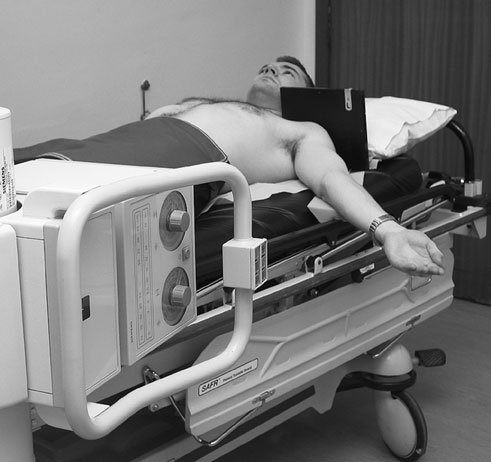
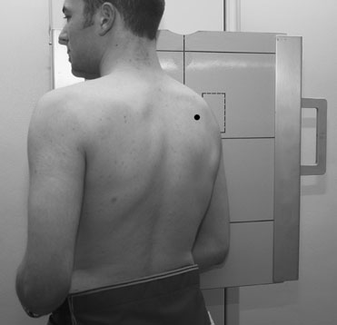
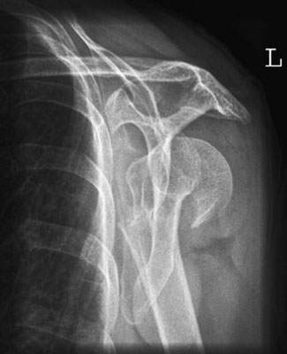

# Rx Humerus Proximal (Col Chirurgical) Profil (Lateral) - infero - superior

  📷 Radiografie Convențională (Rx)
  <strong>Actualizat:</strong> 2026-09-16
  <strong>Autor:</strong> Departamentul de Radiologie / Referință Clark (Ed. 12)

---

-   __1. Rezumat Clinic & Indicații__

    ---

    === "Indicații Clinice"

        - 78 RECOMMENDED incidențe 79 Incidențe Standard de Bază 80 Antero-posterior (AP) (15 grade) Ortostatism – survey imagine 81 Supero-Inferioară (Axială) 81 Infero-Superioară (Axială) (alternate) 82 Incidență Outlet (Subacromială Neer) 83 Antero-posterior (AP) (Incidență Outlet (Subacromială Neer)) 83 Profil (lateral) (Incidență Outlet (Subacromială Neer)) 84 GLENOHUMERAL articulație 85 Antero-posterior (AP) – Ortostatism 85 Antero-posterior (AP) – Decubit dorsal (trauma) 86 Profil (lateral) Oblică ‘Y’ incidență (alternate) luxație articulară/suspiciune de fractură proximal Humerus 86 MODIFICATIONS în TECHNIQUE (POST-MANIPULATION) 87 Antero-posterior (AP) – 25 grade caudal 87 Luxație Recurentă Umăr 88 Antero-posterior (AP) (Profil (lateral) Humerus) 88 Antero-posterior (AP) (Oblică Humerus) 89 Antero-posterior (AP) (modified) – Metoda Stryker 90 Infero-Superioară (Axială) 90 CALCIFIED TENDONS 91 Antero-posterior (AP) 92 Antero-posterior (AP) – 25 grade caudal 93 Infero-Superioară (Axială) 93 Articulații Acromioclaviculare 94 Antero-posterior (AP) 94 Claviculă 95 Postero-anterior (PA) – Ortostatism (basic) 95 Antero-posterior (AP) – Decubit dorsal (alternate) 96 Infero-Superioară (Axială) 97 Infero-Superioară (Axială) – Decubit dorsal 98 Articulații Sternoclaviculare 99 Postero-anterior (PA) Oblică (basic) 99 Semi-Decubit ventral (alternate) 99 Postero-anterior (PA) 100 Profil (lateral) 100 Omoplat (Scapulă) 101 Antero-posterior (AP) (basic) – Ortostatism 101 Profil (lateral) (basic) 102 Profil (lateral) (alternate) 102 Proces Coracoid 103 Antero-posterior (AP) (braț în abducție) 103 CONTENTS

    === "Ghid Național IRIS"

        !!! info "Referință Primară: Ghidul Național IRIS (Ordinul MS 1342/2012)"
            - **Capitol Ghid IRIS:** *Ghidul Național IRIS*
            - **Grad de Recomandare:** **De verificat pe indicație; fără grad atribuit automat**
            - **Nivel de Iradiere Estimată:** `De verificat pentru examinarea și populația selectate`

            [:octicons-search-16: Deschide Ghidul IRIS](../../iris.md){ .md-button .md-button--primary } [:material-open-in-new: Aplicația Oficială PWA](https://radiologie-pediatrica.ro/iris/){ .md-button target="_blank" rel="noopener" }
-   __2. Poziționare & Centrare Fascicul__

    ---

    - **Poziție Pacient:** • pacientul stă în ortostatism sau sits cu Profil (lateral) aspect de injured braț sprijinit pe casetă sau stativ vertical Bucky.
• pacientul este rotit forwards until line joining medial și Profil (lateral) margini de Omoplat (Scapulă) este la drept-angles la caseta.
• caseta este poziționat pentru include cap de Humerus și whole Omoplat (Scapulă).
    - **Punct de Centrare Fascicul:** • orizontal X-ray fascicul este orientat la medial margine de Omoplat (Scapulă) și centred la capul de Humerus.
76
    - **Distanță Focar-Film (DFF / SID):** 100 cm
    - **Comandă Respiratorie:** Apnee completă pe durata expunerii.

-   __3. Parametri Tehnici Expunere__

    ---

    | Parametru Tehnic | Valoare Configurare Generator / Tub |
    |:-----------------|:-------------------------------------|
    | **Tensiune Tub (kV)** | DE CONFIGURAT PE APARAT |
    | **Sarcină / Produs Curent-Timp (mAs)** | Conform AEC / grosime anatomică |
    | **Distanță Focar-Film (DFF / SID)** | 100 cm |
    | **Grilă Antidifuzoare (Bucky)** | Cu grilă antidifuzoare Bucky |
    | **Dimensiune Focar** | Focar Mic (0.6 mm) |
    | **Camere de Ionizare AEC** | Camerele laterale (sau camera centrală funcție de regiune) |
    | **Colimare Fascicul** | Colimare strictă la aria anatomică de interes diagnostic |
    | **Filtrare Tub** | Totală ≥ 2.5 mm Al echivalent (conform Clark: 3.0 mm Al eq.) |

-   __4. Criterii de Calitate & Reușită Imagine__

    ---

    - Omoplat (Scapulă) și upper end de Humerus trebuie să fie evidențiat clear de thoracic cage. Profil (lateral) Oblică incidență de neck de Humerus, evidențiind suspiciune de fractură

-   __5. Protecție Radiologică (ALARA)__

    ---

    - Ecranare gonadică cu șorț plumbat dacă gonadele sunt în apropierea fasciculului util (regula ALARA).
    - Colimare precisă la dimensiunea anatomică strict necesară pentru reducerea dozei și a radiației difuze.
    - Verificarea posibilității unei sarcini la pacientele de vârstă fertilă înainte de expunere.

!!! note "Observații Clinice & Tehnice"
    • expunere trebuie să fie made pe arrested respirație.
• It este important that fără attempt este made la increase amount de movement that pacientul este able sau willing la make.
Profil (lateral) Oblică This incidență este used when braț este imobilizat și fără abduction de braț este possible. stativ vertical Bucky technique poate fie necessary la improve imagine quality.

### 🖼️ Imagini

<figure class="protocol-image-card" markdown>

<figcaption><strong>Profil (lateral) Oblică incidență de neck de Humerus, evidențiind suspiciune de fractură</strong> — Poziționare pacient și centrare fascicul conform Clark (Ed. 12)</figcaption>

</figure>

<figure class="protocol-image-card" markdown>

<figcaption><strong>Figura 2: Aspect radiografic / Poziționare (Clark Ed. 12)</strong> — Aspect radiografic / ghid de poziționare conform tratatului Clark (Ed. 12)</figcaption>

</figure>

<figure class="protocol-image-card" markdown>

<figcaption><strong>Figura 3: Aspect radiografic / Poziționare (Clark Ed. 12)</strong> — Aspect radiografic / ghid de poziționare conform tratatului Clark (Ed. 12)</figcaption>

</figure>

=== "Ghid Rapid de Execuție"

    1. **Identificarea și verificarea pacientului:** verificare identitate, zonă de examinat, consimțământ conform procedurii și evaluarea posibilității unei sarcini, când este relevantă.
    2. **Pregătire:** îndepărtarea oricăror obiecte radiopace (bijuterii, agrafe, fermoare, proteze, pansamente dense).
    3. **Poziționare precisă:** alinierea receptorului de imagine și a tubului la distanța prescrisă (100 cm).
    4. **Colimare strictă:** adaptarea fasciculului strict la regiunea de diagnostic pentru scăderea iradierii și reducerea radiației difuze.
    5. **Radioprotecție:** verificarea [politicii RX](../radioprotectie.md), cu măsuri distincte pentru pacient, personal și însoțitor.

## Surse de documentare

- [Clark's Positioning in Radiography (Ed. 12), Pagina 91](../../assets/protocols/sources/Clark___Positioning_in_Radiography__12th_edition.pdf#page=91)
