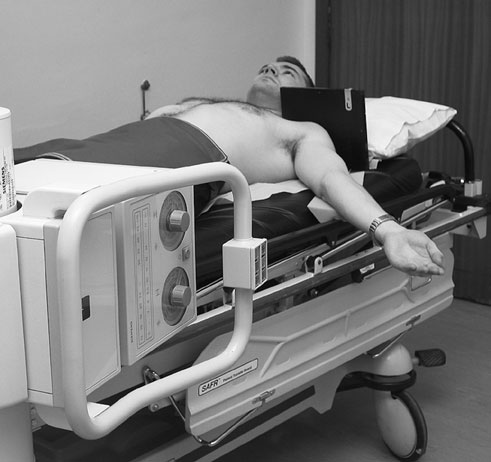
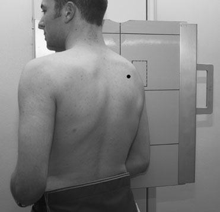
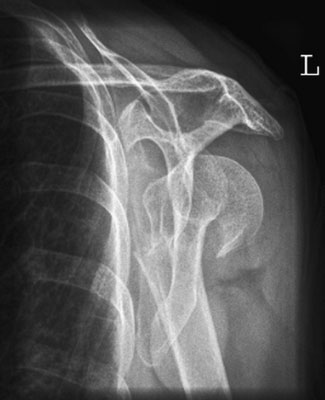

# Rx humerus proximal (col chirurgical) – profil (lateral) – inferosuperior

  📷 Radiografie Convențională (Rx)
  <strong>Actualizat:</strong> 2026-09-16
  <strong>Autor:</strong> Departamentul de Radiologie / Referință Clark (Ed. 12)

---

-   __1. Rezumat Clinic & Indicații__

    ---

    === "Indicații Clinice"

        - 78 INCIDENȚE RECOMANDATE 79 Incidențe standard de bază 80 Anteroposterioară (AP) (15 grade) în ortostatism – imagine de examinare 81 Superoinferioară (axială) 81 Inferosuperioară (axială) (alternativă) 82 Incidență de evacuare (subacromială Neer) 83 Anteroposterioară (AP) (incidență de evacuare (subacromială Neer)) 83 Profil (lateral) (incidență de evacuare (subacromială Neer)) 84 ARTICULAȚIA GLENOHUMERALĂ 85 Anteroposterioară (AP) – în ortostatism 85 Anteroposterioară (AP) – în decubit dorsal (traumatism) 86 Incidență oblică de profil (lateral) „Y” (alternativă) – luxație articulară/suspiciune de fractură a humerusului proximal 86 MODIFICĂRI ALE TEHNICII (DUPĂ MANIPULARE) 87 Anteroposterioară (AP) – 25 grade caudal 87 Luxație recurentă a umărului 88 Anteroposterioară (AP) (profil lateral al humerusului) 88 Anteroposterioară (AP) (oblică a humerusului) 89 Anteroposterioară (AP) modificată – metoda Stryker 90 Inferosuperioară (axială) 90 TENDOANE CALCIFICATE 91 Anteroposterioară (AP) 92 Anteroposterioară (AP) – 25 grade caudal 93 Inferosuperioară (axială) 93 Articulații acromioclaviculare 94 Anteroposterioară (AP) 94 Claviculă 95 Posteroanterioară (PA) – în ortostatism (de bază) 95 Anteroposterioară (AP) – în decubit dorsal (alternativă) 96 Inferosuperioară (axială) 97 Inferosuperioară (axială) – în decubit dorsal 98 Articulații sternoclaviculare 99 Posteroanterioară (PA) oblică (de bază) 99 Semidecubit ventral (alternativă) 99 Posteroanterioară (PA) 100 Profil (lateral) 100 Scapulă 101 Anteroposterioară (AP) (de bază) – în ortostatism 101 Profil (lateral) (de bază) 102 Profil (lateral) (alternativă) 102 Proces coracoid 103 Anteroposterioară (AP) (braț în abducție) 103 CUPRINS

    === "Ghid Național IRIS"

        !!! info "Referință Primară: Ghidul Național IRIS (Ordinul MS 1342/2012)"
            - **Capitol Ghid IRIS:** *Aparat locomotor & Membru superior*
            - **Grad de Recomandare:** **Grad A**
            - **Nivel de Iradiere Estimată:** `Clasa 1 (Minimă < 0.02 mSv)`

            [:octicons-search-16: Deschide Ghidul IRIS](../../iris.md){ .md-button .md-button--primary } [:material-open-in-new: Aplicația Oficială PWA](https://radiologie-pediatrica.ro/iris/){ .md-button target="_blank" rel="noopener" }

-   __2. Poziționare & Centrare Fascicul__

    ---

    - **Poziție Pacient:**
        - Pacientul stă în ortostatism sau șade, cu aspectul lateral al brațului lezat sprijinit pe casetă sau pe stativul vertical Bucky.
        - Pacientul este rotit înainte până când linia care unește marginile medială și laterală ale scapulei este perpendiculară pe casetă.
        - Caseta este poziționată pentru a include capul humerusului și întreaga scapulă.
    - **Punct de Centrare Fascicul:**
        - Fasciculul radiologic orizontal este orientat spre marginea medială a scapulei și centrat pe capul humerusului. 76
    - **Distanță Focar-Film (DFF / SID):** 100 cm
    - **Comandă Respiratorie:** Apnee completă pe durata expunerii.

-   __3. Parametri Tehnici Expunere__

    ---

    | Parametru Tehnic | Valoare Configurare Generator / Tub |
    |:-----------------|:-------------------------------------|
    | **Tensiune Tub (kV)** | DE CONFIGURAT PE APARAT |
    | **Sarcină / Produs Curent-Timp (mAs)** | Conform AEC / grosimii anatomice |
    | **Distanță Focar-Film (DFF / SID)** | 100 cm |
    | **Grilă Antidifuzoare (Bucky)** | Cu grilă antidifuzoare Bucky |
    | **Dimensiune Focar** | Focar Mic (0.6 mm) |
    | **Camere de Ionizare AEC** | Camerele laterale (sau camera centrală, în funcție de regiune) |
    | **Colimare Fascicul** | Colimare strictă la aria anatomică de interes diagnostic |
    | **Filtrare Tub** | Totală ≥ 2.5 mm Al echivalent (conform Clark: 3.0 mm Al echivalent) |

-   __4. Criterii de Calitate & Reușită Imagine__

    ---

    - Scapula și extremitatea superioară a humerusului trebuie evidențiate clar, separat de cutia toracică. Incidență oblică de profil (lateral) a colului humerusului, evidențiind suspiciunea de fractură

-   __5. Protecție Radiologică (ALARA)__

    ---

    - Ecranare gonadică cu șorț plumbat dacă gonadele sunt în apropierea fasciculului util (regula ALARA).
    - Colimare precisă la dimensiunea anatomică strict necesară pentru reducerea dozei și a radiației difuze.
    - Verificarea posibilității unei sarcini la pacientele de vârstă fertilă înainte de expunere.

!!! note "Observații Clinice & Tehnice"
    - Expunerea trebuie efectuată în apnee.
    - Este important să nu se încerce creșterea amplitudinii mișcării pe care pacientul o poate sau dorește să o efectueze. Incidență oblică de profil (lateral). Această incidență se utilizează când brațul este imobilizat și abducția brațului nu este posibilă. Poate fi necesară tehnica cu stativ vertical Bucky pentru îmbunătățirea calității imaginii.

### 🖼️ Imagini

<figure class="protocol-image-card" markdown>

<figcaption><strong>Incidență oblică de profil (lateral) a colului humerusului, evidențiind suspiciunea de fractură</strong> — Poziționarea pacientului și centrarea fasciculului conform Clark (Ed. 12)</figcaption>

</figure>

<figure class="protocol-image-card" markdown>

<figcaption><strong>Figura 2: Aspect radiografic / Poziționare (Clark Ed. 12)</strong> — Aspect radiografic / ghid de poziționare conform tratatului Clark (Ed. 12)</figcaption>

</figure>

<figure class="protocol-image-card" markdown>

<figcaption><strong>Figura 3: Aspect radiografic / Poziționare (Clark Ed. 12)</strong> — Aspect radiografic / ghid de poziționare conform tratatului Clark (Ed. 12)</figcaption>

</figure>

=== "Ghid Rapid de Execuție"

    1. **Identificarea și verificarea pacientului:** verificare identitate, zonă de examinat, consimțământ conform procedurii și evaluarea posibilității unei sarcini, când este relevantă.
    2. **Pregătire:** îndepărtarea oricăror obiecte radiopace (bijuterii, agrafe, fermoare, proteze, pansamente dense).
    3. **Poziționare precisă:** alinierea receptorului de imagine și a tubului la distanța prescrisă (100 cm).
    4. **Colimare strictă:** adaptarea fasciculului strict la regiunea de diagnostic pentru scăderea iradierii și reducerea radiației difuze.
    5. **Radioprotecție:** verificarea [politicii RX](../radioprotectie.md), cu măsuri distincte pentru pacient, personal și însoțitor.

## Surse de documentare

- [Clark's Positioning in Radiography (Ed. 12), Pagina 91](https://books.google.com/books/about/Clark_s_Positioning_in_Radiography.html?id=Xxu6MwEACAAJ)
