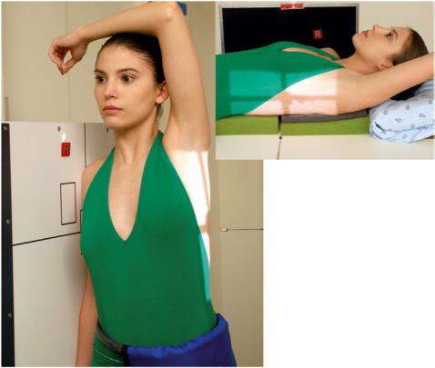
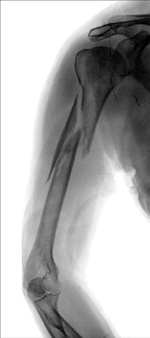
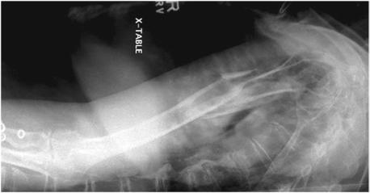

# Rx Humerus (traumatism acuttism / Regim Urgență) TRANSTHORACIC Profil (Lateral)

  📷 Radiografie Convențională (Rx)
  <strong>Actualizat:</strong> 2026-09-15
  <strong>Autor:</strong> Departamentul de Radiologie / Referință Bontrager

---

-   __1. Rezumat Clinic & Indicații__

    ---

    === "Indicații Clinice"

        - suspiciune de fractură of the diaphysis of the Humerus (In addition to a transthoracic Incidență de Profil (Lateral) [Fig. 5.37], an Incidență Antero-Posterioară (AP) with neutral rotation [Fig. 5.38] is required.)

    === "Ghid Național IRIS"

        !!! info "Referință Primară: Ghidul Național IRIS (Ordinul MS 1342/2012)"
            - **Capitol Ghid IRIS:** *Ghidul Național IRIS*
            - **Grad de Recomandare:** **De verificat pe indicație; fără grad atribuit automat**
            - **Nivel de Iradiere Estimată:** `De verificat pentru examinarea și populația selectate`

            [:octicons-search-16: Deschide Ghidul IRIS](../../iris.md){ .md-button .md-button--primary } [:material-open-in-new: Aplicația Oficială PWA](https://radiologie-pediatrica.ro/iris/){ .md-button target="_blank" rel="noopener" }
-   __2. Poziționare & Centrare Fascicul__

    ---

    - **Poziție Pacient:** Pacient: Place patient in an Ortostatism or a Decubit Dorsal position. (The Ortostatism position, which may be more comfortable for the patient, is preferred.) Place patient in Incidență de Profil (Lateral) with side of interest closest to IR (see Fig. 5.37). With patient Decubit Dorsal, place portable grid lines horizontally and center CR to centerline to prevent grid cutoff (see Fig. 5.37, inset).; Regiune anatomică: Place affected arm at patient’s side in neutral rotation; drop Umăr if possible. Raise opposite arm and place Mână over top of head; elevate Umăr as much as possible to prevent superimposition of affected Umăr. Center middiaphysis of affected Humerus and center of IR to
    - **Punct de Centrare Fascicul:** perpendicular to IR, directed through thorax to middiaphysis (see NOTE)
    - **Distanță Focar-Film (DFF / SID):** 100 cm
    - **Comandă Respiratorie:** orthostatic (breathing) technique is preferred if patient can cooperate. Patient should be asked to breathe gently in short, shallow breaths without moving affected arm or Umăr. (This allows best visualization of Humerus by blurring out Coaste (Grilaj Costal) and lung structures.)

-   __3. Parametri Tehnici Expunere__

    ---

    | Parametru Tehnic | Valoare Configurare Generator / Tub |
    |:-----------------|:-------------------------------------|
    | **Tensiune Tub (kV)** | 75-90 kV |
    | **Sarcină / Produs Curent-Timp (mAs)** | DE CONFIGURAT PE APARAT |
    | **Distanță Focar-Film (DFF / SID)** | 100 cm |
    | **Grilă Antidifuzoare (Bucky)** | Cu grilă antidifuzoare Bucky |
    | **Dimensiune Focar** | Focar Mare (1.0 - 1.2 mm) |
    | **Camere de Ionizare AEC** | Camerele laterale (sau camera centrală funcție de regiune) |
    | **Colimare Fascicul** | Field Size Collimate on four sides to area of interest. |
    | **Filtrare Tub** | Totală ≥ 2.5 mm Al echivalent |

-   __4. Criterii de Calitate & Reușită Imagine__

    ---

    - Lateral view of entire Humerus and glenohumeral joint should be visualized through the thorax without superimposition of the opposite Humerus. Position:
    - Outline of the shaft of the Humerus should be clearly visualized anterior to the thoracic vertebrae.
    - Relationship of the humeral head and glenoid cavity should be demonstrated.
    - Collimation field size to area of interest. Exposure:
    - Optimal image receptor exposure and contrast demonstrate entire outline of the Humerus (Fig. 5.39).
    - Overlying Coaste (Grilaj Costal) and lung markings should appear blurred because of breathing technique, but bony outlines of the Humerus should appear sharp, indicating no motion of the arm during the exposure. Fig. 5.39 Decubit transthoracic Incidență de Profil (Lateral) of Humerus.

-   __5. Protecție Radiologică (ALARA)__

    ---

    - Ecranare gonadică și a organelor radiosensibile conform procedurilor locale de radioprotecție ALARA.
    - Colimare strictă la aria de interes pentru limitarea radiației difuze.
    - Verificarea posibilității unei sarcini la pacientele de vârstă fertilă înainte de expunere.

!!! note "Observații Clinice & Tehnice"
    If patient is in too much pain to drop injured Umăr and elevate uninjured arm and Umăr high enough to prevent superimposition of shoulders, angle CR 10° to 15° cephalad. Fig. 5.37 Ortostatism and Decubit transthoracic lateral projecton of Humerus. Fig. 5.38 suspiciune de fractură of proximal Humerus, neutral rotation. This is a required projection for a traumatism acuttism / Regim Urgență Humerus in addition to a transthoracic Incidență de Profil (Lateral). Humerus (Nontraumatism acut) ROUTINE AP Rotational lateral Horizontal beam lateral SPECIAL (traumatism acuttism / Regim Urgență) Horizontal beam lateral Transthoracic lateral

### 🖼️ Imagini

<figure class="protocol-image-card" markdown>

<figcaption><strong>Fig. 5.37 Ortostatism and Decubit transthoracic lateral projecton of</strong> — Poziționare pacient conform Ghidului Bontrager (Fig. 5.37 Erect and recumbent transthoracic lateral projecton of)</figcaption>

</figure>

<figure class="protocol-image-card" markdown>

<figcaption><strong>Fig. 5.38 suspiciune de fractură of proximal Humerus, neutral rotation. This is a</strong> — Aspect radiografic de referință conform Ghidului Bontrager (Fig. 5.38 Fracture of proximal humerus, neutral rotation. This is a)</figcaption>

</figure>

<figure class="protocol-image-card" markdown>

<figcaption><strong>Fig. 5.39 Decubit transthoracic Incidență de Profil (Lateral) of Humerus.</strong> — Aspect radiografic de referință conform Ghidului Bontrager (Fig. 5.39 Recumbent transthoracic lateral projection of humerus.)</figcaption>

</figure>

=== "Ghid Rapid de Execuție"

    1. **Identificarea și verificarea pacientului:** verificare identitate, zonă de examinat, consimțământ conform procedurii și evaluarea posibilității unei sarcini, când este relevantă.
    2. **Pregătire:** îndepărtarea oricăror obiecte radiopace (bijuterii, agrafe, fermoare, proteze, pansamente dense).
    3. **Poziționare precisă:** alinierea receptorului de imagine și a tubului la distanța prescrisă (100 cm).
    4. **Colimare strictă:** adaptarea fasciculului strict la regiunea de diagnostic pentru scăderea iradierii și reducerea radiației difuze.
    5. **Radioprotecție:** verificarea [politicii RX](../radioprotectie.md), cu măsuri distincte pentru pacient, personal și însoțitor.

## Surse de documentare

- [Bontrager's Textbook of Radiographic Positioning (Ed. 9/10), Pagina 202](https://www.elsevier.com/books/textbook-of-radiographic-positioning-and-related-anatomy/lampignano/978-0-323-65367-1)
