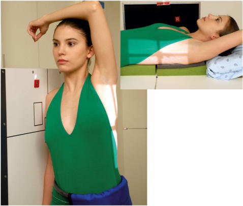
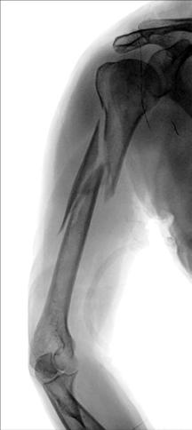
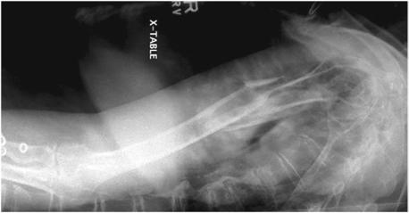

# Rx humerus (traumatism acut/urgență) transtoracic – profil (lateral)

  📷 Radiografie Convențională (Rx)
  <strong>Actualizat:</strong> 2026-09-15
  <strong>Autor:</strong> Departamentul de Radiologie / Referință Bontrager

---

-   __1. Rezumat Clinic & Indicații__

    ---

    === "Indicații Clinice"

        - Suspiciune de fractură a diafizei humerusului (în plus față de incidența transtoracică de profil (lateral) [Fig. 5.37], este necesară incidența anteroposterioară (AP) cu rotație neutră [Fig. 5.38].)

    === "Ghid Național IRIS"

        !!! info "Referință Primară: Ghidul Național IRIS (Ordinul MS 1342/2012)"
            - **Capitol Ghid IRIS:** *Aparat locomotor & Membru superior*
            - **Grad de Recomandare:** **Grad A**
            - **Nivel de Iradiere Estimată:** `Clasa 1 (Minimă < 0.02 mSv)`

            [:octicons-search-16: Deschide Ghidul IRIS](../../iris.md){ .md-button .md-button--primary } [:material-open-in-new: Aplicația Oficială PWA](https://radiologie-pediatrica.ro/iris/){ .md-button target="_blank" rel="noopener" }

-   __2. Poziționare & Centrare Fascicul__

    ---

    - **Poziție Pacient:** Pacient: Așezați pacientul în ortostatism sau în decubit dorsal. (Poziția în ortostatism, care poate fi mai confortabilă pentru pacient, este preferată.) Așezați pacientul în incidență de profil (lateral), cu partea de interes cât mai aproape de receptorul de imagine (vezi Fig. 5.37). Cu pacientul în decubit dorsal, așezați liniile grilei portabile orizontal și centrați raza centrală pe linia mediană pentru a preveni tăierea grilei (vezi Fig. 5.37, imaginea inserată). Regiune anatomică: Așezați brațul afectat al pacientului lângă corp, în rotație neutră; coborâți umărul, dacă este posibil. Ridicați brațul opus și așezați mâna deasupra capului; ridicați umărul cât mai mult posibil pentru a preveni suprapunerea umărului afectat. Centrați diafiza mijlocie a humerusului afectat și centrul receptorului de imagine la
    - **Punct de Centrare Fascicul:** Perpendiculară pe receptorul de imagine, orientată prin torace spre diafiza mijlocie (vezi NOTA)
    - **Distanță Focar-Film (DFF / SID):** 100 cm
    - **Comandă Respiratorie:** Tehnica în ortostatism (cu respirație) este preferată dacă pacientul poate coopera. Pacientului trebuie să i se ceară să respire ușor, cu respirații scurte și superficiale, fără să miște brațul sau umărul afectat. (Aceasta permite cea mai bună vizualizare a humerusului prin estomparea coastelor și a structurilor pulmonare.)

-   __3. Parametri Tehnici Expunere__

    ---

    | Parametru Tehnic | Valoare Configurare Generator / Tub |
    |:-----------------|:-------------------------------------|
    | **Tensiune Tub (kV)** | 75-90 kV |
    | **Sarcină / Produs Curent-Timp (mAs)** | DE CONFIGURAT PE APARAT |
    | **Distanță Focar-Film (DFF / SID)** | 100 cm |
    | **Grilă Antidifuzoare (Bucky)** | Cu grilă antidifuzoare Bucky |
    | **Dimensiune Focar** | Focar Mare (1.0 - 1.2 mm) |
    | **Camere de Ionizare AEC** | Camerele laterale (sau camera centrală, în funcție de regiune) |
    | **Colimare Fascicul** | Dimensiunea câmpului. Colimați pe cele patru laturi la aria de interes diagnostic. |
    | **Filtrare Tub** | Totală ≥ 2.5 mm Al echivalent |

-   __4. Criterii de Calitate & Reușită Imagine__

    ---

    - Incidența laterală a întregului humerus și a articulației glenohumerale trebuie vizualizată prin torace, fără suprapunerea humerusului opus. Poziție:
    - Conturul diafizei humerusului trebuie vizualizat clar anterior de coloana toracică.
    - Relația dintre capul humeral și cavitatea glenoidă trebuie evidențiată.
    - Dimensiunea câmpului de colimare până la aria de interes diagnostic. Expunere:
    - Expunerea și contrastul optime ale receptorului de imagine evidențiază întregul contur al humerusului (Fig. 5.39).
    - Coastele suprapuse și desenul pulmonar trebuie să apară estompate datorită tehnicii de estompare prin respirație superficială (tehnica respiratorie), însă contururile osoase ale humerusului trebuie să apară clare, indicând absența mișcării brațului în timpul expunerii. Fig. 5.39 Incidență transtoracică de profil (lateral) a humerusului în decubit.

-   __5. Protecție Radiologică (ALARA)__

    ---

    - Ecranare gonadică și a organelor radiosensibile conform procedurilor locale de radioprotecție ALARA.
    - Colimare strictă la aria de interes pentru limitarea radiației difuze.
    - Verificarea posibilității unei sarcini la pacientele de vârstă fertilă înainte de expunere.

!!! note "Observații Clinice & Tehnice"
    Dacă pacientul are dureri prea mari pentru a coborî umărul lezat și a ridica suficient de sus brațul și umărul nelezate pentru a preveni suprapunerea umerilor, raza centrală se înclină cu 10°–15° cranial (spre cap). Fig. 5.37 Incidență transtoracică laterală în ortostatism și în decubit a humerusului. Fig. 5.38 Suspiciune de fractură a humerusului proximal, rotație neutră. Aceasta este incidența necesară pentru traumatismul acut/urgența humerusului, în plus față de incidența transtoracică de profil (lateral). Humerus (nontraumatism acut) AP DE RUTINĂ rotație externă AP rotație internă (laterală) fascicul lateral orizontal SPECIALĂ (traumatism acut/urgență) fascicul lateral orizontal Incidență transtoracică laterală

### 🖼️ Imagini

<figure class="protocol-image-card" markdown>

<figcaption><strong>Fig. 5.37 Incidență transtoracică laterală în ortostatism și în decubit a</strong> — Poziționarea pacientului conform Ghidului Bontrager (Fig. 5.37, incidență transtoracică laterală în ortostatism și în decubit a)</figcaption>

</figure>

<figure class="protocol-image-card" markdown>

<figcaption><strong>Fig. 5.38 Suspiciune de fractură a humerusului proximal, rotație neutră. Aceasta este o</strong> — Aspect radiografic de referință conform Ghidului Bontrager (Fig. 5.38, suspiciune de fractură a humerusului proximal, rotație neutră. Aceasta este o)</figcaption>

</figure>

<figure class="protocol-image-card" markdown>

<figcaption><strong>Fig. 5.39 Incidență transtoracică de profil (lateral) a humerusului în decubit.</strong> — Aspect radiografic de referință conform Ghidului Bontrager (Fig. 5.39, incidență transtoracică laterală a humerusului în decubit.)</figcaption>

</figure>

=== "Ghid Rapid de Execuție"

    1. **Identificarea și verificarea pacientului:** verificare identitate, zonă de examinat, consimțământ conform procedurii și evaluarea posibilității unei sarcini, când este relevantă.
    2. **Pregătire:** îndepărtarea oricăror obiecte radiopace (bijuterii, agrafe, fermoare, proteze, pansamente dense).
    3. **Poziționare precisă:** alinierea receptorului de imagine și a tubului la distanța prescrisă (100 cm).
    4. **Colimare strictă:** adaptarea fasciculului strict la regiunea de diagnostic pentru scăderea iradierii și reducerea radiației difuze.
    5. **Radioprotecție:** verificarea [politicii RX](../radioprotectie.md), cu măsuri distincte pentru pacient, personal și însoțitor.

## Surse de documentare

- [Bontrager's Textbook of Radiographic Positioning (Ed. 9/10), Pagina 202](https://www.elsevier.com/books/textbook-of-radiographic-positioning-and-related-anatomy/lampignano/978-0-323-65367-1)
